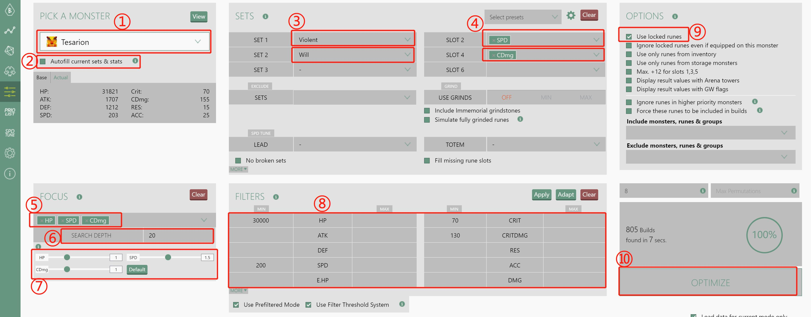
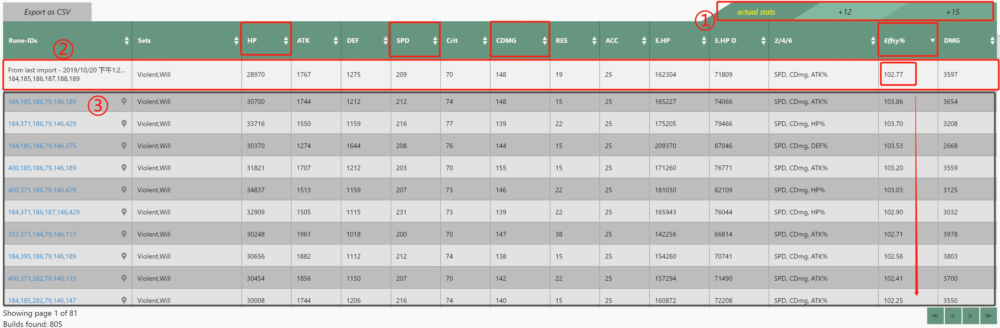
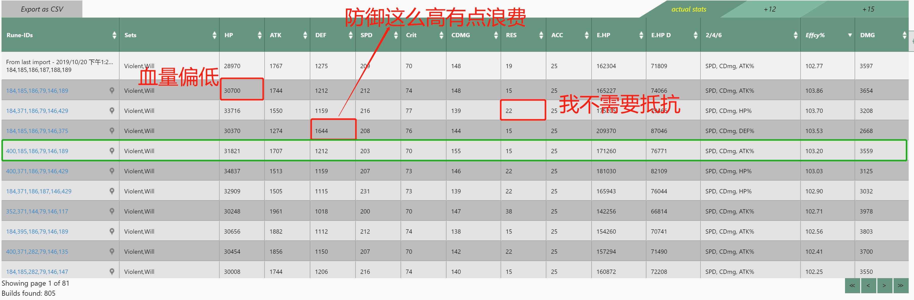
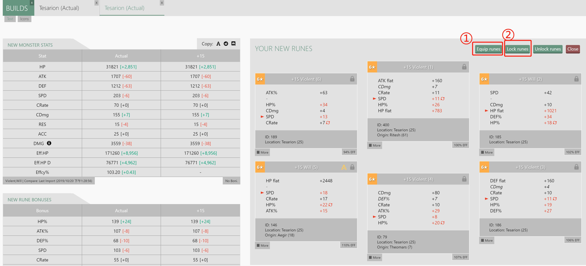
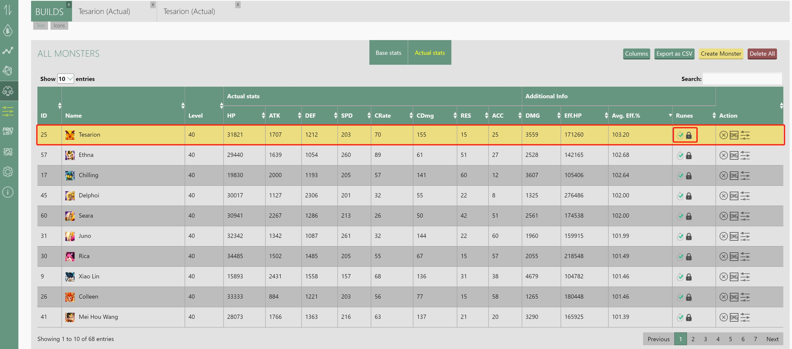
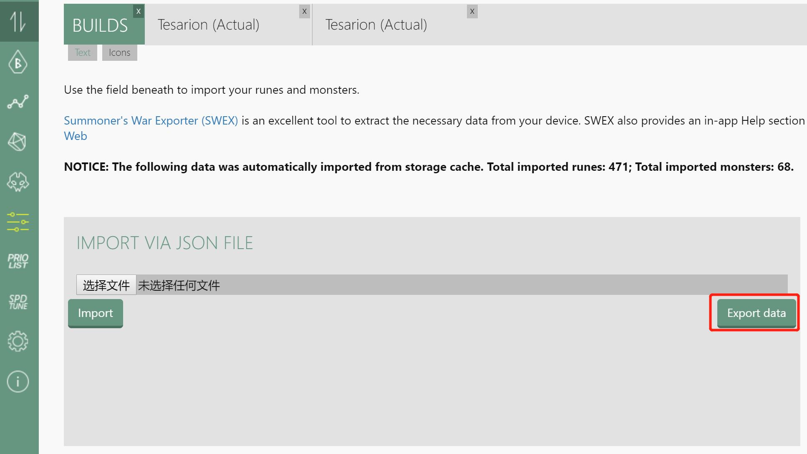

# 魔灵召唤-符文优化篇

> Author: wdpm
>
> Date：2019-10-21

## 导入数据集

访问 https://tool.swop.one/ 

左侧 Export/Import 选项，选择 IMPORT VIA JSON FILE 方式将之前的 json 文件上传，并点击 Import 按钮。如果成功导入，会有类似提示：

```
Total imported runes: 471; Total imported monsters: 68.
```

## 符文优化

### 排列魔灵优先级顺序

在符文优化之前，先考虑一下符文分配给魔灵的优先级顺序。例如：魔灵 A > 魔灵 B > 魔灵 C > ...

符文资源是抢占式的资源，魔灵A使用的符文，魔灵B就不能再次使用。

RTA 作为当前版本的主流，以下是我的RTA魔灵优先级顺序。

- 暴走速度优先梯队：风沙漠 > 火吸 > 水帕 > 光帕 > 光仙女王 > 火哈格 > 水皮球 > 水仙女(二觉）

- 迅速辅助优先梯队：风极地 > 水沙漠 > 暗人鱼 > 光卡 > 水女巫

- 暴走消耗优先梯队：火姨夫 > 风奥 > 风琴 > 水蛮王 > 风熊猫 > 火猴子

- 绝望速度优先梯队：火奥 > 火神秘 

- 绝望消耗优先梯队：火瑞奇

- 吸血消耗优先梯队：火忍 > 风龙骑

- 速度优先强拆梯队：火精灵王

每个人的魔灵池不一样，结合自己偏好按需排列即可。

### 考虑魔灵的符文套装

大件套优先考虑：暴走，迅速，绝望。小件套优先考虑：意志，反击，应报，保护。

对于不同的魔灵，其最佳的符文套装不一定只有一种。以下是我的RTA魔灵套装偏好考虑。

- 暴走速度优先梯队：风沙漠[暴走意志] > 火吸[暴走反击] > 水帕[暴走保护] > 光帕[暴走意志] > 光仙女王[暴走意志] > 火哈格[暴走应报] > 水皮球[暴走意志] > 水仙女(二觉)[暴走意志，反击保护意志]
- 迅速辅助优先梯队：风极地[迅速] > 水沙漠[迅速] > 暗人鱼[迅速保护] > 光卡[迅速] > 水女巫[迅速意志]
- 暴走消耗优先梯队：火姨夫[暴走意志] > 风奥[暴走意志] > 风琴[暴走意志] > 水蛮王[暴走意志] > 风熊猫[暴走+其他] > 火猴子[暴走反击]
- 绝望速度优先梯队：火奥[绝望应报] > 火神秘[绝望] 
- 绝望消耗优先梯队：火瑞奇[绝望反击，绝望刀刃]
- 吸血消耗优先梯队：火忍[吸血反击] > 风龙骑[暴走应报，吸血应报]
- 速度优先强拆梯队：火精灵王[意志+其他]

### 考虑魔灵的属性倾向

以火姨夫为例。~~我全都要~~。主堆速度，体力，爆伤，前提是暴击率要及格。

对于输出，暴击率我认为一般需要在70+；对于辅助向输出，暴击率60+，爆伤130+即可。

>https://godsarmy.garude.de/ 
>是一个关于魔灵召唤各服务器符文排行的网站。可以前往该网站查看某魔灵排行靠前的的套装和属性面板。

### 动手试试

前往 左侧面板中点击 optimizer 选项。



①：选择魔灵，英文名。

②：如果自动勾选，它会使用之前的符文套装。一般不勾选。

③：选择符文套装，上图选了暴走+意志。

④：选择 246位置的符文属性，上图选了2速度，4爆伤。

⑤：选择得分关注点。上图选了HP，SPD，CDmg。

⑥：搜索深度。一般选20足够。设置过大，会搜索得很慢，而且结果也一样。

⑦：这个是属性对评分的权重。速度和暴击率都是1.5，其他为1。不建议改动这里的权重。

⑧：这个是搜索结果的过滤器。上图设置了HP不低于30000，速度不低于200，暴击率不低于70，爆伤不低于130。

⑨：这个“Use locked runes"表示可以使用已锁定的符文。一般而言，强烈建议不勾选这个选项。否则你会发现这个配好了，另一个之前配好的被拆了。

⑩：运行按钮。一般几秒内会给出结果。



①：选择是按实际数据，+12，或+15的符文属性计算结果。一般选+15。

②：这个是之前你刚导入数据时，该魔灵的符文属性面板和评分结果。上图为102.77。

③：灰色背景交替的为搜索优化的结果。结果有时会很多，所以一定要设置之前的过滤器，过滤一些不合理的搭配。同时重点关注Effcy%这一列，它代表的是符文的强度效率。上图最高的是103.86。

### ~~我全都要，不存在的~~


有时，你可能偏好SPD速度，你可以点击SPD按降序排列，然后再观察Effcy%这一列，找出最接近103.86的一行，这一行，可能就是比较合理的提升。

有时，极值的那一行可能并不是你想要的的搭配结果。你必须做出取舍，你需要明白：
- 自己是想要各方面属性都很平均的符文搭配呢？
- 还是想要输出较高，速度较高，但舍弃一部分坦度面板得符文搭配呢？

例如，当你选出自己想要的某一行后：



你可以点击这一行第一列的定位图标，会跳转到符文详情页面：



①：装备符文。

②：锁定符文。

接下来，你可以前往魔灵页面查看效果：



于是，你陷入了上面的循坏当中，一个一个地优化着自己的符文：搜索，挑选，装备锁定......。

~~过于真实~~。

### 保存你的优化结果



## 结语

魔灵召唤-符文优化篇到此结束。于是，你开始期待免拆符文那天的到来。

