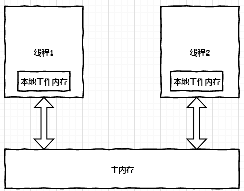

# Java 并发基础

并发：同一个时间段内，多个任务都在执行。

## 线程安全问题

假设cnt初始值为0

| TimeLine | t1            | t2                         | t3                         | t4                   |
| -------- | ------------- | -------------------------- | -------------------------- | -------------------- |
| 线程1    | 读取内存的cnt | 本线程cnt++                | 将cnt写入主内存            |                      |
| 线程2    |               | 读取内存的cnt              | 本线程cnt++                | 将cnt写入主内存      |
| 分析     | 线程1的cnt=0  | 线程1的cnt=1，线程2的cnt=0 | 主内存cnt=1，线程2的cnt为1 | 主内存cnt的值依然为1 |

这就是线程不同步导致的后果。

## Java共享变量的内存可见性


一个线程操作主内存的共享变量时，先复制共享变量到自己的本地工作内存，然后处理，处理完毕后写回主内存。

## synchronized关键字

线程的执行代码在进入synchronized代码块时会自动获取监视器锁。此时，其他线程访问该同步代码块会被阻塞挂起。

释放监视器锁的情况

- 拿到监视器锁的线程**正常退出同步代码块**
- 拿到监视器锁的线程**抛出异常**
- 拿到监视器锁的线程**在同步代码块内部调用wait（）方法主动挂起**

synchronized的内存语义

- 进入synchronized块(加锁)：把synchronized块内的共享变量从线程的工作内存中全部清除，强制从主内存再次获取。
- 退出synchronized块(释放锁）：把synchronized块内的共享变量的修改刷新到主内存。

synchronized关键字会引起线程上下文切换，带来线程调度开销。

## volatile关键字

可以采用volatile关键字解决共享变量的内存可见性问题。

**一个变量被声明为volatile时，线程在对该变量写操作时会直接写入主内存**。

## synchronized 对比 volatile

相同点：都具有相同的内存语义，都可以解决共享变量的内存可见性问题。

不同点：

- synchronized同步的是代码块，volatile同步的是变量。

- synchronized可认为是强同步，会引起线程上下文切换。volatile可认为是弱同步，不会引起线程上下文切换。

- **synchronized保证内存可见性，保证操作原子性**。但是性能开销较大。

- **volatile只是保证内存可见性，不保证操作原子性**。原子性操作指一系列操作要么全部成功，要么全部失败。

  读取-修改-写这种操作经常要求原子性。

示例

```java
public class ThreadSafeCount1 {
    private Long count;

    public synchronized Long getCount() {
        return count;
    }

    public synchronized void setCount(Long count) {
        this.count = count;
    }
}
```

```java
public class ThreadSafeCount2 {
    private volatile Long count;

    public  Long getCount() {
        return count;
    }

    public  void setCount(Long count) {
        this.count = count;
    }
}
```

## 非阻塞CAS算法

CAS（compare and swap），JDK提供的非阻塞原子性操作，通过硬件保证操作原子性。

例如 JDK Unsafe包中的compareAndSwapXXX方法。

Unsafe提供了硬件级别的原子性操作，都是native方法，使用JNI方式访问本地C++实现库。

使用示例

```java
public class TestUnsafe {
    static final Unsafe unsafe=Unsafe.getUnsafe();
    static long stateOffset = 0;
    private volatile long state=0;

    static {
        try {
            // 获取这个类中state字段的偏移量
            stateOffset= unsafe.objectFieldOffset(TestUnsafe.class.getDeclaredField("state"));
        } catch (NoSuchFieldException e) {
            System.out.println(e.getLocalizedMessage());
            throw new Error(e);
        }
    }

    public static void main(String[] args) {
        TestUnsafe testUnsafe = new TestUnsafe();
        //testUnsafe对象中stateOffset偏移量的值如果为0，那么更新为2
        boolean ok = unsafe.compareAndSwapInt(testUnsafe, stateOffset, 0, 2);
        System.out.println(ok);
    }
}
```

```bash
java.lang.ExceptionInInitializerError
Caused by: java.lang.SecurityException: Unsafe
	at sun.misc.Unsafe.getUnsafe(Unsafe.java:90)
	at com.wdpm.thread.TestUnsafe.<clinit>(TestUnsafe.java:6)
```

定位出错地方到

```java
    @CallerSensitive
    public static Unsafe getUnsafe() {
        Class var0 = Reflection.getCallerClass();
        if (!VM.isSystemDomainLoader(var0.getClassLoader())) {
            throw new SecurityException("Unsafe");//这里出错
        } else {
            return theUnsafe;
        }
    }
```

```java
    public static boolean isSystemDomainLoader(ClassLoader var0) {
        return var0 == null;
    }
```

VM.isSystemDomainLoader()判断是否为Boostrap类加载器加载，这里明显为AppClassLoader加载，于是出错。

---

分析：Unsafe类是由rt.jar包提供，该包属于JDK一部分，rt.jar里面的类是由BoostrapClassLoader加载。测试类

TestUnsafe使用AppClassLoader加载，根据类加载的双亲委派机制，会委托给父级加载器BoostrapClassLoader去加载Unsafe类。

结论：常规方式无法使用JDK中的Unsafe类，因为`VM.isSystemDomainLoader()`的限制。

思路：利用反射，动态将theUnsafe字段设置为可操作。

```java
Field theUnsafeField = Unsafe.class.getDeclaredField("theUnsafe");
theUnsafeField.setAccessible(true);
unsafe = (Unsafe) theUnsafeField.get(null);
```

这样，就能获得可用的unsafe对象 了。

## 锁

乐观锁与悲观锁

悲观锁：认为数据很容易被其他线程修改，在数据被处理前就加锁。

乐观锁：认为数据没这么容易被其他线程修改，在访问数据前不会加锁，而是在进行数据提交更新时才加锁。不会使用数据库的锁机制，而是一般是在表中添加version字段，在SQL中根据version字段限制更新操作。

---

公平锁和不公平锁

类似实现：ReentrantLock

公平锁：先到先得

不公平锁：先到不一定先到。

举例：线程1拥有锁，线程2请求该锁。假设线程1释放锁后，线程3也请求该锁。

- 如果采用公平锁，由于线程2先请求，那么线程2获得该锁；
- 如果采用不公平锁，线程2和3竞争，结果是其中之一获得锁。

---

独占锁和共享锁

独占锁：单个线程持有，不共享。属于悲观锁。例如：ReentrantLock

共享锁：多个线程共享。属于乐观锁。例如：ReadWriteLock

---

可重入锁

线程1获取了锁L，这时线程1再次请求获取锁L，如果可以成功，那么就是可重入锁。

---

自旋锁

当前线程获取锁时，如果发现该锁已被其他线程占用，不立即阻塞，而是多次尝试获取，多次失败后才会阻塞。

---

