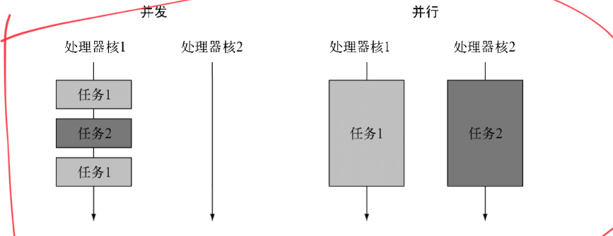

# Java 8

## 行为参数化

行为参数化是一种软件开发模式，可以帮助处理频繁的变更需求。

### 示例

新建接口

```java
public interface ApplePredicate {
    boolean test(Apple apple);
}
```

实现该接口

```java
public class AppleHeavyHeightPredicate  implements ApplePredicate{
    @Override
    public boolean test(Apple apple) {
        return apple.getWeight()>150;
    }
}
```

```java
public class AppleGreenColorPredicate implements ApplePredicate{
    @Override
    public boolean test(Apple apple) {
        return "green".equals(apple.getColor());
    }
}
```

根据抽象条件筛选apple

```java
public static List<Apple> filterApples(List<Apple> inventory, ApplePredicate p) {
    List<Apple> result = new ArrayList<>();
    for (Apple apple : inventory) {
        if (p.test(apple)) {//这里
            result.add(apple);
        }
    }
    return result;
}
```


调用执行

```java
List<Apple> apples = new ArrayList<>();
// omit add apples
AppleHeavyHeightPredicate heavyHeightPredicate = new AppleHeavyHeightPredicate();
filterApples(apples,heavyHeightPredicate);
```

### 用 lambda 改进 Predicate

```java
// use lambda
filterApples(apples,(Apple apple)->"green".equals(apple.getColor()));
```

### 将 List 类型模板化

```java
public interface Predicate<T> {
    boolean test(T t);
}

public static <T> List<T> filter(List<T> list, Predicate<T> p) {
    List<T> result = new ArrayList<>();
    for (T e : list) {
        if (p.test(e)) {
            result.add(e);
        }
    }
    return result;
}
```

```java
filter(apples, (Apple apple) -> "red".equals(apple.getColor()));
```
### 小结

行为参数化，就是一个方法接受多个不同的行为作为参数，并在内部使用他们，完成不同行为的能力。类似于多态的一种能力。

| 分类       |                              | 描述       |
| ---------- | ---------------------------- | ---------- |
| 行为参数化 | 类；匿名类(new XX())；lambda | 简洁，灵活 |
| 值参数化   |                              | 死板，啰嗦 |

## 函数式接口

函数式接口就是只定义一个抽象方法的接口。

### 示例

```java
// java.util.Comparator
public interface Comparator<T>{
    int compare(T o1,T o2);
}

// java.lang.Runable
public interface Runable{
    void run();
}

// java.util.concurrent.Callable
public interface Callable<V>{
    V call();
}

```

### 函数式接口

| 函数式接口        | 函数描述符     | 原始类型初始化                                               |
| ----------------- | -------------- | ------------------------------------------------------------ |
| Predicate<T>      | T->boolean     | IntPredicate,LongPredicate,DoublePredicate                   |
| Consumer<T>       | T->void        | IntConsumer,LongConsumer,DoubleConsumer                      |
| Function<T,R>     | T->R           | IntFunction<R>,IntToDoubleFunction,IntToLongFunction,<br />LongFunction<R>,LongToDoubleFunction,LongToIntFunction,<br />DoubleFunction<R>,ToIntFunction<T>,ToIntFunction<T>,<br />ToDoubleFunction<T>,ToLongFunction<T> |
| Supplier<T>       | ()->T          | BooleanSupplier,IntSupplier,LongSupplier,DoubleSupplier      |
| UnaryOperator<T>  | T->T           | IntUnaryOperator,LongUnaryOperator,DoubleUnaryOperator       |
| BinaryOperator<T> | (T,T)->T       | IntBinaryOperator,LongBinaryOperator,DoubleBinaryOperator    |
| BiPredicate<L,R>  | (L,R)->boolean |                                                              |
| BiConsumer        | (T,U)->void    | ObjIntConsumer<T>,ObjLongConsumer<T>,ObjDoubleConsumer<T>    |
| BiFunction<T,UR>  | (T,U)->R       | ToIntBiFunction<T,U>,ToLongBiFunction<T,U>,ToDoubleBiFunction<T,U> |

### Lambda和函数式接口示例

| 案例         | Lambda例子                                                   | 对应函数式接口                  |
| ------------ | ------------------------------------------------------------ | ------------------------------- |
| 布尔表达式   | (List<String> list) -> list.empty()                          | Predicate<List<String>>         |
| 创建对象     | () -> new Apple(10)                                          | Supplier<Apple>                 |
| 消费对象     | (Apple a) -> System.out.println(a.getWeight())               | Consumer<Apple>                 |
| 从对象中提取 | (String s) -> s.length()                                     | Function<String,Integer>        |
| 合并两个值   | (int a,int b) -> a*b                                         | IntBinaryOperator               |
| 比较两个对象 | (Apple a1,Apple a2) -> a1.getWeight().compareTo(a2.getWeight()) | BiFunction<Apple,Apple,Integer> |

> 闭包：一个函数的实例，可以无限制地访问这个函数的非本地变量（自由变量）。

## 方法引用

### 示例

```java
inventory.sort((Apple a1,Apple a2)-> a1.getWeight().compareTo(a2.getWeight()));
```

```java
// use java.util.Comparator.comparing
inventory.sort(comparing(Apple::getWeight));
```

> comparing比较器.reversed()支持逆序，.thenComparing()支持比较器链。

### 构造函数引用

假如有一个这样的Color类

```java
public class Color {
    public Color(Integer c1, Integer c2, Integer c3) { 
    }
}
```

下面使用方法引用构造函数

```java
public interface TriFunction<T, U, V, R> {
    R apply(T t, U u, V v);
}
```

```java
TriFunction<Integer,Integer,Integer,Color> colorFactory= Color::new;
```

## 高级库

- Google Guava
- Apache Common Collections

## Stream API

流是延迟创建的集合，具有惰性求值的特点。

### 迭代

- for each 外部迭代

  ```java
  List<String> names=new ArrayList<>();
  for(Dish d:menu){
      names.add(d.getName());
  }
  ```

- iterator 外部迭代

  ```java
  List<String> names=new ArrayList<>();
  iterator<String> iterator=menu.iterator();
  while(iterator.hasNext()){
     Dish d=iterator.next();
     names.add(d.getName());
  }
  ```

- 流 内部迭代

  ```java
  List<String> names=menu.stream().map(Dish::getName).collect(toList());
  ```

### 流的操作流程

```
流的创建->中间操作->...->中间操作->终端操作
```

- 流的创建

  - 由值创建

    ```java
    Stream<String> stream = Stream.of("Java", "C++", "Python")
    ```

  - 由数组创建

    ```java
    IntStream intStream = Arrays.stream(new int[]{1, 2, 3});
    ```

  - 由文件创建

    ```java
    Stream<String> lines = Files.lines(Paths.get("data.text"), Charset.defaultCharset());
    ```

  - 由函数创建: iterate 或者 generate

    ```java
    Stream.iterate(new int[]{0, 1}, t -> new int[]{t[1], t[0] + t[1]}).limit(10).forEach(t -> System.out.println(t[0]));
    ```

    ```java
    Stream.generate(Math::random)
            .limit(5)
            .forEach(System.out::println);
    ```

    

- 中间操作

  | 操作     | 类型 | 返回类型  | 操作参数              | 函数描述符    |
  | -------- | ---- | --------- | --------------------- | ------------- |
  | filter   | 中间 | Stream<T> | Predicate<T>          | T->boolean    |
  | map      | 中间 | Stream<R> | Function<T,R>         | T->R          |
  | flatMap  | 中间 | Stream<R> | Function<T,Stream<R>> | T-> Stream<R> |
  | skip     | 中间 | Stream<T> | long                  |               |
  | limit    | 中间 | Stream<T> | long                  |               |
  | sorted   | 中间 | Stream<T> | Comparator<T>         | (T,T) -> int  |
  | distinct | 中间 | Stream<T> |                       |               |

- 终端操作

  | 操作      | 类型 | 返回类型    | 操作参数          | 函数描述符 | 目的                  |
  | --------- | ---- | ----------- | ----------------- | ---------- | --------------------- |
  | anyMatch  | 终端 | boolean     | Predicate<T>      | T->boolean | 匹配全部元素          |
  | noneMatch | 终端 | boolean     | Predicate<T>      | T->boolean | 匹配任意一个          |
  | allMatch  | 终端 | boolean     | Predicate<T>      | T->boolean | 全都不匹配            |
  | findAny   | 终端 | Optional<T> |                   |            | 查找第一个元素        |
  | findFirst | 终端 | Optional<T> |                   |            | 类似findFirst（并行） |
  | forEach   | 终端 | void        | Consumer<T>       | T -> void  | 消费流中每一个元素    |
  | count     | 终端 | long        |                   |            | 返回流中元素的个数    |
  | reduce    | 终端 | Optional<T> | BinaryOperator<T> | (T,T) -> T |                       |
  | collect   | 终端 | R           | Collector<T,A,R>  |            | 收集器：把流归约      |

### 查找和匹配

- allMatch 
- anyMatch 
- noneMatch 
- findFirst 
- findAny 

### 规约 reduce

可用于求和，最大值，最小值。


### 预定义收集器

- 将流元素归约为一个值。例如：minBy、MaxBy、summarizingInt

- 分组（groupingBy） by key
- 分区（partitioningBy）true/false

Collector接口定义：

```java
public interface Collector<T, A, R> {
    Supplier<A> supplier();
    BiConsumer<A, T> accumulator();
    Function<A, R> finisher();
    BinaryOperator<A> combiner();
    Set<Characteristics> characteristics();
}
```

- T是流中元素的泛型。
  

- A是累加器的类型，累加器是中间过程中用于累积部分结果的对象。

- R是收集操作得到的对象（通常是集合）的类型。
  例如，可以实现一个ToListCollector<T>类，将Stream<T>中的所有元素收集到一个
  List<T>里，签名如下：

  ```java
  public class ToListCollector<T> implements Collector<T, List<T>, List<T>>
  ```

  这里累加器类型A也是List<T>。

- 可以使用combiner来并行化规约过程。

### 流的调试

流的peek方法能够在分析Stream流水线时，将中间变量值输出到日志中。

### 并行流

parallelStream()

### 小结

- filter和map操作是无状态的。reduce、sorted和distinct操作是有状态的，它们需要将流中的元素缓存起来才能返回一个新的流。
- 流有三个基本类型的特化：IntStream、DoubleStream、LongStream。
- 无限流是没有固定大小的流。例如斐波那契数列。
- 可以实现Collector方法来自定义收集器。

## 默认方法

菱形继承问题：一个类同时实现了具有相同签名的两个方法，到底选择哪一个实现呢？

### 解决函数签名冲突的三个原则

1. 类中的方法优先级最高。类或父类优先级 > 任何接口默认方法的优先级。

2. 如果第1无法判断，子接口优先级最高。优先选择最具体的实现的默认方法的接口。B extends A，那么 B 更为具体。
3. 如果上述无法判断，继承多个接口的类必须显示覆盖和调用方法。

### 小结

- Java 8接口可通过默认方法或者静态方法实现。
- 默认方法开头是default，其他与常规方法相同。
- 默认方法能帮助设计向后兼容的演进API。
- 默认方法可用于创建可选方法和行为的多继承。


## Optional

设计目的：支持能返回Optiona对象的语法，未实现序列化接口。

### 采用防御式检查减少NPE

```java
if(A!=null){
  B b=A.getB();
  if(b!=null){
    ...
  }
}
```

### Optional 类方法

```java
java.uitl.Optional<T>
```

| 方法        | 描述                                                       |
| ----------- | ---------------------------------------------------------- |
| empty       | 空Optional实例                                             |
| filter      | 过滤                                                       |
| flatMap     | 值存在时，执行mapping函数调用                              |
| get         | 获取值，如果值不存在，抛出NoSuchElementException           |
| ifPresent   | 值存在就执行使用该值的方法调用                             |
| isPresent   | 值存在返回true，否则false                                  |
| map         | 值存在时，执行mapping函数调用                              |
| of          | 将值使用Optional封装返回                                   |
| ofNullable  | 将值使用Optional封装返回，允许封装null，返回空Optional对象 |
| orElse      | 值存在就返回，否则返回默认值                               |
| orElseGet   | 值存在就返回，否则返回由supplier接口生成的值               |
| orElseThrow | 值存在就返回，否则返回由supplier接口生成的异常             |


## Future接口与它的实现CompletableFuture

### 并发与并行



### Future接口

Future 接口来自 JDK 5，设计初衷是对将来某个时刻发生的结果进行建模。

基本使用方式：将一个耗时操作放于Callable对象中，将它提交给 ExecutorService。

```java
public class FutureUsageTest {
    public static void main(String[] args) {
        ExecutorService executor = Executors.newCachedThreadPool();
        Future<Double> future = executor.submit(() -> doSomeLongComputation());
        doSomeThingElse();
        try {
            Double result = future.get(1, TimeUnit.SECONDS);
        } catch (InterruptedException e) {
            e.printStackTrace();
        } catch (ExecutionException e) {
            e.printStackTrace();
        } catch (TimeoutException e) {
            e.printStackTrace();
        }
    }

    private static void doSomeThingElse() {
        System.out.println("doSomeThingElse()");
    }

    private static Double doSomeLongComputation() {
        return 1.0;
    }
}
```

### 调整线程池大小

N(threads)=N(CPU)\*U(CPU)\*(1+W/C)

- N(CPU)= Runtime.getRuntime().availableProcessors()
- U(CPU)是希望的CPU利用率
- W/C是等待时间与计算时间的比率

假设你的应用99%的时间都在等待商店的响应，那么计算时间为1%。W/C=99。

假设期望的CPU利用率100%，N（CPU）=4，那么:

N(threads) = 4 \* 100% \* (1+99)=100

### Stream VS CompletableFuture

- 计算密集型：推荐Stream
- 涉及I/O，网络等待：推荐CompletableFuture

Stream底层依赖的是线程数量固定的通用线程池。自定义CompletableFuture调度任务可以更加灵活利用CPU资源。

### CompletableFuture

.thenCompose 第一个操作的结果传递给第二个操作

.thenCombine 合并两个不相关操作的结果


## 新的日期API

### 不含时区的日期API

- LocalDate
- LocalTime
- Instant
- Duration
- Period

### 处理不同的时区和历法

java.time.ZoneId 替代 java.util.TimeZone


## 函数式编程

一等函数：可作为参数，可作为结果，可保存在数据结构中。

高阶函数：接受函数作为参数，返回另一个函数。例如comparing、andThen、compose。

柯里化：模块化函数和重用代码。


## 类库更新

集合类和接口新增方法

| 类/接口    | 新方法                                                       |
| ---------- | ------------------------------------------------------------ |
| Map        | getOrDefault、forEach、compute、computeIfAbsent、computeIfPresent、merge、putIfAbsent、remove(key,value)、replace、replaceAll |
| Iterable   | forEach、spliterator                                         |
| Iterator   | forEachRemaining                                             |
| Collection | removeIf、stream、parallelStream                             |
| List       | replaceAll、sort                                             |
| BitSet     | stream                                                       |


# 设计模式

## 策略模式

代表一类问题的通用解决方案。

## 模板模式

采用某个算法的框架，但想改进某部分。

## 观察者模式

Subject 物体接口

```java
public interface Subject {
    void registerObserver(Observer o);
    void notifyObservers(String thing);
}
```

Observer 观察者接口

```java
public interface Observer {
    void notify(String thing);
}
```

ASubject 具体的一个物体

```java
public class ASubject implements Subject {
    private final List<Observer> observers = new ArrayList<>();

    @Override
    public void registerObserver(Observer o) {
        this.observers.add(o);
    }

    @Override
    public void notifyObservers(String thing) {
        observers.forEach(o -> o.notify(thing));
    }
}
```

AObserver 具体的一个观察者

```java
public class AObserver implements Observer {
    @Override
    public void notify(String thing) {
        System.out.println("thing is: "+thing);
        System.out.println("AObserver notify() called");
    }
}
```

测试代码

```java
public class ObserverTest {
    public static void main(String[] args) {
        ASubject aSubject = new ASubject();
        aSubject.registerObserver(new AObserver());
        aSubject.notifyObservers("something");
    }
}
```

## 责任链模式