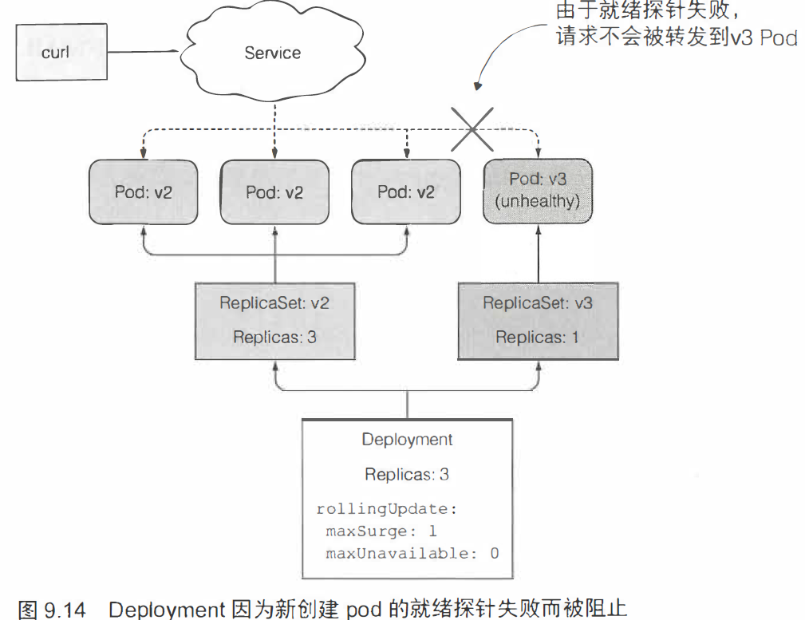

# deployment

Deployment 基于ReplicaSet的资源， 支持声明式地更新应用程序。

## 先删除旧版本pod, 再创建新pod替换


缺点：删除旧pod到新pod创建完成期间，服务短暂性不可用。

优点：部署简单。

## 先创建新pod，再删除旧版本pod

- 蓝绿部署：从旧版本立即切换到新版本。


优点：避免服务短暂性不可用。

缺点：需要较多的硬件资源，否则不能保证新旧版本的pod同时存在。

- 滚动升级


逐步使用新pod替代旧pod。

## ~~RC实现自动滚动升级~~

### V1

`Dockerfile`

```dockerfile
FROM node:7
ADD app.js /app.js
ENTRYPOINT ["node", "app.js"]
```

`app.js`

```js
const http = require('http');
const os = require('os');
console.log("Kubia server starting...");

var handler = function(request, response) {
  console.log("Received request from " + request.connection.remoteAddress);
  response.writeHead(200);
  response.end("This is v1 running in pod " + os.hostname() + "\n");
};

var www = http.createServer(handler);
www.listen(8080);
```

以上就是 `luksa/kubia:v1`的内容。

`kubia-rc-and-service-v1.yaml`

```yml
apiVersion: v1
kind: ReplicationController
metadata:
  name: kubia-v1
spec:
  replicas: 3
  template:
    metadata:
      name: kubia
      labels:
        app: kubia
    spec:
      containers:
      - image: luksa/kubia:v1
        name: nodejs
---
apiVersion: v1
kind: Service
metadata:
  name: kubia
spec:
  type: LoadBalancer
  selector:
    app: kubia
  ports:
  - port: 80
    targetPort: 8080
```

```bash
[root@vmware0 chapter9]# k create -f kubia-rc-and-service-v1.yaml
replicationcontroller/kubia-v1 created
service/kubia created
```

会同时创建`service`和`replicationcontroller`。

> 由于minikube不支持LoadBalancer类型的service，需要使用节点端口形式访问。

```bash
[root@vmware0 chapter9]# k create -f kubia-rc-and-service-v1.yaml
replicationcontroller/kubia-v1 created
service/kubia created
[root@vmware0 chapter9]# k get svc
NAME         TYPE           CLUSTER-IP     EXTERNAL-IP   PORT(S)        AGE
kubernetes   ClusterIP      10.96.0.1      <none>        443/TCP        15d
kubia        LoadBalancer   10.98.132.69   <pending>     80:30201/TCP   39s
[root@vmware0 chapter9]# while true; do curl 10.98.132.69:80;sleep 1;done
This is v1 running in pod kubia-v1-2dgjm
This is v1 running in pod kubia-v1-l4xml
This is v1 running in pod kubia-v1-jxmrn
```

### V2

修改V1版本的应用：

```js
response.end("This is v2 running in pod " + os.hostname() + "\n");
```

```bash
[root@vmware0 chapter7]# k rolling-update kubia-v1 kubia-v2 --image=luksa/kubia:v2
Command "rolling-update" is deprecated, use "rollout" instead
Created kubia-v2
Scaling up kubia-v2 from 0 to 3, scaling down kubia-v1 from 3 to 0 (keep 3 pods available, don't exceed 4 pods)
Scaling kubia-v2 up to 1
Scaling kubia-v1 down to 2
Scaling kubia-v2 up to 2
Scaling kubia-v1 down to 1
Scaling kubia-v2 up to 3
Scaling kubia-v1 down to 0
Update succeeded. Deleting kubia-v1
replicationcontroller/kubia-v2 rolling updated to "kubia-v2"
```

```bash
[root@vmware0 chapter7]# k get all
NAME                 READY   STATUS    RESTARTS   AGE
pod/kubia-v2-4wqwc   1/1     Running   0          8m11s
pod/kubia-v2-ghpx6   1/1     Running   0          7m5s
pod/kubia-v2-pfx9s   1/1     Running   0          5m59s

NAME                             DESIRED   CURRENT   READY   AGE
replicationcontroller/kubia-v2   3         3         3       8m11s
```

rolling-update 的弊端在于，它是由kubectl客户端发起请求的，而不是 k8s master。**如果在kubectl 执行升级时失去了网络连接，**
**升级进程将会中断。pod 和 RC 最终会处于中间状态。**

## 使用Deployment升级应用

在使用Deployment 时， 实际的pod是由Deployment 的Replicaset 创建和管理。

直接定义单个
Deployment资源所需达到的状态，并让Kubemetes处理中间的状态。

### 清理RC

```bash
[root@vmware0 chapter7]# k delete rc --all
replicationcontroller "kubia-v2" deleted
```

### Deployment V1

```bash
[root@vmware0 chapter9]# k create -f kubia-deployment-v1.yaml --record
deployment.apps/kubia created
```

> --record 选项会记录历史版本号。

```bash
[root@vmware0 chapter9]# k rollout status deployment kubia
deployment "kubia" successfully rolled out
[root@vmware0 chapter9]# k get rs
NAME               DESIRED   CURRENT   READY   AGE
kubia-66b4657d7b   3         3         3       2m41s
[root@vmware0 chapter9]# k get po
NAME                     READY   STATUS    RESTARTS   AGE
dnsutils                 1/1     Running   1          11d
kubia-66b4657d7b-6csm4   1/1     Running   0          79s
kubia-66b4657d7b-nlz2b   1/1     Running   0          79s
kubia-66b4657d7b-ntmhk   1/1     Running   0          79s
```

### 升级Deplyment到V2

deployment有不同的升级策略：

- ReCreate：在删除旧的pod 之后才开始创建新的pod。
- RollingUpdate：会渐进地删除旧的pod, 与此同时创建新的pod。

减慢滚动升级速度：

```bash
kubectl patch deployment kubia -p '{"spec": {"minReadySeconds": 10}}'
```

触发滚动升级：

```bash
kubectl set image deployment kubia nodejs=luksa/kubia:v2
```

```bash
[root@vmware0 chapter9]# k get po
NAME                     READY   STATUS    RESTARTS   AGE
kubia-75974f96b5-4v9nd   1/1     Running   0          11m
kubia-75974f96b5-6lgrh   1/1     Running   0          10m
kubia-75974f96b5-sx42c   1/1     Running   0          11m
[root@vmware0 chapter9]# k get rs
NAME               DESIRED   CURRENT   READY   AGE
kubia-66b4657d7b   0         0         0       20m
kubia-75974f96b5   3         3         3       11m
[root@vmware0 chapter9]# 
```

旧的RS `kubia-66b4657d7b`会被保留。

### 升级Deplyment到V3

在V3版本，模拟一次线上的bug。

```js
var handler = function(request, response) {
  console.log("Received request from " + request.connection.remoteAddress);
  if (++requestCount >= 5) {
    response.writeHead(500);
    response.end("Some internal error has occurred! This is pod " + os.hostname() + "\n");
    return;
  }
  response.writeHead(200);
  response.end("This is v3 running in pod " + os.hostname() + "\n");
};
```

前4次请求会被正常响应，后续请求会失败。

```bash
kubectl set image deployment kubia nodejs=luksa/kubia:v3 --record
```

```bash
[root@vmware0 chapter9]# kubectl rollout status deployment kubia
Waiting for deployment "kubia" rollout to finish: 1 out of 3 new replicas have been updated...
Waiting for deployment "kubia" rollout to finish: 2 out of 3 new replicas have been updated...
Waiting for deployment "kubia" rollout to finish: 1 old replicas are pending termination...
Waiting for deployment "kubia" rollout to finish: 1 old replicas are pending termination...
Waiting for deployment "kubia" rollout to finish: 1 old replicas are pending termination...
deployment "kubia" successfully rolled out
```

```bash
[root@vmware0 chapter9]# while true; do curl 10.98.132.69:80;sleep 1;done
Some internal error has occurred! This is pod kubia-5b777459fd-9c982
Some internal error has occurred! This is pod kubia-5b777459fd-9c982
Some internal error has occurred! This is pod kubia-5b777459fd-hf4d8
Some internal error has occurred! This is pod kubia-5b777459fd-hf4d8
Some internal error has occurred! This is pod kubia-5b777459fd-hf4d8
Some internal error has occurred! This is pod kubia-5b777459fd-hf4d8
Some internal error has occurred! This is pod kubia-5b777459fd-9c982
Some internal error has occurred! This is pod kubia-5b777459fd-9c982
```

所以，现在需要回滚版本。

```bash
[root@vmware0 chapter9]# k rollout undo deployment kubia
deployment.extensions/kubia rolled back
```

> Deployment会被回滚到上一个版本。

查看回滚历史。

```bash
[root@vmware0 chapter9]# kubectl rollout history deployment kubia
deployment.extensions/kubia 
REVISION  CHANGE-CAUSE
1         kubectl create --filename=kubia-deployment-v1.yaml --record=true
4         kubectl create --filename=kubia-deployment-v1.yaml --record=true
5         kubectl set image deployment kubia nodejs=luksa/kubia:v3 --record=true
```

可以看到 REVISION=5的版本引入了错误，回滚到4试试。

```bash
kubectl rollout undo deployment kubia --to-revision=4
```


旧版本的ReplicaSet过多会导致ReplicaSet列表过于混乱，可以指定
Deployment 的re visionHistoryLimit 属性来限制历史版本数量。

### 升级Deplyment到V4

#### 控制滚动升级速率

可以通过Deployment 的strategy 字段下
rollingUpdate 的子属性来配置。

```yml
spec:
  strategy:
    rollingUpdate:
      maxSurge: 1
      maxUnavailable: 0
    type: RollingUpdate
```

- maxSurge：Deployment 配置中期望的副本数之外，最多允许超出的pod 实例的数量。默
  认值为25%。
- maxUnavailable：在滚动升级期间，相对于期望副本数能够允许有多少pod 实例处于不可用状态。
  默认值也是25%。


#### 暂停/恢复滚动升级

```bash
kubectl set image deployment kubia nodejs=luksa/kubia:v4
```

等待一段时间，发现有小部分新pod已经running后，马上暂停该升级。

```bash
kubectl rollout pause deployment kubia
```

此时，可以观察这部分新pod是否可以正常响应请求。这就是**金丝雀发布**，将部署新版本的风险降低。如果一切正常，那么可以继续这次新的deployment，否则回滚。

```bash
kubectl rollout resume deployment kubia
```

### 阻止出错版本的滚动升级

minReadySeconds属性指定新创建的pod至少要成功运行多久之后， 才能将其视为可用。

现在先回到V2版本。

```bash
kubectl set image deployment kubia nodejs=luksa/kubia:v2 --record=true
```

为Bug V3版本加入可用探针。

`kubia-deployment-v3-with-readinesscheck.yaml`

```yml
apiVersion: apps/v1beta1
kind: Deployment
metadata:
  name: kubia
spec:
  replicas: 3
  minReadySeconds: 10
  strategy:
    rollingUpdate:
      maxSurge: 1
      maxUnavailable: 0
    type: RollingUpdate
  template:
    metadata:
      name: kubia
      labels:
        app: kubia
    spec:
      containers:
      - image: luksa/kubia:v3
        name: nodejs
        readinessProbe:
          periodSeconds: 1
          httpGet:
            path: /
            port: 8080
```

执行V3升级

```bash
[root@vmware0 chapter9]# kubectl apply -f kubia-deployment-v3-with-readinesscheck.yaml
Warning: kubectl apply should be used on resource created by either kubectl create --save-config or kubectl apply
deployment.apps/kubia configured
```

开始观察

```bash
[root@vmware0 chapter9]# kubectl rollout status deployment kubia
Waiting for deployment "kubia" rollout to finish: 1 out of 3 new replicas have been updated...

[root@vmware0 chapter9]# k get po
NAME                     READY   STATUS    RESTARTS   AGE
kubia-6d46bd4cfd-w62wl   0/1     Running   0          3m58s
kubia-75974f96b5-59d6c   1/1     Running   0          5m32s
kubia-75974f96b5-fqnj7   1/1     Running   0          5m21s
kubia-75974f96b5-rggd5   1/1     Running   0          5m10s
```

`kubia-6d46bd4cfd-w62wl`为新建的pod（V3版本），但是没有Ready。

原因：可用探针每1秒发一次请求验证，而v3版本的pod在第5次以及之后就无法正常响应，这个时间范围在`minReadySeconds: 10`之内，于是被认为不可用。



默认情况下， 在10分钟内不能完成滚动升级的话，将被视为失败。如果运行
kubectl describe deployment命令,可以看到ProgressDeadlineExceeded的记录。

**如果达到了progressDeadlineSeconds指定的时间， 则滚动升级过程会自动取消**。

```bash
[root@vmware0 chapter9]# k rollout status deploy kubia
error: deployment "kubia" exceeded its progress deadline
```

