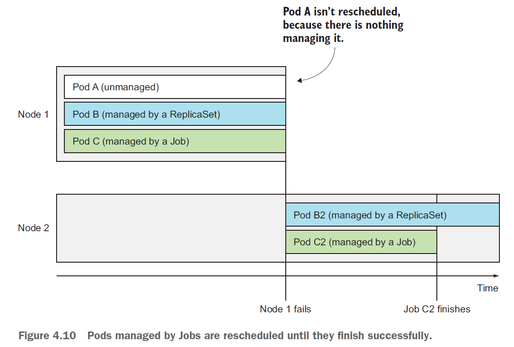

# Job

Job表示单个任务。这种pod 在内部进程成功结束时， 不重启容器。



dockerfile定义一个batch-job，沉默120s后打印退出。

```bash
FROM busybox
ENTRYPOINT echo "$(date) Batch job starting"; sleep 120; echo "$(date) Finished succesfully"
```

``batch-job.yaml``

```yaml
apiVersion: batch/v1
kind: Job
metadata:
  name: batch-job
spec:
  template:
    metadata:
      labels:
        app: batch-job
    spec:
      restartPolicy: OnFailure
      containers:
      - name: main
        image: luksa/batch-job
```

```bash
[root@vmware0 Chapter04]# kubectl create -f batch-job.yaml 
job.batch/batch-job created
[root@vmware0 Chapter04]# kubectl get job
NAME        COMPLETIONS   DURATION   AGE
batch-job   0/1           6s         6s
```

一段时间后：

```bash
[root@vmware0 Chapter04]# kubectl get job
NAME        COMPLETIONS   DURATION   AGE
batch-job   1/1           2m23s      4m50s
[root@vmware0 Chapter04]# kubectl get po
NAME              READY   STATUS      RESTARTS   AGE
batch-job-2pksj   0/1     Completed   0          4m57s
```

在job中运行多个pod实例：

```yaml
...
spec:
  completions: 5
...
```

在job中并行执行pod实例：

```yaml
...
spec:
  completions: 5
  parallelism: 2
...
```

```bash
[root@vmware0 Chapter04]# kubectl create -f multi-completion-parallel-batch-job.yaml 
job.batch/multi-completion-batch-job created
[root@vmware0 Chapter04]# kubectl get po
NAME                               READY   STATUS              RESTARTS   AGE
multi-completion-batch-job-bnlhw   0/1     ContainerCreating   0          2s
multi-completion-batch-job-qkgqq   0/1     ContainerCreating   0          2s
```

表示一次可以同时运行两个pod。

限制job完成任务的时间，可以在Job manifest中设置activeDeadlineSeconds。如果pod 运行时间超过此时间， 系统将尝试终止pod, 并将Job 标记为失败。

限制job标记为失败之前可以重试的次数，可以在Job manifest中设置spec.backoffLimit。