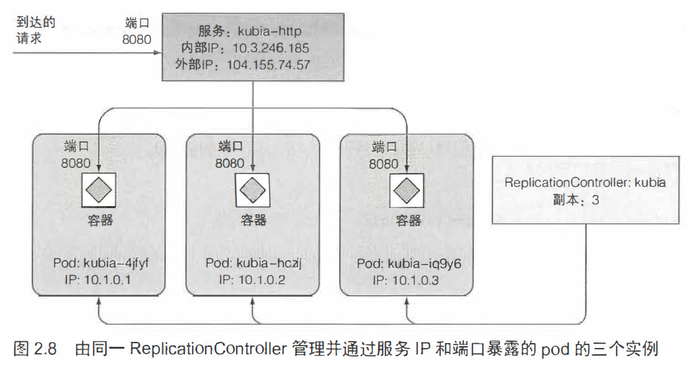
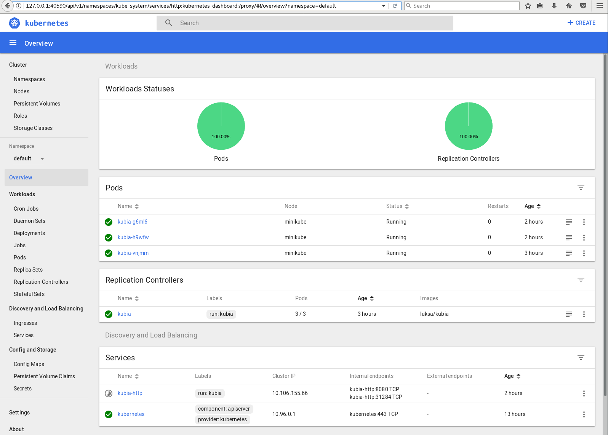

# k8s basic

luksa/kubia 是一个很简单的node.js app，只会echo一下信息。

```bash
kubectl run kubia --image=luksa/kubia --port=8080 --generator=run-pod/v1
```

一段时间后:

```bash
[root@vmware0 ~]# kubectl get pods
NAME                             READY   STATUS             RESTARTS   AGE
kubia-vnjmm                      1/1     Running            0          2m26s
```

## pod


```bash
[root@vmware0 ~]# kubectl describe pod kubia-vnjmm
Name:           kubia-vnjmm
Namespace:      default
Priority:       0
Node:           minikube/192.168.31.12
Start Time:     Tue, 26 Nov 2019 20:00:38 +0800
Labels:         run=kubia
Annotations:    <none>
Status:         Running
IP:             172.17.0.5
IPs:            <none>
Controlled By:  ReplicationController/kubia
Containers:
  kubia:
    Container ID:   docker://d3d022a7cc612b0a8f1649877d2c2e4098269e0617361b96fb7af33ed6ebb724
    Image:          luksa/kubia
    Image ID:       docker-pullable://luksa/kubia@sha256:3f28e304dc0f63dc30f273a4202096f0fa0d08510bd2ee7e1032ce600616de24
    Port:           8080/TCP
    Host Port:      0/TCP
    State:          Running
      Started:      Tue, 26 Nov 2019 20:02:59 +0800
    Ready:          True
    Restart Count:  0
    Environment:    <none>
    Mounts:
      /var/run/secrets/kubernetes.io/serviceaccount from default-token-27dmz (ro)
Conditions:
  Type              Status
  Initialized       True 
  Ready             True 
  ContainersReady   True 
  PodScheduled      True 
Volumes:
  default-token-27dmz:
    Type:        Secret (a volume populated by a Secret)
    SecretName:  default-token-27dmz
    Optional:    false
QoS Class:       BestEffort
Node-Selectors:  <none>
Tolerations:     node.kubernetes.io/not-ready:NoExecute for 300s
                 node.kubernetes.io/unreachable:NoExecute for 300s
Events:
  Type    Reason     Age    From               Message
  ----    ------     ----   ----               -------
  Normal  Scheduled  7m45s  default-scheduler  Successfully assigned default/kubia-vnjmm to minikube
```

整个过程：

- kubectl 向 k8s API server（主节点）发送 http请求，在集群中创建一个 replication controller。
- replication controller 创建 pod，调度器将其调度到一个工作节点。
- 工作节点的 kubelet 告知 docker 拉取镜像，启动容器。


## 让pod支持外部访问

一个常规服务（ Cluster IP 服务）， 比如pod ，只能从集群内部访问。

要让pod 能够从外部访问， 要创建一个特殊的 LoadBalancer 类型的服务暴露它。

```bash
kubectl expose re kubia --type=LoadBalancer --name kubia-http
```

```bash
[root@vmware0 ~]# kubectl get svc
NAME         TYPE           CLUSTER-IP      EXTERNAL-IP   PORT(S)          AGE
kubernetes   ClusterIP      10.96.0.1       <none>        443/TCP          10h
kubia-http   LoadBalancer   10.106.155.66   <pending>     8080:31284/TCP   3m20s
```

kubia-http 的 EXTERNAL-IP 一直处于 pending，因为 minikube 不支持 loadbalancer服务。

> 可以通过 192.168.31.12:31284 访问该node.js app。


Replication Controller用于控制pod的副本数量，但是pod的生命是很脆弱的，容易故障消失，此时RC会产生新的pod替代它，但是新pod的ip和旧pod是不一样的。

为了解决不断变化的pod ip问题，才引入了 Service 的概念。服务表示一组或多组提供相同服务的pod 的静态地址。到达服务IP 和端口的请求将被转发到属于该服务的一个容器的IP 和端口上。

## 水平伸缩

```bash
[root@vmware0 ~]# kubectl get rc
NAME    DESIRED   CURRENT   READY   AGE
kubia   1         1         1       55m
[root@vmware0 ~]# kubectl scale rc kubia --replicas=3
replicationcontroller/kubia scaled
[root@vmware0 ~]# kubectl get rc
NAME    DESIRED   CURRENT   READY   AGE
kubia   3         3         1       56m
[root@vmware0 ~]# kubectl get rc
NAME    DESIRED   CURRENT   READY   AGE
kubia   3         3         3       56m
[root@vmware0 ~]# kubectl get po
NAME                             READY   STATUS             RESTARTS   AGE
kubia-g6ml6                      1/1     Running            0          82m
kubia-h9wfw                      1/1     Running            0          82m
kubia-vnjmm                      1/1     Running            0          138m
```



```bash
# 可以显示更多关于pod的信息列
kubectl get pod -o wide
```

## minikube dashboard

```bash
[root@vmware0 ~]# minikube dashboard
* Verifying dashboard health ...
* Launching proxy ...
* Verifying proxy health ...
* Opening http://127.0.0.1:40590/api/v1/namespaces/kube-system/services/http:kubernetes-dashboard:/proxy/ in your default browser...
```

