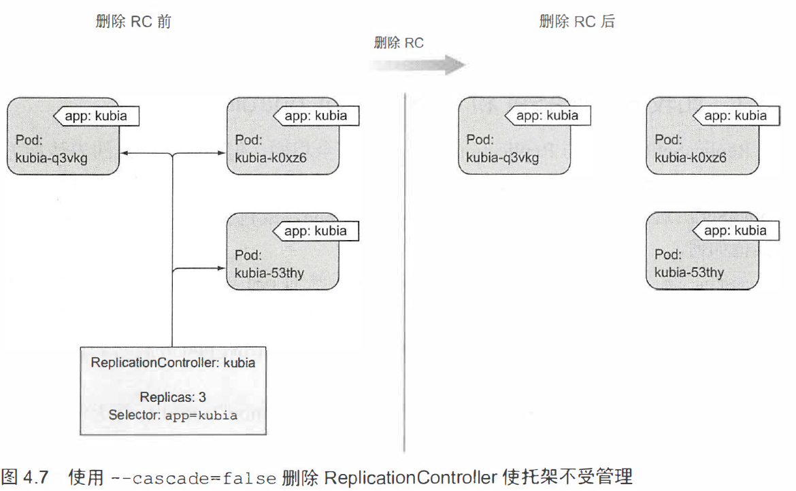

# ReplicationController

ReplicationController
目的是创建和管理一个pod的多个副本(replicas)。

RC有三个部分：

- label selector：标签选择器，例如app=kubia
- replica count：副本个数
- pod template：pod模板

``kubia-rc.yaml``

```yaml
apiVersion: v1
kind: ReplicationController
metadata:
  name: kubia
spec:
  replicas: 3
  selector:
    app: kubia
  template:
    metadata:
      labels:
        app: kubia
    spec:
      containers:
      - name: kubia
        image: luksa/kubia
        ports:
        - containerPort: 8080
```

```bash
[root@vmware0 Chapter04]# kubectl create -f kubia-rc.yaml
replicationcontroller/kubia created
[root@vmware0 Chapter04]# kubectl get po -l app=kubia
NAME          READY   STATUS    RESTARTS   AGE
kubia-698dj   1/1     Running   0          46s
kubia-dxw47   1/1     Running   0          46s
kubia-kngkk   1/1     Running   0          46s
```

## 单pod故障回复

试图删除一个pod，制造故障：

```bash
[root@vmware0 Chapter04]# kubectl delete po kubia-kngkk
pod "kubia-kngkk" deleted
^C
[root@vmware0 Chapter04]# kubectl get po -l app=kubia
NAME          READY   STATUS        RESTARTS   AGE
kubia-698dj   1/1     Running       0          4m17s
kubia-dxw47   1/1     Running       0          4m17s
kubia-kngkk   1/1     Terminating   0          4m17s
kubia-rncr9   1/1     Running       0          6s
```

如果—个pod消失， RC将发现pod数目变少并创建—个新的替代pod。

```bash
[root@vmware0 Chapter04]# kubectl describe rc kubia
...
Replicas:     3 current / 3 desired
Pods Status:  3 Running / 0 Waiting / 0 Succeeded / 0 Failed
...
```

## 单节点故障回复

```bash
# 模拟网络故障，断开节点
sudo ifconfig ethO down
```

该节点状态会由Ready变为NotReady，同时调度到该节点的pod的状态会变为Unknown。

> minikube为单节点集群，所以无法测试多节点情境下的单节点故障。

## 修改pod模板

```bash
export KUBE_EDITOR="/usr/bin/nano"
# or echo KUBE_EDITOR="/usr/bin/nano" >> ~/.bashrc
kubectl edit rc kubia
```

可以水平扩容副本数量：

```yaml
spec:
  replicas: 3 # 10
  ...
```

删除RC:

当你通过kubectl delete 删除RC时， pod 也会被删除。
但是由于由RC创建的pod 不是RC的组成部分，
只是由其进行管理， 因此可以选择只删除 RC并保待pod 运行。



```bash
kubectl delete rc kubia --cascade=false
```

之后，也可以使用合适的标签选择器创建新的RC，将他们再次管理。

