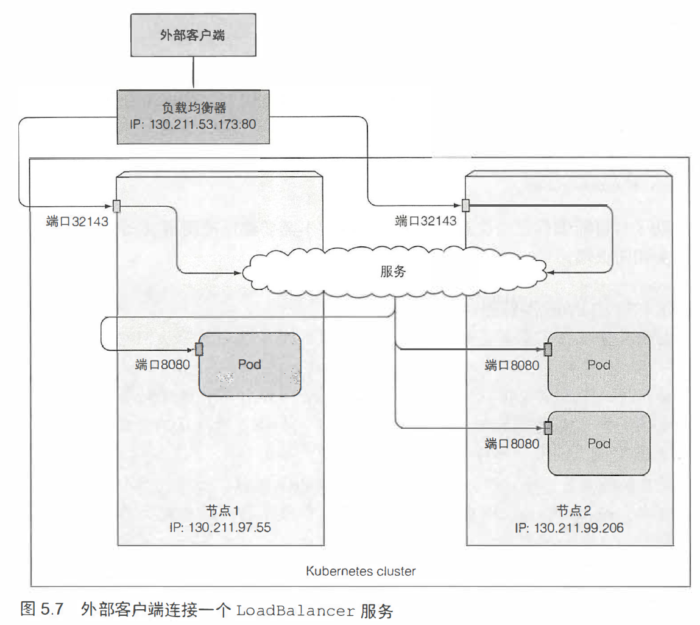
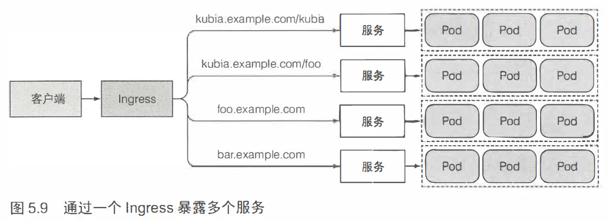

# Service

## 介绍

k8s服务是一种为一组功能相同的pod 提供单一不变的接入点的资源。


## 创建服务

可以通过kubectl expose指令。

还可以通过YAML文件。

``kubia-svc.yaml``

```yaml
apiVersion: v1
kind: Service
metadata:
  name: kubia
spec:
  ports:
  - port: 80
    targetPort: 8080
  selector:
    app: kubia
```

```bash
[root@vmware0 Chapter05]# kubectl create -f kubia-svc.yaml
...
[root@vmware0 Chapter05]# kubectl get svc
NAME         TYPE           CLUSTER-IP      EXTERNAL-IP   PORT(S)          AGE
kubernetes   ClusterIP      10.96.0.1       <none>        443/TCP          2d8h
kubia        ClusterIP      10.108.255.85   <none>        80/TCP           17m
[root@vmware0 Chapter05]# kubectl get po
NAME                                               READY   STATUS    RESTARTS   AGE
kubia-bmjjl                                        1/1     Running   0          3m59s
kubia-fpcln                                        1/1     Running   0          3m59s
kubia-k2kg5                                        1/1     Running   0          3m59s
```

从内部集群测试服务有以下方法：

- 创建一个 pod，发送请求到该集群 ip，查看pod日志检查服务器的响应。

- ssh登录到 k8s的一个节点，执行curl。

- 通过 kubectl exec 在一个已经存在的pod中执行 curl。

  ```bash
  [root@vmware0 Chapter05]# kubectl exec kubia-fpcln -- curl -s http://10.108.255.85
  You've hit kubia-k2kg5
  [root@vmware0 Chapter05]# kubectl exec kubia-fpcln -- curl -s http://10.108.255.85
  You've hit kubia-bmjjl
  ```

  ``-- curl -s http://10.108.255.85``: 双横杠(--)代表着kubectl命令项的结束。在两个横杠之后的内容是指
  在pod内部需要执行的命令。可以看到负载均衡。

  如果想配置服务的会话亲和性：

  ```yaml
  spec:
    sessionAffinity: ClientIP
  ```

  k8s仅支持两种形式的会话亲和性服务： None 和 ClientIP，不支持基于cookie。因为 k8s 服务作用于 TCP 和 UDP，不关心 HTTP层 （cookie所在层）的内容。

## 一个服务暴露多个端口

声明服务：``kubia-svc-unamed-ports.yaml``

```yaml
apiVersion: v1
kind: Service
metadata:
  name: kubia
spec:
  ports:
  - name: http
    port: 80
    targetPort: 8080
  - name: https
    port: 443
    targetPort: 8443
  selector:
    app: kubia
```

上面的定义是未命名的端口，推荐使用命名的端口定义来声明：``kubia-svc-named-ports.yaml``

```yaml
apiVersion: v1
kind: Service
metadata:
  name: kubia
spec:
  ports:
  - name: http
    port: 80
    targetPort: http # 
  - name: https
    port: 443
    targetPort: https #
  selector:
    app: kubia
```

> 在pod中定义多个命名的port 

声明pod：``kubia.yaml``

```yaml
apiVersion: v1
kind: Pod
metadata:
  name: kubia
spec:
  containers:
  - image: luksa/kubia
    name: kubia
    ports:
    - name: http
      containerPort: 8080
    - name: https
      containerPort: 8443
```

## 服务发现

方式一：通过环境变量

```bash
[root@vmware0 Chapter05]# kubectl exec kubia-manual env
...
KUBIA_SERVICE_PORT_HTTP=80
KUBIA_SERVICE_PORT_HTTPS=443
...
KUBIA_SERVICE_HOST=10.98.13.35
...
```

当前端pod需要后端数据库服务pod时，
可通过名为backend-database的服务将后端pod暴露出来，然后前端pod
通过环境变量 BACKEND_DATABASE_SERVICE_HOST 和 BACKEND_DATABASE_SERVICE_PORT 去获得IP 地址和端口信息。

方式二：通过DNS

kube-dns 这个 pod 运行DNS 服务，在集群中的其他pod 都被配置成使用其作为dns ( Kubemetes 通过修改每个容器的/etc/resolv.conf 文件实现）。

运行在pod 上的进程DNS 查询都会被k8s自身的DNS 服务器响应， 该服务器知道系统中运行的所有服务。

通过FQDN 连接服务，例如：

```bash
backend-database.default.svc.cluster.local
```

1. 创建service服务：

``service.yaml``

```yaml
apiVersion: v1
kind: Service
metadata:
  name: kubia
spec:
  ports:
  - name: http
    port: 80
    targetPort: http #
  - name: https
    port: 443
    targetPort: https #
  selector:
    app: kubia
```

```bash
kubectl create -f service.yaml
```

检查svc的地址，集群ip为10.96.109.118：

```
[root@vmware0 ~]# kubectl get svc
NAME         TYPE        CLUSTER-IP      EXTERNAL-IP   PORT(S)          AGE
kubernetes   ClusterIP   10.96.0.1       <none>        443/TCP          3d7h
kubia        ClusterIP   10.96.109.118   <none>        80/TCP,443/TCP   94m
```

2. 删除之前的pod，让rc重新创建新的三个pod：

```bash
[root@vmware0 ~]# kubectl delete po --all
pod "kubia-28mdr" deleted
pod "kubia-5h7tf" deleted
pod "kubia-qlqr6" deleted
```

``kubia-rc.yaml``

```yaml
apiVersion: v1
kind: ReplicationController
metadata:
  name: kubia
spec:
  replicas: 3
  selector:
    app: kubia
  template:
    metadata:
      labels:
        app: kubia
    spec:
      containers:
      - name: kubia
        image: luksa/kubia
        ports:
        - containerPort: 8080
```

 ```bash
kubectl create -f kubia-rc.yaml
 ```

```bash
[root@vmware0 ~]# kubectl get po
NAME          READY   STATUS    RESTARTS   AGE
kubia-4v79s   1/1     Running   0          55s
kubia-rlbq6   1/1     Running   0          55s
kubia-sls68   1/1     Running   0          55s
```

验证pod的集群HOST和PORT是否正确：

```bash
[root@vmware0 ~]# kubectl exec kubia-rlbq6 env
PATH=/usr/local/sbin:/usr/local/bin:/usr/sbin:/usr/bin:/sbin:/bin
HOSTNAME=kubia-rlbq6
...
KUBIA_SERVICE_HOST=10.96.109.118
KUBIA_SERVICE_PORT=80
...
```

可以看到 KUBIA_SERVICE_HOST=10.96.109.118，符合预期。

3. 在pod容器内部验证集群可访问性：

```bash
[root@vmware0 ~]# kubectl exec -it kubia-4v79s bash
root@kubia-4v79s:/# curl http://kubia
You've hit kubia-rlbq6
root@kubia-4v79s:/# curl http://kubia.default
You've hit kubia-sls68
root@kubia-4v79s:/# cat /etc/resolv.conf 
nameserver 10.96.0.10
search default.svc.cluster.local svc.cluster.local cluster.local
options ndots:5
root@kubia-4v79s:/# curl http://kubia.default.svc.cluster.local
You've hit kubia-rlbq6
```

> ping kubia: 这是不通的，因为服务的集群IP是一个虚拟IP ，只有在与服务端口结合时才有意义。

## 连接到集群外部的服务

查看svc的信息：

```bash
[root@vmware0 ~]# kubectl describe svc kubia
Name:              kubia
Namespace:         default
Labels:            <none>
Annotations:       <none>
Selector:          app=kubia # svc服务于app=kubia的pod
Type:              ClusterIP
IP:                10.96.109.118
Port:              http  80/TCP
TargetPort:        8080/TCP
Endpoints:         172.17.0.10:8080,172.17.0.7:8080,172.17.0.9:8080 #入口点
Port:              https  443/TCP
TargetPort:        8443/TCP
Endpoints:         172.17.0.10:8443,172.17.0.7:8443,172.17.0.9:8443
Session Affinity:  None
Events:            <none>
```

Endpoint 资源暴露一个服务的IP地址和端口的列表，Endpoint 资源和其他
k8s 资源一样，可以使用kubectl info 来获取它的基本信息。

```bash
[root@vmware0 ~]# kubectl get endpoints kubia 
NAME    ENDPOINTS                                                      AGE
kubia   172.17.0.10:8443,172.17.0.7:8443,172.17.0.9:8443 + 3 more...   128m
```

### 手动配置endpoint来创建服务

第1步：创建没有选择器的服务

``external-service.yaml``

```yaml
apiVersion: v1
kind: Service
metadata:
  name: external-service
spec:
  ports:
  - port: 80
```

第2步：为没有选择器的服务创建Endpoint资源

``external-service-endpoints.yaml``

```yaml
apiVersion: v1
kind: Endpoints
metadata:
  name: external-service # Endpoint对象需要与服务具有相同的名称
subsets:
  - addresses:
    - ip: 11.11.11.11 # 必须指定ip
    - ip: 22.22.22.22
    ports:
    - port: 80 # 必须指定port
```

服务和Endpoint资源都发布到服务器后，服务就可以像具有pod选择器那样的服务正常使用。

在服务创建后创建的容器将包含服务的环境变量，并且与其
ip:port对的所有连接都将在服务端点之间进行负载均衡。


### 创建ExternalName类型的服务

```yaml
apiVersion: v1
kind: Service
metadata:
  name: external-service
spec:
  type: ExternalName
  externalName: api.somecompany.com
  ports:
  - port: 80
```

外接客户端于是可以通过直接访问 api.somecompany.com:80 来访问 external-service 这个服务。

## 将服务暴露给外部客户端

三个方式：NodePort，LoadBalance，Ingress

### 使用NodePort类型的服务

可以通过服务的内部集群IP访问NodePort服务， 还可以通过任何节点的IP和预留节点端口访问NodePort服务。

``kubia-svc-nodeport.yaml``

```yaml
apiVersion: v1
kind: Service
metadata:
  name: kubia-nodeport
spec:
  type: NodePort
  ports:
  - port: 80  #服务集群ip的端口号
    targetPort: 8080 # 背后pod的目标端口
    nodePort: 30123 # 通过集群节点的30123端口可以访问该服务，若不指定这个端口，k8s随机设置。
  selector:
    app: kubia
```

```bash
[root@vmware0 Chapter05]# kubectl create -f kubia-svc-nodeport.yaml
service/kubia-nodeport created
[root@vmware0 Chapter05]# kubectl get svc
NAME             TYPE        CLUSTER-IP      EXTERNAL-IP   PORT(S)          AGE
...
kubia-nodeport   NodePort    10.101.31.120   <none>        80:30123/TCP     6s
```

> minikube中，EXTERNAL-IP=<none>，表示不支持外部集群节点。

理论上，可以通过以下地址访问服务：

- 10.101.31.120:80
- <1st node's ip>:30123
- <2nd node's ip>:30123


```bash
[root@vmware0 Chapter05]# kubectl get node -o wide
NAME       STATUS   ROLES    AGE    VERSION   INTERNAL-IP     EXTERNAL-IP   OS-IMAGE                KERNEL-VERSION          CONTAINER-RUNTIME
minikube   Ready    master   3d8h   v1.15.0   192.168.31.12   <none>        CentOS Linux 7 (Core)   3.10.0-862.el7.x86_64   docker://19.3.5
```

```yaml
[root@vmware0 Chapter05]# curl 192.168.31.12:30123
You've hit kubia-sls68
```

> 192.168.31.12 是一个指定的node，假设这节点故障了，那么使用192.168.31.12:30123这个路径访问服务的客户端将无法访问到服务。这就是NodePort类型服务的缺点。从这点上看，LoadBalancer类型的服务可靠性更强。

### 使用LoadBalancer类型的服务

负载均衡器拥有自己唯一的可公开访问的IP地址， 并将所有连接重定向到服务。

> minikube旧版本暂不支持LoadBalancer类型的服务。GKE支持。

受限于minikube，以下没有实测，理论上：

``kubia-svc-loadbalancer.yaml``

```yaml
apiVersion: v1
kind: Service
metadata:
  name: kubia-loadbalancer
spec:
  type: LoadBalancer
  ports:
  - port: 80
    targetPort: 8080
  selector:
    app: kubia
```

```bash
[root@vmware0 Chapter05]# kubectl get svc
NAME                 TYPE           CLUSTER-IP      EXTERNAL-IP   PORT(S)          AGE
...
kubia-loadbalancer   LoadBalancer   10.103.57.9     <pending>     80:31969/TCP     11s
...
```

```bash
curl http://EXTERNAL-IP
```

> curl 访问时每次打开一个新连接，负载均衡器可以在连接级别上生效。
>
> 但是浏览器keep-alive连接会保持单一连接直到关闭，于是每次浏览器都会碰到同一个pod。

总结：LoadBalancer类型的服务是一个具有额外的基础设施提供的负载平衡器NodePort服务。



外部连接的特性。

- 防止不必要的网络跳数：

```yaml
apiVersion: v1
kind: Service
metadata:
  name: kubia-nodeport-onlylocal
spec:
  type: NodePort
  externalTrafficPolicy: Local
...
```

- 默认情况下客户端IP不记录：

当通过节点端口接收到连接时， 由于对数据包执行了源网络地址转换
(SNAT), 因此数据包的源IP将发生更改。

例如， 对于Web服务器，访问日志将无法显示浏览器的IP。可以按照上面的 externalTrafficPolicy: Local 解决这个IP跟踪问题。

### 创建Ingress资源

> ingress: 进入或进入的行为；进入的权利；进入的手段或地点；
> 入口。

每个LoadBalancer 服务都需要自己的负载均衡器， 以及独有的公有IP地址， 而Ingress 只需要一个公网IP就能为许多服务提供访问。



在minikube上启用ingress：

```bash
[root@vmware0 Chapter05]# minikube addons list
...
- ingress: disabled
...
[root@vmware0 Chapter05]# minikube addons enable ingress
* ingress was successfully enabled
[root@vmware0 Chapter05]# kubectl get po --all-namespaces
NAMESPACE     NAME                                               READY   STATUS              RESTARTS   AGE
...
kube-system   nginx-ingress-controller-7b465d9cf8-rgrpd          0/1     ContainerCreating   0          15s
...
```

通过ingress访问服务：

``kubia-ingress.yaml``

```yaml
apiVersion: extensions/v1beta1
kind: Ingress
metadata:
  name: kubia
spec:
  rules:
  - host: kubia.example.com
    http:
      paths:
      - path: /
        backend:
          serviceName: kubia-nodeport
          servicePort: 80
```

```bash
[root@vmware0 Chapter05]# kubectl create -f kubia-ingress.yaml 
ingress.extensions/kubia created
[root@vmware0 Chapter05]# kubectl get ingresses
NAME    HOSTS               ADDRESS         PORTS   AGE
kubia   kubia.example.com   192.168.31.12   80      57s
[root@vmware0 Chapter05]# nano /etc/hosts
192.168.31.12 kubia.example.com
[root@vmware0 Chapter05]# curl http://kubia.example.com
You've hit kubia-sls68
```


ingress通过与该服务关联的Endpoint对象查看pod IP ， 并将客户端的请求转发给其中一个pod。

可以通过相同的ingress暴露多个服务：

- 不同的服务映射到相同主机的不同路径

  ```yaml
  - host kubia.example .com
  	http:
        paths:
        - path: /kubia
          backend:
            serviceName : kubia
            servicePort: 80
        - path: /foo
          backend:
            serviceName : bar
            serv工cePort: 80
  ```

- 不同的服务映射到不同的主机

  ```yaml
  spec:
    rules:
    - host: foo.example.com
      http:
        paths:
        - path: /
          backend:
            serviceName: foo
            servicePor t: 80
    - host: bar.example.com
      http :
        paths:
        - path: /
          backend:
            serviceName: bar
            servicePort: 80
  ```

配置ingress支持TLS：

```bash
yum install openssl -y
openssl req -new -x509 -key tls.key -out tls.cert -days 360 -subj /CN=kubia.example.com
[root@vmware0 ~]# kubectl create secret tls tls-secret --cert=tls.cert --key=tls.key
secret/tls-secret created
```

私钥和证书现存储在名为tls-secret的Secret中。

接着，更新
Ingress 对象，让它接收 kubia.example.com 的HTTPS 请求。

``kubia-ingress-tls.yaml``

```yaml
apiVersion: extensions/v1beta1
kind: Ingress
metadata:
  name: kubia
spec:
  tls:
  - hosts: 
    - kubia.example.com
    secretName: tls-secret
  rules:
  - host: kubia.example.com
    http:
      paths:
      - path: /
        backend:
          serviceName: kubia-nodeport
          servicePort: 80
```

```bash
[root@vmware0 Chapter05]# kubectl apply -f kubia-ingress-tls.yaml 
Warning: kubectl apply should be used on resource created by either kubectl create --save-config or kubectl apply
ingress.extensions/kubia configured
[root@vmware0 Chapter05]# curl -k -v https://kubia.example.com
* About to connect() to kubia.example.com port 443 (#0)
*   Trying 192.168.31.12...
* Connected to kubia.example.com (192.168.31.12) port 443 (#0)
* Initializing NSS with certpath: sql:/etc/pki/nssdb
* skipping SSL peer certificate verification
* SSL connection using TLS_ECDHE_RSA_WITH_AES_256_GCM_SHA384
* Server certificate:
* 	subject: CN=kubia.example.com
* 	start date: Nov 30 12:32:25 2019 GMT
* 	expire date: Nov 24 12:32:25 2020 GMT
* 	common name: kubia.example.com
* 	issuer: CN=kubia.example.com
> GET / HTTP/1.1
> User-Agent: curl/7.29.0
> Host: kubia.example.com
> Accept: */*
> 
< HTTP/1.1 200 OK
< Server: nginx/1.15.9
< Date: Sat, 30 Nov 2019 12:38:35 GMT
< Transfer-Encoding: chunked
< Connection: keep-alive
< 
You've hit kubia-sls68
* Connection #0 to host kubia.example.com left intact
```

## pod就绪后发出信号

### 就绪探针
典型是一个简单的GET请求，用于判断特定的pod是否接收客户端请求。有三类：

- Exec : 执行进程，容器的状态由进程的退出状态代码确定。
- HTTP GET：向容器发送HTTP GET 请求，通过响应的HTTP状态代码判断。
- TCP socket：打开一个TCP 连接到容器的指定端口。


``kubia-rc-readinessprobe.yaml``,创建就绪探针：

```yaml
apiVersion: v1
kind: ReplicationController
metadata:
  name: kubia
spec:
  replicas: 3
  selector:
    app: kubia
  template:
    metadata:
      labels:
        app: kubia
    spec:
      containers:
      - name: kubia
        image: luksa/kubia
        ports:
        - name: http
          containerPort: 8080
        readinessProbe:
          exec:
            command:
            - ls
            - /var/ready
```

就绪探针将定期在容器内执行ls/var/ready命令。如果文件存在， 则ls命令返回退出码0, 否则返回非零的退出码。

```bash
[root@vmware0 Chapter05]# kubectl apply -f kubia-rc-readinessprobe.yaml
Warning: kubectl apply should be used on resource created by either kubectl create --save-config or kubectl apply
replicationcontroller/kubia configured
```

删除之前的pod，并让rc重建：

```bash
[root@vmware0 Chapter05]# kubectl delete po --all
pod "kubia-4v79s" deleted
pod "kubia-rlbq6" deleted
pod "kubia-sls68" deleted
[root@vmware0 Chapter05]# kubectl get po
NAME          READY   STATUS    RESTARTS   AGE
kubia-dhzrw   0/1     Running   0          39s
kubia-lhpck   0/1     Running   0          39s
kubia-nrfl2   0/1     Running   0          39s
```

创建/var/ready文件使其中一个pod的就绪探针返回成功:

```bash
[root@vmware0 Chapter05]# kubectl exec kubia-dhzrw -- touch /var/ready
[root@vmware0 Chapter05]# kubectl get po
NAME          READY   STATUS    RESTARTS   AGE
kubia-dhzrw   1/1     Running   0          116s
kubia-lhpck   0/1     Running   0          116s
kubia-nrfl2   0/1     Running   0          116s
```

测试访问：

```bash
[root@vmware0 Chapter05]# kubectl get svc
NAME                 TYPE           CLUSTER-IP      EXTERNAL-IP   PORT(S)          AGE
kubernetes           ClusterIP      10.96.0.1       <none>        443/TCP          4d11h
kubia                ClusterIP      10.96.109.118   <none>        80/TCP,443/TCP   29h
kubia-loadbalancer   LoadBalancer   10.103.57.9     <pending>     80:31969/TCP     26h
kubia-nodeport       NodePort       10.101.31.120   <none>        80:30123/TCP     26h
[root@vmware0 Chapter05]# curl http://10.101.31.120
You've hit kubia-dhzrw
[root@vmware0 Chapter05]# curl http://10.101.31.120
You've hit kubia-dhzrw
[root@vmware0 Chapter05]# curl http://10.101.31.120
You've hit kubia-dhzrw
```

结果：只有一个 pod 报告已ready， 因此唯一的pod接收请求。

> 就绪探针的必要性

如果没有就绪探针，pod启动后会立即成为服务端点，可能此时该pod还不能正常向外提供服务。

## 使用headless服务来发现独立的pod

### 创建headless服务

``kubia-svc-headless.yaml``

```yaml
apiVersion: v1
kind: Service
metadata:
  name: kubia-headless
spec:
  clusterIP: None
  ports:
  - port: 80
    targetPort: 8080
  selector:
    app: kubia
```

```bash
[root@vmware0 Chapter05]# kubectl create -f kubia-svc-headless.yaml 
service/kubia-headless created
[root@vmware0 Chapter05]# kubectl get svc
NAME                 TYPE           CLUSTER-IP      EXTERNAL-IP   PORT(S)          AGE
...
kubia-headless       ClusterIP      None            <none>        80/TCP           14s
...
```

```bash
[root@vmware0 Chapter05]# kubectl exec kubia-nrfl2 -- touch /var/ready
[root@vmware0 Chapter05]# kubectl get po
NAME                                               READY   STATUS      RESTARTS   AGE
kubia-dhzrw                                        1/1     Running     0          20m
kubia-lhpck                                        0/1     Running     0          20m
kubia-nrfl2                                        1/1     Running     0          20m
```

目前只有两个kubia-XX的pod为ready。

### 通过DNS发现pod

基于测试的目的，直接使用 kubectl run 命令创建一个临时pod。

```bash
kubectl run dnsutils --image=tutum/dnsutils --generator=run-pod/v1 --command -- sleep infinity
```

> sleep infinity 是为了保证这个pod为running状态，从而可以exec进去执行一些命令测试。

```bash
[root@vmware0 Chapter05]# kubectl get po -o wide
NAME          READY   STATUS    RESTARTS   AGE     IP            NODE       
dnsutils      1/1     Running   0          6m17s   172.17.0.7    minikube       
kubia-dhzrw   1/1     Running   0          45m     172.17.0.11   minikube       
kubia-lhpck   0/1     Running   0          45m     172.17.0.4    minikube      
kubia-nrfl2   1/1     Running   0          45m     172.17.0.12   minikube       
```

```bash
[root@vmware0 Chapter05]# kubectl exec dnsutils nslookup kubia-headless
Server:		10.96.0.10
Address:	10.96.0.10#53

Name:	kubia-headless.default.svc.cluster.local
Address: 172.17.0.12
Name:	kubia-headless.default.svc.cluster.local
Address: 172.17.0.11
```

查看svc：

```bash
[root@vmware0 Chapter05]# kubectl get svc -o wide
NAME   TYPE     CLUSTER-IP      EXTERNAL-IP   PORT(S)          AGE     SELECTOR
...
kubia  ClusterIP  10.96.109.118   <none>      80/TCP,443/TCP   30h     app=kubia
...
```

```bash
[root@vmware0 Chapter05]# kubectl exec dnsutils nslookup kubia
Server:		10.96.0.10
Address:	10.96.0.10#53

Name:	kubia.default.svc.cluster.local
Address: 10.96.109.118
```

查看endpoints:

```bash
[root@vmware0 Chapter05]# kubectl get endpoints
NAME                 ENDPOINTS                             AGE
kubernetes           192.168.31.12:8443                    4d11h
kubia                ...,172.17.0.11:8080 + 1 more...      30h
kubia-headless       172.17.0.11:8080,172.17.0.12:8080     33m
kubia-loadbalancer   172.17.0.11:8080,172.17.0.12:8080     26h
kubia-nodeport       172.17.0.11:8080,172.17.0.12:8080     27h
```

