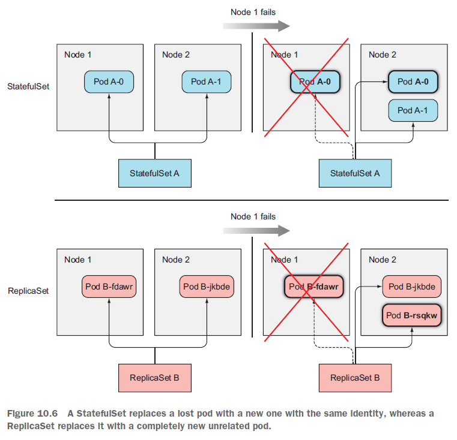
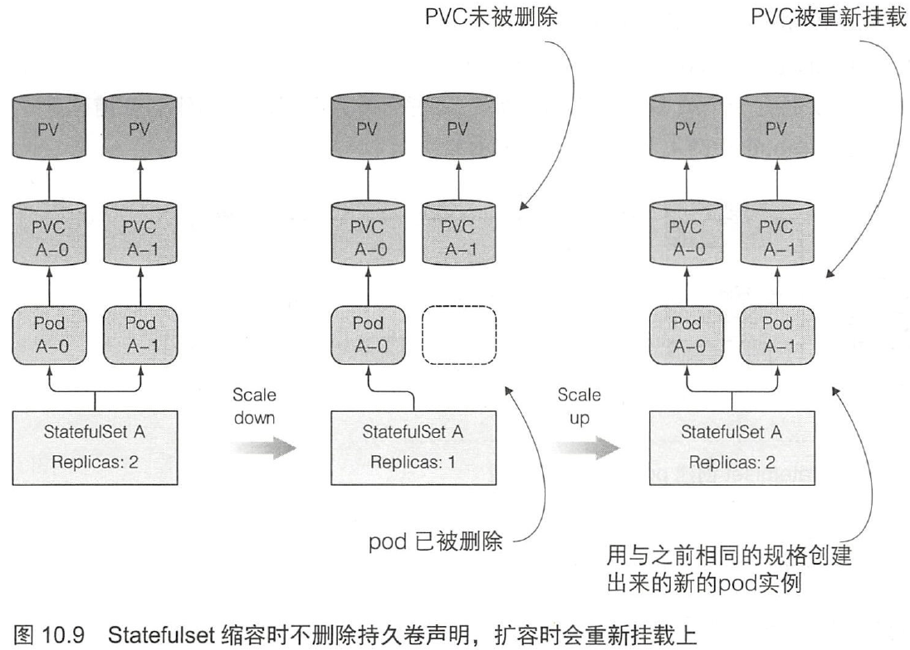
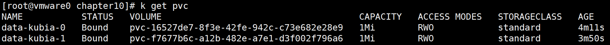
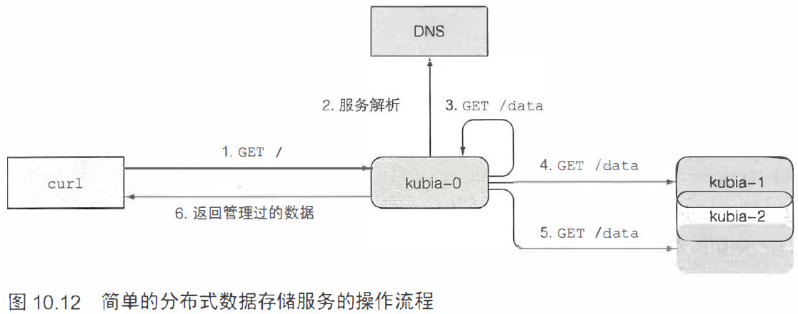

# Statefulset

对比statefulset和replicaSet、replicationController：

- **rs或rc的pod实例可以看做牛，是无状态的**。死掉一个用新的的代替即可。
- **statefulset的pod实例可以看做宠物，是有状态的**。若要替换掉这只宠物，需要找到一只行为举止与之完全一致的宠物。对应用来说， 意味着新的实例需要拥有跟旧的案例完全一致的状态和标识。

Statefulset 保证了pod在重新调度后保留它们的标识和状态，让你方便地扩容、
缩容。

## 简介

### 控制服务

一个Statefulset要求你创建一个用来记录每个pod网络标记的headless Service 。通过这个Service，每个pod将拥有独立的DNS记录， 集群里它的伙伴或者客户端可以通过主机名方便地找到它。

### 稳定的网络标识

替换消失的宠物。



### 扩缩容Statefulset

- 扩容

扩容一个Statefulset会使用下一个还没用到的顺序索引值创建一个新的pod实例。比如， 要把一个Statefulset从两个实例扩容到三个实例， 那么新实例的索引值就会是2 (现有实例使用的索引值为0和1)。

- 缩容

缩容一个Statefulset 将会最先删除最高索引值的实例。

Statefulset 在有实例不健康的情况下不允许做缩容操作。若一个实例是不健康的，而这时再缩容一个实例，也就意味着你实际上同时失去了两个集群成员！

### 为每个有状态实例提供稳定的专属存储


持久卷的创建和删除。

扩容StatefulSet 增加一个副本数时， 会创建两个或更多的API 对象（一个pod
和与之关联的一个或多个持久卷声明） 。**对缩容来说， 则只会删除一个pod ，而遗留下之前创建的声明**。因为当一个声明被删除后，与之绑定的持久卷就会被回收或删除，则其上面的数据就会丢失。

缩容Statefulset 时会保留持久卷声明， 所以在随后的扩容操作中， 新的pod
实例会使用绑定在持久卷上的相同声明和其上的数据。



一个Statefulset 必须在准确确认一个pod 不再运行后，才会去创建它的替换pod。

## 使用Statefulset

`app.js`

```js
const http = require('http');
const os = require('os');
const fs = require('fs');

const dataFile = "/var/data/kubia.txt";

function fileExists(file) {
  try {
    fs.statSync(file);
    return true;
  } catch (e) {
    return false;
  }
}

var handler = function(request, response) {
  if (request.method == 'POST') {
    var file = fs.createWriteStream(dataFile);
    file.on('open', function (fd) {
      request.pipe(file);
      console.log("New data has been received and stored.");
      response.writeHead(200);
      response.end("Data stored on pod " + os.hostname() + "\n");
    });
  } else {
    var data = fileExists(dataFile) ? fs.readFileSync(dataFile, 'utf8') : "No data posted yet";
    response.writeHead(200);
    response.write("You've hit " + os.hostname() + "\n");
    response.end("Data stored on this pod: " + data + "\n");
  }
};

var www = http.createServer(handler);
www.listen(8080);
```

`Dockerfile`

```bash
FROM node:7
ADD app.js /app.js
ENTRYPOINT ["node", "app.js"]
```

### 创建持久卷PV

``persistent-volumes-hostpath.yaml``

```yml
kind: List
apiVersion: v1
items:
- apiVersion: v1
  kind: PersistentVolume
  metadata:
    name: pv-a
  spec:
    capacity:
      storage: 1Mi
    accessModes:
      - ReadWriteOnce
    persistentVolumeReclaimPolicy: Recycle
    hostPath:
      path: /tmp/pv-a
- apiVersion: v1
  kind: PersistentVolume
  metadata:
    name: pv-b
  spec:
    capacity:
      storage: 1Mi
    accessModes:
      - ReadWriteOnce
    persistentVolumeReclaimPolicy: Recycle
    hostPath:
      path: /tmp/pv-b
- apiVersion: v1
  kind: PersistentVolume
  metadata:
    name: pv-c
  spec:
    capacity:
      storage: 1Mi
    accessModes:
      - ReadWriteOnce
    persistentVolumeReclaimPolicy: Recycle
    hostPath:
      path: /tmp/pv-c
```

```bash
[root@vmware0 chapter10]# k create -f persistent-volumes-hostpath.yaml 
persistentvolume/pv-a created
persistentvolume/pv-b created
persistentvolume/pv-c created
```

### 创建控制Service

`kubia-service-headless.yaml`

```yml
apiVersion: v1
kind: Service
metadata:
  name: kubia
spec:
  clusterIP: None
  selector:
    app: kubia
  ports:
  - name: http
    port: 80
```

```bash
[root@vmware0 chapter10]# k create -f kubia-service-headless.yaml 
service/kubia created
```

> statefulset的控制service必须为headless模式。

### 创建Statefulset

`kubia-statefulset.yaml`

```yml
apiVersion: apps/v1beta1
kind: StatefulSet
metadata:
  name: kubia
spec:
  serviceName: kubia
  replicas: 2
  template:
    metadata:
      labels:
        app: kubia
    spec:
      containers:
      - name: kubia
        image: luksa/kubia-pet
        ports:
        - name: http
          containerPort: 8080
        volumeMounts:
        - name: data
          mountPath: /var/data
  volumeClaimTemplates:
  - metadata:
      name: data
    spec:
      resources:
        requests:
          storage: 1Mi
      accessModes:
      - ReadWriteOnce
```

```bash
[root@vmware0 chapter10]# k create -f kubia-statefulset.yaml 
statefulset.apps/kubia created
[root@vmware0 chapter10]# k get po
NAME       READY   STATUS    RESTARTS   AGE
kubia-0    1/1     Running   0          29s
kubia-1    1/1     Running   0          8s
```

kubia-0 和 kubia-1 是依次启动的。

状态明确的集群应用对同时有两个集群成员启动引起的竞争非常敏感。所以依次启动每个成员是比较安全可靠。

```bash
[root@vmware0 chapter10]# k get po kubia-0 -o yaml
apiVersion: v1
kind: Pod
metadata:
  ...
spec:
  containers:
  - image: luksa/kubia-pet
    ...
    volumeMounts:
    - mountPath: /var/data
      name: data
    - mountPath: /var/run/secrets/kubernetes.io/serviceaccount
      name: default-token-27dmz
      readOnly: true
...
  volumes:
  - name: data
    persistentVolumeClaim:
      claimName: data-kubia-0
  - name: default-token-27dmz
    secret:
      defaultMode: 420
      secretName: default-token-27dmz
```

可以看到  persistentVolumeClaim 的声明。



### 使用pod

通过API服务器与pod通信。

```bash
[root@vmware0 chapter10]# k proxy
Starting to serve on 127.0.0.1:8001
```

使用localhost:8001
来代替实际的API 服务器主机地址和端口。

- GET 请求

```bash
[root@vmware0 chapter9]# curl localhost:8001/api/v1/namespaces/default/pods/kubia-0/proxy/
You've hit kubia-0
Data stored on this pod: No data posted yet
```

你正在使用代理的方式， 通过API 服务器与pod 通信， 每个请求都会经过两个代理（第一个是kubectl 代理， 第二个是把请求代理到pod 的API 服务器）。


- POST请求

```bash
[root@vmware0 chapter9]# curl -X POST -d "Hey there! This greeting was submitted to kubia-0." localhost:8001/api/v1/namespaces/default/pods/kubia-0/proxy/
Data stored on pod kubia-0

[root@vmware0 chapter9]# curl localhost:8001/api/v1/namespaces/default/pods/kubia-0/proxy/
You've hit kubia-0
Data stored on this pod: Hey there! This greeting was submitted to kubia-0.
```

此时请求kubia-1

```bash
[root@vmware0 chapter9]# curl localhost:8001/api/v1/namespaces/default/pods/kubia-1/proxy/
You've hit kubia-1
Data stored on this pod: No data posted yet
```

每个节点拥有独自的状态。

接下来，删除kubia-0来验证重新调度的pod 是否关联了相同的存储。

```bash
[root@vmware0 chapter9]# k delete po kubia-0
pod "kubia-0" deleted
[root@vmware0 chapter9]# k get po
NAME       READY   STATUS              RESTARTS   AGE
kubia-0    0/1     ContainerCreating   0          5s
kubia-1    1/1     Running             0          16m
[root@vmware0 chapter9]# k get po
NAME       READY   STATUS    RESTARTS   AGE
kubia-0    1/1     Running   0          20s
kubia-1    1/1     Running   0          17m
```

```bash
[root@vmware0 chapter9]# curl localhost:8001/api/v1/namespaces/default/pods/kubia-0/proxy/
You've hit kubia-0
Data stored on this pod: Hey there! This greeting was submitted to kubia-0.
```

可以确认Statefulset会使用一个完全一致的pod来替换被删除的pod。

### 通过非headless的Service暴露Statefulset的pod

`kubia-service-public.yaml`

```yml
apiVersion: v1
kind: Service
metadata:
  name: kubia-public
spec:
  selector:
    app: kubia
  ports:
  - port: 80
    targetPort: 8080
```

```bash
k create -f kubia-service-public.yaml 
```

它是一个常规的ClusterIPService, 不是一个NodePort或LoadBalancer类型的Service), 只能在你的集群内部访问它。

通过API服务器访问集群内部的服务。

```bash
[root@vmware0 chapter10]# curl localhost:8001/api/v1/namespaces/default/services/kubia-public/proxy/
You've hit kubia-0
Data stored on this pod: Hey there! This greeting was submitted to kubia-0.
```

此时，每个请求会随机分配到一个集群节点上。

## 在Statefulset中发现伙伴节点

**SRV记录用来指向提供指定服务的服务器的主机名和端口号**。K8s通过一个headless service创建SRV记录来指向pod的主机名。

可以在一个临时pod里运行DNS查询工具--dig命令， 列出你的有状态pod
的SRV记录。

```bash
kubectl run -it srvlookup --image=tutum/dnsutils --rm --restart=Never -- dig SRV kubia.default.svc.cluster.local
```


### DNS实现伙伴间彼此发现

``app.js``

```js
var handler = function(request, response) {
  if (request.method == 'POST') {
    var file = fs.createWriteStream(dataFile);
    file.on('open', function (fd) {
      request.pipe(file);
      response.writeHead(200);
      response.end("Data stored on pod " + os.hostname() + "\n");
    });
  } else {
    response.writeHead(200);
    if (request.url == '/data') {
      var data = fileExists(dataFile) ? fs.readFileSync(dataFile, 'utf8') : "No data posted yet";
      response.end(data);
    } else {
      response.write("You've hit " + os.hostname() + "\n");
      response.write("Data stored in the cluster:\n");
      dns.resolveSrv(serviceName, function (err, addresses) {
        if (err) {
          response.end("Could not look up DNS SRV records: " + err);
          return;
        }
        var numResponses = 0;
        if (addresses.length == 0) {
          response.end("No peers discovered.");
        } else {
          addresses.forEach(function (item) {
            var requestOptions = {
              host: item.name,
              port: port,
              path: '/data'
            };
            httpGet(requestOptions, function (returnedData) {
              numResponses++;
              response.write("- " + item.name + ": " + returnedData + "\n");
              if (numResponses == addresses.length) {
                response.end();
              }
            });
          });
        }
      });
    }
  }
};
```

该容器镜像为：`docker.io/luksa/kubia-pet-peers`

首先收到请求的服务器会触发一次headlessmkubia服务的SRV记录查询， 然后发送GET请求到服务背后的每一个pod(也会发送给自己，虽然没有必要，这里为了保证代码简单），然后返回所有节点和它们的数据信息的列表。



### 更新Statefulset

> 使用apply yml的形式更加规范。

```bash
kubectl edit statuefulset kubia
```

更改如下：

```yml
replicas: 3
- image: luksa/kubia-pet-peers
```

```bash
[root@vmware0 etc]# k get po
NAME       READY   STATUS              RESTARTS   AGE
dnsutils   1/1     Running             2          12d
kubia-0    1/1     Running             1          22h
kubia-1    1/1     Running             1          22h
kubia-2    0/1     ContainerCreating   0          4s
```

由于`replicas: 3`,所以一个新的 pod `kubia-2 `被创建。但之前的 kubia-0 和 kubia-1并没有任何更新。

如果想要kubia-0和kubia-1也更新，需要手动删除kubia-0和kubia-1，让其自动新建。

```bash
[root@vmware0 etc]# k delete po kubia-0 kubia-1
pod "kubia-0" deleted
pod "kubia-1" deleted
```

尝试集群数据存储

```bash
[root@vmware0 etc]# curl -X POST -d "The sun is shining" localhost:8001/api/v1/namespaces/default/services/kubia-public/proxy/
Data stored on pod kubia-2
[root@vmware0 etc]# curl -X POST -d "The sun is shining" localhost:8001/api/v1/namespaces/default/services/kubia-public/proxy/
Data stored on pod kubia-0
```

接下来，GET请求验证SRV记录列表

```bash
[root@vmware0 etc]# curl localhost:8001/api/v1/namespaces/default/services/kubia-public/proxy/
You've hit kubia-2
Data stored in the cluster:
- kubia-2.kubia.default.svc.cluster.local: The sun is shining
- kubia-0.kubia.default.svc.cluster.local: The sun is shining
- kubia-1.kubia.default.svc.cluster.local: No data posted yet
```

当一个客户端请求到达集群中任意一个节点后， 它会发现它的所有伙伴节点， 然后通过它们收集数据， 把收集到的所有数据返回给客户端。

## Statefulset处理节点失效

遗憾的是minikube是单节点集群，无法模拟单一节点故障的测试。

以下皆为理论：

在一个节点内部断开网络：

```bash
sudo ifconfig eth0 down
```

当这个节点的网络接口关闭以后，运行在这个节点上的Kubelet 服务就无法与
K8s API 服务器通信， 无法汇报本节点和上面的pod 都在正常运行。

过了一段时间后，控制台就会标记该节点状态为NotReady，该节点上面的所有pod 状态都会变为Unknown。

- 若该节点过段时间正常连通，井且重新汇报它上面的pod 状态，那这个pod 就会重新被标记为Running。
- 若这个pod 的未知状态持续几分钟后（这个时间可以配置），这个pod 就会自动从节点上驱逐。

假设网络断开的节点为Node1，上面有一个kubia-0，那么需要**手动强制删除**kubia-0

```bash
kubectl delete po kubia-0 --force --grace-period 0
```

> 除非你确认节点是不再运行或者永远不会再可以访问，
> 否则不要强制删除有状态的pod。

