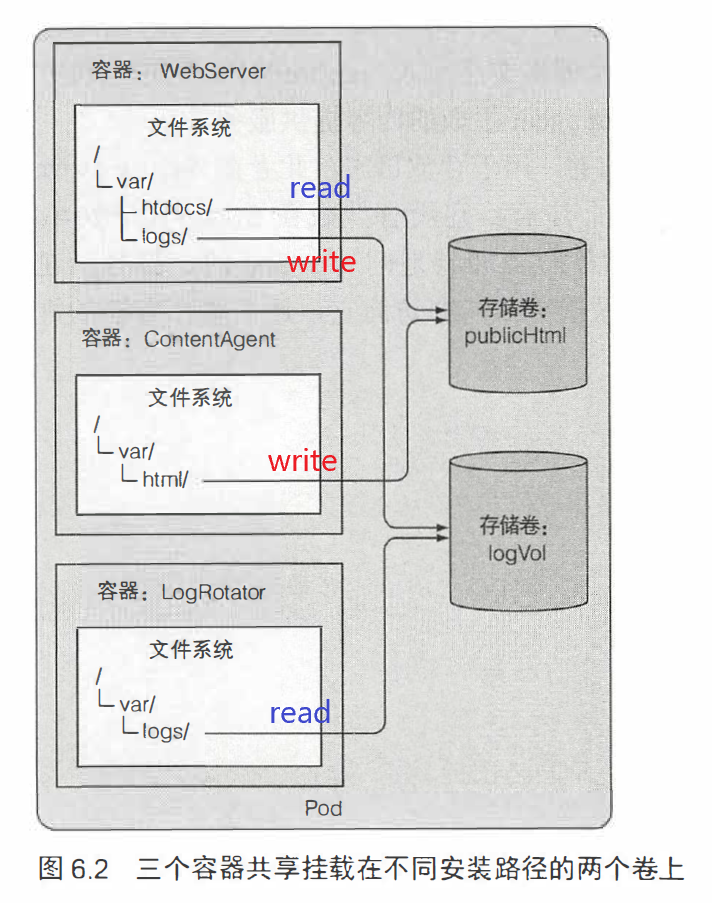
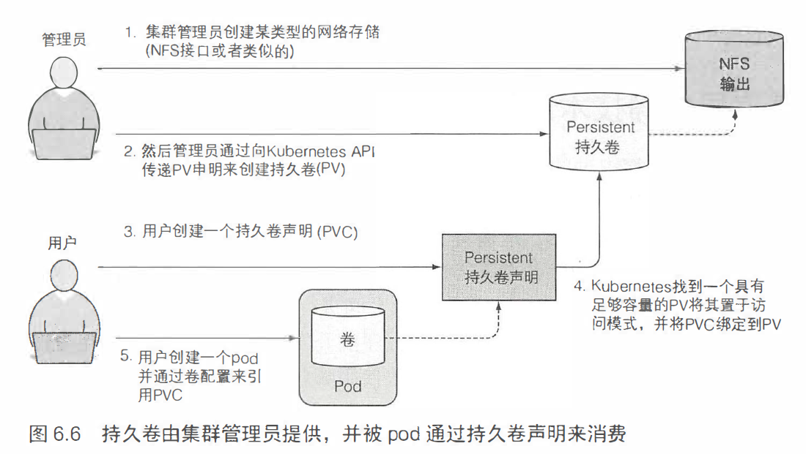
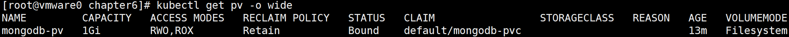
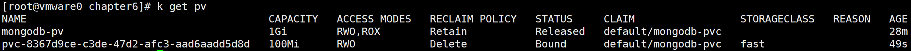
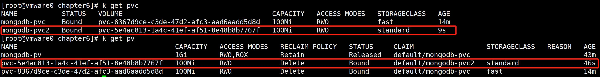
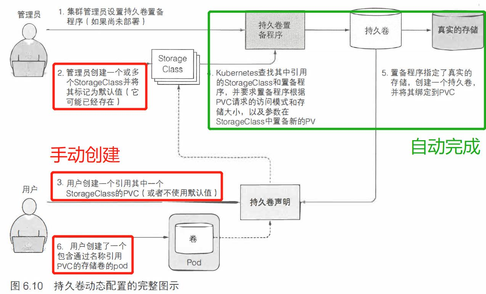

# volume



## volum生命周期

卷的生存周期与pod 的生存周期相关联，当删除pod 时，
卷的内容就会丢失。

但是，有些类型的卷可以将数据写到外部磁盘中，实现持久化。

## volume类型

- emptyDir： 临时数据的空目录
- qujueyu工作节点的文件系统挂载到pod
- gitRepo： git仓库内容初始化卷
- nfs：NFS共享卷
- configMap, secret, downwardAPI
- persistentVolumeClaim

### emptyDir

build a fortune docker image:

``fortuneloop.sh``

```bash
#!/bin/bash
# SIGINT = ctrl + c, call exit
trap "exit" SIGINT
mkdir /var/htdocs

while :
do
  echo $(date) Writing fortune to /var/htdocs/index.html
  /usr/games/fortune > /var/htdocs/index.html
  sleep 10
done
```

``dockerfile``

```dockerfile
FROM ubuntu:latest
RUN apt-get update ; apt-get -y install fortune
ADD fortuneloop.sh /bin/fortuneloop.sh
ENTRYPOINT /bin/fortuneloop.sh
```

```bash
docker build -t luksa/fortune .
docker push luksa/fortune
```

``fortune-pod.yml``

```yml
apiVersion: v1
kind: Pod
metadata:
  name: fortune
spec:
  containers:
  - image: luksa/fortune
    name: html-generator
    volumeMounts:
    - name: html
      mountPath: /var/htdocs
  - image: nginx:alpine
    name: web-server
    volumeMounts:
    - name: html
      mountPath: /usr/share/nginx/html
      readOnly: true
    ports:
    - containerPort: 80
      protocol: TCP
  volumes:
  - name: html
    emptyDir: {}
      # medium: Memory
```

```bash
kubectl port-forward fortune 8080:80
# new a terminal
curl http://localhost:8080
```

### gitRepo

在创建pod 时，首先将卷初始化为一个空目录，然后将指定的Git仓库克隆到其中。

fork  https://github.com/luksa/kubia-website-example to your own repo。

``gitrepo-volume-pod.yaml``

```yml
apiVersion: v1
kind: Pod
metadata:
  name: gitrepo-volume-pod
spec:
  containers:
  - image: nginx:alpine
    name: web-server
    volumeMounts:
    - name: html
      mountPath: /usr/share/nginx/html
      readOnly: true
    ports:
    - containerPort: 80
      protocol: TCP
  volumes:
  - name: html
    gitRepo:
      repository: https://github.com/wdpm/kubia-website-example
      revision: master
      directory: .
```

```bash
kubectl port-forward fortune 8080:80
# new a terminal
curl http://localhost:8080
```

注意，此时远程gir repo跟这个卷的内容不会同步。这个卷的内容只是远程git repo在某个时间点的copy而已。

> 可以考虑 git sync 辅助容器，在docker hub上搜索。此外，gitRepo卷无法适用于私有gitRepo，因为需要配置秘钥。

### hostPath

hostPath 卷指向**节点文件系统上的特定文件或目录**。它是持久性存储，不会在pod被删除时删除。

```
[root@vmware0 ~]# kubectl get po --namespace kube-system
NAME                                        READY   STATUS    RESTARTS   AGE
...
kube-addon-manager-minikube                 1/1     Running   1          14d
```

查看系统已在使用hostPath的pod：

> miniku下考虑查看kube-addon-manager-minikube这个pod

```bash
[root@vmware0 ~]# kubectl describe po kube-addon-manager-minikube --namespace kube-system
```

```yaml
Volumes:
  addons:
    Type:          HostPath (bare host directory volume)
    Path:          /etc/kubernetes/
    HostPathType:  
  kubeconfig:
    Type:          HostPath (bare host directory volume)
    Path:          /var/lib/minikube/
    HostPathType: 
```

hostPath 卷通常用于尝试单节点集群中的持久化存储。**不要用来持久化需要跨pod的数据。**

实践一下：

``mongodb-pod-hostpath.yaml``

```yml
apiVersion: v1
kind: Pod
metadata:
  name: mongodb 
spec:
  volumes:
  - name: mongodb-data
    hostPath:
      path: /tmp/mongodb
  containers:
  - image: mongo
    name: mongodb
    volumeMounts:
    - name: mongodb-data
      mountPath: /data/db
    ports:
    - containerPort: 27017
      protocol: TCP
```

```bash
[root@vmware0 chapter6]# kubectl create -f mongodb-pod-hostpath.yaml
```

```bash
[root@vmware0 chapter6]# kubectl exec -it mongodb mongo
MongoDB shell version v4.2.1
connecting to: mongodb://127.0.0.1:27017/?compressors=disabled&gssapiServiceName=mongodb
Implicit session: session { "id" : UUID("3cfe0ddc-a128-49b7-8fc5-023c71841fa3") }
MongoDB server version: 4.2.1
Welcome to the MongoDB shell.
...
---
> use mystore
switched to db mystore
> db.foo.insert({name:'foo'});
WriteResult({ "nInserted" : 1 })
> db.foo.find()
{ "_id" : ObjectId("5def6b5e471da8511d532f30"), "name" : "foo" }
```

接着，删除该mongodb pod，重建一个相同配置的pod

```bash
[root@vmware0 chapter6]# kubectl delete po mongodb
pod "mongodb" deleted
[root@vmware0 chapter6]# kubectl create -f mongodb-pod-hostpath.yaml 
pod/mongodb created
[root@vmware0 chapter6]# kubectl exec -it mongodb mongo
MongoDB shell version v4.2.1
connecting to: mongodb://127.0.0.1:27017/?compressors=disabled&gssapiServiceName=mongodb
---
> use mystore
switched to db mystore
> db.foo.find()
{ "_id" : ObjectId("5def6b5e471da8511d532f30"), "name" : "foo" }
```

可以看出mongodb数据的确持久化到节点文件系统中。

### 其他类型的卷

- awsElasticBlockStore
- gcePersistentDisk
- nfs

## 从底层存储技术解耦pod

当集群用户需要在其pod 中使用持久化存储时， 首先创建持久卷声明
(Persistent VolumeClaim, 简称PVC) 清单， 指定所需要的最低容量要求和访问模式，
然后将持久卷声明清单提交给Kubernetes API 服务器， Kubernetes 将找到可匹配的待久卷并将其绑定到持久卷声明。



### ①创建持久卷PV

> minikue环境下，可以使用hostPath

``mongodb-pv-hostpath.yaml``

```yml
apiVersion: v1
kind: PersistentVolume
metadata:
  name: mongodb-pv
spec:
  capacity: 
    storage: 1Gi
  accessModes:
    - ReadWriteOnce
    - ReadOnlyMany
  persistentVolumeReclaimPolicy: Retain
  hostPath:
    path: /tmp/mongodb
```

```bash
[root@vmware0 chapter6]# kubectl create -f mongodb-pv-hostpath.yaml 
persistentvolume/mongodb-pv created
[root@vmware0 chapter6]# kubectl get pv
NAME CAPACITY  ACCESS MODES   RECLAIM POLICY STATUS   CLAIM  STORAGECLASS REASON   AGE
mongodb-pv  1Gi    RWO,ROX     Retain       Available                              19s
```


### ②创建持久卷声明PVC

``mongodb-pvc.yaml``

```yaml
apiVersion: v1
kind: PersistentVolumeClaim
metadata:
  name: mongodb-pvc 
spec:
  resources:
    requests:
      storage: 1Gi # 申请1G存储
  accessModes:
  - ReadWriteOnce
  storageClassName: ""
```

```bash
[root@vmware0 chapter6]# kubectl create -f mongodb-pvc.yaml 
persistentvolumeclaim/mongodb-pvc created
[root@vmware0 chapter6]# kubectl get pvc
NAME          STATUS   VOLUME       CAPACITY   ACCESS MODES   STORAGECLASS   AGE
mongodb-pvc   Bound    mongodb-pv   1Gi        RWO,ROX                       20s
```

可以看到 mongodb-pvc 被绑定到 mongodb-pv。

- RWO：ReadWriteOnce：仅允许单个**节点**挂载读写。
- ROX：ReadOnlyMany：允许多个**节点**挂载只读。
- RWX：ReadWriteMany：允许多个**节点**挂载读写这个卷。



可以看到mongodb-pv此时的声明是 default/mongodb-pvc。default代表命名空间，位于顶层集群范围。

### ③在pod中使用PVC

``mongodb-pod-pvc.yaml``

```yml
apiVersion: v1
kind: Pod
metadata:
  name: mongodb 
spec:
  containers:
  - image: mongo
    name: mongodb
    volumeMounts:
    - name: mongodb-data
      mountPath: /data/db
    ports:
    - containerPort: 27017
      protocol: TCP
  volumes:
  - name: mongodb-data
    persistentVolumeClaim:
      claimName: mongodb-pvc
```

```bash
[root@vmware0 chapter6]# kubectl create -f mongodb-pod-pvc.yaml 
pod/mongodb created
[root@vmware0 chapter6]# kubectl get po
NAME                    READY   STATUS    RESTARTS   AGE
...
mongodb                 1/1     Running   0          18s
[root@vmware0 chapter6]# kubectl exec -it mongodb mongo
MongoDB shell version v4.2.1
connecting to: mongodb://127.0.0.1:27017/?compressors=disabled&gssapiServiceName=mongodb
...
---
> use mystore
switched to db mystore
> db.foo.find()
{ "_id" : ObjectId("5def6b5e471da8511d532f30"), "name" : "foo" }
```

### 对比两种方式


### 回收持久卷PV

```bash
[root@vmware0 chapter6]# kubectl delete pod mongodb
pod "mongodb" deleted
[root@vmware0 chapter6]# kubectl delete pvc mongodb-pvc
persistentvolumeclaim "mongodb-pvc" deleted
[root@vmware0 chapter6]# kubectl create -f mongodb-pvc.yaml 
persistentvolumeclaim/mongodb-pvc created
[root@vmware0 chapter6]# kubectl get pvc
NAME          STATUS    VOLUME   CAPACITY   ACCESS MODES   STORAGECLASS   AGE
mongodb-pvc   Pending                                                     11s
[root@vmware0 chapter6]# kubectl get pv
NAME         CAPACITY   ACCESS MODES   RECLAIM POLICY   STATUS     CLAIM                 STORAGECLASS   REASON   AGE
mongodb-pv   1Gi        RWO,ROX        Retain           Released   default/mongodb-pvc                           59m
```

再次重新创建PVC之后，PVC状态一直为pending，而对应的PV的reclaim状态(回收状态）为Released。

也就是说再次创建的PVC无法再利用之前的PV。

**Retain 策略为：保留PV对象，保留PV内容，保留底层存储，将status改为Released，不可被其他PVC再次获得利用。**

- 手动回收PV

  手动**删除**该底层存储，或者**备份**该底层存储，或者**闲置**该底层存储。

- 自动回收PV

  PV存在两种其他可行的回收策略： Recycle 和Delete。

  **Recycle 保留PV对象，删除PV内容，删除底层存储，将status改为Available，然后可被其他PVC再次获得利用。**

  **Delete 删除PV对象，删除PV内容，删除底层存储。**

不同的底层存储支持不同的回收策略。

### 一个有趣的问题

如果之前使用的是PV的Retain策略，当删除对应PVC后（不会删除对应底层存储），以相同配置再次创建该PVC，是否可能实现重用之前的PV以及底层存储呢？

一番研究之后，发现**无法实现重用之前的PV**。可参考官方文档：

 https://kubernetes.io/docs/concepts/storage/persistent-volumes/#retain 

> #### Retain
>
> The `Retain` reclaim policy allows for manual reclamation of the resource. When the `PersistentVolumeClaim` is deleted, the `PersistentVolume` still exists and the volume is considered “released”. But it is not yet available for another claim because the previous claimant’s data remains on the volume. An administrator can manually reclaim the volume with the following steps.
>
> 1. Delete the `PersistentVolume`. The associated storage asset in external infrastructure (such as an AWS EBS, GCE PD, Azure Disk, or Cinder volume) still exists after the PV is deleted.
> 2. Manually clean up the data on the associated storage asset accordingly.
> 3. Manually delete the associated storage asset, or if you want to reuse the same storage asset, create a new `PersistentVolume` with the storage asset definition

如果想要重新使用之前的外部存储数据。应该进行以下步骤：

1. **删除这个PV，但不要删除之前外部存储的数据**。

此时，PVC和Pod将再次由pending状态改为running状态，可继续使用之前外部存储的数据。

### PV动态配置

可以创建一个持久卷配置，并定义一个或多个StorageClass对象，
让用户选择他们想要的持久卷类型而不仅仅只是创建持久卷。用户可以在其持久卷声明中引用StoragClass。

- **使用 StorageClass 动态配置PV**

①创建 StorageClass 资源

``storageclass-fast-hostpath.yaml``

```yml
apiVersion: storage.k8s.io/v1
kind: StorageClass
metadata:
  name: fast
provisioner: k8s.io/minikube-hostpath
parameters:
  type: pd-ssd
```

```bash
[root@vmware0 chapter6]# kubectl create -f storageclass-fast-hostpath.yaml 
storageclass.storage.k8s.io/fast created
```

②创建PVC

``mongodb-pvc-dp.yaml``

```yml
apiVersion: v1
kind: PersistentVolumeClaim
metadata:
  name: mongodb-pvc 
spec:
  storageClassName: fast
  resources:
    requests:
      storage: 100Mi
  accessModes:
    - ReadWriteOnce
```

```bash
[root@vmware0 chapter6]# k get pvc
NAME          STATUS   VOLUME                                     CAPACITY   ACCESS MODES   STORAGECLASS   AGE
mongodb-pvc   Bound    pvc-8367d9ce-c3de-47d2-afc3-aad6aadd5d8d   100Mi      RWO            fast           3s
```

此时，**对应PV会被动态创建**，PV name为 ``pvc-8367d9ce-c3de-47d2-afc3-aad6aadd5d8d``



- **不指定使用StorageClass动态配置PV**

```bash
[root@vmware0 chapter6]# kubectl get sc
NAME                 PROVISIONER                AGE
fast                 k8s.io/minikube-hostpath   5s
standard (default)   k8s.io/minikube-hostpath   14d
```

``mongodb-pvc-dp-nostorageclass.yaml``

```yaml
apiVersion: v1
kind: PersistentVolumeClaim
metadata:
  name: mongodb-pvc2 
spec:
  resources:
    requests:
      storage: 100Mi
  accessModes:
    - ReadWriteOnce
```

```bash
[root@vmware0 chapter6]# k create -f mongodb-pvc-dp-nostorageclass.yaml 
persistentvolumeclaim/mongodb-pvc2 created
```



> 如果希望PVC 使用预先配置的PV, 请将storageClassName 显式设置为” “。



