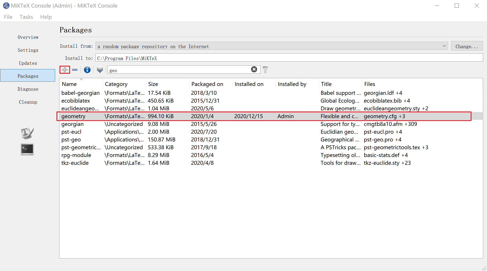

# Solutions to render latex in github

## if you choose to use markdown
### solution 1: Use https://render.githubusercontent.com to render images
> https://gist.github.com/a-rodin/fef3f543412d6e1ec5b6cf55bf197d7b

cons:
- Need to convert your raw latex syntax to img link

### solution 2: ~~Use Texify~~
> https://github.com/settings/installations/13546343

TeXify is wrapper of Readme2Tex.

GitHub App that looks in your pushes for files with extension *.tex.md and renders it's TeX expressions as SVG images.

### solution 3: Use Readme2Tex in local PC
> Installation:
> 
> Make sure that you have Python 2.7 or above and pip installed. In addition, you'll need to have the programs **latex** and
> **dvisvgm** on your PATH. In addition, you'll need to pre-install the **geometry** package in LaTeX.

- install LaTex
  > download MikTex or TexLive
- install dvisvgm
  ```bash
  $ dvisvgm -l
  bgcolor    background color special
  color      complete support of color specials
  dvisvgm    special set for embedding raw SVG snippets
  em         line drawing statements of the emTeX special set
  html       hyperref specials
  papersize  special to set the page size
  pdf        PDF hyperlink, font map, and pagesize specials
  ps         dvips PostScript specials
  tpic       TPIC specials
  ```
- install geometry package in LaTex


Usage
```bash
python -m readme2tex --nocdn --output README.md README.tex.md
```
- `--nocdn` means use relative img links
- `--output README.md` means output is README.md
- `README.tex.md` means input 

After running the command line above ,you will get
```
svgs/
  ....svg
README.md
```

## if you choose to use Jupyter Notebook
> https://gist.github.com/cyhsutw/d5983d166fb70ff651f027b2aa56ee4e

This way is writing markdown in jupyter cell element.

cons:
- The file *.ipynb format limits to python, maybe can't be opened by other text editor.
- The file *.ipynb format is more verbose than markdown.
- The file *.ipynb format is JSON which is not handy to maintain

## Reference links
- Latex rendering in README.md on Github|https://ask.xiaolee.net/questions/1114248
- ~~github-texify~~(dead in 2020)|https://github.com/agurodriguez/github-texify
- readme2tex-action|https://github.com/marketplace/actions/readme2tex-action