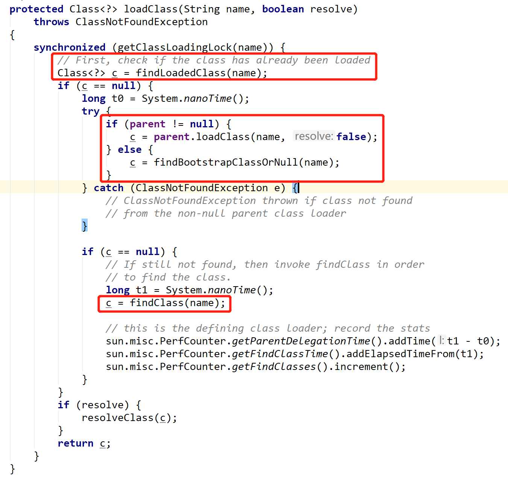

# Class Loading Mechanism

## 三大类加载器执行顺序

当运行时环境需要为应用程序加载新类时，它将在以下位置按顺序查找该类：

- **启动类加载器（Bootstrap ClassLoader）**：rt.jar中的运行时类，i18n.jar中的国际化类以及其他。位于 ``<JAVA_HOME>\lib``

- **扩展类加载器 （Extension ClassLoader）**：``JRE_HOME/lib/ext``或者`java.ext.dirs`系统变量指定的路径 中的JAR文件中的类。

- **应用程序类加载器（Application ClassLoader）**：系统属性``java.class.path``指定的路径上的类，包括JAR文件中的类。如果类路径上的JAR文件具有带有Class-Path属性的清单，则还将搜索由Class-Path属性指定的JAR文件。默认情况下，java.class.path属性的值是.，即当前目录。您可以使用-classpath或-cp命令行选项或设置CLASSPATH环境变量来更改值。命令行选项将覆盖CLASSPATH环境变量的设置。 

## Java类加载机制

> The Java platform uses a delegation model for loading classes. The basic idea is that every class loader has a "parent" class loader. When loading a class, a class loader first "delegates" the search for the class to its parent class loader before attempting to find the class itself. 

**Java平台使用委托模型来加载类。基本思想是每个类加载器都有一个“父”类加载器。加载类时，类加载器首先将对类的搜索“委派”给其父类加载器，然后再尝试查找类本身。** 

以下是类加载API的一些要点： 

-  实例化新的类加载器时，可以使用java.lang.ClassLoader及其子类中的构造函数指定父级。如果您未明确指定父级，则会将虚拟机的系统类加载器指定为默认父级。 

- 当被调用以加载类时，ClassLoader中的loadClass方法按顺序执行这些任务：

  1. 如果已经加载了一个类，它将返回它。

  2. 否则，它将对新类的搜索委托给父类加载器。 

  3. 如果父类加载器找不到该类，则loadClass调用方法findClass查找并加载该类。 

     

-  如果父类加载器未找到该类，则ClassLoader的findClass方法将在当前类加载器中搜索该类。当您在应用程序中实例化类加载器子类时，您可能想重写此方法。 

-  类``java.net.URLClassLoader``用作扩展和其他JAR文件的基本类加载器，它重写``java.lang.ClassLoader``的findClass方法以在一个或多个指定的URL中搜索类和资源。 

  ```java
     class NetworkClassLoader extends ClassLoader {
             String host;
             int port;
    
             public Class findClass(String name) {
                 byte[] b = loadClassData(name);
                 return defineClass(name, b, 0, b.length);
             }
    
             private byte[] loadClassData(String name) {
                 // load the class data from the connection
             }
         }
  ```

验证一下：

```java
public class ClassLoaderTest {
    public static void main(String[] args) {
        final ClassLoader systemClassLoader = ClassLoader.getSystemClassLoader();
        System.out.println("systemClassLoader: "+systemClassLoader);//sun.misc.Launcher$AppClassLoader@18b4aac2
        // $JAVA_HOME/jre/lib/ext/*.jar
        // $JAVA_HOME/jre/lib/*.jar
        // all classpath jar

        ClassLoader parent1 = systemClassLoader.getParent();
        System.out.println("parent: "+parent1);// parent: sun.misc.Launcher$ExtClassLoader@61bbe9ba
        // $JAVA_HOME/jre/lib/ext/*.jar

        ClassLoader parent2 = parent1.getParent();
        System.out.println("parent2: "+parent2);// parent2: null -> BootstrapClassLoader
        // $JAVA_HOME/jre/lib/*.jar

        System.out.println("done");
    }
}
```

##  类加载和java命令

- java工具中，``-classpath``选项是设置``java.class.path``属性的简便方法。 ``-cp``和``-classpath``选项等效。
- -jar选项运行打包在JAR文件中的应用程序。

## 参考

- [1]  https://docs.oracle.com/javase/tutorial/ext/basics/load.html 