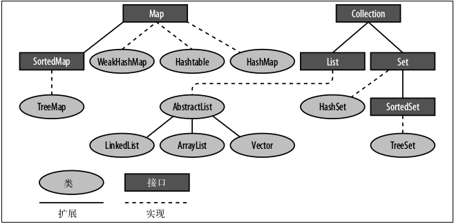

# 集合API

Java 集合定义了两种基本的数据结构:
- Collection ,表示一组对象的集合;
- Map ,表示对象间的一系列映射或关联关系.



> JDK 提供的 Set 、 List 和 Queue 都是 Collection 的子接口

## Collections util包
其中的 synchronizedXX() 方法内部使用synchronized(mutex)进行同步，效率低下。
```
final Object mutex;     // Object on which to synchronize
```


