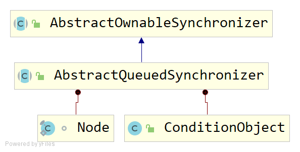
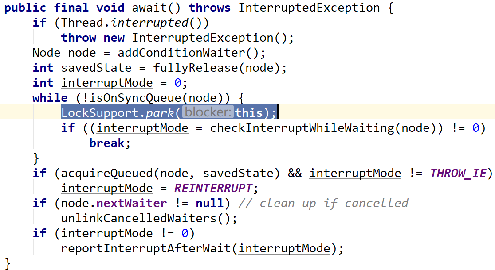
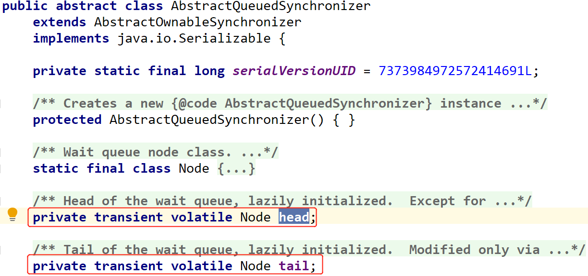

# AbstractQueuedSynchronizer

## 概述

AQS：抽象队列同步器。



## 请求与释放资源

- 独占情况

`acquire(int arg)`

```java
    public final void acquire(int arg) {
        if (!tryAcquire(arg) &&
            acquireQueued(addWaiter(Node.EXCLUSIVE), arg))
            selfInterrupt();
    }
```

请求独占资源时，调用tryAcquire方法（由子类实现）获取资源。

如果失败，会将当前线程封装为Node.EXCLUSIVE的Node节点放入AQS队列，并调用LockSupport.park(this)阻塞自己。

`release(int arg)`

```java
    public final boolean release(int arg) {
        if (tryRelease(arg)) {
            Node h = head;
            if (h != null && h.waitStatus != 0)
                unparkSuccessor(h);
            return true;
        }
        return false;
    }
```

unparkSuccessor方法中会调用LockSupport.unpark(s.thread);激活某个线程。

> AQS的实现类需要注意处理内部state增减的含义。

- 共享情况

`acquireShared(int arg)`

```java
    public final void acquireShared(int arg) {
        if (tryAcquireShared(arg) < 0)
            doAcquireShared(arg);
    }
```

```java
    private void doAcquireShared(int arg) {
        final Node node = addWaiter(Node.SHARED);//1
        boolean failed = true;
        try {
            boolean interrupted = false;
            for (;;) {
                final Node p = node.predecessor();
                if (p == head) {
                    int r = tryAcquireShared(arg);
                    ...
                }
                if (shouldParkAfterFailedAcquire(p, node) &&
                    parkAndCheckInterrupt())//2
                    interrupted = true;
            }
        } finally {
            if (failed)
                cancelAcquire(node);
        }
    }
```

//1:失败时，将当前线程封装为Node.SHARED的Node节点放入AQS尾部。

//2:LockSupport.park(this)挂起自身。

`releaseShared(int arg)`

```java
   public final boolean releaseShared(int arg) {
        if (tryReleaseShared(arg)) {
            doReleaseShared();
            return true;
        }
        return false;
    }
```

doReleaseShared中会调用LockSupport.unpark(s.thread)激活一个线程。

## acquireInterruptibly的区别

acquire()方法忽略中断。即，线程A调用acquire获取资源时，如果其他线程尝试中断线程A，线程A不会因为这个操作而被中断，会继续获取资源或者挂起。

acquireInterruptibly()表示响应中断。其他线程可以中断该线程。

## AQS 条件变量

signal/await方法，类比于线程间同步的wait/notify方法。

 ```java
    public static void main(String[] args) {
        final ReentrantLock lock = new ReentrantLock();
        final Condition condition = lock.newCondition();

        Thread t1 = new Thread(() -> {
            lock.lock();//① 获取锁
            try {
                System.out.println("begin wait");
                condition.await();//② 将线程t1构造为Node节点1放入条件队列内部，然后释放锁
                System.out.println("end wait");
            } catch (InterruptedException e) {
                e.printStackTrace();
            } finally {
                lock.unlock();
            }
        });
        
        t1.start();

        Thread t2 = new Thread(() -> {
            lock.lock();//③ 获取锁
            try {
                System.out.println("begin signal");
                condition.signal();//④ 将条件队列头部一个Node节点1移除，放入AQS队列，唤醒这个线程t1
                System.out.println("end signal");
            } finally {
                lock.unlock();
            }
        });

        t2.start();
    }
 ```

```
begin wait
begin signal
end signal
end wait
```

### condition.await



其中这句 Node node = addConditionWaiter(); 是将该节点放入条件队列。

```java
        /**
         * Adds a new waiter to wait queue.
         * @return its new wait node
         */
        private Node addConditionWaiter() {
            Node t = lastWaiter;
            ...
            Node node = new Node(Thread.currentThread(), Node.CONDITION);
            if (t == null)
                firstWaiter = node;
            else
                t.nextWaiter = node;
            lastWaiter = node;
            return node;
        }
```

LockSupport.park()会挂起当前线程。

### condition.signal

```java
        public final void signal() {
            if (!isHeldExclusively())
                throw new IllegalMonitorStateException();
            Node first = firstWaiter;
            if (first != null)
                doSignal(first);
        }
```

```java
        private void doSignal(Node first) {
            do {
                if ( (firstWaiter = first.nextWaiter) == null)
                    lastWaiter = null;
                first.nextWaiter = null;
            } while (!transferForSignal(first) &&
                     (first = firstWaiter) != null);
        }
```

transferForSignal作用是将节点从条件队列转移到AQS同步队列。

transferForSignal里面会调用入队方法 enq（Node node）。

```java
    private Node enq(final Node node) {
        for (;;) {
            Node t = tail;
            if (t == null) { // Must initialize
                if (compareAndSetHead(new Node()))
                    tail = head;
            } else {
                node.prev = t;
                if (compareAndSetTail(t, node)) {
                    t.next = node;
                    return t;
                }
            }
        }
    }
```

---

总结：

①一个锁对应一个AQS阻塞队列，因为定义了Node类型的head和tail元素。



②一个锁对应多个条件变量，因为 lock可以调用newCondition()多次，每次返回不同的条件对象。

③每个条件变量对应一条条件队列。因为内部代码实现只有各一个头尾指针。

```java
    public class ConditionObject implements Condition, java.io.Serializable {
        private static final long serialVersionUID = 1173984872572414699L;
        /** First node of condition queue. */
        private transient Node firstWaiter;
        /** Last node of condition queue. */
        private transient Node lastWaiter;
```

## 自定义实现AQS

```java
/**
 * 不可重入的独占锁，不可重入代表不需要记录持有锁的线程获取锁的次数。
 * state=0，表示锁没有被当前线程持有，state=1表示当前线程持有锁
 */
public class NonReentrantLock implements Lock, Serializable {
    
    private static class Sync extends AbstractQueuedSynchronizer {
        @Override
        protected boolean tryAcquire(int arg) {
            assert arg == 1;
            if (compareAndSetState(0, 1)) {
                setExclusiveOwnerThread(Thread.currentThread());
                return true;
            }
            return false;
        }

        @Override
        protected boolean tryRelease(int arg) {
            assert arg == 1;
            if (getState() == 0) {
                throw new IllegalMonitorStateException();
            }
            setExclusiveOwnerThread(null);
            setState(0);
            return true;
        }

        @Override
        protected boolean isHeldExclusively() {
            return getState() == 1;//if equals 1,means lock has been owned by someone
        }

        Condition newCondition() {
            return new ConditionObject();
        }
    }

    private final Sync sync = new Sync();

    @Override
    public void lock() {
        sync.acquire(1);//call tryAcquire(int arg),1 can represent anything you like
    }

    @Override
    public void lockInterruptibly() throws InterruptedException {
        sync.acquireInterruptibly(1);
    }

    @Override
    public boolean tryLock() {
        return sync.tryAcquire(1);
    }

    @Override
    public boolean tryLock(long time, TimeUnit unit) throws InterruptedException {
        return sync.tryAcquireNanos(1, unit.toNanos(time));
    }

    @Override
    public void unlock() {
        sync.release(1);//call tryRelease(int arg),1 can represent anything you like
    }

    @Override
    public Condition newCondition() {
        return sync.newCondition();
    }
}
```

