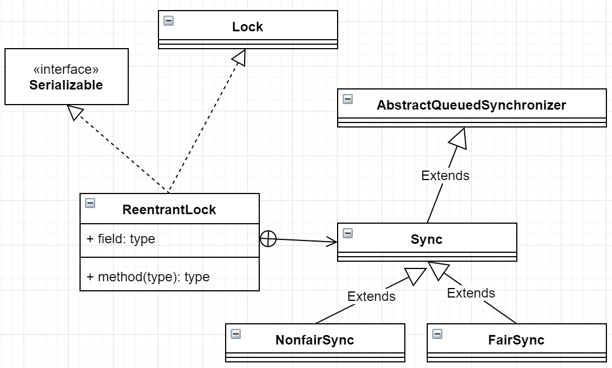

# ReentrantLock

可重复入的独占锁。可重入意味着state的值不只是1，可能是2。因为锁的拥有线程可以继续重入获得锁。



ReentrantLock内部持有Sync类，NonfairSync和FairSync继承Sync类。

## 源码解析

### 构造函数

```java
    public ReentrantLock() {
        sync = new NonfairSync();
    }

    public ReentrantLock(boolean fair) {
        sync = fair ? new FairSync() : new NonfairSync();
    }
```

无参构造默认是非公平锁，有参数的构造函数根据参数决定。

### 获取锁

lock()

```java
    public void lock() {
        sync.lock();
    }
```

内部实现是sync.lock。

该抽象方法在公平锁和非公平锁的实现不一样。

**NonfairSync**

```java
/**
* Performs lock.  Try immediate barge, backing up to normal
* acquire on failure.
*/
final void lock() {
    if (compareAndSetState(0, 1))
        setExclusiveOwnerThread(Thread.currentThread());
    else
        acquire(1);
}
```

acquire(1);是获取锁失败的fallback方法。调用AQS的acquire方法。

```java
    public final void acquire(int arg) {
        if (!tryAcquire(arg) &&
            acquireQueued(addWaiter(Node.EXCLUSIVE), arg))
            selfInterrupt();
    }
```

`java.util.concurrent.locks.ReentrantLock.NonfairSync#tryAcquire`

```java
        protected final boolean tryAcquire(int acquires) {
            return nonfairTryAcquire(acquires);
        }
```

```java
        /**
         * Performs non-fair tryLock.  tryAcquire is implemented in
         * subclasses, but both need nonfair try for trylock method.
         */
        final boolean nonfairTryAcquire(int acquires) {
            final Thread current = Thread.currentThread();
            int c = getState();
            if (c == 0) {//1
                if (compareAndSetState(0, acquires)) {
                    setExclusiveOwnerThread(current);
                    return true;
                }
            }
            else if (current == getExclusiveOwnerThread()) {//2
                int nextc = c + acquires;
                if (nextc < 0) // overflow
                    throw new Error("Maximum lock count exceeded");
                setState(nextc);
                return true;
            }
            return false;
        }
```

第一个if分支表示其他线程也还没获得锁，state为0，当前线程可以顺利获得锁，设置锁拥有者。

else if分支表示当前线程已经拥有该锁，重入获得该锁，更新state的值为state+acquires。

否则，直接返回失败，请求线程会被放入AQS阻塞队列。

> 思考一下：非公平在代码中体现在哪？

//2: 假设线程1先在这里尝试获取锁，发现该锁被其他线程占用，于是返回false。

然后，线程2尝试获取锁，发现此时锁没有被占用，于是它可以执行//1这个分支获取锁。

所以，先到不一定先得。**关键在于线程获取锁时该锁究竟有没空闲**。

---

**FairSync**

公平锁的关键在于

```java
/**
* Fair version of tryAcquire.  Don't grant access unless
* recursive call or no waiters or is first.
*/
protected final boolean tryAcquire(int acquires) {
    final Thread current = Thread.currentThread();
    int c = getState();
    if (c == 0) {//1
        if (!hasQueuedPredecessors() &&
            compareAndSetState(0, acquires)) {
            setExclusiveOwnerThread(current);
            return true;
        }
    }
    else if (current == getExclusiveOwnerThread()) {
        int nextc = c + acquires;
        if (nextc < 0)
            throw new Error("Maximum lock count exceeded");
        setState(nextc);
        return true;
    }
    return false;
}
```

这里是关键：`!hasQueuedPredecessors()`，表示没有等待的前驱节点。也就是没有别的线程先排队。

```java
    public final boolean hasQueuedPredecessors() {
        // The correctness of this depends on head being initialized
        // before tail and on head.next being accurate if the current
        // thread is first in queue.
        Node t = tail; // Read fields in reverse initialization order
        Node h = head;
        Node s;
        return h != t &&
            ((s = h.next) == null || s.thread != Thread.currentThread());
    }
```

`h == t`表示head等于tail，也就是当前队列为空，返回false。

`h != t`表示head不等于tail，也就是不为空。进行下一步判断。

`h != t && (s = h.next) == null` 表示head的后继节点为空，说明有一个节点需要作为AQS第一个节点入列。一样要返回true。

`h != t && s!=null && s.thread != Thread.currentThread()` 表示head的后继节点不为空，而且不等于当前线程。队列第一个元素不是当前线程。

----

lockInterruptily()

```java
    public void lockInterruptibly() throws InterruptedException {
        sync.acquireInterruptibly(1);
    }
    
    public final void acquireInterruptibly(int arg) throws InterruptedException {
        if (Thread.interrupted())
            throw new InterruptedException();
        if (!tryAcquire(arg)//尝试获取
            doAcquireInterruptibly(arg);//调用AQS可中断方法
    }
```

tryLock()

```java
   public boolean tryLock() {
        return sync.nonfairTryAcquire(1);
    }
```

tryLock() 就是非公平锁获取。不会引起线程阻塞。

### 释放锁

unlock()

```java
    public void unlock() {
        sync.release(1);
    }
```

```java
    public final boolean release(int arg) {
        if (tryRelease(arg)) {
            Node h = head;
            if (h != null && h.waitStatus != 0)
                unparkSuccessor(h);
            return true;
        }
        return false;
    }
```

```java
        protected final boolean tryRelease(int releases) {
            int c = getState() - releases;
            if (Thread.currentThread() != getExclusiveOwnerThread())
                throw new IllegalMonitorStateException();
            boolean free = false;
            if (c == 0) {
                free = true;
                setExclusiveOwnerThread(null);
            }
            setState(c);
            return free;
        }
```

## 使用例子

使用ReentrantLock可以实现线程安全的List。思路是add/remove/get方法中lock/unlock。

```java
public class ReentrantLockList<E> {
    List<E> array = new ArrayList<>();
    volatile ReentrantLock lock = new ReentrantLock();

    public void add(E e) {
        lock.lock();
        try {
            array.add(e);
        } finally {
            lock.unlock();
        }
    }
}
```

## 小结

ReentrantLock使用AQS实现可重入的独占锁。state为0表示锁空闲，大于0代表所被占用。