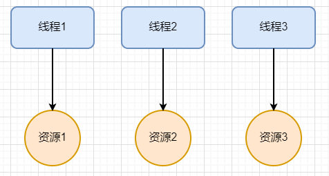
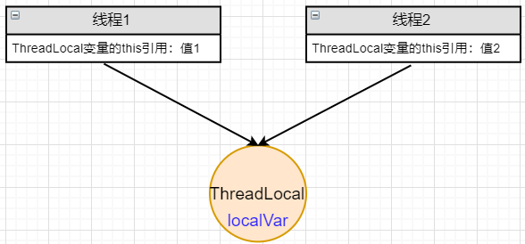

# ThreadLocal

## ThreadLocal示例

线程本地变量。

当创建一个ThreadLocal变量后，访问这个变量的每一个线程都拥有这个变量的一个本地副本。



示例

```java
public class ThreadLocalDemo {
    static ThreadLocal<String> localVar = new ThreadLocal<>();

    public static void main(String[] args) {
        Thread thread1 = new Thread(() -> {
            localVar.set("Thread 1 local var");
            print("thread1");
            localVar.remove();
            System.out.println("thread1 after remove: " + localVar.get());
        });

        Thread thread2 = new Thread(() -> {
            localVar.set("Thread 2 local var");
            print("thread2");
            System.out.println("thread2 after remove: " + localVar.get());
        });
        thread1.start();
        thread2.start();
    }

    static void print(String str) {
        System.out.println(str + ":" + localVar.get());
    }
}
```

```bash
thread2:Thread 2 local var
thread1:Thread 1 local var
thread2 after remove: Thread 2 local var
thread1 after remove: null
```

也就是thread1的localVar.remove()并不会清除thread2的localVar。验证了是线程本地的变量，互相独立。

## ThreadLocal源码解读

### set()

先从localVar.set()方法入手，进入`java.lang.ThreadLocal#set`

```java
    /**
     * Sets the current thread's copy of this thread-local variable
     * to the specified value.  Most subclasses will have no need to
     * override this method, relying solely on the {@link #initialValue}
     * method to set the values of thread-locals.
     *
     * @param value the value to be stored in the current thread's copy of
     *        this thread-local.
     */
    public void set(T value) {
        Thread t = Thread.currentThread();
        ThreadLocalMap map = getMap(t);
        if (map != null)
            map.set(this, value);
        else
            createMap(t, value);
    }
```

set方法里面：

1. 获取当前线程
2. 将当前线程作为key来获取ThreadLocalMap类型的一个map
3. map为null就新建，map存在就直接set值

`java.lang.ThreadLocal#getMap`

```java
    /**
     * Get the map associated with a ThreadLocal. Overridden in
     * InheritableThreadLocal.
     *
     * @param  t the current thread
     * @return the map
     */
    ThreadLocalMap getMap(Thread t) {
        return t.threadLocals;
    }
```

getMap方法本质上是获取当前线程的threadLocals变量，继续研究该变量。

`java.lang.Thread#threadLocals`

```java
    /* ThreadLocal values pertaining to this thread. This map is maintained
     * by the ThreadLocal class. */
    ThreadLocal.ThreadLocalMap threadLocals = null;
```

回到前面的`createMap(t, value)`方法: `java.lang.ThreadLocal#createMap`

```java
    /**
     * Create the map associated with a ThreadLocal. Overridden in
     * InheritableThreadLocal.
     *
     * @param t the current thread
     * @param firstValue value for the initial entry of the map
     */
    void createMap(Thread t, T firstValue) {
        t.threadLocals = new ThreadLocalMap(this, firstValue);
    }
```

本质上就是创建当前线程的threadLocals变量。

### get()

`java.lang.ThreadLocal#get`

```java
    /**
     * Returns the value in the current thread's copy of this
     * thread-local variable.  If the variable has no value for the
     * current thread, it is first initialized to the value returned
     * by an invocation of the {@link #initialValue} method.
     *
     * @return the current thread's value of this thread-local
     */
    public T get() {
        Thread t = Thread.currentThread();
        ThreadLocalMap map = getMap(t);
        if (map != null) {
            ThreadLocalMap.Entry e = map.getEntry(this);
            if (e != null) {
                @SuppressWarnings("unchecked")
                T result = (T)e.value;
                return result;
            }
        }
        return setInitialValue();
    }
```

获取当前线程，获取ThreadLocalMap实例变量map

- map非空，根据此线程局部变量的当前线程副本获取entry，返回entry的值，该值是泛型。
- map为空，初始化。

> 注意 `map.getEntry(this)`中的this表示的是一个ThreadLocal 对象。

---

`java.lang.ThreadLocal#setInitialValue`

```java
    /**
     * Variant of set() to establish initialValue. Used instead
     * of set() in case user has overridden the set() method.
     *
     * @return the initial value
     */
    private T setInitialValue() {
        T value = initialValue();
        Thread t = Thread.currentThread();
        ThreadLocalMap map = getMap(t);
        if (map != null)
            map.set(this, value);
        else
            createMap(t, value);
        return value;
    }
```

set方法的变体，非常类似，不同点在于提供了value的初始值，为null。

### remove()

```java
public void remove() {
    ThreadLocalMap m = getMap(Thread.currentThread());
    if (m != null)
        m.remove(this);
}
```

### 总结

每个线程内部都有一个threadLocals的变量，变量类型为ThreadLocalMap，本质是HashMap。

key为ThreadLocal变量的this引用，value为设置进去的值。



## InheritableThreadLocal源码解读

让子线程可以访问父线程中设置的本地变量。

```java
public class InheritableThreadLocal<T> extends ThreadLocal<T> {

    protected T childValue(T parentValue) {
        return parentValue;
    }

    ThreadLocalMap getMap(Thread t) {
       return t.inheritableThreadLocals;
    }

    void createMap(Thread t, T firstValue) {
        t.inheritableThreadLocals = new ThreadLocalMap(this, firstValue);
    }
}

```

InheritableThreadLocal继承自ThreadLocal，重写了三个方法。**其中createMap和getMap方法保证了使用inheritableThreadLocals代替threadLocals**。

对于该构造方法`childValue(T parentValue)`，需要先查看Thread的默认构造函数

```java
    private void init(ThreadGroup g, Runnable target, String name,
                      long stackSize, AccessControlContext acc,
                      boolean inheritThreadLocals) {
        ...              
        Thread parent = currentThread();
        ...
        if (inheritThreadLocals && parent.inheritableThreadLocals != null)
            this.inheritableThreadLocals =
                ThreadLocal.createInheritedMap(parent.inheritableThreadLocals);
        /* Stash the specified stack size in case the VM cares */
        this.stackSize = stackSize;

        /* Set thread ID */
        tid = nextThreadID();
    }
```

在创建线程时，如果inheritThreadLocals不为null，那么这句：

```java
this.inheritableThreadLocals =
                ThreadLocal.createInheritedMap(parent.inheritableThreadLocals);
```

猜测是将父线程的inheritableThreadLocals的信息传递给了子线程`this.inheritableThreadLocals`。

---

再看`java.lang.ThreadLocal#createInheritedMap`

```java
    static ThreadLocalMap createInheritedMap(ThreadLocalMap parentMap) {
        return new ThreadLocalMap(parentMap);
    }
```

createInheritedMap（）内部：使用父线程的inheritableThreadLocals，直接构造一个ThreadLocalMap赋值给子线程的inheritableThreadLocals。

---

继续研究ThreadLocalMap()构造函数内部细节

```java
        private ThreadLocalMap(ThreadLocalMap parentMap) {
            Entry[] parentTable = parentMap.table;
            int len = parentTable.length;
            setThreshold(len);
            table = new Entry[len];

            for (int j = 0; j < len; j++) {
                Entry e = parentTable[j];
                if (e != null) {
                    @SuppressWarnings("unchecked")
                    ThreadLocal<Object> key = (ThreadLocal<Object>) e.get();
                    if (key != null) {
                        Object value = key.childValue(e.value);
                        Entry c = new Entry(key, value);
                        int h = key.threadLocalHashCode & (len - 1);
                        while (table[h] != null)
                            h = nextIndex(h, len);
                        table[h] = c;
                        size++;
                    }
                }
            }
        }
```

关注这句：` Object value = key.childValue(e.value);` ，将父线程的inheritableThreadLocals复制到新的ThreadLocalMap对象中。

---

示例+总结

```java
InheritableThreadLocal<String> threadLocal = new InheritableThreadLocal<>();
threadLocal.set("main thread local value");

Thread thread = new Thread(() -> System.out.println("threadLocal.get():" + threadLocal.get()));
thread.start();

System.out.println("main: "+threadLocal.get());
```

```
main: main thread local value
threadLocal.get():main thread local value
```

1. 在主线程new一个InheritableThreadLocal对象并设置值后，父线程的inheritableThreadLocals变量不再为null。

2. 在主线程中创建子线程时，构造函数会把父线程的inheritableThreadLocals变量复制一份保存到子线程的inheritableThreadLocals里面。

3. 于是，子线程可以获取到父线程设置的inheritableThreadLocals信息。

