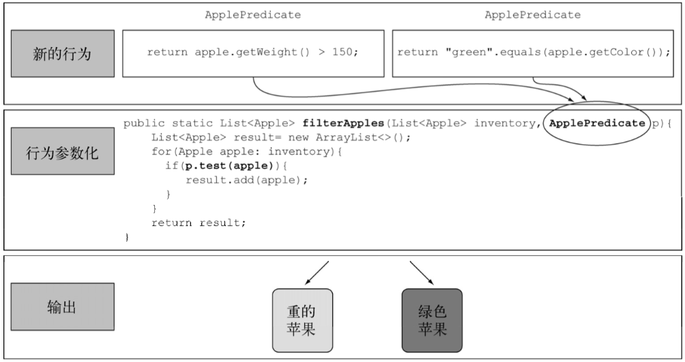

# 行为参数化

行为参数化是一种软件开发模式，可以帮助处理频繁的变更需求。

## 示例

新建接口

```java
public interface ApplePredicate {
    boolean test(Apple apple);
}
```

实现该接口

```java
public class AppleHeavyHeightPredicate  implements ApplePredicate{
    @Override
    public boolean test(Apple apple) {
        return apple.getWeight()>150;
    }
}

public class AppleGreenColorPredicate implements ApplePredicate{
    @Override
    public boolean test(Apple apple) {
        return "green".equals(apple.getColor());
    }
}
```

根据抽象条件筛选apple

```java
public static List<Apple> filterApples(List<Apple> inventory, ApplePredicate p) {
    List<Apple> result = new ArrayList<>();
    for (Apple apple : inventory) {
        if (p.test(apple)) {
            result.add(apple);
        }
    }
    return result;
}
```



调用执行

```java
List<Apple> apples = new ArrayList<>();
// omit add apples
AppleHeavyHeightPredicate heavyHeightPredicate = new AppleHeavyHeightPredicate();
filterApples(apples,heavyHeightPredicate);
```

## 用 Lambda 改进 Predicate

```java
// use lambda
filterApples(apples,(Apple apple)->"green".equals(apple.getColor()));
```

## 将 List 类型模板化

```java
public interface Predicate<T> {
    boolean test(T t);
}

public static <T> List<T> filter(List<T> list, Predicate<T> p) {
    List<T> result = new ArrayList<>();
    for (T e : list) {
        if (p.test(e)) {
            result.add(e);
        }
    }
    return result;
}
```

```java
filter(apples, (Apple apple) -> "red".equals(apple.getColor()));
```

## 小结

行为参数化：一个方法接受多个不同的行为作为参数，并在内部使用他们，完成不同行为的能力。类似于多态的一种能力。

| 分类       |                              | 描述       |
| ---------- | ---------------------------- | ---------- |
| 行为参数化 | 类；匿名类(new XX())；lambda | 简洁，灵活 |
| 值参数化   | 传参数，内部面向过程实现     | 死板，啰嗦 |