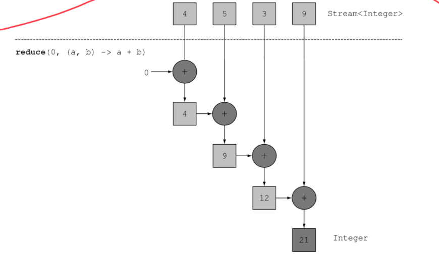

# Stream API

流是延迟创建的集合，具有惰性求值的特点。

## 迭代

- for each 外部迭代

  ```java
  List<String> names=new ArrayList<>();
  for(Dish d:menu){
      names.add(d.getName());
  }
  ```

- iterator 外部迭代

  ```java
  List<String> names=new ArrayList<>();
  iterator<String> iterator=menu.iterator();
  while(iterator.hasNext()){
     Dish d=iterator.next();
     names.add(d.getName());
  }
  ```

- 流 内部迭代

  ```java
  List<String> names=menu.stream().map(Dish::getName).collect(toList());
  ```

## 流的操作流程

```
流的创建->中间操作->...->中间操作->终端操作
```

### 流的创建

  - 由值创建

    ```java
    Stream<String> stream = Stream.of("Java", "C++", "Python")
    ```

  - 由数组创建

    ```java
    IntStream intStream = Arrays.stream(new int[]{1, 2, 3});
    ```

  - 由文件创建

    ```java
    Stream<String> lines = Files.lines(Paths.get("data.text"), Charset.defaultCharset());
    ```

  - 由函数创建: iterate 或者 generate

    ```java
    Stream.iterate(new int[]{0, 1}, t -> new int[]{t[1], t[0] + t[1]}).limit(10).forEach(t -> System.out.println(t[0]));
    ```

    ```java
    Stream.generate(Math::random)
            .limit(5)
            .forEach(System.out::println);
    ```

    

- 中间操作

  | 操作     | 类型 | 返回类型  | 操作参数              | 函数描述符    |
  | -------- | ---- | --------- | --------------------- | ------------- |
  | filter   | 中间 | Stream<T> | Predicate<T>          | T->boolean    |
  | map      | 中间 | Stream<R> | Function<T,R>         | T->R          |
  | flatMap  | 中间 | Stream<R> | Function<T,Stream<R>> | T-> Stream<R> |
  | skip     | 中间 | Stream<T> | long                  |               |
  | limit    | 中间 | Stream<T> | long                  |               |
  | sorted   | 中间 | Stream<T> | Comparator<T>         | (T,T) -> int  |
  | distinct | 中间 | Stream<T> |                       |               |

- 终端操作

  | 操作      | 类型 | 返回类型    | 操作参数          | 函数描述符 | 目的                  |
  | --------- | ---- | ----------- | ----------------- | ---------- | --------------------- |
  | anyMatch  | 终端 | boolean     | Predicate<T>      | T->boolean | 匹配全部元素          |
  | noneMatch | 终端 | boolean     | Predicate<T>      | T->boolean | 匹配任意一个          |
  | allMatch  | 终端 | boolean     | Predicate<T>      | T->boolean | 全都不匹配            |
  | findAny   | 终端 | Optional<T> |                   |            | 查找第一个元素        |
  | findFirst | 终端 | Optional<T> |                   |            | 类似findFirst（并行） |
  | forEach   | 终端 | void        | Consumer<T>       | T -> void  | 消费流中每一个元素    |
  | count     | 终端 | long        |                   |            | 返回流中元素的个数    |
  | reduce    | 终端 | Optional<T> | BinaryOperator<T> | (T,T) -> T |                       |
  | collect   | 终端 | R           | Collector<T,A,R>  |            | 收集器：把流归约      |

### 查找和匹配

- allMatch 
- anyMatch 
- noneMatch 
- findFirst 
- findAny 

### 规约 reduce

可用于求和，最大值，最小值。



## 预定义收集器

- 将流元素归约为一个值。例如：minBy、MaxBy、summarizingInt

- 分组（groupingBy） by key
- 分区（partitioningBy）true/false

Collector接口定义：

```java
public interface Collector<T, A, R> {
    Supplier<A> supplier();
    BiConsumer<A, T> accumulator();
    Function<A, R> finisher();
    BinaryOperator<A> combiner();
    Set<Characteristics> characteristics();
}
```

- T是流中元素的泛型。
  

- A是累加器的类型，累加器是中间过程中用于累积部分结果的对象。

- R是收集操作得到的对象（通常是集合）的类型。
  例如，可以实现一个ToListCollector<T>类，将Stream<T>中的所有元素收集到一个
  List<T>里，签名如下：

  ```java
  public class ToListCollector<T> implements Collector<T, List<T>, List<T>>
  ```

  这里累加器类型A也是List<T>。

- 可以使用combiner来并行化规约过程。

## 流的调试

流的peek方法能够在分析Stream流水线时，将中间变量值输出到日志中。

## 并行流

parallelStream()

## 小结

- filter和map操作是无状态的。reduce、sorted和distinct操作是有状态的，它们需要将流中的元素缓存起来才能返回一个新的流。
- 流有三个基本类型的特化：IntStream、DoubleStream、LongStream。
- 无限流是没有固定大小的流。例如斐波那契数列。
- 可以实现Collector方法来自定义收集器。