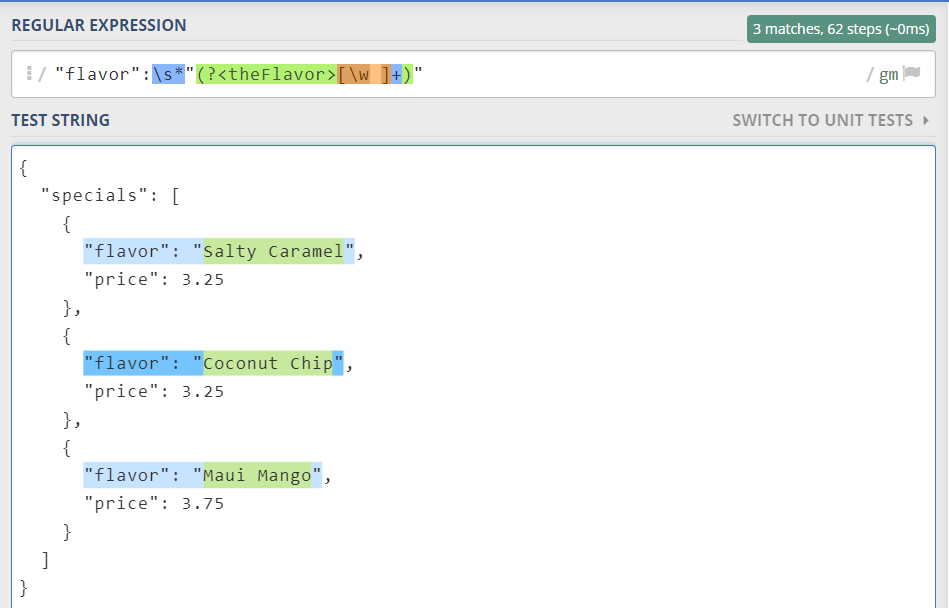

# 测试

方法论：使用Mocks创建测试
1. 创建Mock对象
2. 为Mock对象设置预期行为
3. 把Mock对象注入到测试对象
4. 调用测试对象
5. 验证Mock对象行为是否符合预期

## 单元测试

### Junit 5

正则表达式解析JSON的关键字段。

[DailySpecialServiceTest](src\test\java\io\github\wdpm\service\DailySpecialServiceTest.java)

## 替身测试
### EasyMock
在EasyMock 中，“录制、播放、验证”（record、replay、verify）不好理解，可以理解成“设置、启动、验证“。

[MenuCreatorTestEasyMock](src\test\java\io\github\wdpm\service\MenuCreatorTestEasyMock.java)

### Mockito
Mockito 语法简单，扩展功能丰富，受欢迎程度超越了EasyMock。

[MenuCreatorTestMockito](src\test\java\io\github\wdpm\service\MenuCreatorTestMockito.java)

### PowerMock
PowerMock 建立在EasyMock 和Mockito 基础之上，并添加了更多功能。

当用到第三方代码或遗留代码，且无法通过重构避免调用静态方法时，才会使用PowerMock。