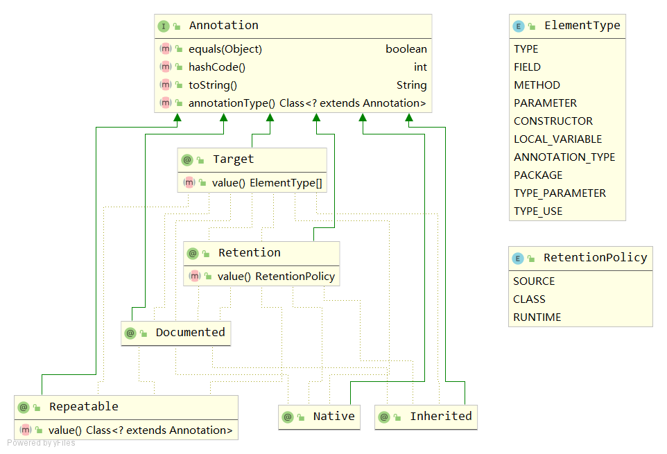

# Annotation
注解。



## RetentionPolicy
```java
public enum RetentionPolicy {
    SOURCE,
    CLASS,
    RUNTIME
}
```
- SOURCE  编译后抛弃
- CLASS   这个是默认值。编译后保留，但是运行时VM不需要保留
- RUNTIME 编译后，运行时VM都会保留，所以使用这个注解的文件可以被反射机制访问

## ElementType
```java
public enum ElementType {
    TYPE,
    FIELD,
    METHOD,
    PARAMETER,
    CONSTRUCTOR,
    LOCAL_VARIABLE,
    ANNOTATION_TYPE,
    PACKAGE,
    TYPE_PARAMETER,
    TYPE_USE
}
```
- TYPE 类，接口，枚举
- FIELD 字段（含枚举常量）
- METHOD 方法
- PARAMETER 合法参数
- CONSTRUCTOR 构造函数
- LOCAL_VARIABLE 本地变量
- ANNOTATION_TYPE 注解类型
- PACKAGE 包
- TYPE_PARAMETER 类型参数
- TYPE_USE 使用类型

## @Documented
```java
@Documented
@Retention(RetentionPolicy.RUNTIME)
@Target(ElementType.ANNOTATION_TYPE)
public @interface Documented {
}
```
- 保留策略为运行时，作用于注解类型,自身也标记为@Documented。
- 用于Javadoc记录文档。

## @Inherited
```java
@Documented
@Retention(RetentionPolicy.RUNTIME)
@Target(ElementType.ANNOTATION_TYPE)
public @interface Inherited {
}
```
- 保留策略为运行时，作用于注解类型，@Documented注解用于Javadoc记录文档。
- 用于子类继承父类的注解。

## @Native
```java
@Documented
@Target(ElementType.FIELD)
@Retention(RetentionPolicy.SOURCE)
public @interface Native {
}
```
- 保留策略为SOURCE，作用于字段，@Documented注解用于Javadoc记录文档。
- 用于标记本地实现的代码，即非Java实现。

## @Repeatable
```java
@Documented
@Retention(RetentionPolicy.RUNTIME)
@Target(ElementType.ANNOTATION_TYPE)
public @interface Repeatable {
    /**
     * Indicates the <em>containing annotation type</em> for the
     * repeatable annotation type.
     * @return the containing annotation type
     */
    Class<? extends Annotation> value();
}
```
- 用于指示其（元）注释声明的注释类型是可重复的。

## @Retention
```java
@Documented
@Retention(RetentionPolicy.RUNTIME)
@Target(ElementType.ANNOTATION_TYPE)
public @interface Retention {
    /**
     * Returns the retention policy.
     * @return the retention policy
     */
    RetentionPolicy value();
}
```
- 用于指明注解类型的注解将保留多长时间。

## @Target
```java
@Documented
@Retention(RetentionPolicy.RUNTIME)
@Target(ElementType.ANNOTATION_TYPE)
public @interface Target {
    /**
     * Returns an array of the kinds of elements an annotation type
     * can be applied to.
     * @return an array of the kinds of elements an annotation type
     * can be applied to
     */
    ElementType[] value();
}
```
- 用于指示注解类型适用的上下文。