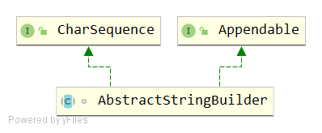

# AbstractStringBuilder
## signature
```java
abstract class AbstractStringBuilder implements Appendable, CharSequence
```


## API

### variables
```java
/**
 * The value is used for character storage.
 */
char[] value;

/**
 * The count is the number of characters used.
 */
int count;

private static final int MAX_ARRAY_SIZE = Integer.MAX_VALUE - 8;
```
### constructor
```java
/**
 * This no-arg constructor is necessary for serialization of subclasses.
 */
AbstractStringBuilder() {
}

/**
 * Creates an AbstractStringBuilder of the specified capacity.
 */
AbstractStringBuilder(int capacity) {
    value = new char[capacity];
}
```
### int length()
```java
@Override
public int length() {
    return count;
}
```
重写CharSequence的length()方法，返回count。代表的是当前由该对象表示的字符序列的长度。

### int capacity()
```java
public int capacity() {
    return value.length;
}
```
返回当前容量。容量是可用于新插入字符的存储量，超过该容量将进行扩容。

### 扩容机制
#### void ensureCapacity(int minimumCapacity)
```java
public void ensureCapacity(int minimumCapacity) {
    if (minimumCapacity > 0)
        ensureCapacityInternal(minimumCapacity);
}
```
#### void ensureCapacityInternal(int minimumCapacity)
```java
private void ensureCapacityInternal(int minimumCapacity) {
    // overflow-conscious code
    if (minimumCapacity - value.length > 0) {
        value = Arrays.copyOf(value, newCapacity(minimumCapacity));
    }
}
```
- 当 minimumCapacity > value.length 时，需求的容量 > 当前的容量，需要扩容。
- 扩容实现在newCapacity(minimumCapacity)
#### int newCapacity(int minCapacity)
```java
private int newCapacity(int minCapacity) {
    // overflow-conscious code
    int newCapacity = (value.length << 1) + 2;
    if (newCapacity - minCapacity < 0) {
        newCapacity = minCapacity;
    }
    return (newCapacity <= 0 || MAX_ARRAY_SIZE - newCapacity < 0)
        ? hugeCapacity(minCapacity)
        : newCapacity;
}
```
- 先扩容一次：int newCapacity = (value.length << 1) + 2; 新容量=旧容量*2 +2
- 判断：如果此时 newCapacity还是小于minCapacity，那么将minCapacity赋值给newCapacity
- 返回值
  - 大部分情况下，直接返回newCapacity
  - 当 newCapacity <= 0 || MAX_ARRAY_SIZE - newCapacity < 0，此时newCapacity溢出或者newCapacity已经很接近最大值，
  调用hugeCapacity(minCapacity)
#### int hugeCapacity(int minCapacity)
```java
private int hugeCapacity(int minCapacity) {
    if (Integer.MAX_VALUE - minCapacity < 0) { // overflow
        throw new OutOfMemoryError();
    }
    return (minCapacity > MAX_ARRAY_SIZE)
        ? minCapacity : MAX_ARRAY_SIZE;
}
```
- Integer.MAX_VALUE < minCapacity，抛出栈溢出异常
- 否则，返回 minCapacity 和 MAX_ARRAY_SIZE 中较大的那一个值。也就是最终结果必然 >= MAX_ARRAY_SIZE

### 压缩机制
```java
public void trimToSize() {
    if (count < value.length) {
        value = Arrays.copyOf(value, count);
    }
}
```
count < value.length 时，压缩使得 count = value.length。

### void setLength(int newLength)
```java
public void setLength(int newLength) {
    if (newLength < 0)
        throw new StringIndexOutOfBoundsException(newLength);

    ensureCapacityInternal(newLength);

    if (count < newLength) {
        Arrays.fill(value, count, newLength, '\0');
    }

    count = newLength;
}
```
- newLength参数必须大于或等于0
- ensureCapacityInternal(newLength) 。
  - 在 newLength <= value.length 时无操作。
  - 在 newLength > value.length 时会进行扩容。
- 如果newLength参数大于count，则附加足够的空字符（'\0'），以便长度成为newLength参数。
   - 填充时从a[count]...a[newLength-1]
- 最后，更新count等于newLength

### void getChars(int srcBegin, int srcEnd, char[] dst, int dstBegin)
```java
public void getChars(int srcBegin, int srcEnd, char[] dst, int dstBegin)
{
    if (srcBegin < 0)
        throw new StringIndexOutOfBoundsException(srcBegin);
    if ((srcEnd < 0) || (srcEnd > count))
        throw new StringIndexOutOfBoundsException(srcEnd);
    if (srcBegin > srcEnd)
        throw new StringIndexOutOfBoundsException("srcBegin > srcEnd");
    System.arraycopy(value, srcBegin, dst, dstBegin, srcEnd - srcBegin);
}
```
字符从此序列复制到目标字符数组dst。 
- 要复制的第一个字符在索引srcBegin处；最后要复制的字符在索引srcEnd-1处。要复制的字符总数为srcEnd-srcBegin。
- 将字符复制到dst的子数组中，该子数组从索引dstBegin开始并以索引结束：dstBegin + (srcEnd-srcBegin) - 1

### AbstractStringBuilder append(String str)
```java
public AbstractStringBuilder append(String str) {
    if (str == null)
        return appendNull();
    int len = str.length();
    ensureCapacityInternal(count + len);//保证至少count+len长度
    str.getChars(0, len, value, count);//将入参str[0...len-1]复制到value中，从value的char[count]开始
    count += len;//更新value的count计数
    return this;
}
```
> AbstractStringBuilder append(AbstractStringBuilder asb)的实现跟这个方法很类似。

### AbstractStringBuilder appendNull()
```java
private AbstractStringBuilder appendNull() {
    int c = count;
    ensureCapacityInternal(c + 4);
    final char[] value = this.value;
    value[c++] = 'n';
    value[c++] = 'u';
    value[c++] = 'l';
    value[c++] = 'l';
    count = c;//记得更新count
    return this;
}
```
### AbstractStringBuilder append(CharSequence s)
```java
// Documentation in subclasses because of synchro difference
@Override
public AbstractStringBuilder append(CharSequence s) {
    if (s == null)
        return appendNull();
    if (s instanceof String)
        return this.append((String)s);
    if (s instanceof AbstractStringBuilder)
        return this.append((AbstractStringBuilder)s);

    // AbstractStringBuilder append(CharSequence s, int start, int end)
    return this.append(s, 0, s.length());
}
```

### AbstractStringBuilder append(CharSequence s, int start, int end) 
```java
@Override
public AbstractStringBuilder append(CharSequence s, int start, int end) {
    if (s == null)
        s = "null";
    if ((start < 0) || (start > end) || (end > s.length()))
        throw new IndexOutOfBoundsException(
            "start " + start + ", end " + end + ", s.length() "
            + s.length());

    int len = end - start;
    ensureCapacityInternal(count + len);
    for (int i = start, j = count; i < end; i++, j++)
        value[j] = s.charAt(i);
    count += len;
    return this;
}
```
### append
#### AbstractStringBuilder append(boolean b)
```java
public AbstractStringBuilder append(boolean b) {
    if (b) {
        ensureCapacityInternal(count + 4);
        value[count++] = 't';
        value[count++] = 'r';
        value[count++] = 'u';
        value[count++] = 'e';
    } else {
        ensureCapacityInternal(count + 5);
        value[count++] = 'f';
        value[count++] = 'a';
        value[count++] = 'l';
        value[count++] = 's';
        value[count++] = 'e';
    }
    return this;
}
```
#### AbstractStringBuilder append(char c)
```java
@Override
public AbstractStringBuilder append(char c) {
    ensureCapacityInternal(count + 1);
    value[count++] = c;
    return this;
}
```
#### AbstractStringBuilder append(int i)
```java
public AbstractStringBuilder append(int i) {
    if (i == Integer.MIN_VALUE) {
        append("-2147483648");
        return this;
    }
    int appendedLength = (i < 0) ? Integer.stringSize(-i) + 1
                                 : Integer.stringSize(i);
    int spaceNeeded = count + appendedLength;
    ensureCapacityInternal(spaceNeeded);
    Integer.getChars(i, spaceNeeded, value);
    count = spaceNeeded;
    return this;
}
```
- Integer.getChars(i, spaceNeeded, value); 从value的char[spaceNeeded-1]开始，从右往左开始放置，直到char[count]

> AbstractStringBuilder append(long l) 的实现和AbstractStringBuilder append(int i)非常类似。

#### AbstractStringBuilder appendCodePoint(int codePoint)
```java
public AbstractStringBuilder appendCodePoint(int codePoint) {
    final int count = this.count;

    if (Character.isBmpCodePoint(codePoint)) {
        ensureCapacityInternal(count + 1);
        value[count] = (char) codePoint;
        this.count = count + 1;
    } else if (Character.isValidCodePoint(codePoint)) {
        ensureCapacityInternal(count + 2);
        Character.toSurrogates(codePoint, value, count);
        this.count = count + 2;
    } else {
        throw new IllegalArgumentException();
    }
    return this;
}
```
- isBmpCodePoint: count+1
- isValidCodePoint: count+2

### delete
#### AbstractStringBuilder delete(int start, int end)
```java
public AbstractStringBuilder delete(int start, int end) {
    if (start < 0)
        throw new StringIndexOutOfBoundsException(start);
    if (end > count)
        end = count;
    if (start > end)
        throw new StringIndexOutOfBoundsException();

    int len = end - start;
    if (len > 0) {
        System.arraycopy(value, start+len, value, start, count-end);
        count -= len;
    }
    return this;
}
```
关键: System.arraycopy(value, start+len, value, start, count-end);
```java
将 start+len   -> start
将 start+len+1 -> start +1
将 start+len+2 -> start +2
...
start+len+(count-end-1) -> start + (count-end-1)
```
一共移动count-end次。

#### AbstractStringBuilder deleteCharAt(int index)
```java
public AbstractStringBuilder deleteCharAt(int index) {
    if ((index < 0) || (index >= count))
        throw new StringIndexOutOfBoundsException(index);
    System.arraycopy(value, index+1, value, index, count-index-1);
    count--;
    return this;
}
```
- index范围 [0,count-1]
- 将index之后的字符左移一位。一共移动(count-1)-index次。

### replace
#### AbstractStringBuilder replace(int start, int end, String str) 
```java
public AbstractStringBuilder replace(int start, int end, String str) {
    // 0 <= start <= end <= count
    if (start < 0)
        throw new StringIndexOutOfBoundsException(start);
    if (start > count)
        throw new StringIndexOutOfBoundsException("start > length()");
    if (start > end)
        throw new StringIndexOutOfBoundsException("start > end");

    if (end > count)
        end = count;

    int len = str.length();
    int newCount = count + len - (end - start);
    ensureCapacityInternal(newCount);

    System.arraycopy(value, end, value, start + len, count - end);
    str.getChars(value, start);
    count = newCount;
    return this;
}
```
- 作用：用指定字符串str替换此序列的子字符串的[start...end-1]位置。 
- int newCount = count + len - (end - start);
  - 若 len = (end - start)，这是最简单的情况，新长度等于旧长度。
  - 若 len > (end - start)，代表入参str的长度比替换的范围[start...end-1]大。
  - 若 len < (end - start)，代表入参str的长度比替换的范围[start...end-1]小。
- ensureCapacityInternal(newCount); 在 newCount > value.length()时才会扩容。
- System.arraycopy(value, end, value, start + len, count - end);
  - 原字符串的[end...count-1]的子串(count-end个)移动到自身的[start+len,(start+len)+count-1-end]位置。
  [start+len,count+len-(end-start)-1] = [start+len,newCount-1]。于是，就为str腾出了空位[start...start+len-1]。
```
0...start...end...count-1
// 必要时扩容
0...start...start+len-1,start+len...newCount-1
```
- str.getChars(value, start);
  - 表示将str复制到value中，从value的char[start]开始。即 char[start...start+len-1]，一共复制len个char。

#### 测试用例
- len = (end - start)
```java
StringBuilder sb = new StringBuilder();
sb.append("0123456789");//0123456789
sb.replace(2,7,"hello");// 23456 -> hello
System.out.println(sb);//01hello789
```
```
// count = 10
// len = 5 
// end =7  start=2
// newCount= count + len - (end - start) =10
0...2...7...10-1
// 不需要扩容
0...2...6,7...10-1
将[7...10-1]复制到[7...10-1]
将hello复制到[2...6]
```
---
- len > (end - start)
```java
StringBuilder sb = new StringBuilder();
sb.append("0123456789");//0123456789
sb.replace(2,5,"hello");// 234 -> hello
System.out.println(sb);//01hello56789
```
```
// count = 10
// len = 5 
// end =5  start=2
// newCount= count + len - (end - start) =10+5-(5-2)=12
0...start...end...count-1
// 扩容
0...start...start+len-1,start+len...newCount-1
将[5...9]复制到[7...11] //原来数组就空出了[2...6]的位置
将hello复制到[2...6]
```
---
- len < (end - start)
```java
StringBuilder sb = new StringBuilder();
sb.append("0123456789");//0123456789
sb.replace(2,9,"hello");// 2345678 -> hello
System.out.println(sb);//01hello9
```
```
// count = 10
// len = 5 
// end =9  start=2
// newCount= count + len - (end - start) =10+5-(9-2)=8
0...2...9...9
// 不需要扩容
0...2...6,7...7
将[9...9]复制到[7...7] //原来数组就空出了[2...6]的位置
将hello复制到[2...6]
```

### String substring(int start, int end)
```java
public String substring(int start, int end) {
    if (start < 0) //make sure： 0<=start
        throw new StringIndexOutOfBoundsException(start);
    if (end > count) //make sure： end<=count 
        throw new StringIndexOutOfBoundsException(end);
    if (start > end)//make sure： start<=end
        throw new StringIndexOutOfBoundsException(end - start);
    // 0<=start<=end<=count 合法范围
    
    // String(char value[], int offset, int count)
    return new String(value, start, end - start);//从start开始，复制count个字符
}
```
### insert

#### AbstractStringBuilder insert(int index, char[] str, int offset, int len)
```java
public AbstractStringBuilder insert(int index, char[] str, int offset,
                                    int len)
{
    if ((index < 0) || (index > length()))
        throw new StringIndexOutOfBoundsException(index);
    if ((offset < 0) || (len < 0) || (offset > str.length - len))
        throw new StringIndexOutOfBoundsException(
            "offset " + offset + ", len " + len + ", str.length "
            + str.length);
    ensureCapacityInternal(count + len);
    System.arraycopy(value, index, value, index + len, count - index);
    System.arraycopy(str, offset, value, index, len);
    count += len;
    return this;
}
```
将str数组参数的子数组的字符串插入此序列中。
- 子数组从指定的偏移量offset开始，并延伸到len个字符。必须满足约束：offset+len <=str.length()
- 子数组的字符插入到此序列由index指示的位置。该序列的长度增加len个字符。
- ensureCapacityInternal(count + len); 扩容到至少count+len长度
- newCount=count+len
- System.arraycopy(value, index, value, index + len, count - index); 
  - 将[index...count-1]移动到[index+len...newCount-1]
  - 腾出[index...index+len-1]空位，长度为len。
- System.arraycopy(str, offset, value, index, len);
  - 将str从str[offset]开始复制，复制len个元素到value，value起始位置为index。即复制到value的[index...index+len-1]。

#### AbstractStringBuilder insert(int offset, char c)
```java
public AbstractStringBuilder insert(int offset, char c) {
    ensureCapacityInternal(count + 1);
    System.arraycopy(value, offset, value, offset + 1, count - offset);
    value[offset] = c;
    count += 1;
    return this;
}
```
- 将[offset...count-1]移动到[offset+1...count]，一共移动count-offset个元素。腾出offset位置的空位。
- 入参c赋值到offset位置，更新count。

#### AbstractStringBuilder insert(int dstOffset, CharSequence s, int start, int end)
```java
public AbstractStringBuilder insert(int dstOffset, CharSequence s,
                                 int start, int end) {
    if (s == null)
        s = "null";
    if ((dstOffset < 0) || (dstOffset > this.length()))
        throw new IndexOutOfBoundsException("dstOffset "+dstOffset);
    if ((start < 0) || (end < 0) || (start > end) || (end > s.length()))
        throw new IndexOutOfBoundsException(
            "start " + start + ", end " + end + ", s.length() "
            + s.length());

    int len = end - start;
    ensureCapacityInternal(count + len);
    System.arraycopy(value, dstOffset, value, dstOffset + len, count - dstOffset);
    for (int i=start; i<end; i++)
        value[dstOffset++] = s.charAt(i);
    count += len;
    return this;
}
```
- int len = end - start; len为原字符串增加的长度
- ensureCapacityInternal(count + len); 扩容至至少count+len长度。设变量 newCount=count + len
- System.arraycopy(value, dstOffset, value, dstOffset + len, count - dstOffset);
  - 将value的[dstOffset...count-1]复制到value的[dstOffset+len...newCount-1]。复制长度为count-dstOffset
  - 腾出[dstOffset...dstOffset+len-1]空位。
```java
for (int i=start; i<end; i++)
    value[dstOffset++] = s.charAt(i);
```
for-loop将s[start...end-1]一共len个元素复制到value[dstOffset...dstOffset+len-1]

#### AbstractStringBuilder insert(int dstOffset, CharSequence s)
```java
public AbstractStringBuilder insert(int dstOffset, CharSequence s) {
    if (s == null)
        s = "null";
    if (s instanceof String)
        return this.insert(dstOffset, (String)s);

    // AbstractStringBuilder insert(int dstOffset, CharSequence s, int start, int end)
    return this.insert(dstOffset, s, 0, s.length());
}
```
#### AbstractStringBuilder insert(int offset, String str)
```java
public AbstractStringBuilder insert(int offset, String str) {
    if ((offset < 0) || (offset > length())) //make sure: 0 <= offset <= length()
        throw new StringIndexOutOfBoundsException(offset);
    if (str == null)
        str = "null";
    int len = str.length();
    ensureCapacityInternal(count + len);
    System.arraycopy(value, offset, value, offset + len, count - offset);
    str.getChars(value, offset);
    count += len;
    return this;
}
```
- 扩容到至少count+len。设变量 newCount=count+len
- System.arraycopy(value, offset, value, offset + len, count - offset);
  - 将value[offset...count-1]复制到value[offset + len...count-1+len]即[offset + len...newCount-1]
  - 腾出[offset...offset + len-1]一共len个空位。
- str.getChars(value, offset);
  - 将str[0...len-1]复制到value的[offset...offset + len-1]。

#### AbstractStringBuilder insert(int offset, char[] str)
```java
public AbstractStringBuilder insert(int offset, char[] str) {
    if ((offset < 0) || (offset > length())) //make sure: 0 <= offset <= length()
        throw new StringIndexOutOfBoundsException(offset);
    int len = str.length;
    ensureCapacityInternal(count + len);
    System.arraycopy(value, offset, value, offset + len, count - offset);
    System.arraycopy(str, 0, value, offset, len);
    count += len;
    return this;
}
```
这个方法实现跟AbstractStringBuilder insert(int offset, String str)差不多。
- System.arraycopy(str, 0, value, offset, len); 等效于 str.getChars(value, offset);
将str[0...len-1]复制到value的[offset...offset + len-1]

### AbstractStringBuilder reverse()
```java
public AbstractStringBuilder reverse() {
    boolean hasSurrogates = false;
    int n = count - 1;
    for (int j = (n-1) >> 1; j >= 0; j--) {
        int k = n - j;
        char cj = value[j];
        char ck = value[k];
        value[j] = ck;
        value[k] = cj;
        if (Character.isSurrogate(cj) ||
            Character.isSurrogate(ck)) {
            hasSurrogates = true;
        }
    }
    if (hasSurrogates) {
        reverseAllValidSurrogatePairs();
    }
    return this;
}
```
原理是以中心为轴，进行对称交换。

### indexOf(String str)
```java
public int indexOf(String str) {
    return indexOf(str, 0);
}
public int indexOf(String str, int fromIndex) {
    return String.indexOf(value, 0, count, str, fromIndex);
}
```
实际上委托到String类的公用方法。

### int lastIndexOf(String str)
```java
public int lastIndexOf(String str) {
    return lastIndexOf(str, count);
}
public int lastIndexOf(String str, int fromIndex) {
    return String.lastIndexOf(value, 0, count, str, fromIndex);
}
```
返回最后一次出现的指定子字符串在此字符串内的索引。
- 返回的整数是最大值k，满足：k <= Math.min(fromIndex, this.length()) && this.toString().startsWith(str, k)。
- 如果不存在这样的k值，返回-1。

## 说明
- 可变的字符序列。
- 实现可修改的字符串。在任何时间点都包含一些特定的字符序列，但可以通过某些方法调用来更改序列的长度和内容。
- 将null参数传递给此类中的构造函数或方法将导致引发NullPointerException。