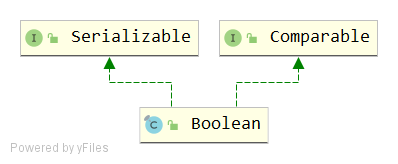

# Boolean
## 签名
```java
public final class Boolean implements java.io.Serializable, Comparable<Boolean>
```


## API
### Variables
```java
public static final Boolean TRUE = new Boolean(true);
public static final Boolean FALSE = new Boolean(false);
public static final Class<Boolean> TYPE = (Class<Boolean>) Class.getPrimitiveClass("boolean");
private final boolean value;//背后的表示
```
### Constructor
```java
public Boolean(boolean value) {
    this.value = value;
}

public Boolean(String s) {
    this(parseBoolean(s));
}
```
两个构造函数，入参分别为boolean和String类型

### boolean parseBoolean(String s)
```java
public static boolean parseBoolean(String s) {
    return ((s != null) && s.equalsIgnoreCase("true"));
}
```
### boolean booleanValue()
```java
public boolean booleanValue() {
    return value;
}
```
### valueOf
```java
public static Boolean valueOf(boolean b) {
    return (b ? TRUE : FALSE);
}

public static Boolean valueOf(String s) {
    return parseBoolean(s) ? TRUE : FALSE;
}
```
valueOf方法都是返回内部实例TRUE或FALSE的引用。

### hashCode
```java
public static int hashCode(boolean value) {
    return value ? 1231 : 1237;
}
```
- true -> 1231
- false -> 1237

### boolean equals(Object obj)
```java
public boolean equals(Object obj) {
    if (obj instanceof Boolean) {
        return value == ((Boolean)obj).booleanValue();
    }
    return false;
}
```

### int compare(boolean x, boolean y)
```java
public static int compare(boolean x, boolean y) {
    return (x == y) ? 0 : (x ? 1 : -1);
}
```
- 两者相等 => 0
- 两者不等时，如果第一个入参为true，那么返回1，否则返回0。

## 说明
该类提供了一些String <=> Boolean 相互转化的方法。