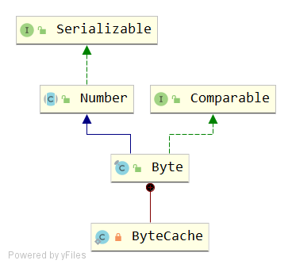

# Byte
## 签名
```java
public final class Byte extends Number implements Comparable<Byte>
```


## API
### 变量
```java
public static final byte   MIN_VALUE = -128;
public static final byte   MAX_VALUE = 127;
```
取值为 [-128,127]

```java
public static final Class<Byte>     TYPE = (Class<Byte>) Class.getPrimitiveClass("byte");
public static final int SIZE = 8;
public static final int BYTES = SIZE / Byte.SIZE;
```
- SIZE = 8 表示一个 Byte 等于 8 bits
- BYTES = SIZE / Byte.SIZE =8/8=1 表示一个字节

### Constructor
```java
public Byte(byte value) {
    this.value = value;
}
public Byte(String s) throws NumberFormatException {
    this.value = parseByte(s, 10);
}
```
- 入参可以为byte；也可以为String，为String时默认10进制解析。

### byte parseByte(String s, int radix)
```java
public static byte parseByte(String s, int radix) throws NumberFormatException {
    int i = Integer.parseInt(s, radix);
    if (i < MIN_VALUE || i > MAX_VALUE) throw new NumberFormatException(
            "Value out of range. Value:\"" + s + "\" Radix:" + radix);
    return (byte)i;
}
```
使用的是 Integer类的解析方法 Integer.parseInt(s, radix)

### toString()
```java
public String toString() {
    return Integer.toString((int)value);
}
```
先转为int类型，然后使用Integer.toString(int i)

### String toString(byte b)
```java
public static String toString(byte b) {
    return Integer.toString((int)b, 10);
}
```
使用 Integer.toString(int i, int radix)

### hashCode()
```java
@Override
public int hashCode() {
    return Byte.hashCode(value);
}

public static int hashCode(byte value) {
    return (int)value;
}
```
使用 int value

### boolean equals(Object obj)
```java
public boolean equals(Object obj) {
    if (obj instanceof Byte) {
        return value == ((Byte)obj).byteValue();
    }
    return false;
}
```
### int compareTo(Byte anotherByte)
```java
public int compareTo(Byte anotherByte) {
    return compare(this.value, anotherByte.value);
}

public static int compare(byte x, byte y) {
    return x - y;
}
```
直接返回 x-y ，为何不使用 x==y ? 0; ( x>y ? 1:-1) ？
### Byte valueOf(byte b)
```java
public static Byte valueOf(byte b) {
    final int offset = 128;
    return ByteCache.cache[(int)b + offset];
}
```
使用内部cache
#### ByteCache
```java
private static class ByteCache {
    private ByteCache(){}

    static final Byte cache[] = new Byte[-(-128) + 127 + 1];

    static {
        for(int i = 0; i < cache.length; i++)
            cache[i] = new Byte((byte)(i - 128));
    }
}
```
- Byte[] 长度为256，为常量数组
- cache[0]=-128, cache[1]=-127,...,cache[255]=127。index i比value大128
  - 回顾 valueOf(byte b)，举例：当 b=0 时，ByteCache.cache[0+128]=cache[128]=0

### Byte decode(String nm)
```java
public static Byte decode(String nm) throws NumberFormatException {
    int i = Integer.decode(nm);
    if (i < MIN_VALUE || i > MAX_VALUE)
        throw new NumberFormatException(
                "Value " + i + " out of range from input " + nm);
    return valueOf((byte)i);
}
```
利用 Integer.decode(nm) 解析

### int toUnsignedInt(byte x)
```java
public static int toUnsignedInt(byte x) {
    return ((int) x) & 0xff;
}
```
- 无符号转换为int，int的高24位为零，低8位与byte参数的位相等。 
- 零字节和正字节值映射到一个数值上相等的int值。
- 负字节值映射到一个等于输入加2^8的int值。

### long toUnsignedLong(byte x)
```java
public static long toUnsignedLong(byte x) {
    return ((long) x) & 0xffL;
}
```
- 无符号转换为long，long的高56位为零，低8位与byte参数的位相等。
- 零字节和正字节值映射为数值相等的long值。
- 负字节值映射为等于输入加2^8的long值。

