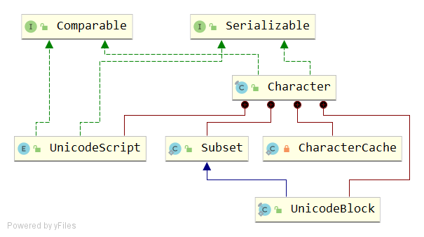

# Character
## signature
```java
public final class Character 
    implements java.io.Serializable, Comparable<Character>
```


## Unicode Character Representations
- char数据类型（以及Character对象封装的值）基于原始Unicode规范，该规范将字符定义为固定宽度的16位实体。
- 此后，Unicode标准进行了更改，允许其表示需要16位以上的字符。合法代码点的范围现在为U+0000到U+10FFFF，即Unicode标量值。
---
- 从U+0000到U+FFFF的字符集有时称为基本多语言平面（BMP）。 代码点大于U+FFFF的字符称为补充字符。  
- Java平台在char数组以及String和StringBuffer类中使用UTF-16表示形式。 
在此表示形式中，辅助字符表示为一对char值，第一个字符来自高代理范围（\uD800 - \uDBFF），第二个字符来自低代理范围（\uDC00- \uDFFF）。
---
- char值表示基本多语言平面（BMP）代码点，包括代理代码点或UTF-16编码的代码单元。 
- 一个int值表示所有Unicode代码点，包括补充代码点。
- int的低21位（最低有效）用于表示Unicode代码点，高11位（最高有效）必须为零。有关补充字符和替代char值的行为如下：

1. 仅接受char值的方法不能支持补充字符。他们将代理范围中的char值视为未定义字符。 例如，Character.isLetter（'\ uD840'）返回false。
2. 接受int值的方法支持所有Unicode字符，包括补充字符。 例如，Character.isLetter（0x2F81A）返回true，因为代码点值表示字母（CJK表意文字）。
---
- 在Java SE API文档中，Unicode代码点用于U+0000到U+10FFFF之间的字符值，Unicode代码单元用于16位char值，这些字符是UTF-16编码的代码单元。

## API
### variables
```java
public static final int MIN_RADIX = 2;
public static final int MAX_RADIX = 36;

public static final char MIN_VALUE = '\u0000';
public static final char MAX_VALUE = '\uFFFF';

public static final Class<Character> TYPE = (Class<Character>) Class.getPrimitiveClass("char");
```
```java
public static final char MIN_HIGH_SURROGATE = '\uD800';
public static final char MAX_HIGH_SURROGATE = '\uDBFF';

public static final char MIN_LOW_SURROGATE  = '\uDC00';
public static final char MAX_LOW_SURROGATE  = '\uDFFF';

public static final int MIN_SUPPLEMENTARY_CODE_POINT = 0x010000;
public static final int MIN_CODE_POINT = 0x000000;
public static final int MAX_CODE_POINT = 0X10FFFF;

public static final int SIZE = 16;
public static final int BYTES = SIZE / Byte.SIZE;

private final char value;
```
final char value是Character背后的数据结构。

### constructor
```java
public Character(char value) {
    this.value = value;
}
```
### Character valueOf(char c)
```java
public static Character valueOf(char c) {
    if (c <= 127) { // must cache
        return CharacterCache.cache[(int)c];
    }
    return new Character(c);
}
```
c <=127 时，使用缓存值。
#### CharacterCache
```java
private static class CharacterCache {
    private CharacterCache(){}

    static final Character cache[] = new Character[127 + 1];

    static {
        for (int i = 0; i < cache.length; i++)
            cache[i] = new Character((char)i);
    }
}
```
- Character[]长度为128，cache[0] ~ cache[127]
- cache[0] ='0',..., cache[127]=127

### int hashCode()
```java
@Override
public int hashCode() {
    return Character.hashCode(value);
}

public static int hashCode(char value) {
    return (int)value;
}
```
hashCode = char value 强转为 int
### boolean equals(Object obj)
```java
public boolean equals(Object obj) {
    if (obj instanceof Character) {
        return value == ((Character)obj).charValue();
    }
    return false;
}
```
### String toString()
```java
public String toString() {
    char buf[] = {value};
    return String.valueOf(buf);
}
```
{value} 表示将char转化为char[],但只有一个元素。然后传给 String.valueOf(buf)

### boolean isValidCodePoint(int codePoint)
```java
public static boolean isValidCodePoint(int codePoint) {
    // Optimized form of:
    //     codePoint >= MIN_CODE_POINT && codePoint <= MAX_CODE_POINT
    int plane = codePoint >>> 16;
    return plane < ((MAX_CODE_POINT + 1) >>> 16);
}
```
含义：codePoint >= MIN_CODE_POINT && codePoint <= MAX_CODE_POINT。即 0x000000 ~ 0X10FFFF

### boolean isBmpCodePoint(int codePoint)
```java
public static boolean isBmpCodePoint(int codePoint) {
    return codePoint >>> 16 == 0;
    // Optimized form of:
    //     codePoint >= MIN_VALUE && codePoint <= MAX_VALUE
    // We consistently use logical shift (>>>) to facilitate
    // additional runtime optimizations.
}
```
含义：codePoint >= MIN_VALUE && codePoint <= MAX_VALUE。即 '\u0000' ~ '\uFFFF'

### boolean isSupplementaryCodePoint(int codePoint)
```java
public static boolean isSupplementaryCodePoint(int codePoint) {
    return codePoint >= MIN_SUPPLEMENTARY_CODE_POINT
        && codePoint <  MAX_CODE_POINT + 1;
}
```
即 0x010000 ~ (0X10FFFF + 1)

### boolean isHighSurrogate(char ch)
```java
public static boolean isHighSurrogate(char ch) {
    // Help VM constant-fold; MAX_HIGH_SURROGATE + 1 == MIN_LOW_SURROGATE
    return ch >= MIN_HIGH_SURROGATE && ch < (MAX_HIGH_SURROGATE + 1);
}
```
### boolean isLowSurrogate(char ch)
```java
public static boolean isLowSurrogate(char ch) {
    return ch >= MIN_LOW_SURROGATE && ch < (MAX_LOW_SURROGATE + 1);
}
```
### boolean isSurrogate(char ch)
```java
public static boolean isSurrogate(char ch) {
    return ch >= MIN_SURROGATE && ch < (MAX_SURROGATE + 1);
}
```
### boolean isSurrogatePair(char high, char low)
```java
public static boolean isSurrogatePair(char high, char low) {
    return isHighSurrogate(high) && isLowSurrogate(low);
}
```
判断一个char对是否为Surrogate Pair：high和low分别位于HighSurrogate 和 LowSurrogate 区间内。

### int charCount(int codePoint)
```java
public static int charCount(int codePoint) {
    return codePoint >= MIN_SUPPLEMENTARY_CODE_POINT ? 2 : 1;
}
```
- 确定表示指定字符（Unicode代码点）所需的char值的数量。如果指定的字符等于或大于0x10000，则该方法返回2。否则，该方法返回1。
- 此方法不会验证指定的字符是否为有效的Unicode代码点。如果需要，调用者必须使用isValidCodePoint验证字符值。

### int toCodePoint(char high, char low)
```java
public static int toCodePoint(char high, char low) {
    // Optimized form of:
    // return ((high - MIN_HIGH_SURROGATE) << 10)
    //         + (low - MIN_LOW_SURROGATE)
    //         + MIN_SUPPLEMENTARY_CODE_POINT;
    return ((high << 10) + low) + (MIN_SUPPLEMENTARY_CODE_POINT
                                   - (MIN_HIGH_SURROGATE << 10)
                                   - MIN_LOW_SURROGATE);
}
```
将指定的代理对转换为其补充代码点值。

### int codePointAtImpl(char[] a, int index, int limit)
```java
// throws ArrayIndexOutOfBoundsException if index out of bounds
static int codePointAtImpl(char[] a, int index, int limit) {
    char c1 = a[index];
    if (isHighSurrogate(c1) && ++index < limit) {
        char c2 = a[index];
        if (isLowSurrogate(c2)) {
            return toCodePoint(c1, c2);
        }
    }
    return c1;
}
```
根据index取对应位置的char，得到c1，判断：
- 如果isHighSurrogate为true，并且index+1小于 limit。那么获取a[index+1]并判断是否为LowSurrogate，是的话返回toCodePoint(c1, c2)
- 否则，直接返回c1

