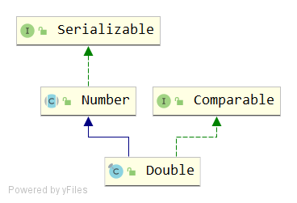

# Double
## signature
```java
public final class Double extends Number implements Comparable<Double>
```


## API
### variables
```java
// 正无穷，等于 Double.longBitsToDouble(0x7ff0000000000000L)
public static final double POSITIVE_INFINITY = 1.0 / 0.0;

// 负无穷，等于Double.longBitsToDouble(0xfff0000000000000L).
public static final double NEGATIVE_INFINITY = -1.0 / 0.0;

// NaN ，等于Double.longBitsToDouble(0x7ff8000000000000L
public static final double NaN = 0.0d / 0.0;

// 最大的正有限值, (2-2^(-52))·2^1023. 等价于 Double.longBitsToDouble(0x7fefffffffffffffL).
public static final double MAX_VALUE = 0x1.fffffffffffffP+1023; // 1.7976931348623157e+308

// 最小正标准值 2^(-1022) 等于 Double.longBitsToDouble(0x0010000000000000L)
public static final double MIN_NORMAL = 0x1.0p-1022; // 2.2250738585072014E-308

// 最小正非零值 等于 Double.longBitsToDouble(0x1L)
public static final double MIN_VALUE = 0x0.0000000000001P-1022; // 4.9e-324

// double类型的最大指数
public static final int MAX_EXPONENT = 1023;

// double类型的最小指数
public static final int MIN_EXPONENT = -1022;

public static final int SIZE = 64;
public static final int BYTES = SIZE / Byte.SIZE; //64/8=8 个字节

public static final Class<Double>   TYPE = (Class<Double>) Class.getPrimitiveClass("double");

private final double value; // Double的值, 是实例变量
```

### constructor
```java
public Double(double value) {
    this.value = value;
}
public Double(String s) throws NumberFormatException {
    value = parseDouble(s);
}
```
入参分别是double类型和String类型。String类型会内部进行解析。
```java
public static double parseDouble(String s) throws NumberFormatException {
    return FloatingDecimal.parseDouble(s);
}
```
这个 FloatingDecimal.parseDouble(s) 里面调用层级很深，先跳过。

### boolean isNaN(double v)
```java
public static boolean isNaN(double v) {
    return (v != v);
}
```
根据自反性判断是否为NaN, 因为 NaN!=NaN 成立

### boolean isInfinite(double v)
```java
public static boolean isInfinite(double v) {
    return (v == POSITIVE_INFINITY) || (v == NEGATIVE_INFINITY);
}
```
判断无穷的条件：是正无穷或负无穷

### boolean isFinite(double d)
```java
public static boolean isFinite(double d) {
    return Math.abs(d) <= DoubleConsts.MAX_VALUE;//1.7976931348623157E308D
}
```
绝对值小于等于DoubleConsts.MAX_VALUE，就是有限的值。

### String toString()
```java
public String toString() {
    return toString(value);
}

public static String toString(double d) {
    return FloatingDecimal.toJavaFormatString(d);
}
```
=> FloatingDecimal.toJavaFormatString(d)

### int hashCode()
```java
@Override
public int hashCode() {
    return Double.hashCode(value);
}

public static int hashCode(double value) {
    long bits = doubleToLongBits(value);
    return (int)(bits ^ (bits >>> 32));
}
```
doubleToLongBits(value) 这行似乎是关键。

### long doubleToLongBits(double value)
```java
public static long doubleToLongBits(double value) {
    long result = doubleToRawLongBits(value);
    // Check for NaN based on values of bit fields, maximum
    // exponent and nonzero significand.
    if ( ((result & DoubleConsts.EXP_BIT_MASK) ==
          DoubleConsts.EXP_BIT_MASK) &&
         (result & DoubleConsts.SIGNIF_BIT_MASK) != 0L)
        result = 0x7ff8000000000000L;
    return result;
}
```
- 注释说明：根据位字段的值，最大指数（exponent）和非零尾数（significand）检查为NaN，如果是，则返回 0x7ff8000000000000L
- 如果参数为正无穷大，则结果为0x7ff0000000000000L。
- 如果参数为负无穷大，则结果为0xfff0000000000000L。
- 所有情况下，结果都是一个long整数，longBitsToDouble(long)与doubleToLongBits互逆。（除了所有NaN值均折叠为单个“规范” NaN值）。

### boolean equals(Object obj)
```java
public boolean equals(Object obj) {
    return (obj instanceof Double)
           && (doubleToLongBits(((Double)obj).value) == doubleToLongBits(value));
}
```
两个Double对象相等的两个条件：
- 都是Double类型
- 两者的doubleToLongBits(value)相等

### long doubleToRawLongBits(double value)
```java
public static native long doubleToRawLongBits(double value);
```
说明
- 根据IEEE 754浮点“double 格式”位布局，返回指定的浮点值的表示形式，并保留非数字（NaN）值。
- 位63（由掩码0x8000000000000000L选择的位）表示浮点数的符号。(sign) => 1 bit
- 位62-52（由掩码0x7ff0000000000000L选择的位）表示指数。(exponent) => 11位
- 位51-0（由掩码0x000fffffffffffffL选择的位）表示浮点数的有效位（也称为尾数）。(mantissa) => 52位

返回值
- 如果参数为正无穷大，则结果为0x7ff0000000000000L。
- 如果参数为负无穷大，则结果为0xfff0000000000000L。
- 如果参数为NaN，则结果为表示实际NaN值的long整数。
- 与doubleToLongBits方法不同，doubleToRawLongBits不会将编码NaN的所有位模式折叠为单个“规范的” NaN值。
- longBitsToDouble(long)方法与doubleToRawLongBits(double value)方法互为逆运算。

### double longBitsToDouble(long bits)
```java
public static native double longBitsToDouble(long bits);
```
说明
- 此方法可能无法以与long参数完全相同的位模式返回 double NaN。  
- IEEE 754区分两种NaN，quiet NaN和signaling NaN。 两种NaN之间的差异通常在Java中不可见。 
- 对signaling NaN进行算术运算会将其转换为具有不同但通常相似的位模式的quiet NaN。在某些处理器上，仅复制signaling NaN也会执行该转换。 
特别地，复制signaling NaN以将其返回给调用方法可以执行该转换。
- 因此，longBitsToDouble可能无法返回带有signaling NaN位模式的double。
- 因此，对于某些long值，doubleToRawLongBits（longBitsToDouble（start））可能不等于start。 
- 此外，哪些特定的位模式表示signaling NaN取决于特定平台；但所有的NaN位模式（quiet或signaling）都必须在上面确定的NaN范围内。

返回值
- 如果参数为0x7ff0000000000000L，则结果为正无穷大。
- 如果参数为0xfff0000000000000L，则结果为负无穷大。
- 如果参数是0x7ff0000000000001L 到 0x7fffffffffffffffffL，或0xfff0000000000001L到0xffffffffffffffffL范围内的值，则结果为NaN。
- Java提供的IEEE 754浮点运算无法区分具有不同位模式的相同类型的两个NaN值。NaN的不同值只能通过Double.doubleToRawLongBits来区分。
- 在所有其他情况下，令s，e和m为可以从参数计算得出的三个值：
```java
int s = ((bits >> 63) == 0) ? 1 : -1; //符号位
int e = (int)((bits >> 52) & 0x7ffL); // 指数
long m = (e == 0) ? 
             (bits & 0xfffffffffffffL) << 1 :
             (bits & 0xfffffffffffffL) | 0x10000000000000L;
```
浮点结果等于数学表达式 s·m·2^(e-1075) 的值。

### int compare(double d1, double d2)
```java
public static int compare(double d1, double d2) {
    if (d1 < d2)
        return -1;           // Neither val is NaN, thisVal is smaller
    if (d1 > d2)
        return 1;            // Neither val is NaN, thisVal is larger

    // Cannot use doubleToRawLongBits because of possibility of NaNs.
    long thisBits    = Double.doubleToLongBits(d1);
    long anotherBits = Double.doubleToLongBits(d2);

    return (thisBits == anotherBits ?  0 : // Values are equal
            (thisBits < anotherBits ? -1 : // (-0.0, 0.0) or (!NaN, NaN)
             1));                          // (0.0, -0.0) or (NaN, !NaN)
}
```
- val都不是NaN，thisVal较小, 即d1 < d2 => -1
- val都不是NaN，thisVal较大, 即d1 > d2 => 1
- 因为doubleToRawLongBits可能产生NaN值，于是不能使用doubleToRawLongBits进行比较。
- 使用doubleToLongBits方法将 d1 和 d2 转为 long 类型：thisBits 和 anotherBits
  - thisBits == anotherBits, => 0
  - thisBits < anotherBits, => -1
  - thisBits > anotherBits, => 1

