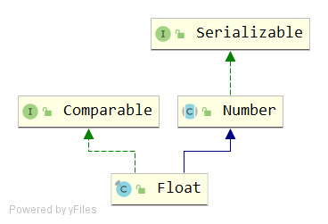

# Float
## signature
```java
public final class Float extends Number implements Comparable<Float>
```

## API
### variables
```java
// Float.intBitsToFloat(0x7f800000) 正无穷
public static final float POSITIVE_INFINITY = 1.0f / 0.0f;

// Float.intBitsToFloat(0xff800000) 负无穷
public static final float NEGATIVE_INFINITY = -1.0f / 0.0f;

// Float.intBitsToFloat(0x7fc00000) NaN
public static final float NaN = 0.0f / 0.0f;

// Float.intBitsToFloat(0x7f7fffff)
public static final float MAX_VALUE = 0x1.fffffeP+127f; // 3.4028235e+38f

// Float.intBitsToFloat(0x00800000)
public static final float MIN_NORMAL = 0x1.0p-126f; // 1.17549435E-38f

// Float.intBitsToFloat(0x1)
public static final float MIN_VALUE = 0x0.000002P-126f; // 1.4e-45f

// 最大指数
public static final int MAX_EXPONENT = 127;

// 最小指数
public static final int MIN_EXPONENT = -126;

public static final int SIZE = 32;
public static final int BYTES = SIZE / Byte.SIZE;// 4个字节

public static final Class<Float> TYPE = (Class<Float>) Class.getPrimitiveClass("float");
```
- MAX_VALUE = (2-2<sup>-23</sup>)·2<sup>127</sup>
- MIN_NORMAL = 2<sup>-126</sup>
- MIN_VALUE = 2<sup>-149</sup>

### constructor
```java
public Float(float value) {
    this.value = value;
}

public Float(double value) {
    this.value = (float)value;
}

public Float(String s) throws NumberFormatException {
    value = parseFloat(s);
}
```
三个构造函数，入参分别是 float，double和String类型。
- double类型入参会转化为float，属于宽范围向窄范围强转，会发生精度丢失。
- String类型入参会触发解析。

### float parseFloat(String s)
```java
public static float parseFloat(String s) throws NumberFormatException {
    return FloatingDecimal.parseFloat(s);
}
```
=> FloatingDecimal.parseFloat(s);

### valueOf
```java
public static Float valueOf(String s) throws NumberFormatException {
    return new Float(parseFloat(s));
}
```
如果入参为String，则转化为float后，再new Float(f)
```java
public static Float valueOf(float f) {
    return new Float(f);
}
```
### String toString()
```java
public String toString() {
    return Float.toString(value);
}
```
```java
public static String toString(float f) {
    return FloatingDecimal.toJavaFormatString(f);
}
```
=> FloatingDecimal.toJavaFormatString(f);

### int hashCode()
```java
@Override
public int hashCode() {
    return Float.hashCode(value);
}

public static int hashCode(float value) {
    return floatToIntBits(value);
}
```

### int floatToIntBits(float value)
```java
public static int floatToIntBits(float value) {
    int result = floatToRawIntBits(value);
    // Check for NaN based on values of bit fields, maximum
    // exponent and nonzero significand.
    if ( ((result & FloatConsts.EXP_BIT_MASK) ==
          FloatConsts.EXP_BIT_MASK) &&
         (result & FloatConsts.SIGNIF_BIT_MASK) != 0)
        result = 0x7fc00000;
    return result;
}
```
说明
- 根据IEEE 754浮点“float格式”位布局，返回指定浮点值的表示形式。
- 位31（由掩码0x80000000选择的位）表示浮点数的符号。
- 位30-23（由掩码0x7f800000选择的位）表示指数。 
- 位22-0（由掩码0x007fffff选择的位）表示浮点数的有效位（也称为尾数）。

返回值
- 如果参数为正无穷大，则结果为0x7f800000。
- 如果参数为负无穷大，则结果为0xff800000。
- 如果参数为NaN，则结果为0x7fc00000。
- 所有情况下，结果都是一个integer，与intBitsToFloat(int)互为逆运算（除了所有NaN值都折叠为单个“规范” NaN值）。
   
### int floatToRawIntBits(float value)
```java
public static native int floatToRawIntBits(float value);
```
- 如果参数为NaN，则结果为代表实际NaN值的integer。 
- 与floatToIntBits方法不同，floatToRawIntBits不会将编码NaN的所有位模式折叠为单个“规范” NaN值。

### float intBitsToFloat(int bits)
```java
public static native float intBitsToFloat(int bits);
```
- 返回与给定位表示形式对应的浮点值。 根据IEEE 754浮点“float格式”位布局，该参数被认为是浮点值的表示。
- 如果参数为0x7f800000，则结果为正无穷大。
- 如果参数为0xff800000，则结果为负无穷大。
- 如果参数为0x7f800001到0x7fffffff范围内的任何值，或者0xff800001到0xffffffff范围内的任何值，则结果为NaN。 
- Java提供的IEEE 754浮点运算无法区分具有不同位模式的相同类型的两个NaN值。NaN的不同值只能通过使用Float.floatToRawIntBits方法来区分。
- 在所有其他情况下，令s，e和m为可以从参数计算得出的三个值：
```java
int s = ((bits >> 31) == 0) ? 1 : -1;
int e = ((bits >> 23) & 0xff);
int m = (e == 0) ?
             (bits & 0x7fffff) << 1 :
             (bits & 0x7fffff) | 0x800000;
```
然后，浮点结果等于数学表达式s·m·2^(e-150)的值。

> 其他说明
- 此方法可能无法返回与int参数完全相同的位模式的float NaN。IEEE 754区分两种NaN，即quiet NaN和signaling NaN。
- 两种NaN之间的差异通常在Java中不可见。 对signaling NaN进行算术运算会将其转换为具有不同但通常相似的位模式的quiet NaN。 
- 在某些处理器上，仅复制signaling NaN也会执行该转换。 特别地，复制signaling NaN以将其返回给调用方法可以执行该转换。 
- 因此，intBitsToFloat可能无法返回带有信号NaN位模式的浮点数。 
- 因此，对于某些int值，floatToRawIntBits（intBitsToFloat（start））可能不等于start。 
- 此外，哪些特定的位模式表示NaN signaling取决于平台；但是所有的NaN位模式（quiet或signaling）都必须在上面确定的NaN范围内。
