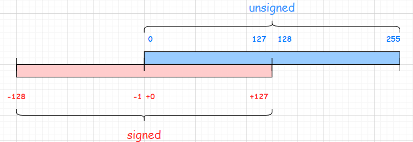

# Integer compareUnsigned
> java.lang.Integer.compareUnsigned
```java
public static int compareUnsigned(int x, int y) {
    return compare(x + MIN_VALUE, y + MIN_VALUE);
}
```
本文将对此原理进行详细讨论，并总结一般化的扩展思路。

## 证明过程
为简化说明，使用8位字节大小的整数进行解释。
- 如果是无符号位表示：范围是[0,2^8-1] => [0,255]
- 如果是有符号位表示：范围是[-2^8,2^8-1] => [-128,127]



- 无符号和有符号的数值，在[0,127]区间内，二进制表示都是一样的，0000 0000 ~ 0111 1111。
- 一共可以划分三个区间 [-128,-1] [0,127] [128,255]

2个值，每个值都必须落于这3个区间之内。假设这两个值为 x 和 y。由于x 和y 可以互换，实际上只有6种可能。

| 横轴为x 竖轴为y | [-128,-1] |[0,127] | [128,255] |
|--------------|--------|--------|--------|
| [-128,-1] | case 1 | case 4 | case 5 |
| [0,127] | case 4 | case 2 | case 6 |
| [128,255]   | case 5 | case 6 | case 3 |

### Case 1: 两个值都位于有符号的负范围内[-128,-1]
假设 x = −35 和 y = −80

|                          | x          | 比较结果 | y           |
|--------------------------|------------|------|-------------|
| 十进制                      | \-35       |     | \-80        |
| 二进制                   | ‭11011101‬ |      | ‭‭10110000‬ |
| 看成无符号二进制 \-> 十进制         | 221        |      | 176         |
| 期望的比较结果        |        |  \>     |        |
| 同时\+ MIN\_VALUE\(\-128\) | 93         | \>    | 48          |

### Case 2: 两个值都位于有符号的正范围内[0,127]
假设 x = 20 和 y = 60

|                          | x           | 比较结果 | y            |
|--------------------------|-------------|------|--------------|
| 十进制                      | 20          |     | 60           |
| 二进制                   | ‭‭00010100‬ |      | ‭‭‭00111100‬ |
| 看成无符号二进制 \-> 十进制         | 20          |      | 60           |
| 期望的比较结果        |        |  \<     |        |
| 同时\+ MIN\_VALUE\(\-128\) | \-108       | \<    | \-68         |


### Case 3: 两个值都位于无符号的右半部分的正范围内[128,255]
假设 x = 140 和 y = 200

|                          | x            | 比较结果 | y             |
|--------------------------|--------------|------|---------------|
| 十进制                      | 140          |     | 200           |
| 二进制                      | ‭‭‭10001100‬ |      | ‭‭‭‭11001000‬ |
| 看成无符号二进制 \-> 十进制         | 140          |      | 200           |
| 期望的比较结果        |        |  \<     |        |
| 同时\+ MIN\_VALUE\(\-128\) | 12           | \<    | 72            |

### Case 4: 一个值位于[-128,-1], 另一个值位于[0,127]
假设 x = −35 和 y = 60

|                          | x            | 比较结果 | y              |
|--------------------------|--------------|------|----------------|
| 十进制                      | \-35         |     | 60             |
| 二进制                      | ‭‭‭10001100‬ |      | ‭‭‭‭‭00111100‬ |
| 看成无符号二进制 \-> 十进制         | 221          |      | 60             |
| 期望的比较结果        |        |  \>     |        |
| 同时\+ MIN\_VALUE\(\-128\) | 93           | \>    | \-68           |


### Case 5: 一个值位于[-128,-1], 另一个值位于[128,255]
假设 x = −35 和 y = 140

|                          | x            | 比较结果 | y               |
|--------------------------|--------------|------|-----------------|
| 十进制                      | \-35         |     | 140             |
| 二进制                      | ‭‭‭10001100‬ |      | ‭‭‭‭‭‭10001100‬ |
| 看成无符号二进制 \-> 十进制         | 221          |      | 140             |
| 期望的比较结果                  |              | \>    |                 |
| 同时\+ MIN\_VALUE\(\-128\) | 93           | \>    | 12              |

### Case 6: 一个值位于[0,127], 另一个值位于[128,255]
假设 x = 60 和 y = 140

|                          | x             | 比较结果 | y               |
|--------------------------|---------------|------|-----------------|
| 十进制                      | 60            |      | 140             |
| 二进制                      | ‭‭‭‭00111100‬ |      | ‭‭‭‭‭‭10001100‬ |
| 看成无符号二进制 \-> 十进制         | 60            |      | 140             |
| 期望的比较结果                  |               | <    |                 |
| 同时\+ MIN\_VALUE\(\-128\) | \-68          | <    | 12              |

## 一般化
1. 有符号整数使用二进制补码表示。 
2. 加法在溢出时回绕（不是引发错误或提升为更大的数字类型或未定义）。

### Integer
对于32位整数
- 有符号范围为 −2,147,483,648（MIN_VALUE）至+2,147,483,647
- 无符号范围为 0 至 4,294,967,295
### Long
对于64位整数
- 有符号范围为 −2^63 至 +2^63 -1
- 无符号范围为 0 至 +2^64-1

## 参考
- https://stackoverflow.com/questions/27527943/how-does-adding-min-value-compare-integers-as-unsigned