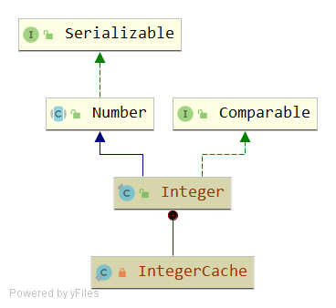
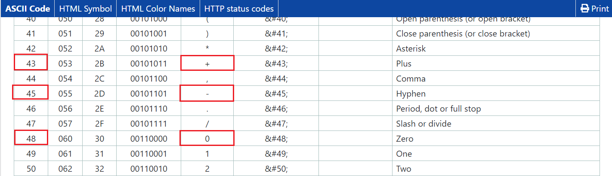

# Integer
## 签名
```java
public final class Integer extends Number implements Comparable<Integer>
```


## API
### 取值范围
```java
@Native public static final int   MIN_VALUE = 0x80000000;//-2^31
@Native public static final int   MAX_VALUE = 0x7fffffff;//2^31-1
```
取值范围是：[-2^31,2^31-1]

### 构造函数
#### Integer(int value)
```java
public  {
    this.value = value;
}
```
#### Integer(String s)
```java
public Integer(String s) throws NumberFormatException {
    this.value = parseInt(s, 10);
}
```

### int parseInt(String s, int radix)
```java
public static int parseInt(String s, int radix) throws NumberFormatException
{
    if (s == null) {
        throw new NumberFormatException("null");
    }

    if (radix < Character.MIN_RADIX) {
        throw new NumberFormatException("radix " + radix +" less than Character.MIN_RADIX");
    }

    if (radix > Character.MAX_RADIX) {
        throw new NumberFormatException("radix " + radix +" greater than Character.MAX_RADIX");
    }

    int result = 0;// 最终返回的结果的负数形式
    boolean negative = false; // 判断是否为负数
    int i = 0, len = s.length();
    int limit = -Integer.MAX_VALUE;// 边界限制取相反的符号：-2147483647 是最大整数的取反值
    int multmin;
    int digit;

    if (len > 0) {
        char firstChar = s.charAt(0);
        if (firstChar < '0') { // Possible leading "+" or "-"
            if (firstChar == '-') {
                negative = true;
                limit = Integer.MIN_VALUE;
            } else if (firstChar != '+')
                throw NumberFormatException.forInputString(s);

            if (len == 1) // Cannot have lone "+" or "-"
                throw NumberFormatException.forInputString(s);
            i++;
        }
        multmin = limit / radix;
        while (i < len) {
            // Accumulating negatively avoids surprises near MAX_VALUE
            digit = Character.digit(s.charAt(i++),radix);// 循坏获取数字，假设输入为123，那么分别获取1,2,3
            if (digit < 0) {
                throw NumberFormatException.forInputString(s);
            }
            if (result < multmin) {
                throw NumberFormatException.forInputString(s);
            }
            result *= radix;
            if (result < limit + digit) {
                throw NumberFormatException.forInputString(s);
            }
            result -= digit;
        }
    } else {
        throw NumberFormatException.forInputString(s);
    }
    return negative ? result : -result;
}
```
#### 解析原理
1.先检测输入合法性，将引发NumberFormatException异常：
- 第一个参数为null。
- 基数小于Character.MIN_RADIX(2)或大于Character.MAX_RADIX(36)。

2.1如果上面检测通过，且字符串长度大于0，对于第一个字符，先判断 if (firstChar < '0')

- 如果为true，表示第一个字符可能为"+"或者"-"
  - 如果为"-": 将negative变量标记为true，limit标记为Integer.MIN_VALUE。（limit初始值是-Integer.MAX_VALUE）
  - 如果不为"+"：抛出异常
  - 如果字符串长度为1，那么也抛出异常，因为不允许单独的"+"或"-"作为输入
  - 如果上面都顺利通过，那么就是"+"或"-"开头，且长度大于1，执行i++，将当前光标前进一步。
- 如果为false，表示第一个字符是数字或者字母，执行关键的解析逻辑。
```java
if (result < multmin) {
    throw NumberFormatException.forInputString(s);
}
result *= radix;
if (result < limit + digit) {
    throw NumberFormatException.forInputString(s);
}
result -= digit;
```
由于这里是以取反进行计算，为了理清思路，先回到不取反的计算逻辑
```
// 检测 result * radix 是否会超出 limit
if (result > limit / radix) // result, limit and radix are positive

// 检测 result + digit 是否会超出 limit
if (result > limit - digit) // result, limit and digit are positive
```
然后下面是取反逻辑，将上面左右不等式添加负号，符号方向改变
```java
// 原式：if ( - result < - limit / radix) // result, limit and radix are positive
// if ( result <  limit / radix)    // 将 result and limit 改为 negative 表示法

// 原式：if ( - result < - limit + digit) // result, limit and digit are positive
// if ( result < limit + digit)     // 将 result and limit 改为 negative 表示法
```
这样，上面if的判断逻辑就理清了。

接下来是这两句，解析的关键。
```java
result *= radix;
result -= digit;
```
给一个例子感受一下过程。假设输入s=123，radix=10
```java
result=0*10=0
result=0-1=-1

result=-1*10=-10
result=-10-2=-12

result=-12*10=-120
result=-120-3=-123
```
得到的result（-123）其实是期望结果（123）的相反数。于是，最后的返回值是
```java
return negative ? result : -result;
```
由于negative为false，那么返回-result=-(-123)=123

2.2 如果上面检测通过，且字符串长度等于0，那么抛出异常。
#### 边界异常
```java
// parseInt("2147483648", 10)
  limit: -2147483647 (-Integer.MAX_VALUE)
multmin: -214748364
 result: -2
 result: -21
 result: -214
 result: -2147
 result: -21474
 result: -214748
 result: -2147483
 result: -21474836
 result: -214748364
 result: NumberFormatException (after multiplication, before subtraction)  
```
当 -214748364*10=-2147483640 时，满足条件 result < limit + digit = -2147483647 + 8，抛出异常
#### 一个例子
```java
parseInt("Kona", 27) returns 411787
```
在16进制数中a=10，b=11，c=12，d=13，e=14，f=15，...，k=20，n=23，o=24

于是 20*27^3+24*27^2+23*27^1+97=411874

### int parseInt(String s)
=> parseInt(s,10) 默认10进制解析

### int parseUnsignedInt(String s, int radix)
```java
public static int parseUnsignedInt(String s, int radix) throws NumberFormatException {
    if (s == null)  {
        throw new NumberFormatException("null");
    }

    int len = s.length();
    if (len > 0) {
        char firstChar = s.charAt(0);
        if (firstChar == '-') {
            throw new NumberFormatException(String.format("Illegal leading minus sign " + "on unsigned string %s.", s));
        } else {
            if (len <= 5 || // Integer.MAX_VALUE in Character.MAX_RADIX is 6 digits
                (radix == 10 && len <= 9) ) { // Integer.MAX_VALUE in base 10 is 10 digits
                return parseInt(s, radix);
            } else {
                long ell = Long.parseLong(s, radix);
                if ((ell & 0xffff_ffff_0000_0000L) == 0) {
                    return (int) ell;
                } else {
                    throw new
                        NumberFormatException(String.format("String value %s exceeds " +
                                                            "range of unsigned int.", s));
                }
            }
        }
    } else {
        throw NumberFormatException.forInputString(s);
    }
}
```
- 当字符串长度较小时，可以断定该数值不会很大，使用parseInt(s, radix)进行解析。
- 否则，使用Long.parseLong(s, radix)进行解析
  - (ell & 0xffff_ffff_0000_0000L) == 0 表示高32位都是0，这时直接取低32位 (int) ell
  - 否则，抛出范围越界异常

### int parseUnsignedInt(String s)
=> parseUnsignedInt(s, 10) 默认10进制解析

### Integer valueOf(int i)
```java
public static Integer valueOf(int i) {
    if (i >= IntegerCache.low && i <= IntegerCache.high)
        return IntegerCache.cache[i + (-IntegerCache.low)];
    return new Integer(i);
}
```
- 如果请求值在缓存区间内，则直接从缓存中取值返回，否则new一个Integer实例。
- 如果不需要新的Integer实例，应优先于构造方法Integer（int）使用此方法，因为此方法通过缓存经常请求的值可能会有更好的空间和时间性能。 
- 此方法始终缓存-128至127（包括）范围内的值，并且可能缓存该范围之外的其他值。

其他重载方法：
```java
Integer valueOf(String s) => Integer.valueOf(parseInt(s, 10))
Integer valueOf(String s, int radix) => Integer.valueOf(parseInt(s,radix))
```
### IntegerCache
```java
private static class IntegerCache {
    static final int low = -128;
    static final int high;
    static final Integer cache[];

    static {
        // high value may be configured by property
        int h = 127;
        String integerCacheHighPropValue =
            sun.misc.VM.getSavedProperty("java.lang.Integer.IntegerCache.high");
        if (integerCacheHighPropValue != null) {
            try {
                int i = parseInt(integerCacheHighPropValue);
                i = Math.max(i, 127);
                // Maximum array size is Integer.MAX_VALUE
                h = Math.min(i, Integer.MAX_VALUE - (-low) -1);
            } catch( NumberFormatException nfe) {
                // If the property cannot be parsed into an int, ignore it.
            }
        }
        high = h;

        cache = new Integer[(high - low) + 1];
        int j = low;
        for(int k = 0; k < cache.length; k++)
            cache[k] = new Integer(j++);

        // range [-128, 127] must be interned (JLS7 5.1.7)
        assert IntegerCache.high >= 127;
    }

    private IntegerCache() {}
}
```
- low=-128 是固定的
- high 默认值是 127，但是该值可以通过JVM参数`java.lang.Integer.IntegerCache.high`进行调整。
  - 实现方式为：sun.misc.VM.getSavedProperty("java.lang.Integer.IntegerCache.high")
  - Math.max(i, 127) 保证 high 一定 >= 127
  - Math.min(i, Integer.MAX_VALUE - (-low) -1) => Math.min(i,Integer.MAX_VALUE-129) 保证一定小于 Integer.MAX_VALUE-129
  - 那么 high范围是 [127,Integer.MAX_VALUE-129]
- 新建 (high - low) + 1 个Integer实例初始化值，cache[0]=-128,cache[1]=-127,cache[255]=127,... 即 index i= value + 128
  - 回顾 Integer valueOf(int i) => IntegerCache.cache[i + (-IntegerCache.low)] => IntegerCache.cache[i + 128]
  - 当valueOf(-128) => IntegerCache.cache[i + 128] => IntegerCache.cache[0] = -128
  - 当valueOf(127) => IntegerCache.cache[i + 128] => IntegerCache.cache[255] = 127
  - 默认缓存区间得证。
- assert IntegerCache.high >= 127 这句是代码自检测

### 比较
#### int compareTo(Integer anotherInteger)
```java
public int compareTo(Integer anotherInteger) {
    return compare(this.value, anotherInteger.value);
}
```
委托到方法 int compare(int x, int y)

#### int compare(int x, int y)
```java
public static int compare(int x, int y) {
    return (x < y) ? -1 : ((x == y) ? 0 : 1);//-1,0,1是一种约定
}
```
int x, int y 认为都是有符号的。

#### int compareUnsigned(int x, int y)
```java
public static int compareUnsigned(int x, int y) {
    return compare(x + MIN_VALUE, y + MIN_VALUE);
}
```
int x, int y 认为都是无符号的。比较无符号整数时，先同时加上一个相同的数MIN_VALUE。
> 为什么两边无条件添加MIN_VALUE就能正确地无符号比较？具体讨论参见 Integer#compareUnsigned.md

### int hashCode(int value)
```java
@Override
public int hashCode() {
    return Integer.hashCode(value);
}
```
```java
public static int hashCode(int value) {
    return value;
}
```
直接返回 value 作为 hashCode

### boolean equals(Object obj)
```java
public boolean equals(Object obj) {
    if (obj instanceof Integer) {
        return value == ((Integer)obj).intValue();//value
    }
    return false;
}
```
判断相等
- 如果不是Integer 实例，直接false
- 如果是Integer 实例，转型为Integer，取value进行比较

### toString
#### String toString() 
```java
public String toString() {
    return toString(value);
}
```
#### String toString(int i)
```java
public static String toString(int i) {
    if (i == Integer.MIN_VALUE)
        return "-2147483648";
    int size = (i < 0) ? stringSize(-i) + 1 : stringSize(i);
    char[] buf = new char[size];
    getChars(i, size, buf);
    return new String(buf, true);
}
```
> 辅助方法 stringSize(int x)
```java
final static int [] sizeTable = { 9, 99, 999, 9999, 99999, 999999, 9999999,
                                  99999999, 999999999, Integer.MAX_VALUE };

// Requires positive x
static int stringSize(int x) {
    for (int i=0; ; i++)
        if (x <= sizeTable[i])
            return i+1;
}
```
返回该int数值的位数：
- x<=sizeTable[0] => x<=9  => return 1
- x<=sizeTable[1] => x<=99  => return 2
- ...
- x<=sizeTable[8] => x<=999999999  => return 9
- x<=sizeTable[9] => x<=Integer.MAX_VALUE  => return 10

回到 `int size = (i < 0) ? stringSize(-i) + 1 : stringSize(i);`
- 如果i为负数，例如-23，字符串化时需要占3位，"-"号占一位。所以有 stringSize(-i) + 1
- 如果i为整数或0，那么没有符号位，直接 stringSize(i)

小结：常规思路是while不断除法进行pos++，这里直接和边界值数组元素比较，压榨性能。

接下来
```java
char[] buf = new char[size];//开辟char[]来保存字符
getChars(i, size, buf);//关键是这个方法实现
return new String(buf, true);
```

> 辅助方法 void getChars(int i, int index, char[] buf)
```java
static void getChars(int i, int index, char[] buf) {
    int q, r;
    int charPos = index;
    char sign = 0;

    if (i < 0) { //如果为负数
        sign = '-'; //记住符号位
        i = -i; //将负数转化为整数
    }

    // Generate two digits per iteration
    while (i >= 65536) {
        q = i / 100;
        // really: r = i - (q * 100);
        r = i - ((q << 6) + (q << 5) + (q << 2));
        i = q;
        buf [--charPos] = DigitOnes[r];
        buf [--charPos] = DigitTens[r];
    }

    // Fall thru to fast mode for smaller numbers
    // assert(i <= 65536, i);
    for (;;) {
        q = (i * 52429) >>> (16+3);     // q = i/10
        r = i - ((q << 3) + (q << 1));  // r = i-(q*10) ...
        buf [--charPos] = digits [r];
        i = q;
        if (i == 0) break;
    }
    if (sign != 0) {
        buf [--charPos] = sign;
    }
}
```
---
**高位2字节的处理**
```java
// Generate two digits per iteration
while (i >= 65536) {
    q = i / 100; 
    // really: r = i - (q * 100);
    r = i - ((q << 6) + (q << 5) + (q << 2));
    i = q;
    buf [--charPos] = DigitOnes[r];
    buf [--charPos] = DigitTens[r];
}
```
- 65536 的二进制表示为: 1 0000 0000 0000 0000 后面16位表示低位2个字节。
- while (i >= 65536) 表示处理的是高位的16位，也是2个字节。
- q = i / 100 和 r = i - (q * 100) 表示每次处理两位
  - 举例：q= 123456 / 100 =1234 ; r=123456-1234*100=56; q为商，r为余数
- DigitOnes 和 DigitTens, 都是一维数组，但是为 10*10 的规格样式
```java
final static char [] DigitOnes = {
    '0', '1', '2', '3', '4', '5', '6', '7', '8', '9',
    '0', '1', '2', '3', '4', '5', '6', '7', '8', '9',
    '0', '1', '2', '3', '4', '5', '6', '7', '8', '9',
    '0', '1', '2', '3', '4', '5', '6', '7', '8', '9',
    '0', '1', '2', '3', '4', '5', '6', '7', '8', '9',
    '0', '1', '2', '3', '4', '5', '6', '7', '8', '9',
    '0', '1', '2', '3', '4', '5', '6', '7', '8', '9',
    '0', '1', '2', '3', '4', '5', '6', '7', '8', '9',
    '0', '1', '2', '3', '4', '5', '6', '7', '8', '9',
    '0', '1', '2', '3', '4', '5', '6', '7', '8', '9',
    } ;

final static char [] DigitTens = {
    '0', '0', '0', '0', '0', '0', '0', '0', '0', '0',
    '1', '1', '1', '1', '1', '1', '1', '1', '1', '1',
    '2', '2', '2', '2', '2', '2', '2', '2', '2', '2',
    '3', '3', '3', '3', '3', '3', '3', '3', '3', '3',
    '4', '4', '4', '4', '4', '4', '4', '4', '4', '4',
    '5', '5', '5', '5', '5', '5', '5', '5', '5', '5',
    '6', '6', '6', '6', '6', '6', '6', '6', '6', '6',
    '7', '7', '7', '7', '7', '7', '7', '7', '7', '7',
    '8', '8', '8', '8', '8', '8', '8', '8', '8', '8',
    '9', '9', '9', '9', '9', '9', '9', '9', '9', '9',
    } ;
```
- 假设 r =56，那么 DigitOnes[56]=6 ；DigitTens[34]=5
---
**低两位字节的处理**
```java
for (;;) {
    q = (i * 52429) >>> (16+3);     // q = i/10
    r = i - ((q << 3) + (q << 1));  // r = i-(q*10) ...
    buf [--charPos] = digits [r];
    i = q;
    if (i == 0) break;
}
```
- 每次处理一位，因为此时i比较小，每次处理一位速度也不会太慢。
- 假设 i=1234
  - q = 123 ; r =4 ; i = 123 ; 保存 r 
  - q = 12 ; r =3 ; i =12; 保存 r
  - q = 1 ; r =2 ; i =1; 保存 r
  - q = 0 ; r =1 ; i =0; 保存 r; break
-  digits 是一个一维数组
```java
final static char[] digits = {
    '0' , '1' , '2' , '3' , '4' , '5' ,
    '6' , '7' , '8' , '9' , 'a' , 'b' ,
    'c' , 'd' , 'e' , 'f' , 'g' , 'h' ,
    'i' , 'j' , 'k' , 'l' , 'm' , 'n' ,
    'o' , 'p' , 'q' , 'r' , 's' , 't' ,
    'u' , 'v' , 'w' , 'x' , 'y' , 'z'
};
```
**符号位处理**
```java
if (sign != 0) {
    buf [--charPos] = sign;
}
```
主要是处理当sign="-"时的逻辑

### getInteger(String nm, Integer val)
```java
public static Integer getInteger(String nm, Integer val) {
    String v = null;
    try {
        v = System.getProperty(nm);//1
    } catch (IllegalArgumentException | NullPointerException e) {
    }
    if (v != null) {
        try {
            return Integer.decode(v);//2
        } catch (NumberFormatException e) {
        }
    }
    return val;
}
```
关键是 Integer.decode(v)
#### Integer decode(String nm)
```java
public static Integer decode(String nm) throws NumberFormatException {
    int radix = 10;
    int index = 0;
    boolean negative = false;
    Integer result;

    if (nm.length() == 0)
        throw new NumberFormatException("Zero length string");
    char firstChar = nm.charAt(0);
    // Handle sign, if present
    if (firstChar == '-') {
        negative = true;
        index++;
    } else if (firstChar == '+')
        index++;

    // Handle radix specifier, if present
    if (nm.startsWith("0x", index) || nm.startsWith("0X", index)) {
        index += 2;
        radix = 16;
    }
    else if (nm.startsWith("#", index)) {
        index ++;
        radix = 16;
    }
    else if (nm.startsWith("0", index) && nm.length() > 1 + index) {
        index ++;
        radix = 8;
    }

    if (nm.startsWith("-", index) || nm.startsWith("+", index))
        throw new NumberFormatException("Sign character in wrong position");

    try {
        result = Integer.valueOf(nm.substring(index), radix);
        result = negative ? Integer.valueOf(-result.intValue()) : result;
    } catch (NumberFormatException e) {
        // If number is Integer.MIN_VALUE, we'll end up here. The next line
        // handles this case, and causes any genuine format error to be
        // rethrown.
        String constant = negative ? ("-" + nm.substring(index))
                                   : nm.substring(index);
        result = Integer.valueOf(constant, radix);
    }
    return result;
}
```
1.首先，解析正负符号位
2.接着，解析进制位
```
Sign opt DecimalNumeral
Sign opt 0x HexDigits
Sign opt 0X HexDigits
Sign opt # HexDigits
Sign opt 0 OctalDigits
```
3.中间不允许再出现正负符号
4.当符号位和进制位都解析并跳过之后，开始数值解析
```java
result = Integer.valueOf(nm.substring(index), radix);
result = negative ? Integer.valueOf(-result.intValue()) : result;
```
假设发生了异常，那么会产生一个更加纯粹的格式错误，再次抛出异常。
```java
// If number is Integer.MIN_VALUE, we'll end up here. The next line
// handles this case, and causes any genuine format error to be rethrown
String constant = negative ? ("-" + nm.substring(index))
                           : nm.substring(index);
result = Integer.valueOf(constant, radix);
```
### 转化
#### long toUnsignedLong(int x)
```java
public static long toUnsignedLong(int x) {
    return ((long) x) & 0xffffffffL;
}
```
- 在无符号转换为long时，long的高阶32位为零，低阶32位等于integer参数的位。 
- 零和正整数值映射为数值相等的long值
- 负整数映射为等于输入加2^32的long值

### 算术运算
#### int divideUnsigned(int dividend, int divisor)
```java
public static int divideUnsigned(int dividend, int divisor) {
    // In lieu of tricky code, for now just use long arithmetic.
    return (int)(toUnsignedLong(dividend) / toUnsignedLong(divisor));
}
```
在二进制补码算术中，如果两个操作数都被视为有符号或无符号，则加，减和乘三个基本算术运算在位上相同。因此，不提供单独的addUnsigned等方法。
#### int remainderUnsigned(int dividend, int divisor)
```java
public static int remainderUnsigned(int dividend, int divisor) {
    // In lieu of tricky code, for now just use long arithmetic.
    return (int)(toUnsignedLong(dividend) % toUnsignedLong(divisor));
}
```
### 位运算
#### int highestOneBit(int i)
```java
public static int highestOneBit(int i) {
    // HD, Figure 3-1
    i |= (i >>  1);
    i |= (i >>  2);
    i |= (i >>  4);
    i |= (i >>  8);
    i |= (i >> 16);
    return i - (i >>> 1);
}
```
最高位（“最左”）一位的位置返回一个最多1位的int值。如果指定值的二进制补码二进制表示中没有一位，即它就是0，返回0。
- `>>>` 为无符号右移，左边一定补0。`>>` 为有符号右移，左边补之前的最高位。
- 举例：假设一个int是8位 ，那么返回的是 10000000 (表示128)，下面是过程
```
// i == 10000000
i |= (i >>  1); // i = 10000000 | 11000000 = 11000000 
i |= (i >>  2); // i = 11000000 | 11110000 = 11110000 
i |= (i >>  4); // i = 11110000 | 11111111 = 11111111
return i - (i >>> 1); // 11111111 - 01111111 = 10000000
```
事实上，int是32位，原理类似。

#### int lowestOneBit(int i)
```java
public static int lowestOneBit(int i) {
    // HD, Section 2-1
    return i & -i;
}
```
最低位（“最右”）一位的位置返回一个最多1位的int值。如果指定值的二进制补码二进制表示中没有一位，即它就是0，返回0。

为简化步骤，取八位进行说明。
```java
  10000000 (-128)
& 01111111
----------
         0

  11111111 (-1)
& 00000001
----------
         1
         
  01111111 (127)
& 10000001
----------
         1

  00000000 (0)
&100000000 // 1为溢出位
----------
         0 
```

#### int bitCount(int i)
```java
public static int bitCount(int i) {
    // HD, Figure 5-2
    i = i - ((i >>> 1) & 0x55555555);
    i = (i & 0x33333333) + ((i >>> 2) & 0x33333333);
    i = (i + (i >>> 4)) & 0x0f0f0f0f;
    i = i + (i >>> 8);
    i = i + (i >>> 16);
    return i & 0x3f;
}
```
~~一脸懵逼~~
作用：返回指定int值的二进制补码表示形式中的1的个数。
> - [Counting bits set, in parallel](http://graphics.stanford.edu/~seander/bithacks.html)
> - Integer#bitCount.md

#### int signum(int i)
```java
public static int signum(int i) {
    // HD, Section 2-7
    return (i >> 31) | (-i >>> 31);
}
```
#### 其他方法
```java
int numberOfLeadingZeros(int i)
int numberOfTrailingZeros(int i)
int rotateLeft(int i, int distance)
int rotateRight(int i, int distance)
int reverse(int i)
int reverseBytes(int i)
```
