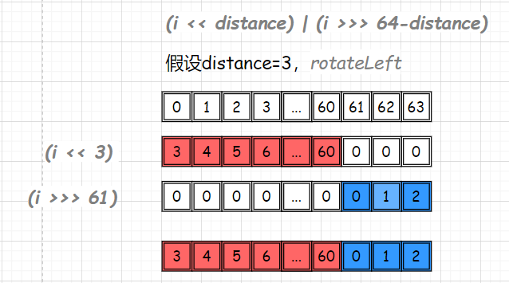

# Long
## signature
```java
public final class Long extends Number implements Comparable<Long>
```


## API
### variables
```java
@Native public static final long MIN_VALUE = 0x8000000000000000L;
@Native public static final long MAX_VALUE = 0x7fffffffffffffffL;
public static final Class<Long>     TYPE = (Class<Long>) Class.getPrimitiveClass("long");
@Native public static final int SIZE = 64;
public static final int BYTES = SIZE / Byte.SIZE;
```
- 取值范围 [-2<sup>63</sup>,2<sup>63</sup>-1]
- SIZE = 64 表示一个Long是64 bits
- BYTES = SIZE / Byte.SIZE= 64/8=8 个字节

### constructor
```java
public Long(long value) {
    this.value = value;
}

public Long(String s) throws NumberFormatException {
    this.value = parseLong(s, 10);
}
```
入参分别为long和String类型。String类型默认10进制解析。

### long parseLong(String s, int radix)
```java
public static long parseLong(String s, int radix) throws NumberFormatException {
    if (s == null) {
        throw new NumberFormatException("null");
    }
    if (radix < Character.MIN_RADIX) {
        throw new NumberFormatException("radix " + radix + " less than Character.MIN_RADIX");
    }
    if (radix > Character.MAX_RADIX) {
        throw new NumberFormatException("radix " + radix + " greater than Character.MAX_RADIX");
    }

    long result = 0;
    boolean negative = false;
    int i = 0, len = s.length();
    long limit = -Long.MAX_VALUE;
    long multmin;
    int digit;

    if (len > 0) {
        char firstChar = s.charAt(0);
        if (firstChar < '0') { // Possible leading "+" or "-"
            if (firstChar == '-') {
                negative = true;
                limit = Long.MIN_VALUE;
            } else if (firstChar != '+')
                throw NumberFormatException.forInputString(s);

            if (len == 1) // Cannot have lone "+" or "-"
                throw NumberFormatException.forInputString(s);
            i++;
        }
        multmin = limit / radix;
        while (i < len) {
            // Accumulating negatively avoids surprises near MAX_VALUE
            digit = Character.digit(s.charAt(i++),radix);
            if (digit < 0) {
                throw NumberFormatException.forInputString(s);
            }
            if (result < multmin) {
                throw NumberFormatException.forInputString(s);
            }
            result *= radix;
            if (result < limit + digit) {
                throw NumberFormatException.forInputString(s);
            }
            result -= digit;
        }
    } else {
        throw NumberFormatException.forInputString(s);
    }
    return negative ? result : -result;
}
```
这部分代码和Integer的int parseInt(String s, int radix)非常类似。参见 Integer.md

### long parseUnsignedLong(String s, int radix)
```java
public static long parseUnsignedLong(String s, int radix) throws NumberFormatException {
    if (s == null)  {
        throw new NumberFormatException("null");
    }

    int len = s.length();
    if (len > 0) {
        char firstChar = s.charAt(0);
        if (firstChar == '-') {
            throw new
                NumberFormatException(String.format("Illegal leading minus sign " +
                                                   "on unsigned string %s.", s));
        } else {
            if (len <= 12 || // Long.MAX_VALUE in Character.MAX_RADIX is 13 digits
                (radix == 10 && len <= 18) ) { // Long.MAX_VALUE in base 10 is 19 digits
                return parseLong(s, radix);
            }

            // No need for range checks on len due to testing above.
            long first = parseLong(s.substring(0, len - 1), radix);
            int second = Character.digit(s.charAt(len - 1), radix);
            if (second < 0) {
                throw new NumberFormatException("Bad digit at end of " + s);
            }
            long result = first * radix + second;
            if (compareUnsigned(result, first) < 0) {
                /*
                 * The maximum unsigned value, (2^64)-1, takes at
                 * most one more digit to represent than the
                 * maximum signed value, (2^63)-1.  Therefore,
                 * parsing (len - 1) digits will be appropriately
                 * in-range of the signed parsing.  In other
                 * words, if parsing (len -1) digits overflows
                 * signed parsing, parsing len digits will
                 * certainly overflow unsigned parsing.
                 *
                 * The compareUnsigned check above catches
                 * situations where an unsigned overflow occurs
                 * incorporating the contribution of the final
                 * digit.
                 */
                throw new NumberFormatException(String.format("String value %s exceeds " +
                                                              "range of unsigned long.", s));
            }
            return result;
        }
    } else {
        throw NumberFormatException.forInputString(s);
    }
}
```
- UnsignedLong不允许"-"为第一个字符
- 如果s数值较小，交给parseLong(s, radix)解析
```java
if (len <= 12 || // Long.MAX_VALUE in Character.MAX_RADIX is 13 digits
    (radix == 10 && len <= 18) ) { // Long.MAX_VALUE in base 10 is 19 digits
    return parseLong(s, radix);
}
```
- 对最后一个字符进行合法性检测
```java
int second = Character.digit(s.charAt(len - 1), radix);
if (second < 0) {
    throw new NumberFormatException("Bad digit at end of " + s);
}
```
- 最后判断一下是否溢出：compareUnsigned(result, first) < 0
> The maximum unsigned value, (2^64)-1, takes at most one more digit to represent than the maximum signed value, (2^63)-1.
> if parsing (len -1) digits overflows  signed parsing, parsing len digits will  certainly overflow unsigned parsing

> 最大的无符号值是(2^64)-1，最大的有符号值是(2^63)-1。如果有符号解析（len -1）位会溢出，那么无符号解析len位也一定会溢出。

### Long valueOf(long l)
```java
public static Long valueOf(long l) {
    final int offset = 128;
    if (l >= -128 && l <= 127) { // will cache
        return LongCache.cache[(int)l + offset];
    }
    return new Long(l);
}
```
缓存区间是 [-128,127]

#### LongCache 
```java
private static class LongCache {
    private LongCache(){}

    static final Long cache[] = new Long[-(-128) + 127 + 1];

    static {
        for(int i = 0; i < cache.length; i++)
            cache[i] = new Long(i - 128);
    }
}
```
- Long[] 数组长度为256，缓存区间上限不可像Integer cache那样调整。
- cache[0]=-128,...,cache[255]=127
   
### Long decode(String nm)
```java
public static Long decode(String nm) throws NumberFormatException {
    int radix = 10;
    int index = 0;
    boolean negative = false;
    Long result;

    if (nm.length() == 0)
        throw new NumberFormatException("Zero length string");
    char firstChar = nm.charAt(0);
    // Handle sign, if present
    if (firstChar == '-') {
        negative = true;
        index++;
    } else if (firstChar == '+')
        index++;

    // Handle radix specifier, if present
    if (nm.startsWith("0x", index) || nm.startsWith("0X", index)) {
        index += 2;
        radix = 16;
    }
    else if (nm.startsWith("#", index)) {
        index ++;
        radix = 16;
    }
    else if (nm.startsWith("0", index) && nm.length() > 1 + index) {
        index ++;
        radix = 8;
    }

    if (nm.startsWith("-", index) || nm.startsWith("+", index))
        throw new NumberFormatException("Sign character in wrong position");

    try {
        result = Long.valueOf(nm.substring(index), radix);
        result = negative ? Long.valueOf(-result.longValue()) : result;
    } catch (NumberFormatException e) {
        // If number is Long.MIN_VALUE, we'll end up here. The next line
        // handles this case, and causes any genuine format error to be
        // rethrown.
        String constant = negative ? ("-" + nm.substring(index))
                                   : nm.substring(index);
        result = Long.valueOf(constant, radix);
    }
    return result;
}
```
这部分解码逻辑非常类似于Integer的解码方法。
- 先处理"+"或"-"符号位
- 然后处理进制位 "0x" "0X" "#" "0"
- 进行正值的解析处理：`result = Long.valueOf(nm.substring(index), radix);`
- 补充符号位：`result = negative ? Long.valueOf(-result.longValue()) : result;`

### String toString()
```java
public String toString() {
    return toString(value);
}

public static String toString(long i) {
    if (i == Long.MIN_VALUE)
        return "-9223372036854775808";
    int size = (i < 0) ? stringSize(-i) + 1 : stringSize(i);
    char[] buf = new char[size];
    getChars(i, size, buf);
    return new String(buf, true);
}
```
这部分代码流程类似于Integer那边的处理，但是 stringSize 和 getChars 方法内部实现必然不一样。

#### int stringSize(long x) 
```java
// Requires positive x
static int stringSize(long x) {
    long p = 10;
    for (int i=1; i<19; i++) {//i=1,...18 最多循坏18次
        if (x < p) 
            return i;
        p = 10*p;//p每次递增10倍
    }
    return 19;//假如执行到这里，返回19
}
```
举例看一下流程的处理逻辑。
- 假设x=0...9 -> return 1
- 假设x=10...99 -> p=10*10=100 i++ -> p=100 i=2 ; x<p, return 2 
- 假设x=100...999 -> ... -> return 3
- ...
- 假设x=10 0000 0000 0000 0000 ... 99 9999 9999 9999 9999 -> return 18
- 假设x > 999 999 999 999 999 999，就会执行到最后一行 return 19 
```java
Dec 999 999 999 999 999 999

(2^63)-1 
= 9,223,372,036,854,775,807 
= ‭0111 1111 1111 1111 1111 1111 1111 1111 1111 1111 1111 1111 1111 1111 1111 1111‬
```
因为 long最大值 9,223,372,036,854,775,807 也就是19位而已。

#### void getChars(long i, int index, char[] buf)
```java
static void getChars(long i, int index, char[] buf) {
    long q;
    int r;
    int charPos = index;
    char sign = 0;

    if (i < 0) {
        sign = '-';
        i = -i;
    }

    // Get 2 digits/iteration using longs until quotient fits into an int
    while (i > Integer.MAX_VALUE) {
        q = i / 100;
        // really: r = i - (q * 100);
        r = (int)(i - ((q << 6) + (q << 5) + (q << 2)));
        i = q;
        buf[--charPos] = Integer.DigitOnes[r];
        buf[--charPos] = Integer.DigitTens[r];
    }

    // Get 2 digits/iteration using ints
    int q2;
    int i2 = (int)i;
    while (i2 >= 65536) {
        q2 = i2 / 100;
        // really: r = i2 - (q * 100);
        r = i2 - ((q2 << 6) + (q2 << 5) + (q2 << 2));
        i2 = q2;
        buf[--charPos] = Integer.DigitOnes[r];
        buf[--charPos] = Integer.DigitTens[r];
    }

    // Fall thru to fast mode for smaller numbers
    // assert(i2 <= 65536, i2);
    for (;;) {
        q2 = (i2 * 52429) >>> (16+3);
        r = i2 - ((q2 << 3) + (q2 << 1));  // r = i2-(q2*10) ...
        buf[--charPos] = Integer.digits[r];
        i2 = q2;
        if (i2 == 0) break;
    }
    if (sign != 0) {
        buf[--charPos] = sign;
    }
}
```
- 第一步：符号位预处理
```java
if (i < 0) {
    sign = '-';
    i = -i;
}
```
- 第二步：每次取2位进行迭代，直到商 <= Integer.MAX_VALUE
- 第三步：每次取2位进行迭代，直到商 < 65536
- 第四步：每次取1位进行迭代，直到结束

### int hashCode() 
```java
@Override
public int hashCode() {
    return Long.hashCode(value);
}

public static int hashCode(long value) {
    return (int)(value ^ (value >>> 32));
}
```
#### 原理说明
- value >>> 32，表示value无符号右移32位，得到
```
HHHH HHHH HHHH HHHH HHHH HHHH HHHH HHHH LLLL LLLL LLLL LLLL LLLL LLLL LLLL LLLL
=>
0000 0000 0000 0000 0000 0000 0000 0000 HHHH HHHH HHHH HHHH HHHH HHHH HHHH HHHH
```
- value ^ (value >>> 32)，^ 表示位进行异或操作。(相同取0，不同取1)
```java
  HHHH HHHH HHHH HHHH HHHH HHHH HHHH HHHH LLLL LLLL LLLL LLLL LLLL LLLL LLLL LLLL
^ 0000 0000 0000 0000 0000 0000 0000 0000 HHHH HHHH HHHH HHHH HHHH HHHH HHHH HHHH
---------------------------------------------------------------------------------
  HHHH HHHH HHHH HHHH HHHH HHHH HHHH HHHH ???? ???? ???? ???? ???? ???? ???? ???? 
```
- 新的高32位 = 旧的高32位
- 新的低32位 = 原来的高32位和原来的低位32位作异或运算

#### 举例说明
```java
Long l= 4_910_107_545_594_759_744L;
// ‭0100 0100 0010 0100 0011 0100 1100 1100| 0100 0000 0010 0100 0000 1010 0100 0000‬  原式
// ‭0000 0000 0000 0000 0000 0000 0000 0000| 0100 0100 0010 0100 0011 0100 1100 1100  右移32位 
// ‭0100 0100 0010 0100 0011 0100 1100 1100| 0000 0100 0000 0000 0011 1110 1000 1100  异或^
//                                          0000 0100 0000 0000 0011 1110 1000 1100  强转为(int)，取低32位
//                                          67124876                                 十进制
```
### boolean equals(Object obj)
```java
public boolean equals(Object obj) {
    if (obj instanceof Long) {
        return value == ((Long)obj).longValue();
    }
    return false;
}
```

### int compareTo(Long anotherLong)
```java
public int compareTo(Long anotherLong) {
    return compare(this.value, anotherLong.value);
}

public static int compare(long x, long y) {
    return (x < y) ? -1 : ((x == y) ? 0 : 1);
}
```
compare(long x, long y) 是有符号的比较。

### int compareUnsigned(long x, long y)
```java
public static int compareUnsigned(long x, long y) {
    return compare(x + MIN_VALUE, y + MIN_VALUE);
}
```
compareUnsigned(long x, long y)是无符号比较，两边同时加上MIN_VALUE。

### long divideUnsigned(long dividend, long divisor)
```java
public static long divideUnsigned(long dividend, long divisor) {
    if (divisor < 0L) { // signed comparison
        // Answer must be 0 or 1 depending on relative magnitude
        // of dividend and divisor.
        return (compareUnsigned(dividend, divisor)) < 0 ? 0L :1L;
    }

    if (dividend > 0) //  Both inputs non-negative
        return dividend/divisor;
    else {
        /*
         * For simple code, leveraging BigInteger.  Longer and faster
         * code written directly in terms of operations on longs is
         * possible; see "Hacker's Delight" for divide and remainder
         * algorithms.
         */
        return toUnsignedBigInteger(dividend).
            divide(toUnsignedBigInteger(divisor)).longValue();
    }
}
```
- 当 divisor < 0L
  - 假设 `long l = Long.divideUnsigned(1L, -2L)`, 那么 `compareUnsigned(dividend, divisor) =-1` 于是返回0
- 如果 divisor > 0L 并且 dividend > 0 ，进行常规除法 dividend/divisor
- 如果 divisor > 0L 并且 dividend < 0 , 参阅 Hacker's Delight。

### long remainderUnsigned(long dividend, long divisor)
```java
public static long remainderUnsigned(long dividend, long divisor) {
    if (dividend > 0 && divisor > 0) { // signed comparisons
        return dividend % divisor;
    } else {
        if (compareUnsigned(dividend, divisor) < 0) // Avoid explicit check for 0 divisor
            return dividend;
        else
            return toUnsignedBigInteger(dividend).
                remainder(toUnsignedBigInteger(divisor)).longValue();
    }
}
```
- dividend > 0 && divisor > 0 时，正常处理 dividend % divisor
- dividend 和 divisor 中至少有一个为负数，进行 compareUnsigned(dividend, divisor)
  - 如果 < 0 ,那么直接返回 dividend。
  - 如果 >=0 ,参阅 Hacker's Delight。

### 位移运算
下面这些方法基本需要参阅 Hacker's Delight
```java
long highestOneBit(long i)
long lowestOneBit(long i)
int numberOfLeadingZeros(long i)
int numberOfTrailingZeros(long i)
int bitCount(long i)
long rotateLeft(long i, int distance) //
long rotateRight(long i, int distance) 
long reverse(long i)
int signum(long i)
long reverseBytes(long i)
```
#### long rotateLeft(long i, int distance)
```java
public static long rotateLeft(long i, int distance) {
    return (i << distance) | (i >>> -distance);
}
```
向左循坏移位。distance为移动的位数。
- 从左手或高阶移出的位，在右侧或低阶重新进入。这就是循坏的含义。
- 负向左旋转等于右旋转：rotateLeft(val, -distance) == rotateRight(val, distance)。 
- 以64的任意倍数进行的旋转是空操作。因此向左移动 distance 的效果和向左移动 distance & 0x3F 的效果一样。
  - 0x3F = 0011 1111 = (2^6)-1 = 63 
  - 假设 distance =200，那么 distance & 0x3F = 200 & 0x3F = 8, 也就是说移动8位和移动200位效果一样。

根据上面的解释：(i >>> -distance) 等价于 (i >>> 64-distance)。因为这样容量理解。于是
```java
(i << distance) | (i >>> 64-distance)
```
的示意图是
