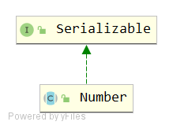

# Number
## 签名
```java
public abstract class Number implements java.io.Serializable
```


该类抽象了数值。

## API
```java
public abstract int intValue();
public abstract long longValue();
public abstract float floatValue();
public abstract double doubleValue();
public byte byteValue() {
    return (byte)intValue();
}
public short shortValue() {
    return (short)intValue();
}
```