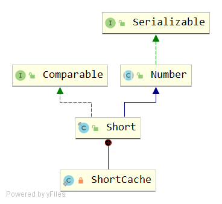

# Short
## Signature
```java
public final class Short extends Number implements Comparable<Short>
```


## API
### variables
```java
public static final short   MIN_VALUE = -32768;
public static final short   MAX_VALUE = 32767;
public static final Class<Short>    TYPE = (Class<Short>) Class.getPrimitiveClass("short");
public static final int SIZE = 16;
public static final int BYTES = SIZE / Byte.SIZE;
```
- 取值范围 [-2<sup>15</sup>,2<sup>15</sup>-1]
- SIZE = 16 表示一个 Short 是 16 bits
- BYTES = SIZE / Byte.SIZE=16/8=2个字节
### Constructor
```java
public Short(short value) {
    this.value = value;
}
public Short(String s) throws NumberFormatException {
    this.value = parseShort(s, 10);
}
```
入参分别是 short类型和String类型。String类型入参，默认10进制解析。
### short parseShort(String s, int radix)
```java
public static short parseShort(String s, int radix) throws NumberFormatException {
    int i = Integer.parseInt(s, radix);
    if (i < MIN_VALUE || i > MAX_VALUE)
        throw new NumberFormatException("Value out of range. Value:\"" + s + "\" Radix:" + radix);
    return (short)i;
}
```
调用的是Integer.parseInt(s, radix)来进行解析。

### String toString(short s)
```java
public static String toString(short s) {
    return Integer.toString((int)s, 10);
}
```
调用 Integer.toString(int i, int radix)进行解析

### Short valueOf(short s)
```java
public static Short valueOf(short s) {
    final int offset = 128;
    int sAsInt = s;
    if (sAsInt >= -128 && sAsInt <= 127) { // must cache
        return ShortCache.cache[sAsInt + offset];
    }
    return new Short(s);
}
```
缓存区间 [-128,127]

### Short decode(String nm)
```java
public static Short decode(String nm) throws NumberFormatException {
    int i = Integer.decode(nm);
    if (i < MIN_VALUE || i > MAX_VALUE)
        throw new NumberFormatException(
                "Value " + i + " out of range from input " + nm);
    return valueOf((short)i);
}
```
调用 Integer.decode(nm) 

### String toString()
```java
public String toString() {
    return Integer.toString((int)value);
}
```

### int hashCode()
```java
@Override
public int hashCode() {
    return Short.hashCode(value);
}

public static int hashCode(short value) {
    return (int)value;
}
```
直接返回(int)value作为hashCode

### boolean equals(Object obj)
```java
public boolean equals(Object obj) {
    if (obj instanceof Short) {
        return value == ((Short)obj).shortValue();
    }
    return false;
}
```

### int compareTo(Short anotherShort)
```java
public int compareTo(Short anotherShort) {
    return compare(this.value, anotherShort.value);
}
public static int compare(short x, short y) {
    return x - y;
}
```
the value 0 if x == y;a value less than 0 if x < y; and a value greater than 0 if x > y

### short reverseBytes(short i)
```java
public static short reverseBytes(short i) {
    return (short) (((i & 0xFF00) >> 8) | (i << 8));
}
```
- `>>`表示有符号右移，`<<`表示有符号左移。
- 假设之前数i二进制表示为：AAAABBBB
- (i & 0xFF00)表示取高8位；((i & 0xFF00) >> 8)表示然后右移8位，也就是将高8位移动到低8位。记为数0000AAAA
- (i << 8)表示左移8位，也就是将低8位移动到高8位。记为数BBBB0000
- (((i & 0xFF00) >> 8) | (i << 8)) 中 | 表示或运算，过程如下
```
  0000AAAA
| BBBB0000
----------
  BBBBAAAA

或

  1111AAAA
| BBBB0000
----------
  BBBBAAAA
```
### int toUnsignedInt(short x)
```java
public static int toUnsignedInt(short x) {
    return ((int) x) & 0xffff;
}
```
- 无符号转换为int：int的高16位为零，而低16位与short参数的位相等。 
- 零个和正的short值被映射为一个数值相等的int值，负的short值被映射为一个等于输入值加上2^16的int值。

### long toUnsignedLong(short x)
```java
public static long toUnsignedLong(short x) {
    return ((long) x) & 0xffffL;
}
```
- 无符号转换为long：long的高阶48位为零，而低阶16位等于short参数的位。 
- 0和正的short值被映射为一个数值相等的long值，负的short值被映射为一个等于输入值加2^16的long值。