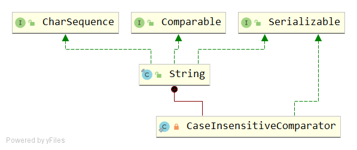

# String
## 类签名
```java
public final class String
    implements java.io.Serializable, Comparable<String>, CharSequence
```


String 类有 final 修饰
## API
### 变量
```java
private final char value[];
private int hash; // Default to 0

public static final Comparator<String> CASE_INSENSITIVE_ORDER = new CaseInsensitiveComparator();

private static final ObjectStreamField[] serialPersistentFields = new ObjectStreamField[0];
```
- char value[] 
  - char[] 作为String的背后数据结构
- CASE_INSENSITIVE_ORDER
  - 一个由compareToIgnoreCase排序String对象的比较器。该比较器是可序列化。
  - 该比较器未考虑locale环境，会导致某些locale环境的排序不符合期望。java.text包提供了Collators以允许对locale环境敏感的排序。
- serialPersistentFields
  - String 类在序列化流协议中是特殊情况。根据对象序列化规范第6.2节“流元素”，将String实例写入ObjectOutputStream中。
  
### 构造方法
```java
public java.lang.String();
public java.lang.String(java.lang.String);
public java.lang.String(char[]);
public java.lang.String(char[], int, int);
public java.lang.String(int[], int, int);
public java.lang.String(byte[], int, int, int); // @Deprecated
public java.lang.String(byte[], int);// @Deprecated
public java.lang.String(byte[], int, int, java.lang.String) throws java.io.UnsupportedEncodingException;
public java.lang.String(byte[], int, int, java.nio.charset.Charset);
public java.lang.String(byte[], java.lang.String) throws java.io.UnsupportedEncodingException;
public java.lang.String(byte[], java.nio.charset.Charset);
public java.lang.String(byte[], int, int);
public java.lang.String(byte[]);
public java.lang.String(java.lang.StringBuffer);
public java.lang.String(java.lang.StringBuilder);
java.lang.String(char[], boolean);
```
可见有很多String的构造函数。
#### public String()
```java
public String() {
    this.value = "".value;
}
```
""初始化value

#### public String(String original)
```java
public String(String original) {
    this.value = original.value;
    this.hash = original.hash;
}
```
入参为String类型，复制String的value和hash值到内部value。

#### public String(char value[])
```java
public String(char value[]) {
    this.value = Arrays.copyOf(value, value.length);
}
```
入参为char[]类型，使用Arrays.copyOf进行复制。
#### public String(int[] codePoints, int offset, int count)
```java
public String(int[] codePoints, int offset, int count) {
    if (offset < 0) {
        throw new StringIndexOutOfBoundsException(offset);
    }
    if (count <= 0) {
        if (count < 0) {
            throw new StringIndexOutOfBoundsException(count);
        }
        if (offset <= codePoints.length) {
            this.value = "".value;
            return;
        }
    }
    // Note: offset or count might be near -1>>>1.
    if (offset > codePoints.length - count) { // 这样易于理解：offset + count > codePoints.length 
        throw new StringIndexOutOfBoundsException(offset + count);
    }

    final int end = offset + count; // end为终点index，但不包含end

    // Pass 1: Compute precise size of char[]
    int n = count;
    for (int i = offset; i < end; i++) {
        int c = codePoints[i];
        if (Character.isBmpCodePoint(c))
            continue;
        else if (Character.isValidCodePoint(c)) 
            n++;
        else throw new IllegalArgumentException(Integer.toString(c));
    }

    // Pass 2: Allocate and fill in char[]
    final char[] v = new char[n];

    for (int i = offset, j = 0; i < end; i++, j++) {
        int c = codePoints[i];
        if (Character.isBmpCodePoint(c))
            v[j] = (char)c;
        else
            Character.toSurrogates(c, v, j++);
    }

    this.value = v;
}
```
- 作用：分配一个新的String，该字符串包含Unicode code points数组参数的子数组中的字符。
- 入参说明
  - codePoints - Unicode code points 源数组
  - offset - 偏移量，复制的开始位置
  - count - 复制长度
- 代码解析
```java
// Pass 1: Compute precise size of char[]
int n = count;
for (int i = offset; i < end; i++) {
    int c = codePoints[i];
    if (Character.isBmpCodePoint(c))
        continue;
    else if (Character.isValidCodePoint(c)) 
        n++;
    else throw new IllegalArgumentException(Integer.toString(c));
}
```
> 区分 BmpCodePoint 和 ValidCodePoint

如果指定的字符在基本多语言平面BMP中，可使用单个char表示这个代码点。ValidCodePoint 指 Unicode code point value。
n初始值为入参count，上面代码在遇到code point等于ValidCodePoint时，将n++。最终n等于char[]的实际长度。

```java
// Pass 2: Allocate and fill in char[]
final char[] v = new char[n];

for (int i = offset, j = 0; i < end; i++, j++) {
    int c = codePoints[i];
    if (Character.isBmpCodePoint(c))
        v[j] = (char)c;
    else
        Character.toSurrogates(c, v, j++);
}
```
开辟精确长度的新的char[]后，开始遍历
- 如果code point为BMP，那么直接转为char，然后赋值
- 如果不为BMP，那么调用 Character.toSurrogates(c, v, j++)
```java
static void toSurrogates(int codePoint, char[] dst, int index) {
    // We write elements "backwards" to guarantee all-or-nothing
    dst[index+1] = lowSurrogate(codePoint);
    dst[index] = highSurrogate(codePoint);
}
```

#### StringCoding.decode(charsetName, bytes, offset, length)
```java
public java.lang.String(byte[], int, int, java.lang.String) throws java.io.UnsupportedEncodingException;
public java.lang.String(byte[], int, int, java.nio.charset.Charset);
public java.lang.String(byte[], java.lang.String) throws java.io.UnsupportedEncodingException;
public java.lang.String(byte[], java.nio.charset.Charset);
public java.lang.String(byte[], int, int);
public java.lang.String(byte[]);
```
上面这些以byte[]为第一个入参的方法都会调用 StringCoding.decode(charsetName, bytes, offset, length)。

#### public String(StringBuffer buffer)
```java
public String(StringBuffer buffer) {
    synchronized(buffer) {
        this.value = Arrays.copyOf(buffer.getValue(), buffer.length());
    }
}
```
这里为什么对入参buffer加了同步 synchronized ？

#### public String(StringBuilder builder)
```java
public String(StringBuilder builder) {
    this.value = Arrays.copyOf(builder.getValue(), builder.length());
}
```
提供此构造函数是为了简化StringBuilder迁移到String。从string builder通过toString方法获取字符串可能会运行得更快，通常是首选。

### int length()
```java
public int length() {
    return value.length;
}
```

### boolean isEmpty()
```java
public boolean isEmpty() {
    return value.length == 0;
}
```
### char charAt(int index)
```java
public char charAt(int index) {
    if ((index < 0) || (index >= value.length)) {
        throw new StringIndexOutOfBoundsException(index);
    }
    return value[index];
}
```
> 如果index指定的char值是surrogate，则返回该surrogate值。

### int codePointAt(int index)
```java
public int codePointAt(int index) {
    if ((index < 0) || (index >= value.length)) {
        throw new StringIndexOutOfBoundsException(index);
    }
    return Character.codePointAtImpl(value, index, value.length);
}
```

### getChars(int srcBegin, int srcEnd, char dst[], int dstBegin)
```java
public void getChars(int srcBegin, int srcEnd, char dst[], int dstBegin) {
    if (srcBegin < 0) {
        throw new StringIndexOutOfBoundsException(srcBegin);
    }
    if (srcEnd > value.length) {
        throw new StringIndexOutOfBoundsException(srcEnd);
    }
    if (srcBegin > srcEnd) {
        throw new StringIndexOutOfBoundsException(srcEnd - srcBegin);
    }
    System.arraycopy(value, srcBegin, dst, dstBegin, srcEnd - srcBegin);
}
```
将字符串中的字符复制到目标字符数组中。

下面是非法入参：
- srcBegin < 0
- srcEnd > value.length
- srcBegin > srcEnd
---
- 要复制的第一个字符在索引srcBegin处；最后要复制的字符位于索引srcEnd-1（因此，要复制的字符总数为srcEnd-srcBegin）。 
- 将字符复制到dst的子数组中，该子数组从索引dstBegin开始并以索引结束：dstBegin +（srcEnd-srcBegin）-1 

### boolean equals(Object anObject)
```java
public boolean equals(Object anObject) {
    if (this == anObject) {
        return true;
    }
    if (anObject instanceof String) {
        String anotherString = (String)anObject;
        int n = value.length;
        if (n == anotherString.value.length) {
            char v1[] = value;
            char v2[] = anotherString.value;
            int i = 0;
            while (n-- != 0) {
                if (v1[i] != v2[i])
                    return false;
                i++;
            }
            return true;
        }
    }
    return false;
}
```
- 如果anObject =this，那么相等
- 如果anObject是String类型，并且长度和this的长度相等，那么对这两个String进行同步遍历
  - 当且仅当，两个String相同位置对应的字符都相等时，认为相等。
- 否则，认为不相等。

### boolean contentEquals(StringBuffer sb)
```java
public boolean contentEquals(StringBuffer sb) {
    return contentEquals((CharSequence)sb);
}
```
将 StringBuffer 转化为 (CharSequence)sb ，再比较。

#### boolean contentEquals(CharSequence cs)
```java
public boolean contentEquals(CharSequence cs) {
    // Argument is a StringBuffer, StringBuilder
    if (cs instanceof AbstractStringBuilder) {
        if (cs instanceof StringBuffer) {
            synchronized(cs) {
               return nonSyncContentEquals((AbstractStringBuilder)cs);
            }
        } else {
            return nonSyncContentEquals((AbstractStringBuilder)cs);
        }
    }
    // Argument is a String
    if (cs instanceof String) {
        return equals(cs);
    }
    // Argument is a generic CharSequence
    char v1[] = value;
    int n = v1.length;
    if (n != cs.length()) {
        return false;
    }
    for (int i = 0; i < n; i++) {
        if (v1[i] != cs.charAt(i)) {
            return false;
        }
    }
    return true;
}
```
- 如果CharSequence是StringBuffer，则该方法将在其上同步,然后调用 nonSyncContentEquals
- 如果CharSequence是StringBuilder，不同步, 然后调用 nonSyncContentEquals
- 如果CharSequence是String，调用 equals
- 如果CharSequence是generic CharSequence，则需要进行跟equals类似的比较逻辑。
  - 判断长度是否相等
  - 判断相同位置的字符是否都相等

#### boolean nonSyncContentEquals(AbstractStringBuilder sb)
```java
private boolean nonSyncContentEquals(AbstractStringBuilder sb) {
    char v1[] = value;
    char v2[] = sb.getValue();
    int n = v1.length;
    if (n != sb.length()) {
        return false;
    }
    for (int i = 0; i < n; i++) {
        if (v1[i] != v2[i]) {
            return false;
        }
    }
    return true;
}
```
判断长度和相同位置的每个字符，如果都满足，那么认为相等。
### boolean equalsIgnoreCase(String anotherString)
```java
public boolean equalsIgnoreCase(String anotherString) {
    return (this == anotherString) ? true
            : (anotherString != null)
            && (anotherString.value.length == value.length)
            && regionMatches(true, 0, anotherString, 0, value.length);
}
```
- 如果this == anotherString，返回true
- 否则，需要满足三个条件才认为相等：
  - anotherString != null。
  - 两者长度相等。
  - 相同位置的每个字符区域相等。
               
### boolean regionMatches(boolean ignoreCase, int toffset, String other, int ooffset, int len)
```java
public boolean regionMatches(boolean ignoreCase, int toffset,
        String other, int ooffset, int len) {
    char ta[] = value;
    int to = toffset;
    char pa[] = other.value;
    int po = ooffset;
    // Note: toffset, ooffset, or len might be near -1>>>1.
    if ((ooffset < 0) || (toffset < 0)
            || (toffset > (long)value.length - len)
            || (ooffset > (long)other.value.length - len)) {
        return false;
    }
    while (len-- > 0) {
        char c1 = ta[to++];
        char c2 = pa[po++];
        if (c1 == c2) {
            continue;
        }
        if (ignoreCase) {
            // If characters don't match but case may be ignored,
            // try converting both characters to uppercase.
            // If the results match, then the comparison scan should
            // continue.
            char u1 = Character.toUpperCase(c1);
            char u2 = Character.toUpperCase(c2);
            if (u1 == u2) {
                continue;
            }
            // Unfortunately, conversion to uppercase does not work properly
            // for the Georgian alphabet, which has strange rules about case
            // conversion.  So we need to make one last check before
            // exiting.
            if (Character.toLowerCase(u1) == Character.toLowerCase(u2)) {
                continue;
            }
        }
        return false;
    }
    return true;
}
```
当且仅当以下至少一项为true时，结果为false：
- toffset为负。
- ooffset为负。
- toffset + len大于此String对象的长度。
- ooffset + len大于另一个参数的长度。
- ignoreCase为false，并且存在一些小于len的非负整数k，使得：
this.charAt（toffset + k）！= other.charAt（ooffset + k）ignoreCase是true，
- 存在一些非负整数k（k<len）使得：
  - Character.toLowerCase(this.charAt(toffset+k)) != Character.toLowerCase(other.charAt(ooffset+k))
  - 并且：
  - Character.toUpperCase(this.charAt(toffset+k)) != Character.toUpperCase(other.charAt(ooffset+k))

### boolean regionMatches(int toffset, String other, int ooffset, int len)
```java
public boolean regionMatches(int toffset, String other, int ooffset, int len) {
    char ta[] = value;
    int to = toffset;
    char pa[] = other.value;
    int po = ooffset;
    // Note: toffset, ooffset, or len might be near -1>>>1.
    if ((ooffset < 0) || (toffset < 0)
            || (toffset > (long)value.length - len)
            || (ooffset > (long)other.value.length - len)) {
        return false;
    }
    while (len-- > 0) {
        if (ta[to++] != pa[po++]) {
            return false;
        }
    }
    return true;
}
```
这个方法没有boolean ignoreCase入参。

### int compareTo(String anotherString)
```java
public int compareTo(String anotherString) {
    int len1 = value.length;
    int len2 = anotherString.value.length;
    int lim = Math.min(len1, len2);//两者长度中较小的一个 -> 作为遍历的最大次数
    char v1[] = value;
    char v2[] = anotherString.value;

    int k = 0;
    while (k < lim) {
        char c1 = v1[k];
        char c2 = v2[k];
        if (c1 != c2) {
            return c1 - c2;//某相同位置的字母差
        }
        k++;
    }
    return len1 - len2;//长度差
}
```
### int compareToIgnoreCase(String str)
```java
public int compareToIgnoreCase(String str) {
    return CASE_INSENSITIVE_ORDER.compare(this, str);
}
```
#### CaseInsensitiveComparator
```java
private static class CaseInsensitiveComparator
        implements Comparator<String>, java.io.Serializable {
    // use serialVersionUID from JDK 1.2.2 for interoperability
    private static final long serialVersionUID = 8575799808933029326L;

    public int compare(String s1, String s2) {
        int n1 = s1.length();
        int n2 = s2.length();
        int min = Math.min(n1, n2);
        for (int i = 0; i < min; i++) {
            char c1 = s1.charAt(i);
            char c2 = s2.charAt(i);
            if (c1 != c2) {
                c1 = Character.toUpperCase(c1);
                c2 = Character.toUpperCase(c2);
                if (c1 != c2) {
                    c1 = Character.toLowerCase(c1);
                    c2 = Character.toLowerCase(c2);
                    if (c1 != c2) {
                        // No overflow because of numeric promotion
                        return c1 - c2;
                    }
                }
            }
        }
        return n1 - n2;
    }

    /** Replaces the de-serialized object. */
    private Object readResolve() { return CASE_INSENSITIVE_ORDER; }
}
```
- CaseInsensitiveComparator 实现Comparator接口，是外排序。重写 int compare(String s1, String s2) 方法。
不区分大小写的String比较逻辑
- 取两者中长度较小的值，作为遍历比较的次数
- 比较相同位置的char，
  - 如果char不相同，检测toUpperCase是否相等。
  - 如果toUpperCase不相等，检测toLowerCase是否相等。
  - 如果toLowerCase不相等，那么可以下结论：这个位置的字符在不区分大小写的情况下还是不相等。返回c1-c2的差值。
- 如果经历了for循坏后，并没有return。代表相同位置的字符都是相等的，这时有两个情况
  - case1：len1=len2 ，那么return 0，也就是return len1-len2
  - case2：len1!=len2，那么返回他们长度的差值 len1-len2
  - 合并起来，就是return len1-len2
   
### boolean startsWith(String prefix, int toffset)
```java
public boolean startsWith(String prefix, int toffset) {
    char ta[] = value;
    int to = toffset;
    char pa[] = prefix.value;//要查找的子字符
    int po = 0;
    int pc = prefix.value.length;
    // Note: toffset might be near -1>>>1.
    if ((toffset < 0) || (toffset > value.length - pc)) {
        return false;
    }
    while (--pc >= 0) {
        if (ta[to++] != pa[po++]) {
            return false;
        }
    }
    return true;
}
```
入参说明
- prefix - 前缀
- toffset - 寻找这个字符串的开始index

代码逻辑
- 遍历比较的次数为prefix.value.length
- 遍历是，如果对应位置的字符不相等，返回false
#### boolean startsWith(String prefix)
```java
public boolean startsWith(String prefix) {
    return startsWith(prefix, 0);
}
```
toffset=0

#### boolean endsWith(String suffix)
```java
public boolean endsWith(String suffix) {
    return startsWith(suffix, value.length - suffix.value.length);
}
```
toffset = value.length - suffix.value.length

### int hashCode()
```java
public int hashCode() {
    int h = hash;// hash 初始为0
    if (h == 0 && value.length > 0) {
        char val[] = value;

        for (int i = 0; i < value.length; i++) {
            h = 31 * h + val[i];// 迭代计算公式
        }
        hash = h;//缓存计算结果到hash变量，下次就不会再次计算h。
    }
    return h;
}
```

### int indexOf(int ch, int fromIndex)
```java
public int indexOf(int ch, int fromIndex) {
    final int max = value.length;
    // fromIndex合法性检测
    if (fromIndex < 0) {
        fromIndex = 0;
    } else if (fromIndex >= max) {
        // Note: fromIndex might be near -1>>>1.
        return -1;
    }

    if (ch < Character.MIN_SUPPLEMENTARY_CODE_POINT) {
        // handle most cases here (ch is a BMP code point or a
        // negative value (invalid code point))
        final char[] value = this.value;
        for (int i = fromIndex; i < max; i++) {
            if (value[i] == ch) {
                return i;
            }
        }
        return -1;
    } else {
        return indexOfSupplementary(ch, fromIndex);
    }
}
```
- if (ch < Character.MIN_SUPPLEMENTARY_CODE_POINT)，走入常见的BMP遍历查找逻辑
- 否则，进入 indexOfSupplementary(ch, fromIndex);

### int lastIndexOf(int ch, int fromIndex) 
```java
public int lastIndexOf(int ch, int fromIndex) {
    if (ch < Character.MIN_SUPPLEMENTARY_CODE_POINT) {
        // handle most cases here (ch is a BMP code point or a
        // negative value (invalid code point))
        final char[] value = this.value;
        int i = Math.min(fromIndex, value.length - 1);
        for (; i >= 0; i--) {
            if (value[i] == ch) {
                return i;
            }
        }
        return -1;
    } else {
        return lastIndexOfSupplementary(ch, fromIndex);
    }
}
```
- int i = Math.min(fromIndex, value.length - 1); 这步减少了一点遍历的次数。当然int i= value.length - 1也是可以的。
- 遍历方向从右往左，直到i=0。

### int indexOf(String str)
```java
public int indexOf(String str) {
    return indexOf(str, 0);
}
```
#### int indexOf(String str, int fromIndex)
```java
public int indexOf(String str, int fromIndex) {
    return indexOf(value, 0, value.length,
            str.value, 0, str.value.length, fromIndex);
}
```
```java
static int indexOf(char[] source, int sourceOffset, int sourceCount,
        char[] target, int targetOffset, int targetCount,
        int fromIndex) { 
    // 如果开始查找位置大于等于 source字符串的长度，则当target字符串为空，返回字符串的长度，否则返回-1
    if (fromIndex >= sourceCount) {
        return (targetCount == 0 ? sourceCount : -1);
    }
   // 如果开始查找位置小于0，则开始查找位置等于0
    if (fromIndex < 0) {
        fromIndex = 0;
    }
   // 如果查找字符串长度为0，则返回初始查找位置，此位置大于等于0
    if (targetCount == 0) {
        return fromIndex;
    }

    char first = target[targetOffset];
    int max = sourceOffset + (sourceCount - targetCount);

    // i的范围: [sourceOffset + fromIndex, sourceOffset + (sourceCount - targetCount))
    for (int i = sourceOffset + fromIndex; i <= max; i++) {
        /* Look for first character. */
        //在source字符串中，找到target第一个字符，赋值给i
        if (source[i] != first) {
            while (++i <= max && source[i] != first);
        }

        /* Found first character, now look at the rest of v2 */
        if (i <= max) {
            int j = i + 1;
            int end = j + targetCount - 1; //得到目标字符串其余的长度，标记为end
            for (int k = targetOffset + 1; j < end && source[j]
                    == target[k]; j++, k++);

            if (j == end) { //源字符串中匹配到目标字符串，匹配结束
                /* Found whole string. */
                return i - sourceOffset;// 假设 sourceOffset =0 ，那么返回i，比较容易理解
            }
        }
    }
    return -1;
}
```
> 注意，indexOf(String str) 不使用 KMP 算法
- String和StringBuffer共享的代码以进行搜索。source是要搜索的字符数组，而target是要搜索的字符串。
```
spurce–正在搜索的字符串。
sourceOffset –源字符串的偏移量。
sourceCount –源字符串的计数。
target–搜索的字符串。
targetOffset –目标字符串的偏移量。
targetCount –目标字符串的计数。
fromIndex –开始搜索的索引。
```

### String substring(int beginIndex)
```java
public String substring(int beginIndex) {
    if (beginIndex < 0) {
        throw new StringIndexOutOfBoundsException(beginIndex);
    }
    int subLen = value.length - beginIndex;
    if (subLen < 0) {
        throw new StringIndexOutOfBoundsException(subLen);
    }
    return (beginIndex == 0) ? this : new String(value, beginIndex, subLen);
}
```
- new String(value, beginIndex, subLen) 表示从beginIndex开始，复制value.length - beginIndex个字符。

### substring(int beginIndex, int endIndex)
```java
public String substring(int beginIndex, int endIndex) {
    if (beginIndex < 0) {
        throw new StringIndexOutOfBoundsException(beginIndex);
    }
    if (endIndex > value.length) {
        throw new StringIndexOutOfBoundsException(endIndex);
    }
    int subLen = endIndex - beginIndex;
    if (subLen < 0) {
        throw new StringIndexOutOfBoundsException(subLen);
    }
    return ((beginIndex == 0) && (endIndex == value.length)) ? this
            : new String(value, beginIndex, subLen);
}
```
- ((beginIndex == 0) && (endIndex == value.length)) ? this 处理最简单的情况
- new String(value, beginIndex, subLen) 从beginIndex开始复制，复制endIndex - beginIndex个字符。
  - 假设 beginIndex =2，endIndex=7，那么subLen=7-2=5，从s[2]...到s[6]，一共5个字符。

### String concat(String str)
```java
public String concat(String str) {
    int otherLen = str.length();
    if (otherLen == 0) {
        return this;
    }
    int len = value.length;
    char buf[] = Arrays.copyOf(value, len + otherLen);
    str.getChars(buf, len);
    return new String(buf, true);
}
```
- char buf[] = Arrays.copyOf(value, len + otherLen); 开辟 len + otherLen 长度的char[] 并先把value复制过去
- str.getChars(buf, len);
```java
/**
 * Copy characters from this string into dst starting at dstBegin.
 * This method doesn't perform any range checking.
 */
void getChars(char dst[], int dstBegin) {
    System.arraycopy(value, 0, dst, dstBegin, value.length);
}
```
从buf[]的len位置开始，将入参str的所有字符逐个复制到buf[]末尾。最后new String对象返回。

### String replace(char oldChar, char newChar)
```java
public String replace(char oldChar, char newChar) {
    if (oldChar != newChar) {
        int len = value.length;
        int i = -1;
        char[] val = value; /* avoid getfield opcode */

        while (++i < len) { //i=0,...,len-1
            if (val[i] == oldChar) {
                break;
            }
        }
        if (i < len) {
            char buf[] = new char[len];
            for (int j = 0; j < i; j++) {// copy val[0...i-1] -> buf[0...i-1] 这部分是不需要进行替换的部分。
                buf[j] = val[j];
            }
            
            // i...len-1 这部分是可能需要进行替换的部分。
            while (i < len) {
                char c = val[i];
                buf[i] = (c == oldChar) ? newChar : c;
                i++;
            }
            return new String(buf, true);
        }
    }
    return this;
}
```
- 前面的while 循环先找到第一个需要进行字符替换的位置i。那么这个字符前面的所有字符都不需要替换，直接复制过去。对应 0...i-1
- i...len-1 这部分是可能需要进行替换的部分。遍历时进行判断，然后替换。
- 最后 new String返回。再次体现String的不可变性。

### boolean matches(String regex)
```java
public boolean matches(String regex) {
    return Pattern.matches(regex, this);
}
```
内部调用层级很深，理解是正则匹配即可。

### boolean contains(CharSequence s)
```java
public boolean contains(CharSequence s) {
    return indexOf(s.toString()) > -1;
}
```
### String join(CharSequence delimiter, CharSequence... elements)
```java
public static String join(CharSequence delimiter, CharSequence... elements) {
    Objects.requireNonNull(delimiter);
    Objects.requireNonNull(elements);
    // Number of elements not likely worth Arrays.stream overhead.
    StringJoiner joiner = new StringJoiner(delimiter);
    for (CharSequence cs: elements) {
        joiner.add(cs);
    }
    return joiner.toString();
}
```
注释：元素数量可能不值得使用Arrays.stream的开销。因此实现使用了StringJoiner来遍历拼接。

### String trim()
```java
public String trim() {
    int len = value.length;
    int st = 0;
    char[] val = value;    /* avoid getfield opcode */

    while ((st < len) && (val[st] <= ' ')) {//st表示从左到右，跳过空字符
        st++;
    }
    while ((st < len) && (val[len - 1] <= ' ')) {//st表示从右往左，跳过空字符
        len--;
    }
    return ((st > 0) || (len < value.length)) ? substring(st, len) : this;
}
```    
- (st > 0) || (len < value.length) 表示最左边或者最右边存在空白字符，调用substring(st, len)
- 否则，表示原来的value最左边或者最右边不存在空白字符，直接返回this
    
### char[] toCharArray()
```java
public char[] toCharArray() {
    // Cannot use Arrays.copyOf because of class initialization order issues
    char result[] = new char[value.length];
    System.arraycopy(value, 0, result, 0, value.length);
    return result;
}
```  
> Cannot use Arrays.copyOf because of class initialization order issues
   
不能使用Arrays.copyOf，因为类初始化顺序的问题。

### valueOf
#### String valueOf(Object obj)
```java
public static String valueOf(Object obj) {
    return (obj == null) ? "null" : obj.toString();
}
```
#### String valueOf(char data[])
```java
public static String valueOf(char data[]) {
    return new String(data);
}
```
#### String valueOf(char data[], int offset, int count)
```java
public static String valueOf(char data[], int offset, int count) {
    return new String(data, offset, count);
}
```
#### String valueOf(boolean b)
```java
public static String valueOf(boolean b) {
    return b ? "true" : "false";
}
```
#### String valueOf(char c)
```java
public static String valueOf(char c) {
    char data[] = {c};//char -> char[]
    return new String(data, true);
}
```
#### String valueOf(int i)
```java
public static String valueOf(int i) {
    return Integer.toString(i);
}
```
#### String valueOf(long l)
```java
public static String valueOf(long l) {
    return Long.toString(l);
}
```
#### String valueOf(float f) 
```java
public static String valueOf(float f) {
    return Float.toString(f);
}
```

#### String valueOf(double d)
```java
public static String valueOf(double d) {
    return Double.toString(d);
}
```

### String intern()
```java
public native String intern();
```
- 最初为空的字符串池由String类私有维护。
- 调用intern方法时，如果池已经包含等于此String对象的字符串（由equals(Object)方法确定），则返回池中的字符串。 
否则，将此String对象添加到池中，并返回对此String对象的引用。
- 对于任何两个字符串s和t，当且仅当s.equals(t)为true时，s.intern() == t.intern()才为true。
   
## 说明
- String 是常量，值创建后无法更改，可以共享。StringBuffer支持可变字符串。
- 除非另有说明，将null参数传递给此类中的构造函数或方法将导致引发NullPointerException。
- 一个 String 表示UTF-16格式的字符串，其中补充字符由surrogate pairs表示（参见Character类中的Unicode字符表示部分）。 
索引值是指char code单位，一个补充字符在String中使用两个position。
- 除了提供处理Unicode代码单元（即char）的方法外，还提供用于处理Unicode代码点（即characters）的方法。

