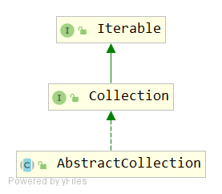
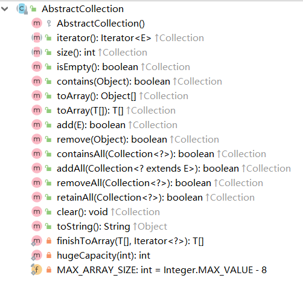

# AbstractCollection

## 签名
```java
public abstract class AbstractCollection<E> implements Collection<E>
```


## API


### 构造函数
```
/**
 * Sole constructor.  (For invocation by subclass constructors, typically
 * implicit.)
 */
protected AbstractCollection() {
}
```
### 抽象方法
```
public abstract Iterator<E> iterator();
public abstract int size();
```
### isEmpty()
```java
public boolean isEmpty() {
    return size() == 0;
}
```
### contains(Object o)
```
public boolean contains(Object o) {
    Iterator<E> it = iterator();
    if (o==null) {
        while (it.hasNext())
            if (it.next()==null)
                return true;
    } else {
        while (it.hasNext())
            if (o.equals(it.next()))
                return true;
    }
    return false;
}
```
很仔细地处理了当入参为null的情况：当入参为null，假如集合中有元素为null，则认为包含。

### toArray()
```java
public Object[] toArray() {
    // Estimate size of array; be prepared to see more or fewer elements
    Object[] r = new Object[size()]; //根据长度创建等长的Object[] r
    Iterator<E> it = iterator();
    for (int i = 0; i < r.length; i++) {//迭代复制到上面的Object[] r
        if (! it.hasNext()) // fewer elements than expected
            return Arrays.copyOf(r, i);
        r[i] = it.next();
    }
    return it.hasNext() ? finishToArray(r, it) : r;//再次检查it是否还有后续元素，如果是则执行finishToArray(r, it)；否则直接返回r
}
```
finishToArray(r, it)是考虑到该集合的大小在迭代过程中发生更改（如果该集合允许在迭代过程中进行并发修改）。 

### toArray(T[] a)
```java
public <T> T[] toArray(T[] a) {
    // Estimate size of array; be prepared to see more or fewer elements
    int size = size();
    // 取入参数组的元素类型，取入参数组长度和该集合本身长度中最大者作为结果数组的长度
    T[] r = a.length >= size ? a :
              (T[])java.lang.reflect.Array
              .newInstance(a.getClass().getComponentType(), size);
    Iterator<E> it = iterator();

    for (int i = 0; i < r.length; i++) {
        if (! it.hasNext()) { // fewer elements than expected
            if (a == r) {//猜测：a==r表示迭代器一开始就没有元素，设置r[0]=null，原路返回a
                r[i] = null; // null-terminate
            } else if (a.length < i) {// a长度小于集合长度，那么复制数组r，之后返回
                return Arrays.copyOf(r, i);
            } else {
                // 此分支，表示a长度 >= 结果数组r长度i，当复制完集合的元素后，a后面的空位置补为null
                System.arraycopy(r, 0, a, 0, i);
                if (a.length > i) {
                    a[i] = null;
                }
            }
            return a;
        }
        r[i] = (T)it.next();
    }
    // more elements than expected
    return it.hasNext() ? finishToArray(r, it) : r;
}
```
### finishToArray(T[] r, Iterator<?> it)
```java
private static <T> T[] finishToArray(T[] r, Iterator<?> it) {
    int i = r.length;
    while (it.hasNext()) {
        int cap = r.length;
        if (i == cap) {
            // 数组扩容机制。具体扩容的参数可以先跳过
            int newCap = cap + (cap >> 1) + 1;
            // overflow-conscious code
            if (newCap - MAX_ARRAY_SIZE > 0)
                newCap = hugeCapacity(cap + 1);
            
            r = Arrays.copyOf(r, newCap);
        }
        // 迭代复制后续元素到扩容后的数组中
        r[i++] = (T)it.next();
    }
    // trim if overallocated
    return (i == r.length) ? r : Arrays.copyOf(r, i);
}
```

### hugeCapacity(int minCapacity)
```java
private static int hugeCapacity(int minCapacity) {
    if (minCapacity < 0) // overflow
        throw new OutOfMemoryError
            ("Required array size too large");
    return (minCapacity > MAX_ARRAY_SIZE) ?
        Integer.MAX_VALUE :
        MAX_ARRAY_SIZE;
}
```
其中 MAX_ARRAY_SIZE 值为 Integer.MAX_VALUE - 8，与 Integer.MAX_VALUE 都是很大的数字了。

### add(E e)
```java
public boolean add(E e) {
    throw new UnsupportedOperationException();
}
```
这个方法的实现交给子类处理。

### remove(Object o)
```java
public boolean remove(Object o) {
    Iterator<E> it = iterator();
    if (o==null) {
        while (it.hasNext()) {
            if (it.next()==null) {
                it.remove();
                return true;
            }
        }
    } else {
        while (it.hasNext()) {
            if (o.equals(it.next())) {
                it.remove();
                return true;
            }
        }
    }
    return false;
}
```
主要是调用迭代器的remove方法来删除元素。
> 如果此集合的迭代器方法返回的迭代器未实现remove方法，并且此集合包含指定的对象，将引发UnsupportedOperationException

### containsAll(Collection<?> c)
```java
public boolean containsAll(Collection<?> c) {
    for (Object e : c)
        if (!contains(e))
            return false;
    return true;
}
```

### addAll(Collection<? extends E> c)
```java
public boolean addAll(Collection<? extends E> c) {
    boolean modified = false;
    for (E e : c)
        if (add(e))
            modified = true;
    return modified;
}
```
Collection<? extends E> c 集合中任意一个元素被添加成功，都认为是添加成功，返回true。

### removeAll(Collection<?> c)
```java
public boolean removeAll(Collection<?> c) {
    Objects.requireNonNull(c);
    boolean modified = false;
    Iterator<?> it = iterator();
    while (it.hasNext()) {
        if (c.contains(it.next())) { //入参集合c中包含迭代器中的当前元素，则删除并设置标记，表示删除成功
            it.remove();
            modified = true;
        }
    }
    return modified;
}
```

### retainAll(Collection<?> c)
```java
public boolean retainAll(Collection<?> c) {
    Objects.requireNonNull(c);
    boolean modified = false;
    Iterator<E> it = iterator();
    while (it.hasNext()) {
        if (!c.contains(it.next())) {//入参集合c中不包含迭代器中的当前元素，则删除并设置标记，表示删除成功
            it.remove();
            modified = true;
        }
    }
    return modified;
}
```
### clear()
```java
public void clear() {
    Iterator<E> it = iterator();
    while (it.hasNext()) {
        it.next();
        it.remove();
    }
}
```
### toString()
```java
public String toString() {
    Iterator<E> it = iterator();
    if (! it.hasNext())
        return "[]";

    StringBuilder sb = new StringBuilder();
    sb.append('[');
    for (;;) {
        E e = it.next();
        sb.append(e == this ? "(this Collection)" : e);//考虑了某个元素就是集合本身引用的情况。
        if (! it.hasNext())
            return sb.append(']').toString();
        sb.append(',').append(' ');
    }
}
```
## 说明
- 该类是Collection接口的基本实现。
- 要实现不可修改的集合，只需扩展此类并为iterator和size方法提供实现。（由迭代器方法返回的迭代器必须实现hasNext和next。）
- 要实现可修改的集合，必须额外重写此类的add方法（否则将引发UnsupportedOperationException），并且让iterator方法返回的迭代器实现remove方法。
- 根据Collection接口规范的建议，通常应提供一个void（无参）和Collection参数的构造函数。
- 对于此类中每个非抽象方法，如果有更有效的实现，可以覆盖这些方法中的每一个。