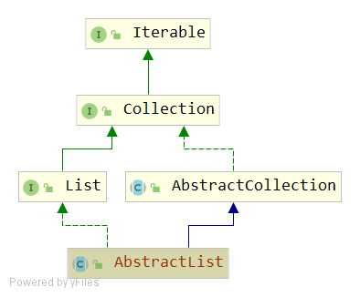

# AbstractList
## 类签名
```java
public abstract class AbstractList<E> extends AbstractCollection<E> implements List<E>
```


## AbstractList API
### 构造函数
```java
protected AbstractList() {}
```
### add(E e)
```java
public boolean add(E e) {
    add(size(), e);// add(int index, E element)
    return true;
}
```

### 抽象或者未实现的方法
```java
abstract public E get(int index);

public E set(int index, E element) {
    throw new UnsupportedOperationException();
}

public void add(int index, E element) {
    throw new UnsupportedOperationException();
}

public E remove(int index) {
    throw new UnsupportedOperationException();
}
```

### indexOf(Object o)
```java
public int indexOf(Object o) {
    ListIterator<E> it = listIterator();
    if (o==null) {
        while (it.hasNext())
            if (it.next()==null)
                return it.previousIndex();
    } else {
        while (it.hasNext())
            if (o.equals(it.next()))
                return it.previousIndex();
    }
    return -1;
}
```
正常情况下会调用 it.previousIndex()。首先获取一个列表迭代器(带有listIterator())。
然后，在列表上进行迭代，直到找到指定的元素或到达列表的末尾。

### lastIndexOf(Object o)
```java
public int lastIndexOf(Object o) {
    ListIterator<E> it = listIterator(size());
    if (o==null) {
        while (it.hasPrevious())
            if (it.previous()==null)
                return it.nextIndex();
    } else {
        while (it.hasPrevious())
            if (o.equals(it.previous()))
                return it.nextIndex();
    }
    return -1;
}
```
正常情况下会调用 it.nextIndex()。首先获取一个指向列表末尾的列表迭代器(使用listIterator(size())。
然后，反向迭代列表，直到找到指定的元素，或者到达列表的开头。

### clear()
```java
public void clear() {
    removeRange(0, size()); // removeRange(int fromIndex, int toIndex)
}
```

### addAll(int index, Collection<? extends E> c)
```java
public boolean addAll(int index, Collection<? extends E> c) {
    rangeCheckForAdd(index);//index 合法性检测
    boolean modified = false;
    for (E e : c) {
        add(index++, e);
        modified = true;
    }
    return modified;
}
```

### iterator()
```java
public Iterator<E> iterator() {
    return new Itr();
}
```
- 此实现返回迭代器接口的直接实现，依赖于后备列表的size（）、get（int）和remove（int）方法。
- 除非重写列表的remove（int）方法，否则此方法返回的迭代器将响应其remove方法抛出UnsupportedOperationException。
- 这个实现可以在并发修改时抛出运行时异常，如（protected）modCount字段规范中所述。

### listIterator() 
```java
public ListIterator<E> listIterator() {
    return listIterator(0);
}
```
依赖于 listIterator()实现。

### listIterator(final int index)
```java
public ListIterator<E> listIterator(final int index) {
    rangeCheckForAdd(index);

    return new ListItr(index);
}
```
依赖于 ListItr(index) 实现。

### subList(int fromIndex, int toIndex)
```java
public List<E> subList(int fromIndex, int toIndex) {
    return (this instanceof RandomAccess ?
            new RandomAccessSubList<>(this, fromIndex, toIndex) :
            new SubList<>(this, fromIndex, toIndex));
}
``` 
- 返回此列表中指定的fromIndex（包含）和toIndex（不包含）之间部分的视图。如果fromIndex和toIndex相等，则返回的列表为空。
- 注意：返回的列表由该列表支持，因此返回列表中的非结构更改将反映在此列表中，反之亦然。
- 此方法消除了显式范围操作的需要。任何需要列表的操作都可以通过传递子列表视图而不是整个列表来用作范围操作。
例如，从列表中删除一系列元素：list.subList(from，to).clear();
- 结构更改：改变列表大小，或以其他方式干扰列表，使得正在进行的迭代可能产生不正确的结果。
- 子类的set（int，E）、get（int）、add（int，E）、remove（int）、addAll（int，Collection）和removeRange（int，int）方法
在边界检查索引并调整偏移量之后，都委托给后备抽象列表中的相应方法。addAll（Collection c）方法只返回addAll（size，c）。
- 所有方法首先检查备份列表的实际modCount是否等于其预期值，如果不是，则抛出ConcurrentModificationException

### equals(Object o)
```java
public boolean equals(Object o) {
    if (o == this)
        return true;
    if (!(o instanceof List))
        return false;

    ListIterator<E> e1 = listIterator();
    ListIterator<?> e2 = ((List<?>) o).listIterator();
    while (e1.hasNext() && e2.hasNext()) {//对比迭代，步长都为1
        E o1 = e1.next();
        Object o2 = e2.next();
        if (!(o1==null ? o2==null : o1.equals(o2))) // e1 和 e2 判断不相等：if (!(e1==null ? e2==null : e1.equals(e2)))
            return false;
    }
    return !(e1.hasNext() || e2.hasNext());//如果 !(null || null) ,则返回true；否则返回false，因为其中一个不为null(该情形应该不会出现）。
}
```
- e1 和 e2 判断相等：if (e1==null ? e2==null : e1.equals(e2))。
- 换句话说，如果两个列表以相同的顺序包含相同的元素，则它们被定义为相等。

比较过程：
1. 首先检查指定的对象是否是此列表。如果是，则返回true；
2. 如果不是，则检查指定的对象是否为列表。如果不是，则返回false；
3. 遍历两个列表，比较对应的元素对。如果任何比较返回false，则此方法返回false。
如果其中一个迭代器在另一个迭代器之前用完了元素，此时一个为null，一个不为null，则返回false（因为列表的长度不等）；
4. 否则，当迭代完成时返回true。

### hashCode()
```java
public int hashCode() {
    int hashCode = 1;
    for (E e : this)
        hashCode = 31*hashCode + (e==null ? 0 : e.hashCode());
    return hashCode;
}
```
以 hashCode = 31*hashCode + (e==null ? 0 : e.hashCode()) 公式进行迭代计算。
        
### removeRange(int fromIndex, int toIndex)
```java
protected void removeRange(int fromIndex, int toIndex) {
    ListIterator<E> it = listIterator(fromIndex);
    for (int i=0, n=toIndex-fromIndex; i<n; i++) {
        it.next();// 前进光标位置,这里不在意返回元素值
        it.remove();// 删除光标当前位置元素
    }
} 
```
### rangeCheckForAdd(int index)
```java
private void rangeCheckForAdd(int index) {
    if (index < 0 || index > size()) // <0 或者 > N 都是非法，那么合法范围是[0,N]
        throw new IndexOutOfBoundsException(outOfBoundsMsg(index));
}

private String outOfBoundsMsg(int index) {
    return "Index: "+index+", Size: "+size();
}
```
### modCount
> 重点
```java
protected transient int modCount = 0;
```
- 含义：此列表在结构上被修改的次数。
- 结构修改是那些改变列表大小的修改，或者以其他方式干扰列表，使得正在进行的迭代可能产生不正确的结果。
- 此字段由迭代器和列表迭代器实现使用。如果此字段的值意外更改，则迭代器（或列表迭代器）将抛出ConcurrentModificationException以
响应next, remove, previous, set 或 add操作。即快速失败。
- 子类使用此字段是可选的。如果子类希望提供快速失败的迭代器（和列表迭代器），那么它只需在其add（int，E）和remove（int）方法
（以及它重写的导致列表结构修改的任何其他方法）中递增这个字段。
- 对add（int，E）或remove（int）的单个调用不能向该字段递增多次，否则迭代器（和列表迭代器）将抛出虚假的ConcurrentModificationExceptions。
如果实现不希望提供失败快速迭代器，则可以忽略此字段。

### Itr
```java
private class Itr implements Iterator<E> {

    int cursor = 0;

    /**
     * Index of element returned by most recent call to next or
     * previous.  Reset to -1 if this element is deleted by a call
     * to remove.
     */
    int lastRet = -1;

    /**
     * The modCount value that the iterator believes that the backing
     * List should have.  If this expectation is violated, the iterator
     * has detected concurrent modification.
     */
    int expectedModCount = modCount;

    public boolean hasNext() {
        return cursor != size();
    }

    public E next() {
        checkForComodification();
        try {
            int i = cursor;
            E next = get(i);
            lastRet = i;// 因为get(i),所以 lastRet 必须为 get()方法中的参数 i
            cursor = i + 1;// 光标加1 ，从这里可以看出 cursor=lastRet+1（除非有删除操作）
            return next;
        } catch (IndexOutOfBoundsException e) {
            checkForComodification();
            throw new NoSuchElementException();
        }
    }

    public void remove() {
        if (lastRet < 0) // 说明执行了remove后，还没有进行过next操作,此时 lastRet =-1
            throw new IllegalStateException();
        checkForComodification();

        try {
            AbstractList.this.remove(lastRet); //这步会导致AbstractList类的modCount自增，此时 modCount != expectedModCount
            if (lastRet < cursor)
                cursor--; // 由于在lastRet位置删除了一个元素，需要将cursor减1，此时cursor等于lastRet（即被删除位置的index）
            lastRet = -1;// 删除操作，重设 lastRet 为 -1
            expectedModCount = modCount;// 将 AbstractList类的modCount最新值更新到迭代器的expectedModCount
        } catch (IndexOutOfBoundsException e) {
            throw new ConcurrentModificationException();
        }
    }

    final void checkForComodification() {
        if (modCount != expectedModCount)
            throw new ConcurrentModificationException();
    }
}
```
- 从remove方法的实现可以看出，第一次调用remove()之后，lastRet = -1，如果此时继续调用remove()，则会抛出 IllegalStateException。
也就是不能连续remove。必须next() -> remove() -> next() -> remove() 交替执行。因为next()方法中会修复的值：lastRet = i
- remove() 方法中 expectedModCount = modCount 这句保证了迭代器正常的状态。

### ListItr
```java
private class ListItr extends Itr implements ListIterator<E> {
    ListItr(int index) {
        cursor = index;//构造方法中可以传入一个index初始化cursor
    }

    public boolean hasPrevious() {
        return cursor != 0; // 如果cursor为0，表示已在头部，头部不能往左走。
    }

    public E previous() {
        checkForComodification();
        try {
            int i = cursor - 1;
            E previous = get(i);
            lastRet = cursor = i; // cursor = i，因为get(i),所以 lastRet 必须为 get()方法中的参数 i
            return previous;
        } catch (IndexOutOfBoundsException e) {
            checkForComodification();
            throw new NoSuchElementException();
        }
    }

    public int nextIndex() {
        return cursor;
    }

    public int previousIndex() {
        return cursor-1;
    }

    public void set(E e) {
        if (lastRet < 0) //如果执行了remove或add后，还没有进行过next或previous操作,此时 lastRet =-1，这状态不允许继续修改集合
            throw new IllegalStateException();
        checkForComodification();

        try {
            AbstractList.this.set(lastRet, e);//在lastRet位置设置 e元素        
            expectedModCount = modCount;// 更新 expectedModCount
        } catch (IndexOutOfBoundsException ex) {
            throw new ConcurrentModificationException();
        }
    }

    public void add(E e) {
        // add不用关心lastRet，不在乎之前有没有remove或add，于是这里没有if (lastRet < 0)检查
        checkForComodification();

        try {
            int i = cursor;
            AbstractList.this.add(i, e);// 在lastRet位置添加 e元素
            lastRet = -1;// 添加操作，属于集合结构修改操作，于是设置 lastRet = -1，防止继续执行结构修改的操作
            cursor = i + 1;// 光标加1
            expectedModCount = modCount;// 更新 expectedModCount
        } catch (IndexOutOfBoundsException ex) {
            throw new ConcurrentModificationException();
        }
    }
}
```
## SubList API
### 签名
```java
class SubList<E> extends AbstractList<E>
```
### 构造函数
```java
private final AbstractList<E> l;
private final int offset;
private int size;
    
SubList(AbstractList<E> list, int fromIndex, int toIndex) {
    if (fromIndex < 0)
        throw new IndexOutOfBoundsException("fromIndex = " + fromIndex);
    if (toIndex > list.size())
        throw new IndexOutOfBoundsException("toIndex = " + toIndex);
    if (fromIndex > toIndex)
        throw new IllegalArgumentException("fromIndex(" + fromIndex +
                                           ") > toIndex(" + toIndex + ")");
    l = list;
    offset = fromIndex;//偏移量为 fromIndex
    size = toIndex - fromIndex;
    this.modCount = l.modCount;
}
```
### set(int index, E element)
```java
public E set(int index, E element) {
    rangeCheck(index);
    checkForComodification();
    return l.set(index+offset, element); // 注意 index+offset 等于实际位置
}
```
### get(int index)
```java
public E get(int index) {
    rangeCheck(index);
    checkForComodification();
    return l.get(index+offset);// 注意 index+offset 等于实际位置
}
```
### size()
```java
public int size() {
    checkForComodification();
    return size;
}
```
### add(int index, E element)
```java
public void add(int index, E element) {
    rangeCheckForAdd(index);
    checkForComodification();
    l.add(index+offset, element);
    this.modCount = l.modCount;//更新 subList的 modCount
    size++;//更新 size
}
```
### remove(int index)
```java
public E remove(int index) {
    rangeCheck(index);
    checkForComodification();
    E result = l.remove(index+offset);
    this.modCount = l.modCount;//更新 subList的 modCount
    size--;//更新 size
    return result;
}
```
### removeRange(int fromIndex, int toIndex)
```java
protected void removeRange(int fromIndex, int toIndex) {
    checkForComodification();
    l.removeRange(fromIndex+offset, toIndex+offset);
    this.modCount = l.modCount;//更新 subList的 modCount
    size -= (toIndex-fromIndex);//更新 size
}
```

### addAll
```java
public boolean addAll(Collection<? extends E> c) {
    return addAll(size, c);
}

public boolean addAll(int index, Collection<? extends E> c) {
    rangeCheckForAdd(index);
    int cSize = c.size();
    if (cSize==0) //c为空集合则直接返回
        return false;

    checkForComodification();
    l.addAll(offset+index, c);
    this.modCount = l.modCount;
    size += cSize;
    return true;
}
```

### iterator()
```java
public Iterator<E> iterator() {
    return listIterator();//java.util.AbstractList#listIterator()
}
```

### listIterator(final int index)
```java
public ListIterator<E> listIterator(final int index) {
    checkForComodification();
    rangeCheckForAdd(index);

    return new ListIterator<E>() {
        private final ListIterator<E> i = l.listIterator(index+offset);

        public boolean hasNext() {
            return nextIndex() < size;
        }

        public E next() {...}

        public boolean hasPrevious() {
            return previousIndex() >= 0;
        }

        public E previous() {...}
       

        public int nextIndex() {
            return i.nextIndex() - offset;
        }

        public int previousIndex() {
            return i.previousIndex() - offset;
        }

        public void remove() {
            i.remove();
            SubList.this.modCount = l.modCount;//l迭代器的modCount更新到SubList实例的modCount
            size--;
        }

        public void set(E e) {
            i.set(e);
        }

        public void add(E e) {
            i.add(e);
            SubList.this.modCount = l.modCount;
            size++;
        }
    };
}
```
- 这个方法有一个入参index，表示从index开始的集合视图。
- remove()和add(E e)方法中需要更新modCount和size字段。

### 其他工具方法
```java
public List<E> subList(int fromIndex, int toIndex) {
    return new SubList<>(this, fromIndex, toIndex);
}

private void rangeCheck(int index) {
    if (index < 0 || index >= size)
        throw new IndexOutOfBoundsException(outOfBoundsMsg(index));
}

private void rangeCheckForAdd(int index) {
    if (index < 0 || index > size)
        throw new IndexOutOfBoundsException(outOfBoundsMsg(index));
}

private String outOfBoundsMsg(int index) {
    return "Index: "+index+", Size: "+size;
}

private void checkForComodification() {
    if (this.modCount != l.modCount)
        throw new ConcurrentModificationException();
}
```
- rangeCheck(int index) 用于 set 和 get
- rangeCheckForAdd(int index) 用于 add

## RandomAccessSubList API
```java
class RandomAccessSubList<E> extends SubList<E> implements RandomAccess {
    RandomAccessSubList(AbstractList<E> list, int fromIndex, int toIndex) {
        super(list, fromIndex, toIndex);
    }

    public List<E> subList(int fromIndex, int toIndex) {
        return new RandomAccessSubList<>(this, fromIndex, toIndex);
    }
}
```
- RandomAccessSubList 继承自 SubList，实现 RandomAccess 接口。
- 构造函数主要委托给父类 SubList的构造函数。   

## 说明
- 此类提供了List接口的基本实现。对于顺序访问数据（例如链表），应优先使用AbstractSequentialList代替此类。
- 要实现不可修改的list，只需扩展此类并为get（int）和size（）方法提供实现
- 要实现可修改的list，必须另外重写set（int E）方法（否则将抛出UnsupportedOperationException）。
如果列表是可变大小的，则必须另外重写add（int E）和remove（int）方法。
- 应按照Collection接口规范中的建议提供一个void（无参）和collection参数的构造函数。
- 不必提供迭代器实现。迭代器和列表迭代器由此类在“random access”方法上实现：get（int），set（int，E），add（int，E）和remove（int）。