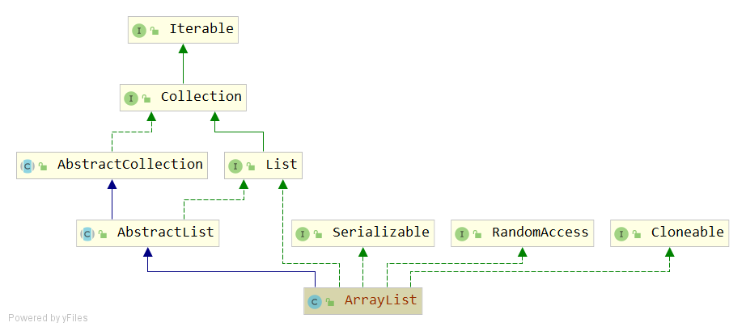
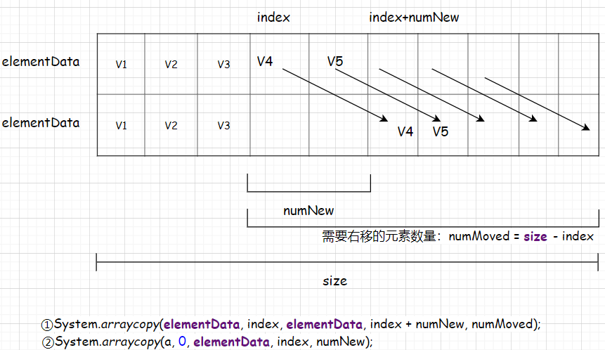
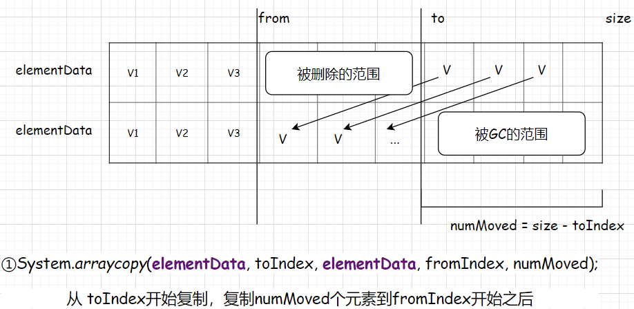
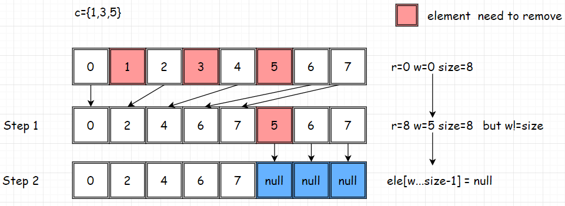

# ArrayList
## 签名
```java
public class ArrayList<E> extends AbstractList<E> implements List<E>, RandomAccess, Cloneable, java.io.Serializable
```



## API
### 字段
```java
private static final long serialVersionUID = 8683452581122892189L;
private static final int DEFAULT_CAPACITY = 10; //默认容量
private static final Object[] EMPTY_ELEMENTDATA = {};
private static final Object[] DEFAULTCAPACITY_EMPTY_ELEMENTDATA = {};
transient Object[] elementData; // 背后数组表示
private int size; //数组长度
```

### 构造函数
```
ArrayList(int initialCapacity)       //自定义初始化容器的构造
ArrayList()                          //依据Collection规范，无参构造
ArrayList(Collection<? extends E> c) //依据Collection规范，Collectionca入参构造
```
```java
public ArrayList(int initialCapacity) {
    if (initialCapacity > 0) {
        this.elementData = new Object[initialCapacity];// 按容量初始化对象数组，设置引用
    } else if (initialCapacity == 0) {
        this.elementData = EMPTY_ELEMENTDATA; // EMPTY_ELEMENTDATA = {}，设置引用
    } else {
        throw new IllegalArgumentException("Illegal Capacity: "+
                                           initialCapacity);
    }
}
```
```java
/**
 * Constructs an empty list with an initial capacity of ten.
 */
public ArrayList() {
    this.elementData = DEFAULTCAPACITY_EMPTY_ELEMENTDATA;// DEFAULTCAPACITY_EMPTY_ELEMENTDATA = {}
}
```
```java
public ArrayList(Collection<? extends E> c) {
    elementData = c.toArray();
    if ((size = elementData.length) != 0) {
        // c.toArray might (incorrectly) not return Object[] (see 6260652)
        if (elementData.getClass() != Object[].class)
            elementData = Arrays.copyOf(elementData, size, Object[].class);
    } else {
        // replace with empty array.
        this.elementData = EMPTY_ELEMENTDATA;
    }
}
```
ArrayList(Collection<? extends E> c) 实现中 elementData = c.toArray()；似乎已经完成逻辑了，为何需要下面的if判断呢？

注意这句: c.toArray might (incorrectly) not return Object[] (see 6260652)。
原因在于 c.toArray 返回的可能是子类的类型如String[]而不是Object[],于是if的逻辑是保证elementData初始化为对象数组。

### 添加
```
boolean add(E e)
void add(int index, E element)
boolean addAll(Collection<? extends E> c)
boolean addAll(int index, Collection<? extends E> c)
```
#### add(E e)
```java
public boolean add(E e) {
    ensureCapacityInternal(size + 1);  // Increments modCount!! 保证容量+1，具体实现先跳过
    elementData[size++] = e;//主要是这句：赋值，size++
    return true;
}
```
#### add(int index, E element)
```java
public void add(int index, E element) {
    rangeCheckForAdd(index);
    ensureCapacityInternal(size + 1);  // Increments modCount!! 保证容量+1
    
    //从index（包含index）开始后面的元素，全部右移一个单位，让出index这个空位置
    System.arraycopy(elementData, index, elementData, index + 1,size - index);
    elementData[index] = element;
    size++;
}
```
#### addAll(Collection<? extends E> c)
```java
public boolean addAll(Collection<? extends E> c) {
    Object[] a = c.toArray();
    int numNew = a.length;
    ensureCapacityInternal(size + numNew);  // Increments modCount 保证容量+numNew
  
    System.arraycopy(a, 0, elementData, size, numNew);//a复制到elementData的末尾
    size += numNew;//更新size
    return numNew != 0;// numNew不为0时，添加成功
}
```
#### addAll(int index, Collection<? extends E> c)
```java
public boolean addAll(int index, Collection<? extends E> c) {
    rangeCheckForAdd(index);

    Object[] a = c.toArray();
    int numNew = a.length;
    ensureCapacityInternal(size + numNew);  // Increments modCount

    int numMoved = size - index; //计算elementData中需要让出的位置个数
    if (numMoved > 0)
        System.arraycopy(elementData, index, elementData, index + numNew,
                         numMoved);

    System.arraycopy(a, 0, elementData, index, numNew);
    size += numNew;
    return numNew != 0;
}
```


### 更新
#### set(int index, E element)
```java
public E set(int index, E element) {
    rangeCheck(index);

    E oldValue = elementData(index);
    elementData[index] = element;//设置新的值
    return oldValue;//返回旧的值
}
```
### 查询
#### get(int index)
```java
public E get(int index) {
    rangeCheck(index);
    return elementData(index);
}
```
#### indexOf(Object o)
```java
public int indexOf(Object o) {
     if (o == null) {
         for (int i = 0; i < size; i++)
             if (elementData[i]==null)
                 return i;
     } else {
         for (int i = 0; i < size; i++)
             if (o.equals(elementData[i]))
                 return i;
     }
     return -1;
 }
```
从左往右遍历。
#### lastIndexOf(Object o)
```java
public int lastIndexOf(Object o) {
    if (o == null) {
        for (int i = size-1; i >= 0; i--)
            if (elementData[i]==null)
                return i;
    } else {
        for (int i = size-1; i >= 0; i--)
            if (o.equals(elementData[i]))
                return i;
    }
    return -1;
}
```
从右往左遍历。
#### contains(Object o)
委托到 indexOf(Object o) >0;

### 删除
```
E remove(int index)                                   // 根据索引删除
boolean remove(Object o)                              // 根据对象删除
boolean removeAll(Collection<?> c)                    // 根据集合删除
boolean removeIf(Predicate<? super E> filter)         // 根据条件删除
void removeRange(int fromIndex, int toIndex)          // 根据范围删除
void fastRemove(int index)
boolean batchRemove(Collection<?> c, boolean complement)
```
#### remove(int index)
```java
public E remove(int index) {
    rangeCheck(index);

    modCount++;
    E oldValue = elementData(index);

    int numMoved = size - index - 1;//计算需要移动元素的个数
    if (numMoved > 0)
        System.arraycopy(elementData, index+1, elementData, index, numMoved);
    elementData[--size] = null; // GC 最后一个位置元素

    return oldValue;
}
```
#### remove(Object o)
```java
public boolean remove(Object o) {
    if (o == null) {
        for (int index = 0; index < size; index++)
            if (elementData[index] == null) {
                fastRemove(index);
                return true;
            }
    } else {
        for (int index = 0; index < size; index++)
            if (o.equals(elementData[index])) {
                fastRemove(index);
                return true;
            }
    }
    return false;
}
```
根据入参o是否为null拆分遍历查找的逻辑。删除操作委托到 fastRemove(index)。

#### removeAll(Collection<?> c)
```java
public boolean removeAll(Collection<?> c) {
    Objects.requireNonNull(c);
    return batchRemove(c, false);// 委托到 batchRemove(Collection<?> c, boolean complement)
}
```
#### removeIf(Predicate<? super E> filter) 
```java
@Override
public boolean removeIf(Predicate<? super E> filter) {
    Objects.requireNonNull(filter);
    // figure out which elements are to be removed
    // any exception thrown from the filter predicate at this stage
    // will leave the collection unmodified
    int removeCount = 0;
    final BitSet removeSet = new BitSet(size); //一个集合：保存所有要删除的元素的index
    final int expectedModCount = modCount;
    final int size = this.size;
    for (int i=0; modCount == expectedModCount && i < size; i++) {
        @SuppressWarnings("unchecked")
        final E element = (E) elementData[i];
        if (filter.test(element)) {
            removeSet.set(i);
            removeCount++;
        }
    }
    if (modCount != expectedModCount) {
        throw new ConcurrentModificationException();
    }

    // shift surviving elements left over the spaces left by removed elements
    final boolean anyToRemove = removeCount > 0;
    if (anyToRemove) {
        final int newSize = size - removeCount; // size - removeCount 表示存活元素的数量
        for (int i=0, j=0; (i < size) && (j < newSize); i++, j++) {
            i = removeSet.nextClearBit(i); // 先这样理解：nextClearBit(i)得到的是下一个存活元素的index
            elementData[j] = elementData[i];//复制到新的elementData[j]，整个过程总体上就是右边元素往左边填坑。结束后，右边存在连续空白
        }
        for (int k=newSize; k < size; k++) {
            elementData[k] = null;  // newSize以及之后的位置可以被回收
        }
        this.size = newSize;//重设 size
        if (modCount != expectedModCount) {
            throw new ConcurrentModificationException();
        }
        modCount++;//更新 modCount
    }

    return anyToRemove;
}
```
#### removeRange(int fromIndex, int toIndex) 
```java
protected void removeRange(int fromIndex, int toIndex) {
    modCount++;
    int numMoved = size - toIndex;
    System.arraycopy(elementData, toIndex, elementData, fromIndex,numMoved);

    // clear to let GC do its work
    int newSize = size - (toIndex-fromIndex);
    for (int i = newSize; i < size; i++) {
        elementData[i] = null;// newSize以及之后的位置可以被回收
    }
    size = newSize;
}
```


#### fastRemove(int index) 
```java
private void fastRemove(int index) {
    modCount++;
    int numMoved = size - index - 1;
    if (numMoved > 0)
        System.arraycopy(elementData, index+1, elementData, index, numMoved);
    elementData[--size] = null; // clear to let GC do its work
}
```
fast的含义在于：跳过对index的合法性检测，以及没有返回值。

#### batchRemove(Collection<?> c, boolean complement)
```java
private boolean batchRemove(Collection<?> c, boolean complement) {
    final Object[] elementData = this.elementData;
    int r = 0, w = 0;
    boolean modified = false;
    try {
        for (; r < size; r++)
            if (c.contains(elementData[r]) == complement) //假设complement=false,c.contains(elementData[r])为false表示保留该元素
                elementData[w++] = elementData[r]; // Object[] elementData 先存放需要保存的元素，w为数组长度
    } finally {
        // Preserve behavioral compatibility with AbstractCollection,
        // even if c.contains() throws.
        if (r != size) {
            System.arraycopy(elementData, r,elementData, w, size - r); //从r开始复制，复制目标从w位置开始，复制size-r个元素
            w += size - r;// W加上size-r的值，此时w表示新数组的长度
        }
        if (w != size) {
            // clear to let GC do its work
            for (int i = w; i < size; i++)
                elementData[i] = null; //从w索引开始（含w）的位置被回收
            modCount += size - w;// 表示修改了 size-w 次
            size = w;
            modified = true;
        }
    }
    return modified;
}
```
示意图


该示意图并没有运行这段代码：
```java
if (r != size) {
    System.arraycopy(elementData, r,elementData, w, size - r); 
    w += size - r;// W加上size-r的值，此时w表示新数组的长度
}
```
这段代码含义是：从r开始复制，复制目标从w位置开始，复制size-r个元素。

> 经历了for (; r < size; r++)，什么时候会出现r != size呢？

源码注释这句话：even if c.contains() throws。当 for循坏中c.contains()抛出异常时，由于没有遍历完全，可能会导致 r != size 情况出现。

### clear()
```java
public void clear() {
    modCount++;

    // clear to let GC do its work
    for (int i = 0; i < size; i++)
        elementData[i] = null; //全设置为null，触发GC

    size = 0;//重设size=0
}
```

### 扩容机制
```java
// step 1
private void ensureCapacityInternal(int minCapacity) {
    ensureExplicitCapacity(calculateCapacity(elementData, minCapacity));
}

//step 2
private static int calculateCapacity(Object[] elementData, int minCapacity) {
    if (elementData == DEFAULTCAPACITY_EMPTY_ELEMENTDATA) {//当elementData为空数组时
        return Math.max(DEFAULT_CAPACITY, minCapacity);// DEFAULT_CAPACITY=10；返回一个较大的容量
    }
    return minCapacity;
}

// step 3
private void ensureExplicitCapacity(int minCapacity) { 
    modCount++;

    // overflow-conscious code
    if (minCapacity - elementData.length > 0) //假设 elementData.length =10，那么index为[0,9] ,如果 minCapacity>10，那么需要扩容
        grow(minCapacity); // step 4
}
```
- 在addXXX()方法中，会调用 ensureCapacityInternal(int minCapacity) 保证容量，入参表示最小的容量。
- ensureExplicitCapacity(int minCapacity) 会调用 grow(minCapacity);

#### grow(minCapacity)
```java
private void grow(int minCapacity) {
    // overflow-conscious code
    int oldCapacity = elementData.length;
    int newCapacity = oldCapacity + (oldCapacity >> 1); 
    if (newCapacity - minCapacity < 0) 
        newCapacity = minCapacity;
    if (newCapacity - MAX_ARRAY_SIZE > 0)
        newCapacity = hugeCapacity(minCapacity);
    // minCapacity is usually close to size, so this is a win:
    elementData = Arrays.copyOf(elementData, newCapacity);
}
```
- 新容量= 旧容量 * 1.5，这个就是关键的扩容机制。
- 如果新容量还是小于所需最小容量，将所需最小容量赋值给新容量
- 如果新容量大于MAX_ARRAY_SIZE(Integer.MAX_VALUE - 8)，调用hugeCapacity(minCapacity)再次保证容量
- minCapacity is usually close to size, so this is a win 表示：一般而言minCapacity应该和size接近，这样内存就不会太浪费
- 将原来数组data复制到新容量的新数组中

### 压缩机制
#### trimToSize()
trimToSize方法可以使得size = elementData.length，更加紧凑。
```java
public void trimToSize() {
    modCount++;
    if (size < elementData.length) {
        elementData = (size == 0)
          ? EMPTY_ELEMENTDATA
          : Arrays.copyOf(elementData, size);
    }
}
```
### 迭代
#### Iterator<E> iterator()
```java
public Iterator<E> iterator() {
    return new Itr();
}
```
#### Itr
先看类定义和方法签名
```java
private class Itr implements Iterator<E> {
    int cursor;       // index of next element to return
    int lastRet = -1; // index of last element returned; -1 if no such
    int expectedModCount = modCount;
    Itr() {}
    public boolean hasNext() { }
    public E next() {}
    public void remove() {}
    @Override
    public void forEachRemaining(Consumer<? super E> consumer) { }
    final void checkForComodification() { }
}
```
- next()
```java
public E next() {
    checkForComodification();//1
    int i = cursor;
    if (i >= size)
        throw new NoSuchElementException();
    Object[] elementData = ArrayList.this.elementData;//2
    if (i >= elementData.length)// i >= elementData.length 为true时，抛出CME，什么时候会出现 i >= elementData.length ？
        throw new ConcurrentModificationException();
    cursor = i + 1;
    return (E) elementData[lastRet = i];
}
```
代码注释中//1和//2之间，如果其他线程调用trimToSize()进行压缩，那么此时
- `Object[] elementData = ArrayList.this.elementData;`得到的只是本地变量
- 需要对 i >= elementData.length 进行判断是否有其他线程进行修改

#### ListIterator<E> listIterator()
```java
public ListIterator<E> listIterator() {
    return new ListItr(0);
}
```
#### ListItr
```java
private class ListItr extends Itr implements ListIterator<E>
```
- 遍历时提供previous和next两个方向；这点和Iterator()不同，Iterator()只有next一个方向。

### 转化
- Object[] toArray();
- <T> T[] toArray(T[] a);

### 排序
```java
@Override
@SuppressWarnings("unchecked")
public void sort(Comparator<? super E> c) {
    final int expectedModCount = modCount;
    Arrays.sort((E[]) elementData, 0, size, c);
    if (modCount != expectedModCount) {
        throw new ConcurrentModificationException();
    }
    modCount++;
}
```
- Arrays.sort((E[]) elementData, 0, size, c); 委托到Arrays的工具方法。

### 视图
#### subList(int fromIndex, int toIndex)
```java
public List<E> subList(int fromIndex, int toIndex) {
    subListRangeCheck(fromIndex, toIndex, size);
    return new SubList(this, 0, fromIndex, toIndex);
}
```
- new SubList(this, 0, fromIndex, toIndex);注意这里的this，指的是当前这个list。
- 对于该方法返回的list实例，该list所做的修改将直接反映到原来的list。
- 对于该方法返回的list实例，原list的修改也会反映到这个list实例。

## 说明

- List接口的可调整大小的数组实现。实现所有可选的列表操作，并允许所有元素，包括null。
- 时间复杂度
  - size，isEmpty，get，set，iterator和listIterator操作在常数时间内运行。
  - add 按均摊常数时间运行，添加n个元素需要O(n)时间。
  - 所有其他操作均以线性时间运行（大约是这样）。
  - 与LinkedList实现相比，常数因子较低。
- 容量：capacity 是用于在列表中存储元素的数组的大小。它至少与列表大小一样大。随着元素添加到ArrayList中，其容量会自动增长。
- 技巧：在添加大量元素之前，可以使用ensureCapacity操作增加ArrayList实例的容量。这可以减少扩容的次数。
- 注意：此实现未同步。如果多个线程同时访问ArrayList实例，并且至少有一个线程在结构上修改列表，则必须在外部进行同步。
> 结构修改是添加或删除一个或多个元素，或显式调整后备数组大小的任何操作；仅设置元素的值不是结构上的修改。
```java
List list = Collections.synchronizedList(new ArrayList(...));
```
- 此类的迭代器和listIterator方法返回的迭代器是快速失败的：如果在创建迭代器之后，以任何方式对列表进行结构修改，
则除了通过迭代器自己的remove或add方法之外，迭代器都会抛出ConcurrentModificationException。
- 迭代器的快速失败行为应仅用于检测错误，不应该编写任何依赖于此异常的逻辑。