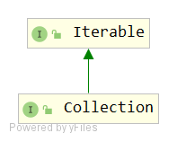

# Collection
## 签名
```java
public interface Collection<E> extends Iterable<E>
```



## API
```java
// Query Operations
int size();
boolean isEmpty();
boolean contains(Object o);
Iterator<E> iterator(); // 继承自Iterator接口
Object[] toArray();
<T> T[] toArray(T[] a);

// Modification Operations
boolean add(E e);
boolean remove(Object o);

// Bulk Operations(批量操作)
boolean containsAll(Collection<?> c);
boolean addAll(Collection<? extends E> c);
boolean removeAll(Collection<?> c);
default boolean removeIf(Predicate<? super E> filter) {...}
boolean retainAll(Collection<?> c);
void clear();

// Comparison and hashing
boolean equals(Object o); //继承自 Object 类
int hashCode();// 继承自 Object 类
default Spliterator<E> spliterator() {...}
default Stream<E> stream() {...}
default Stream<E> parallelStream() {...}
```
### 默认方法实现
- removeIf
```java
default boolean removeIf(Predicate<? super E> filter) {
        Objects.requireNonNull(filter);
        boolean removed = false;
        final Iterator<E> each = iterator();
        while (each.hasNext()) {
            if (filter.test(each.next())) {
                each.remove();
                removed = true;
            }
        }
        return removed;
    }
```
- spliterator
```java
@Override
default Spliterator<E> spliterator() { //继承自Iterator接口
    return Spliterators.spliterator(this, 0);
}
```
- stream
```java
default Stream<E> stream() {
    return StreamSupport.stream(spliterator(), false);
}
```
- parallelStream
```java
default Stream<E> parallelStream() {
    return StreamSupport.stream(spliterator(), true);
}
```

## 说明
所有通用的Collection实现类（通常通过其子接口之一间接实现Collection）都应提供两个“标准”构造函数：

- 一个void（无参数）构造函数，用于创建一个空集合；
- 一个具有单个Collection类型参数的构造函数，用于创建一个新集合，其元素与其参数相同。

第二个构造函数允许用户复制任何集合，从而生成所需实现类型的等效集合。
无法强制执行此约定（因为接口不能包含构造函数），但是Java平台库中的所有通用Collection实现都应当遵循该原则。