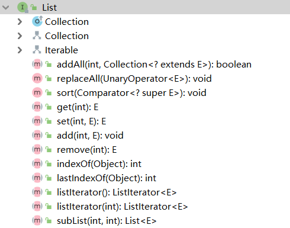

# List

## 签名
```java
public interface List<E> extends Collection<E>
```


## API
> 继承的方法省略，只显示自身的方法



```java
// 重写 Collection 接口的 spliterator
default Spliterator<E> spliterator() {...}
boolean addAll(int index, Collection<? extends E> c);
default void replaceAll(UnaryOperator<E> operator) {...}
default void sort(Comparator<? super E> c) {...}
E get(int index);
E set(int index, E element);
void add(int index, E element);
E remove(int index);
int indexOf(Object o);
int lastIndexOf(Object o);
ListIterator<E> listIterator();
ListIterator<E> listIterator(int index);
List<E> subList(int fromIndex, int toIndex);
```

### 默认实现
- replaceAll
```java
default void replaceAll(UnaryOperator<E> operator) {
    Objects.requireNonNull(operator);
    final ListIterator<E> li = this.listIterator();
    while (li.hasNext()) {
        li.set(operator.apply(li.next()));
    }
}
```
- sort
```java
default void sort(Comparator<? super E> c) {
    Object[] a = this.toArray();
    Arrays.sort(a, (Comparator) c);
    ListIterator<E> i = this.listIterator();
    for (Object e : a) {//遍历排序后的a数组
        i.next(); // 取迭代器当前元素
        i.set((E) e); //迭代器当前元素重设为数组a中当前遍历的元素
    }
}
```
- spliterator
```java
@Override
default Spliterator<E> spliterator() {
    return Spliterators.spliterator(this, Spliterator.ORDERED);//表明元素是有顺序的，因为数组中元素是有顺序的(by index)
}
```

## 说明
- 列表通常允许重复的元素，并且如果它们完全允许空元素，则通常允许多个空元素。
- List接口提供了一个称为ListIterator的特殊迭代器，除了Iterator接口提供的常规操作之外，该迭代器还允许元素插入和替换以及双向访问。
- List接口还提供一种获取列表的迭代器listIterator(int index)，该列表迭代器从列表中的指定位置开始。
- 尝试添加不合格的元素会引发未经检查的异常，通常为NullPointerException或ClassCastException。