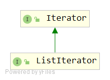

# ListIterator
## 签名
```java
public interface ListIterator<E> extends Iterator<E>
```


## API
```
boolean hasNext(); ↑ Iterator
E next(); ↑ Iterator
boolean hasPrevious(); 
E previous(); 
int nextIndex(); 
int previousIndex(); 
void remove(); ↑ Iterator
void set(E e); 
void add(E e);  
```

## 说明
长度为n的列表的迭代器有n+1个可能的光标位置，如下面的插入符号（^）所示：
```
                      Element(0)   Element(1)   Element(2)   ... Element(n-1)  
cursor positions:  ^            ^            ^            ^    ...            ^   
```
remove（）和set（Object）方法不根据光标位置定义；它们被定义为对调用next（）或previous（）返回的最后一个元素进行操作。