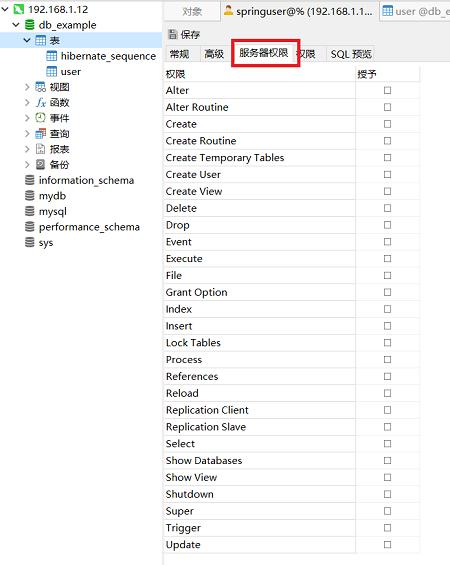

# access data with jpa in mysql
## 编码
1.maven依赖
```xml
<!-- JPA Data (We are going to use Repositories, Entities, Hibernate, etc...) -->
<dependency>
    <groupId>org.springframework.boot</groupId>
    <artifactId>spring-boot-starter-data-jpa</artifactId>
</dependency>

<!-- Use MySQL Connector-J -->
<dependency>
    <groupId>mysql</groupId>
    <artifactId>mysql-connector-java</artifactId>
</dependency>
```
2.新建User实体类
```java
@Entity // This tells Hibernate to make a table out of this class
public class User {
    @Id
    @GeneratedValue(strategy = GenerationType.AUTO)
    private Integer id;

    private String name;

    private String email;
    
    //get/set
}
```
3.创建user的jpa接口
```java
public interface UserRepository extends CrudRepository<User, Integer> {  }
```
4.创建controller
```java
@RestController
@RequestMapping(path = "/user")
public class MainController {
    @Autowired
    private UserRepository userRepository;

    @GetMapping("/add")
    public String addNewUser(@RequestParam String name, @RequestParam String email) {
        User n = new User();
        n.setName(name);
        n.setEmail(email);
        userRepository.save(n);
        return "Saved";
    }

    @GetMapping("/all")
    public Iterable<User> getAllUsers() {
        return userRepository.findAll();
    }
}
```

## 配置
1.保证先安装一个MySQL Server,并创建如下数据库。
```bash
mysql> create database db_example; -- Create the new database
mysql> create user 'springuser'@'%' identified by 'Spring_2019'; -- Creates the user
mysql> grant all privileges on db_example.* to 'springuser'@'%'; -- Gives all the privileges to the new user on the newly created database
```

2.配置 application.properties 中数据库参数。
```properties
spring.jpa.hibernate.ddl-auto=create
spring.datasource.url=jdbc:mysql://192.168.31.12:3306/db_example?useSSL=false
spring.datasource.username=springuser
spring.datasource.password=Spring_2019
spring.jpa.properties.hibernate.dialect = org.hibernate.dialect.MySQL5Dialect
spring.jpa.show-sql = false
```
spring.jpa.hibernate.ddl-auto可以是none，update，create，create-drop。

- none 这是MySQL的默认值，不会更改数据库表结构。
- update 如果对应表不存在，则创建对应表；当表存在时，不会重新创建表。Hibernate根据给定的Entity结构更改数据库表结构。
- create 每次都会删掉对应表，然后重新创建对应表，但在关闭时（例如停止应用）不会删除对应表。
- create-drop 每次都会删掉对应表，然后重新创建对应表，然后在SessionFactory关闭时删除它。

这里以 create 开头，因为还没有数据库结构。 第一次运行后，我们可以根据程序要求将其切换为 update 或 none。 
如果要对数据库结构进行一些更改，请使用 update 。

H2和其他嵌入式数据库的默认值是create-drop，但像MySQL这样的其他数据库默认则为 none，MySQL设置为create-drop的效果和create一样。

在数据库处于 prod 状态后，可以使用none并从连接到Spring应用程序的MySQL用户撤消所有权限，
然后只给予SELECT，UPDATE，INSERT，DELETE，这是一种很好的安全做法。

第一次运行结果：
```bash
Hibernate: drop table if exists hibernate_sequence
Hibernate: drop table if exists user
Hibernate: create table hibernate_sequence (next_val bigint) engine=MyISAM
Hibernate: insert into hibernate_sequence values ( 1 )
Hibernate: create table user (id integer not null, email varchar(255), name varchar(255), primary key (id)) engine=MyISAM
```
此时数据库已经有了user，将 spring.jpa.hibernate.ddl-auto 改为 none 并重新启动。

## 测试
```bash
GET localhost:8080/user/add?name=First&email=someemail@someemailprovider.com
GET localhost:8080/user/all
```
```json
[
    {
        "id": 1,
        "name": "First",
        "email": "someemail@someemailprovider.com"
    }
]
```

## 数据库安全性更改
必须留意某用户的服务器权限（不同于权限），将服务器权限也全部撤销。


```bash
# 这句撤销的只是权限（某个数据库的操作权限），而不是服务器权限
mysql> revoke all privileges on db_example.* from 'springuser'@'%';
Query OK, 0 rows affected (0.00 sec)

mysql> grant select, insert, delete, update on db_example.* to 'springuser'@'%';

mysql> flush privileges;
Query OK, 0 rows affected (0.00 sec)
```
此时，springuser 对于 db_example 表来说，只能CRUD数据，不能更改任何schema结构。

若要对数据库进行更改，请重新将spring.jpa.hibernate.ddl-auto更改为update，然后重新运行应用程序。
或者，使用专用的迁移工具，如Flyway或Liquibase。