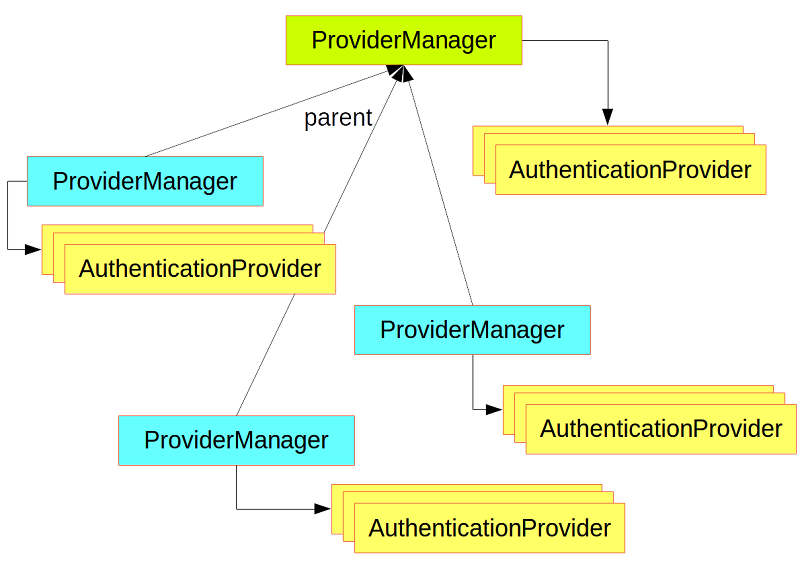
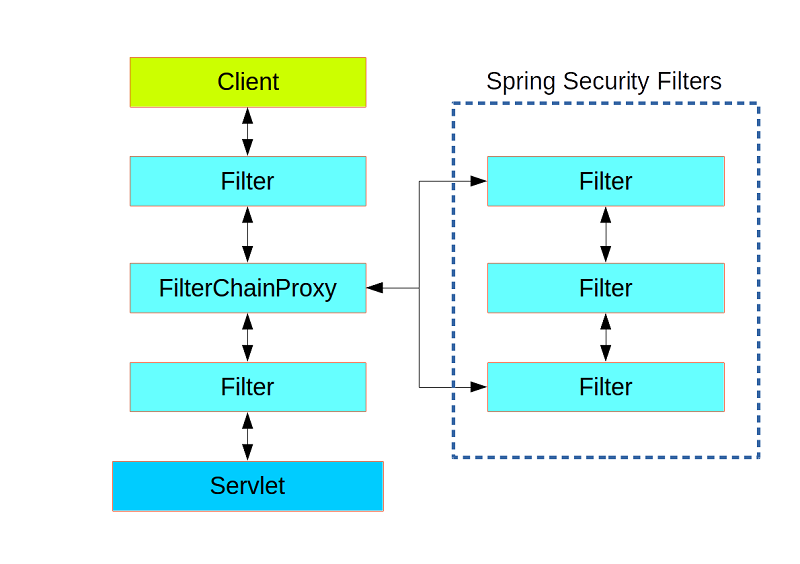
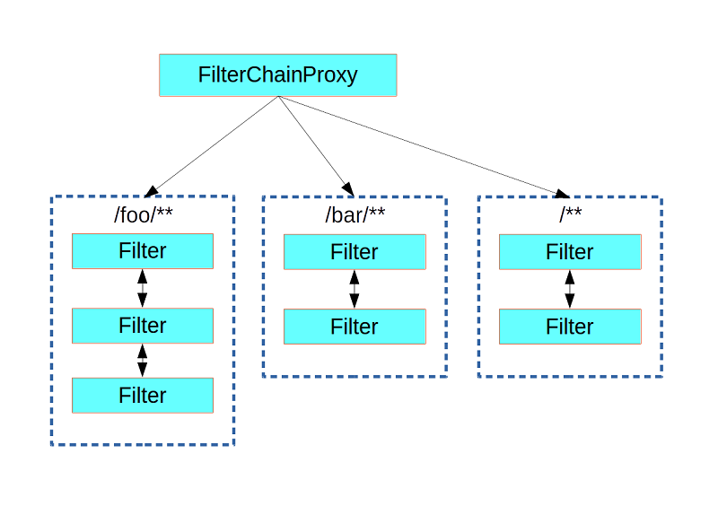

# Spring Security Architecture
> https://spring.io/guides/topicals/spring-security-architecture

应用安全包含两个方面：
- 验证(authentication)
- 授权(authorization)

## Authentication and Access Control
### Authentication
```java
public interface AuthenticationManager {

  Authentication authenticate(Authentication authentication)
    throws AuthenticationException;

}
```
三种结果：
- 验证通过时，返回一个Authentication(此时authenticated=true)；
- 验证失败时返回 null；
- 验证异常时抛出 AuthenticationException。

AuthenticationManager最常用的实现是ProviderManager，它委托到一系列AuthenticationProvider实例
```java
public interface AuthenticationProvider {

	Authentication authenticate(Authentication authentication)
			throws AuthenticationException;

	boolean supports(Class<?> authentication);

}
```


### Customizing Authentication Managers
```java
@Configuration
public class ApplicationSecurity extends WebSecurityConfigurerAdapter {

   ... // web stuff here

  @Autowired
  public void initialize(AuthenticationManagerBuilder builder, DataSource dataSource) {
    builder.jdbcAuthentication().dataSource(dataSource).withUser("dave")
      .password("secret").roles("USER");
  }

}
```
请注意，AuthenticationManagerBuilder是@Autowired到@Bean中的方法 -- 这是使它构建全局（父）AuthenticationManager的原因。

### Authorization or Access Control
一旦身份验证成功，我们就可以授权，这里的核心策略是AccessDecisionManager。
框架提供了三个实现，并且所有三个都委托给 AccessDecisionVoter 链。
```java
boolean supports(ConfigAttribute attribute);

boolean supports(Class<?> clazz);

// object代表用户可能想要访问的任何内容
// ConfigAttributes 表示安全对象的装饰，其中包含一些元数据，用于确定访问它所需的权限级别。例如 ROLE_ADMIN
int vote(Authentication authentication, S object,
        Collection<ConfigAttribute> attributes);
```

## Web Security
Web层中的Spring Security（用于UI和HTTP后端）基于Servlet过滤器
```
Client <-> filters <-> filters <-> filters <-> Servlet
```
过滤器链的顺序非常重要，Spring Boot通过两种机制对其进行管理：
1. 类型为Filter的@Beans可以有@Order或者实现Ordered。
2. 可以成为FilterRegistrationBean的一部分，order作为其API的一部分。

Spring Security作为链中的单个Filter安装，其具体类型为FilterChainProxy。
安全过滤器是ApplicationContext中的@Bean，默认安装它，以便它应用于每个请求。



### Creating and Customizing Filter Chains

`org.springframework.boot.autoconfigure.security.SecurityProperties`
```java
public class SecurityProperties {
    public static final int BASIC_AUTH_ORDER = 2147483642;
    public static final int IGNORED_ORDER = -2147483648;
    public static final int DEFAULT_FILTER_ORDER = -100;
```
可通过 @Order 修饰符降低优先级,作为一个后备
```java
@Configuration
@Order(SecurityProperties.BASIC_AUTH_ORDER - 10)
public class ApplicationConfigurerAdapter extends WebSecurityConfigurerAdapter {
  @Override
  protected void configure(HttpSecurity http) throws Exception {
    http.antMatcher("/foo/**")
     ...;
  }
}
```

### Request Matching for Dispatch and Authorization
您可以通过在HttpSecurity配置器中设置其他匹配器来对授权进行更细粒度的控制
```java
@Configuration
@Order(SecurityProperties.BASIC_AUTH_ORDER - 10)
public class ApplicationConfigurerAdapter extends WebSecurityConfigurerAdapter {
  @Override
  protected void configure(HttpSecurity http) throws Exception {
    http.antMatcher("/foo/**")
      .authorizeRequests()
        .antMatchers("/foo/bar").hasRole("BAR")
        .antMatchers("/foo/spam").hasRole("SPAM")
        .anyRequest().isAuthenticated();
  }
}
```
### Combining Application Security Rules with Actuator Rules
如果您更喜欢Actuator端点的默认安全设置，最简单的方法是在Actuator之后添加您自己的过滤器，
但比回退更早（例如ManagementServerProperties.BASIC_AUTH_ORDER + 1）
```java
@Configuration
@Order(ManagementServerProperties.BASIC_AUTH_ORDER + 1)
public class ApplicationConfigurerAdapter extends WebSecurityConfigurerAdapter {
  @Override
  protected void configure(HttpSecurity http) throws Exception {
    http.antMatcher("/foo/**")
     ...;
  }
}
```
## Method Security
在主App类启动方法级别的安全。
```java
@SpringBootApplication
@EnableGlobalMethodSecurity(securedEnabled = true)
public class SampleSecureApplication {
}
```
将 @Secured 定义于某一个方法上面，值可以指定授权属性。
```java
@Service
public class MyService {

  @Secured("ROLE_USER")
  public String secure() {
    return "Hello Security";
  }

}
```
还有其他注释可用于强制执行安全约束的方法，特别是@PreAuthorize和@PostAuthorize，它们允许您编写包含对方法参数和返回值的引用的表达式。

## Working with Threads
如果正在使用Spring Security，HttpServletRequest中的Principal将是Authentication类型，因此您也可以直接使用它。
```java
@RequestMapping("/foo")
public String foo(Principal principal) {
  Authentication authentication = (Authentication) principal;
  User = (User) authentication.getPrincipal();
  ... // do stuff with user
}
```
### Processing Secure Methods Asynchronously
要将SecurityContext传播到@Async方法，您需要提供AsyncConfigurer并确保Executor的类型正确：
```java
@Configuration
public class ApplicationConfiguration extends AsyncConfigurerSupport {

  @Override
  public Executor getAsyncExecutor() {
    return new DelegatingSecurityContextExecutorService(Executors.newFixedThreadPool(5));
  }

}
```