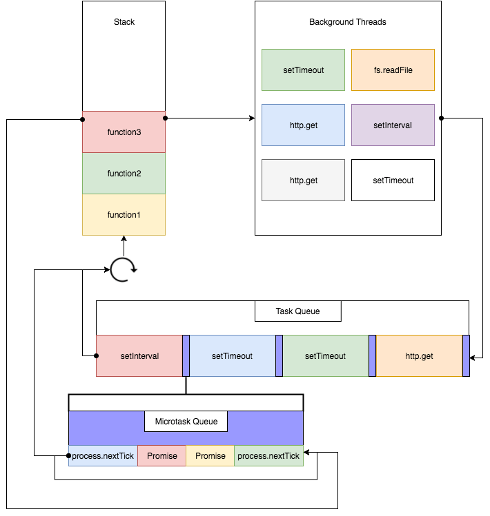

# event loop

## Microtasks and Macrotasks

examples of microtasks:

- process.nextTick
- promises
- Object.observe

examples of macrotasks:

- setTimeout
- setInterval
- setImmediate
- I/O

## Example
```js
console.log('script start') //1

const interval = setInterval(() => {
    console.log('setInterval') //4 //8
}, 0)

setTimeout(() => {
    console.log('setTimeout 1')//5
    Promise.resolve().then(() => {
        console.log('promise 3')//6
    }).then(() => {
        console.log('promise 4')//7
    }).then(() => {
        setTimeout(() => {
            console.log('setTimeout 2') //9
            Promise.resolve().then(() => {
                console.log('promise 5')//10
            }).then(() => {
                console.log('promise 6')//11
            }).then(() => {
                clearInterval(interval)
            })
        }, 0)
    })
}, 0)

Promise.resolve().then(() => {
    console.log('promise 1') //2
}).then(() => {
    console.log('promise 2')//3
})
```
结果
```
script start
promise 1
promise 2
setInterval
setTimeout 1
promise 3
promise 4
setInterval
setTimeout 2
promise 5
promise 6
```
图解



> 图片来自: https://blog.risingstack.com/node-js-at-scale-understanding-node-js-event-loop/

详细分析

Cycle 1:

- `setInterval` is scheduled as task
- `setTimeout 1` is scheduled as task
- in `Promise.resolve 1` both `then`s are scheduled as microtasks
- the stack is empty, microtasks are run
```
script start
promise 1
promise 2
```
Task queue: setInterval, setTimeout 1

Cycle 2:

- the microtask queue is empty, `setInteval`'s handler can be run, another `setInterval` is scheduled as a task, right behind `setTimeout 1`

```
setInterval
```
Task queue: ~~setInterval(done)~~, setTimeout 1, setInterval

Cycle 3:

- the microtask queue is empty, `setTimeout 1`'s handler can be run, `promise 3` and `promise 4` are scheduled as microtasks,
- handlers of `promise 3` and `promise 4` are run `setTimeout 2` is scheduled as task
```
setTimeout 1
promise 3
promise 4
```
Task queue: ~~setInterval(done)~~, ~~setTimeout 1(done)~~, setInterval, setTimeout 2

Cycle 4:

- the microtask queue is empty, `setInteval`'s handler can be run, another `setInterval` is scheduled as a task, right behind `setTimeout`
```
setInterval
```
Task queue: ~~setInterval(done)~~, ~~setTimeout 1(done)~~, ~~setInterval(done)~~, setTimeout 2, setInterval

- `setTimeout 2`'s handler run, `promise 5` and `promise 6` are scheduled as microtasks
```
setTimeout 2
```

Task queue: ~~setInterval(done)~~, ~~setTimeout 1(done)~~, ~~setInterval(done)~~,
 ~~setTimeout 2(done)~~, setInterval
 
Now handlers of promise 5 and promise 6 should be run,and clearing our interval.
```
promise 5
promise 6
```
Task queue: ~~setInterval(done)~~, ~~setTimeout 1(done)~~, ~~setInterval(done)~~,
 ~~setTimeout 2(done)~~, ~~setInterval(cancelled)~~