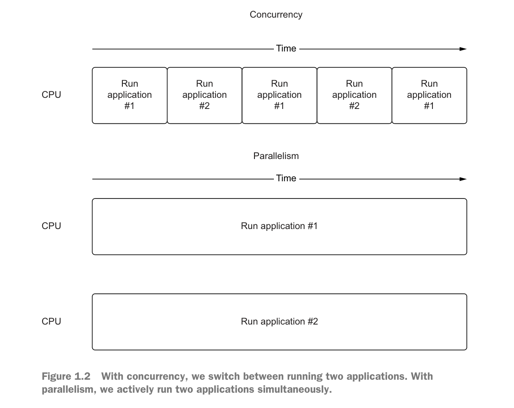
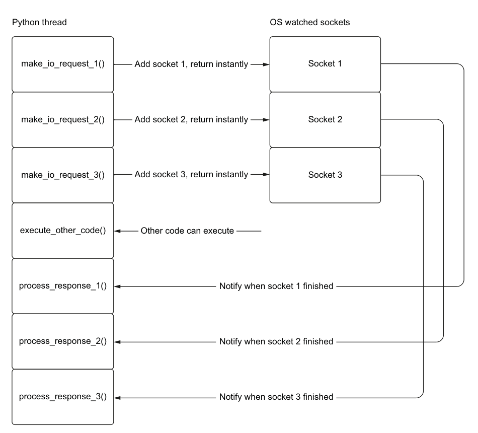
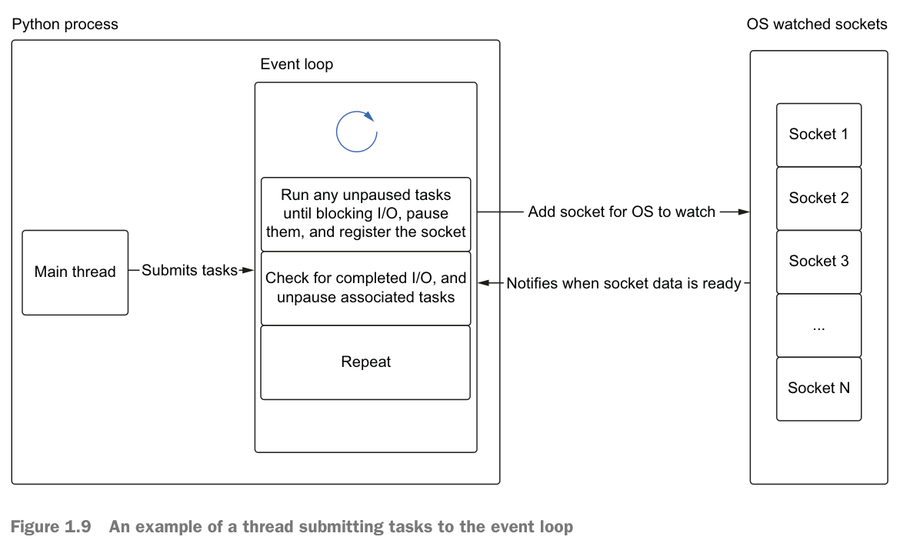
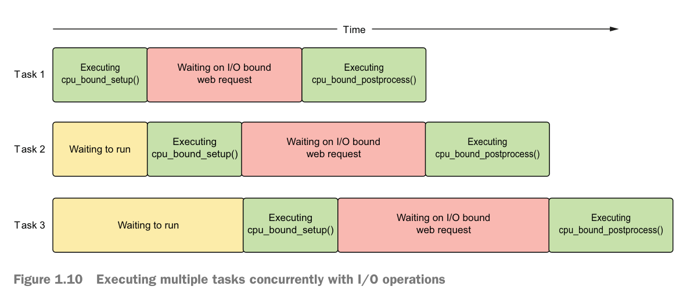

# 01

## 区分并发和并行

- 并发指的是任务的切换，同一时刻并不会同时进行多个任务，只能不停地交替做任务。
- 并行指的是不同的任务同时进行者，好像你有分身在独立地帮你干活。如果只有一个CPU，那么并行是不可能的。



## 区分并发，并行，多任务

asyncio uses cooperative multitasking to achieve concurrency。


## 区分进程、线程、多线程、多进程


### GIL的阻力

但是，这些并发模型的功能受到 Python 的实现细节（全局解释器锁）的阻碍。

> Briefly, the GIL prevents one Python process from executing more than one Python bytecode instruction at any given time. 
>
> This means that even if we have multiple threads on a machine with multiple cores, a Python process can have only one thread running Python code at a time.

一个进程代表一把GIL，也就是GIL限制的是多线程的上限能力。

例如，你有8核，那么8个GIL，同时可以有8个线程指令在运行。CPU核心数就是能力上限了。

GIL的背后，其实是Cpython实现，因为Cpython的线程不安全，所以创建了GIL机制来保证运算结果的正确，然而，这大大限制了CPU的计算能力。


So how is it that we can release the GIL for I/O but not for CPU-bound operations? The answer lies in the system calls that are made in the background.

但是，在 Python 中，由于 GIL，我们能做的最好的事情就是并发我们的 I/O 操作，并且在给定时间只执行一段 Python 代码。

由此，asyncio诞生，它解决的，正是这样一个问题。

asyncio exploits the fact that I/O operations release the GIL to give us concurrency,even with only one thread。


## event notification systems

The following are the event notification systems used
by specific operating systems:

- kqueue—FreeBSD and MacOS
- epoll—Linux
- IOCP (I/O completion port)—Windows




## event loop

```python
from collections import deque

messages = deque()

while True:
    if messages:
        message = messages.pop()
        process_message(message)
```

```py
def make_request():
    cpu_bound_setup()
    io_bound_web_request()
    cpu_bound_postprocess()
    
task_one = make_request()
task_two = make_request()
task_three = make_request()
```





从垂直切片看，任意一个时刻，CPU只有一件事情在做。

在等待IO时，事件轮训机制让下面的CPU代码得到执行。