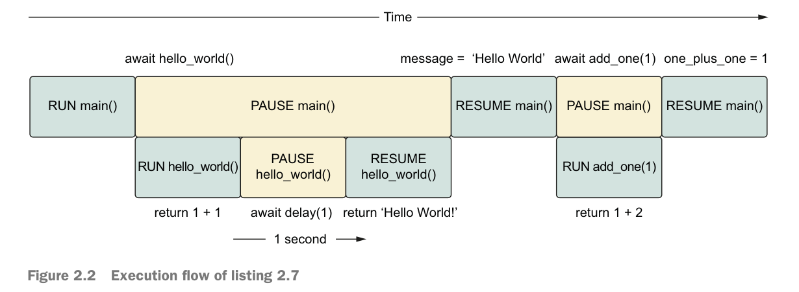
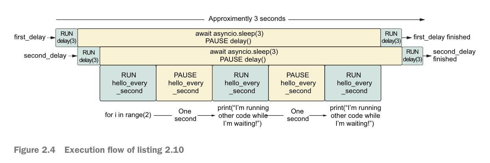
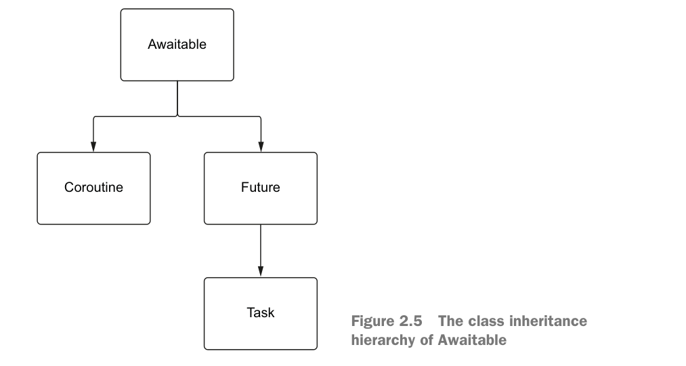

# 02

## async/await
The async keyword will let us define a coroutine; the await key-
word will let us pause our coroutine when we have a long-running operation.

这一点，和JS很像。

```python
async def add_one(number: int) -> int:
    return number + 1


async def main() -> None:
    one_plus_one = await add_one(1)
    two_plus_one = await add_one(2)
    print(one_plus_one)
    print(two_plus_one)


asyncio.run(main())
```


## 串行例子

```python
async def add_one(number: int) -> int:
    return number + 1


async def hello_world_message() -> str:
    await delay(1)
    return 'Hello World!'


async def main() -> None:
    message = await hello_world_message()
    one_plus_one = await add_one(1)
    print(one_plus_one)
    print(message)


asyncio.run(main())
```



上面的代码依旧没有释放多线程的威力，就像是串行执行，性能一般。

- await 同步挂起等待。后续代码没法立即执行。
- tasks 执行挂起当前任务，后续代码可以得到立即执行。


## task例子

```python
async def main():
    sleep_for_three = asyncio.create_task(delay(3))
    sleep_again = asyncio.create_task(delay(3))
    sleep_once_more = asyncio.create_task(delay(3))

    await sleep_for_three
    await sleep_again
    await sleep_once_more


asyncio.run(main())
```

大约3s就能执行完毕。在遇到第一个await语句后，可以立即执行后续的await语句，因此类似于3个任务同时执行，然后一起等待。


## 具体的task模型

```python
async def hello_every_second():
    for i in range(2):
        await asyncio.sleep(1)
        print("I'm running other code while I'm waiting!")


async def main():
    first_delay = asyncio.create_task(delay(3))
    second_delay = asyncio.create_task(delay(3))
    await hello_every_second()
    await first_delay
    await second_delay

asyncio.run(main())
```

```
sleeping for 3 second(s)
sleeping for 3 second(s)
I'm running other code while I'm waiting!
I'm running other code while I'm waiting!
finished sleeping for 3 second(s)
finished sleeping for 3 second(s)
```



从竖直时间片来看，任意一个时刻，CPU都只能做一件事情。（绿色代表CPU的工作）。

## task, future and coroutine

- When we create a task, we are creating an empty future and running the coroutine.
- Then, when the coroutine has completed with either an exception or a result, we set the result or exception of the future.




## Measuring coroutine execution time with decorators

起点代码的样子：

```python
import asyncio
import time

async def main():
    start = time.time()
    await asyncio.sleep(1)
    end = time.time()
    print(f'Sleeping took {end - start} seconds')
    
asyncio.run(main())
```


## custom own event loop

```py
async def main():
    await asyncio.sleep(1)


loop = asyncio.new_event_loop()

try:
    loop.run_until_complete(main())
finally:
    loop.close()
```


## debug mode

- asyncio.run(coroutine(), debug=True)
- python3 -X dev program.py
- PYTHONASYINCIODEBUG=1 python3 program.py