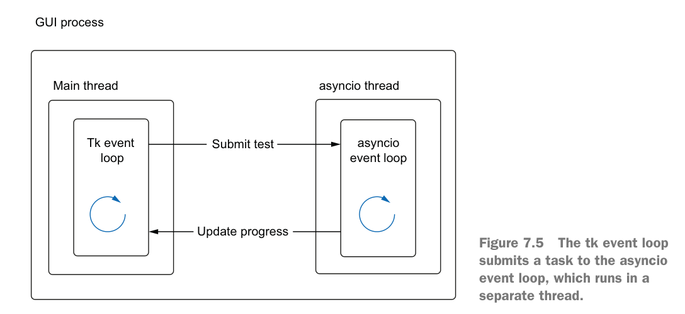

# 07

blocking http client library: requests

## GUI

- call_soon_threadsafe
- coroutine_threadsafe.

> This technique of running the asyncio event loop in a separate thread is useful for building responsive GUIs,
but also is useful for any synchronous legacy applications where coroutines and asyncio don’t fit smoothly.

## Using threads for CPU-bound work

Low-level libraries(hashlib and numpy) will sometimes release the GIL, which lets us use threading for CPU-
bound work.
