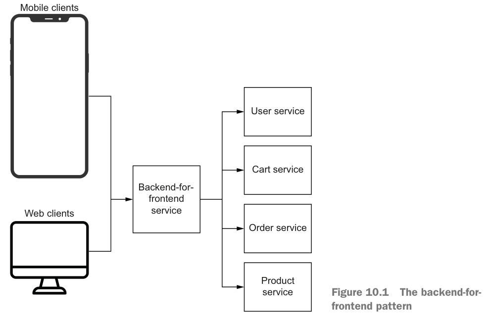
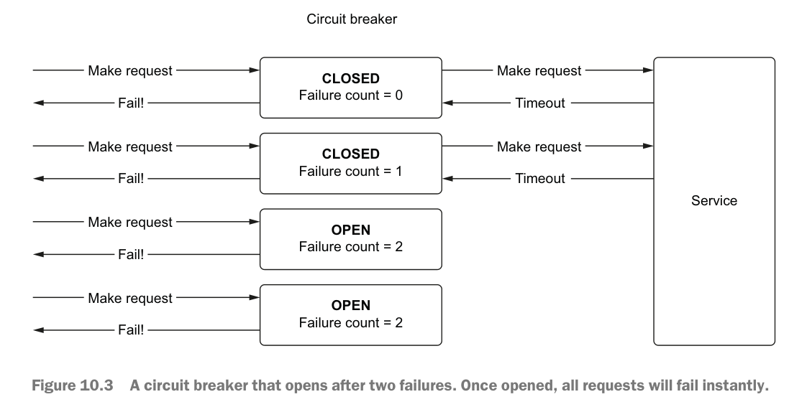

# 10 microservices

- The basics of microservices
- The backend-for-frontend pattern
- Using asyncio to handle microservice communication
- Using asyncio to handle failures and retries

## microservices

- They are loosely coupled and independently deployable.
- They have their own independent stack, including a data model.
- They communicate with one another over a protocol such as REST or gRPC.
- They follow the “single responsibility” principle; that is, a microservice should “do one thing and do it well.”

优点：

- 缓解技术债
- 灵活伸缩独立服务的规模，把资源给到性能瓶颈上，而不是一视同仁。
- 开发团队和运维团队可以独立，技术栈也可以独立。

asyncio可以做什么？可以并发请求来提升API性能。

## Introducing the backend-for-frontend pattern

backend-for-frontend pattern. In this design pattern, instead of our UIs directly communicating with our services, 
we create a new service that makes these calls and aggregates the responses.

就是这是一个API聚合编排服务，专门为前端UI页面提供简单友好的接口。

## Using asyncio to handle microservice communication

参阅代码。

性能需求：
- The API should never wait for the product service more than 1 second. If it
takes longer than 1 second, we should respond with a timeout error (HTTP
code 504), so the UI does not hang indefinitely.
- The user cart and favorites data is optional. If we can get it in within 1 second,
that’s great! If not, we should just return what product data we have.
- The inventory data for products is optional as well. If we can’t get it, just return
the product data
  

## Using asyncio to handle failures and retries

circuit breaker pattern.

