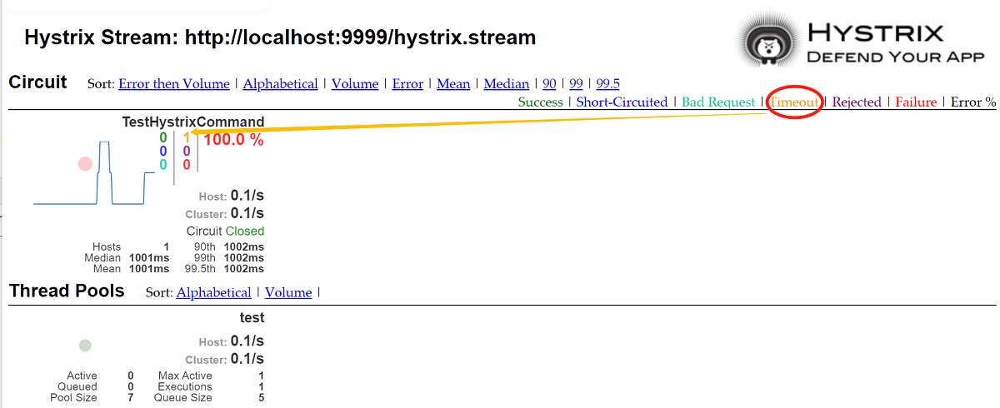

# Hystrix

## maven dependency
```xml
<dependency>
    <groupId>org.springframework.cloud</groupId>
    <artifactId>spring-cloud-starter-netflix-hystrix</artifactId>
</dependency>
<dependency>
    <groupId>org.springframework.cloud</groupId>
    <artifactId>spring-cloud-starter-netflix-hystrix-dashboard</artifactId>
</dependency>
```

## circuit breaker
in test module. create ``TestHystrixCommand``:
```java
public class TestHystrixCommand extends HystrixCommand<String> {

    public TestHystrixCommand(String groupKey){
        super(HystrixCommandGroupKey.Factory.asKey(groupKey));
    }

    @Override
    protected String run() {
        try {
            //mock http timeout
            Thread.sleep(10000);
        }catch (Exception e){
            e.printStackTrace();
        }
        return "TestHystrixCommand ok!";// #mock do something here.
    }

    @Override
    protected String getFallback() {
        return "TestHystrixCommand fallback.";
    }
}
```
start test module. GET ``localhost:9999/testHystrix``, the response is: ``TestHystrixCommand fallback.``.

## hystrix dashboard
1.main class add ``@EnableHystrixDashboard`` annotation.

2.browser visit ``http://localhost:9999/hystrix``.
it has 3 monitor way:
```
Cluster via Turbine (default cluster): http://turbine-hostname:port/turbine.stream
Cluster via Turbine (custom cluster): http://turbine-hostname:port/turbine.stream?cluster=[clusterName]
Single Hystrix App: http://hystrix-app:port/hystrix.stream
```
enter: ``http://localhost:9999/hystrix.stream`` you will get:
```
Unable to connect to Command Metric Stream.
```

3.because in spring boot 2.0+, hystrix don't load ``hystrix.stream`` endpoint by default.
you can enable it by java code:
```java
public class TestApplication extends Application {
    //...
    
    @Bean
    public ServletRegistrationBean getServlet(){
        HystrixMetricsStreamServlet streamServlet = new HystrixMetricsStreamServlet();
        ServletRegistrationBean registrationBean = new ServletRegistrationBean(streamServlet);
        registrationBean.setLoadOnStartup(1);
        registrationBean.addUrlMappings("/hystrix.stream");
        registrationBean.setName("HystrixMetricsStreamServlet");
        return registrationBean;
    }
}
```
4.restart test module. visit ``http://localhost:9999/hystrix.stream`` again.




