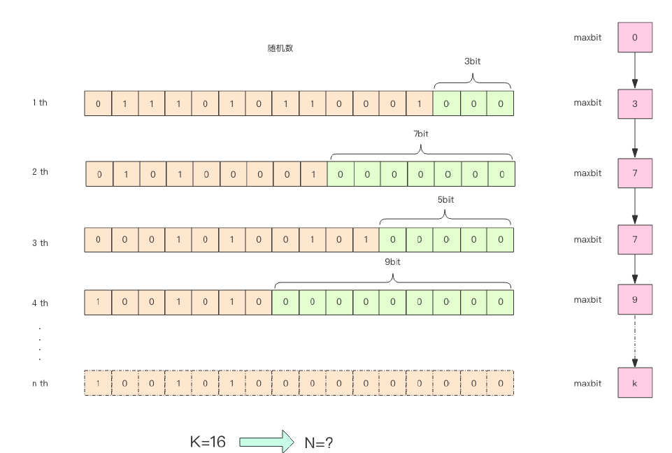

err# redis HyperLogLog
划重点：解决精确度不高的统计需求。

## 场景
### 统计 PV

每个网页一个独立的 Redis 计数器，这个计数器的 key 后缀加上当天的日期。来一个请求，incrby 一次，就可以统计出所有的 PV 数据。
```
key:page1-2019-11-11 value:1
key:page1-2019-11-11 value:2
...
```

### 统计 UV

同一个用户一天之内的多次访问请求只能计数一次。要求每一个网页请求都需要带上用户的 ID，无论是登陆用户还是未登陆用户都需要一个唯一 ID 来标识。

- 方案1：使用Set。每一个页面一个独立的 set 集合来存储所有当天访问过此页面的用户 ID。当一个请求过来时，使用 sadd 将用户 ID 添加进去。
通过 scard 取出这个集合的大小，就是这个页面的 UV 数据。

- 方案2：使用HyperLogLog。HyperLogLog 提供不精确的去重计数方案，标准误差是 0.81%，精确度已经可以满足上面的 UV 统计需求。

## 使用
HyperLogLog 指令
- pfadd
- pfcount
- pfmerge，将多个 pf 计数值累加在一起形成新的 pf 值。

## 注意事项
- 不适合统计单个用户相关的数据

## HLL原理

> 该图来自《Redis 深度历险》

先说结论：给定一系列的随机整数，记录下低位连续0位的最大长度 k，通过 k 值可以估算出随机数的数量。

### 为什么？
测试程序 [PfMock](..\src\main\java\io\github\wdpm\redis\hyperloglog\PfMock.java)

部分输出 [完整输出文件](..\docs\PfMock-output.txt)
```
99100 16.60 22
99200 16.60 15
99300 16.60 15
99400 16.60 17
99500 16.60 14
99600 16.60 16
99700 16.61 16
99800 16.61 17
99900 16.61 17
```
K 和 N 的对数之间存在显著的线性相关性：
```
N=2^K
```
如果 N 介于 2^K 和 2^(K+1) 之间，这种方式估计值都等于 2^K，不合理。
可以采用多个 BitKeeper，进行加权估计，就可以得到一个比较准确的值。
---
加权的测试程序 [PfMock2](..\src\main\java\io\github\wdpm\redis\hyperloglog\PfMock2.java)

代码中分 1024 个桶，计算平均数使用调和平均 (倒数的平均)。普通平均可能因为个别离群值对平均结果产生较大的影响，调和平均可以有效平滑离群值的影响。
```
avg=(3+4+5+104)/4=29
avg=4/(1/3+1/4+1/5+1/101)=5.044
```
### pf 的内存占用为什么是 12k？
上面的算法中使用了 1024 个桶进行独立计数，Redis 的 HyperLogLog 用的是 16384 个桶，也就是 2^14，
每个桶的 maxBits 需要 6 个 bits 来存储，最大可以表示 maxBits=63，于是总共占用内存就是2^14 * 6 bits / 8  = 12888 Byte = 12k字节。

## 扩展阅读
- HyperLogLog 复杂的公式推导 Count-Distinct Problem