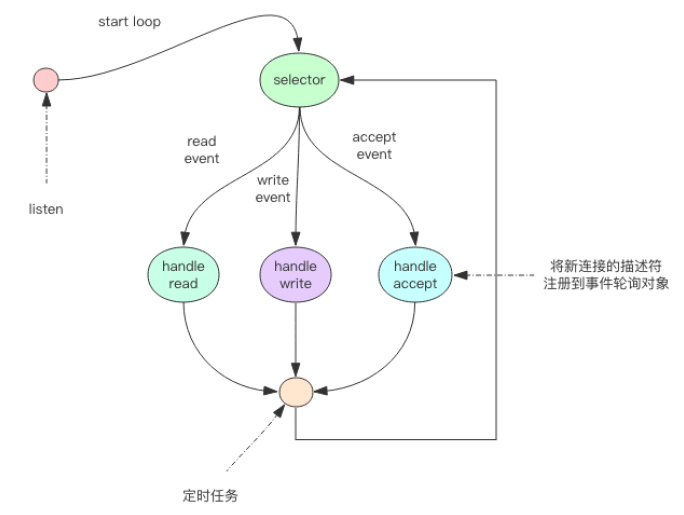

# redis 线程 I/O 模型

> Redis 单线程为什么这么快？

因为数据都在内存中，所有的运算都是内存级别的运算。

> Redis 单线程如何处理并发客户端连接？

事件轮询(多路复用)，非阻塞IO。

## 非阻塞IO
套接字的读写方法，默认是阻塞的。

非阻塞 IO 在套接字对象上提供了一个选项Non_Blocking，当这个选项打开时，
- 读写方法不会阻塞，能读多少读多少，能写多少写多少。
- 读多少取决于内核为套接字分配的读缓冲区内部的数据字节数，写多少取决于内核为套接字分配的写缓冲区的空闲空间字节数。
- 读方法和写方法都通过返回值来告知程序实际读写了多少字节。

## 事件轮询(多路复用)
最简单的事件轮询 API 是select函数，它是操作系统提供给用户程序的 API。
- 输入是读写描述符列表read_fds & write_fds
- 输出是与之对应的可读可写事件。
- 同时提供了一个timeout参数，如果没有任何事件到来，最多等待timeout时间，线程处于阻塞状态。

拿到事件后，线程继续挨个处理相应的事件。处理完了继续轮询。这个死循环称为事件循环，一个循环为一个周期。


> 图片来自《Redis 深度历险》

伪代码描述
```
read_events, write_events = select(read_fds, write_fds, timeout)
for event in read_events:
    handle_read(event.fd)
for event in write_events:
    handle_write(event.fd)
handle_others() # 处理其它事情，如定时任务等
```
> - 现代操作系统的多路复用 API 不再使用select系统调用，而改用epoll(linux)和kqueue(freebsd & macosx)
> - 事件轮询 API 就是Java 语言里面的NIO 技术

## 指令队列
每个客户端套接字关联一个指令队列。客户端的指令通过队列来排队进行顺序处理，先到先服务。

## 响应队列
通过响应队列来将指令的返回结果回复给客户端。如果队列为空，意味着连接暂时处于空闲状态，
不需要去获取写事件，可以将当前的客户端描述符从write_fds里面移出来。等到队列有数据了，再将描述符放进去。

## 定时任务
定时任务会记录在最小堆的数据结构中。最快要执行的任务排在堆的最上方。
- 在每个循环周期，会将最小堆里面已经到点的任务立即进行处理。
- 处理完毕后，将最快要执行的任务还需要的时间记录下来，这个时间就是select系统调用的timeout参数。
- 未来timeout时间内，没有其它定时任务需要处理，可以安心睡眠timeout的时间。


