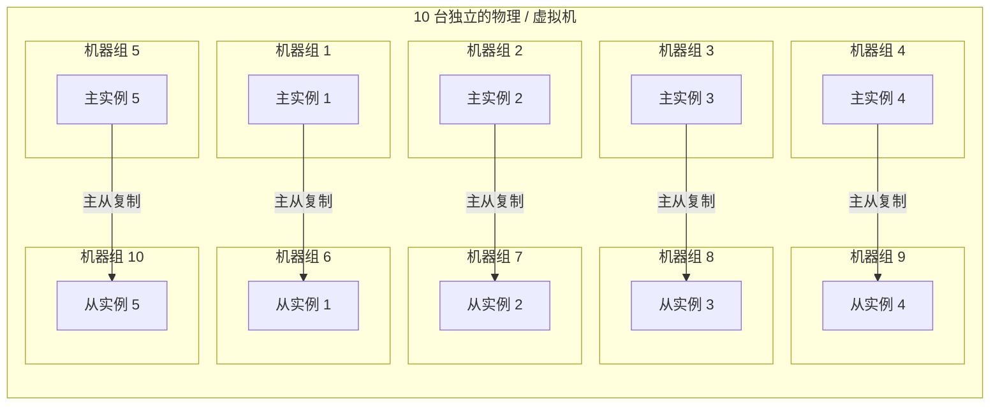

# 高级 Java 知识

> https://github.com/doocs/advanced-java

## MQ

### 消息队列简介

消息队列常见的使用场景：解耦、异步、削峰。

```
A system ----> MQ -----> B system
```

- 解耦指的是在两个系统之间加入一个消息中间件，缺点是增加延迟。
- 异步指的是 A 系统往 B 系统写数据从直接变成间接，从同步变成异步。添加 MQ 后，B 系统可以灵活控制消费 MQ 数据的时机。
- 削峰指的是应对流量高峰，虽然整个系统的瓶颈依旧取决于数据库链接或者程序处理处理速度的短板。
  但是高峰过后，MQ 中积压的消息会在低峰期逐渐被消费掉。

消息队列的缺点：

- 系统可用性降低，增加的这个消息中间件可能是系统的单点故障发生地。
- 系统复杂度提高，引入 MQ 后，要考虑消息消费的幂等性、顺序性、持久性（是否会丢失消息）。
- 数据一致性问题。MQ 消息可能被多个消费者消费，例如 B、C、D。如果 BC 成功消费，而 D 消费失败，此时如何处理也需要仔细考虑。

市面上主流消息队列框架的对比和评价：

- ActiveMQ
- RabbitMQ: 基于 erlang 开发，并发能力强，延时很低。开源社区活跃度很高。
- RocketMQ：分布式架构。开源社区活跃度不高。
- Kafka：分布式架构。在大数据领域的实时计算和日志采集领域被广泛使用。

### 消息队列的高可用

MQ 的高可用性，以 RabbitMQ 为例说明。

RabbitMQ 有三种模式：单机模式、普通集群模式、镜像集群模式。

- 单机模式：demo 模式，玩具模式，不具备任何高可用性。
- 普通集群模式（无高可用性）：本质就是多台机器上启动多个 RabbitMQ 实例，每台机器启动一个。
  你创建的 queue，只会放在一个 RabbitMQ 实例上，每个实例都可以同步 queue 元数据（元数据是 queue 的一些配置信息，
  通过元数据，可以找到 queue 所在实例）。消费者如果连接到了另外一个实例，那么那个实例会从 queue 所在实例上拉取数据过来。
  那么，分析到这里，就可以理解为有数据拉取的开销，底层还是受限于单实例性能瓶颈。

```
+-----------------------------+              +-----------------------------+
|      RabbitMQ 进程（实例）   |              |      RabbitMQ 进程（实例）     |
|     部署在独立的一台机器上    |              |     部署在独立的一台机器上      |
+-----------------------------+               +-----------------------------+
             |                                         |
             | queue 元数据                            |
             |                                         |
                                                  +----+----+
                                                  | queue   |
                                                  |( 元数据和 |
                                                  | 实际数据 )|
                                                  +---------+
                                                       |
                                                  +----+----+    +-------+    +-------+
                                                  | data1   |    | data2 |    | data3 |
                                                  +---------+    +-------+    +-------+

第一个实例仅包含队列的元数据。   
第二个实例包含一个队列（queue）及其元数据和实际数据（data1, data2, data3）。 
这方案本质上是提高吞吐量的。                                      
```

- 镜像集群模式（高可用性）：在镜像集群模式下，你创建的 queue，无论是元数据还是 queue 里的消息都会存在于多个实例上，
  就是说，每个 RabbitMQ 节点都有这个 queue 的一个完整数据副本。每次你写消息到 queue 的时候，都会自动把消息同步到多个实例的
  queue 上。

```
+-------------------------+        +-------------------------+ 
|   RabbitMQ 节点           |       |   RabbitMQ 节点           | 
|   +-----------------+   |        |   +-----------------+   | 
|   |     queue       |   |        |   |     queue       |   | 
|   +-----------------+   |        |   +-----------------+   |                                                                    
```

---

Kafka 的高可用性。

Kafka 基本的架构：由多个 broker 组成，每个 broker 是一个节点；你创建一个 topic，这个 topic 可以划分为多个 partition，
每个 partition 可以存在于不同的 broker 上，每个 partition 就放一部分数据。一个 topic 的数据，是分散放在多个机器上的，每个机器就只放一部分数据。

```
                          ┌─────────────┐                   topic data 3             
    topic data1           │             ┼─────────────────────┐          
       ┌──────────────────┼   生产者    │                     │          
       │                  └───────┬─────┘                     │          
       │                          │topic data 2               │            
       │                          │                           │          
       │                          ▼                           │          
┌──────▼──────┐              ┌───────────┐             ┌──────▼──────┐   
│   机器 1     │ leader       │   机器 2   │leader        │  机器 3      │ leader 
│             │              │           │             │             │   
│   broker    │◄──────┐      │    broker │       ┌─────►   broker    │   
│             │       │      │           │       │     │             │   
└──────┬──────┘       │      └─────┬─────┘       │     └───────┬─────┘   
       │              │            │             │             │         
       │ sync         │            │sync         │             │sync         
       │              │            ▼             │             ▼         
       ▼              │      ┌────────────┐      │      ┌──────────────┐ 
┌────────────┐        │      │            │      │      │              │ 
│   机器 4    │        │      │   机器 5     │      │      │  机器 6       │ 
│            │        │      │            │      │      │              │ 
│  broker    │        │      │  broker    │      │      │    broker    │ 
└────────────┘        │      └────────────┘      │      └──────────────┘ 
     follower         │          follower        │           follower                             
                      │     ┌──────────────┐     │                       
                      │     │              │     │                       
                      └─────┼    消费者    ┼─────┘                       
                            │              │                            
                            │              │                             
                            └──────────────┘                             
```

### 消息不被重复消费

MQ 框架本身并不内置消息幂等性的开箱即用机制，所以只能在业务层自行实现。

以 kafka 的一个场景举例分析。

- 数据 1/2/3 依次进入 Kafka，Kafka 给这三条数据每条分配一个 offset，代表这条数据的序号，假设分配的 offset 依次是
  152/153/154。
- 消费者按照这个顺序去消费。假如当消费者消费完了 offset=153 的这条数据，刚准备去提交 offset 到 Zookeeper，此时消费者进程被重启了。
  那么此时消费过的数据 1/2 的 offset 并没有提交，Kafka 不知道你已经消费了 offset=153 这条数据。
- 消费者重启之后，找 Kafka 要求补发消息，即消息续传。
- 由于之前 offset 没有提交成功，那么数据 1/2 会再次传过来，如果此时消费者没有去重的话，那么就会导致重复消费。

现在，思考消费者如何保证写数据库的一致性。

- 对于 RDBMS，可以借助数据库记录 key 的唯一性来保证这个约束。如果已存在，那就改为 update 而不是全新的 insert。
- 对于 NoSQL，往往利用的是自定义的唯一消息 ID，例如 UUID。在写库时，先查询这个数据记录是否处理过，从而避免重复处理。

### 保证消息不会丢失

对于 rabbitMQ:

-
    1. 生产者 -> rabbitmq 途中消息丢失。
- 2.rabbitmq 自己把消息弄丢，可能是宕机，内存数据丢失。
-
    3. 消费者已正常收到消息，但是处理不当，rabbitmq 以为消费者没有收到消息。

第一种情形：生产者弄丢了数据

- 开启事务。开启 RabbitMQ 事务 channel.txSelect()，但是这种方式吞吐量会受到很大影响，性能不佳。
- 使用 confirm 模式。
    - 普通 confirm 模式
  ```java
  channel.basicPublish(ConfirmConfig.exchangeName, ConfirmConfig.routingKey, MessageProperties.PERSISTENT_TEXT_PLAIN, ConfirmConfig.msg_10B.getBytes());
  if (!channel.waitForConfirms()) {
      // 消息发送失败
      // ...
  }
  ```
    - 异步 confirm 模式
  ```java
  SortedSet<Long> confirmSet = Collections.synchronizedSortedSet(new TreeSet<Long>());
  channel.confirmSelect();
  channel.addConfirmListener(new ConfirmListener() {
    public void handleAck(long deliveryTag, boolean multiple) throws IOException {
        if (multiple) {
            confirmSet.headSet(deliveryTag + 1).clear();
        } else {
            confirmSet.remove(deliveryTag);
        }
    }
  
    public void handleNack(long deliveryTag, boolean multiple) throws IOException {
        System.out.println("Nack, SeqNo: " + deliveryTag + ", multiple: " + multiple);
        if (multiple) {
            confirmSet.headSet(deliveryTag + 1).clear();
        } else {
            confirmSet.remove(deliveryTag);
        }
    }
  });
  
  while (true) {
    long nextSeqNo = channel.getNextPublishSeqNo();
    channel.basicPublish(ConfirmConfig.exchangeName, ConfirmConfig.routingKey, MessageProperties.PERSISTENT_TEXT_PLAIN, ConfirmConfig.msg_10B.getBytes());
    confirmSet.add(nextSeqNo);
  }
  ```

代码解释：

场景 1：收到 `deliveryTag = 5, multiple = true`

```java
confirmSet.headSet(5 + 1).clear(); // 即 headSet(6).clear()
```

执行结果：

- headSet(6) 返回 [1, 2, 3, 4, 5]（所有 ≤5 的元素）
- .clear() 移除这些元素
- 剩余集合：[6, 7, 8, 9, 10]

---

第二种情形：RabbitMQ 弄丢了数据

rabbitmq 设置持久化有两个步骤：

- 配置 queue 元数据持久化：创建 queue 的时候将其设置为持久化。保证 RabbitMQ 持久化 queue 的元数据，但是不会持久化 queue
  里的数据。
- 配置消息持久化：发送消息时将消息的 deliveryMode 设置为 2。就是将消息设置为持久化的，此时 RabbitMQ 就会将消息持久化到磁盘上去。

注意点：持久化跟生产者那边的 confirm 机制结合，只有消息被持久化到磁盘之后，才会通知生产者 ack 了，
所以哪怕是在持久化到磁盘之前，RabbitMQ 挂了，数据丢了，生产者收不到 ack ，也需要重发。

---

第三种情形：消费端弄丢了数据

有这么一种情况：消费者接收到消息，还没处理，结果进程挂了。这种情况应该被视为没有收到消息，要求消息补偿重发。
但是，rabbitmq 可能会认为消费者已经处理。因此，必须重新考虑消息处理的确认机制。

> 为保证消息从队列中可靠地到达消费者，RabbitMQ 提供了消息确认机制。消费者在声明队列时，可以指定 noAck 参数，
> 当 noAck=false，RabbitMQ 会等待消费者显式发回 ack 信号后，才从内存（和磁盘，如果是持久化消息）中移去消息。
> 否则，默认情况下，一旦消息被消费者消费，RabbitMQ 会在队列中立即删除它。


下面是对于 kafka：

> 生产者会不会弄丢数据？

设置 acks=all ，一定不会丢，要求是，你的 leader 接收到消息，所有的 follower 都同步到了消息之后，才认为本次写成功了。
如果没满足这个条件，生产者会自动不断的重试，重试无限次。

> Kafka 弄丢了数据

设置参考：

- 给 topic 设置 replication.factor 参数：这个值必须大于 1，要求每个 partition 必须有至少 2 个副本。
- 在 Kafka 服务端设置 min.insync.replicas 参数：这个值必须大于 1，这个是要求一个 leader 至少感知到有至少一个 follower
  还跟自己保持联系，
  没掉队，这样才能确保 leader 挂了还有一个 follower 。
- 在 producer 端设置 acks=all ：这个是要求每条数据，必须是写入所有 replica 之后，才能认为是写成功了。
- 在 producer 端设置 retries=MAX （很大很大很大的一个值，无限次重试的意思）：这个是要求一旦写入失败，就无限重试。

> 消费端弄丢了数据

Kafka 会自动提交 offset，那么只要关闭自动提交 offset，在处理完之后自己手动提交 offset，就可以保证数据不会丢。
但是此时确实还是可能会有重复消费，比如你刚处理完，还没提交 offset，结果自己挂了，此时肯定会重复消费一次，自己需要处理幂等性。

### 如何保证消息的顺序性？

待补充。原文写的不清楚。

### 解决消息积压和消息过期失效

场景：消费端每次消费之后要写 mysql，结果 mysql 挂了，消费端因此卡住；或者是消费端出了个什么问题，导致消费速度极其慢。

> 大量消息在 mq 里积压了几个小时了还没解决

先恢复 consumer 的消费速度，然后扩容 mq 的 queue。处理完毕后，恢复以前的处理规模架构。

> mq 中的消息过期失效了

假设 1 万个订单积压在 mq 里面，没有处理，其中 1000 个订单都丢了，可以手动写程序把那 1000 个订单给查出来，手动发到 mq 里去再补一次。

对于 RocketMQ，官方针对消息积压问题，提供了解决方案。这些方式有一定启发。

- 提高消费并行度。如果能同时消费，肯定比串行排队消费更加灵活和迅速。
- 尽量批量方式消费。某些业务流程如果支持批量方式消费，那么一次处理 1 个消息对比一次处理 100 个消息，效率肯定有区别。
- 跳过非重要消息。如果某些消息允许抛弃，那么抛弃部分消息将有效减少压力。

### 消息队列的简易架构设计

kafka 的设计理念，broker -> topic -> partition，每个 partition 放一个机器，就存一部分数据。
如果资源不够了，给 topic 增加 partition，然后做数据迁移，增加机器，就可以存放更多数据。

其中：

- Broker（代理节点）：一个独立的 Kafka 服务器实例。一个 Kafka 集群由多个 Broker 组成。
    - 分布式、无中心，避免单点故障。
- Topic（主题）：消息的逻辑分类，可以看作一个数据流（如 user-logs, order-events）。
    - 生产者向特定 Topic 发送消息，消费者从特定 Topic 读取消息。
    - 不同的业务数据通过不同的 Topic 进行隔离，互不影响。
- Partition（分区）：Kafka 实现高并发的核心。
    - 每个 Topic 可以被划分为一个或多个 Partition。每个 Partition 是一个有序的、不可变的消息序列。
    - 顺序性：偏移量 offset 标识是保证局部顺序性的关键。
    - 并行处理：不同 Partition 的消息可以并行处理。
    - 水平扩展：通过增加 Partition 数量，可以线性地提升 Topic 的吞吐量。
    - 复制与容错：每个 Partition 都有多个副本（Replica），分散在不同 Broker 上。其中一个副本是 Leader，负责读写；其他是
      Follower，从 Leader 同步数据。
    - 通过分片实现极高的吞吐量和并发处理能力。这是 Kafka 与很多传统消息队列（如 RabbitMQ）在架构上最根本的区别之一。

举例

```
# 生产者视角：消息被发布到 Topic 的某个 Partition
+----------+      +-----------------+      +-----------------------+
| Producer |----->| Topic: click-stream |----->| Partition Assignment |
+----------+      +-----------------+      +-----------------------+
                                                 |     |     |
                                                P0    P1    P2
                                                 |     |     |
                                                v     v     v
+-------------------------------------------------------------------+
|                          Kafka Cluster                           |
|  +----------+     +----------+     +----------+                  |
|  | Broker 1 |     | Broker 2 |     | Broker 3 |                  |
|  | [P0-Leader] | | [P1-Leader] | | [P2-Leader] |                  |
|  | [P2-Follower]| | [P0-Follower]| | [P1-Follower]|                |
|  +----------+     +----------+     +----------+                  |
+-------------------------------------------------------------------+
       |                 |                 |
       |                 |                 |
      C1                C2                C3
(消费 P0)           (消费 P1)           (消费 P2)
```

流程：

- 生产者将消息发布到 `click-stream` Topic。
- Kafka 根据配置的分区策略（如轮询或基于消息 Key 的哈希）决定将消息写入 P0、P1 还是 P2。
- 每个 Partition 的 Leader 副本（分布在不同的 Broker 上）负责处理读写。
- Follower 副本从 Leader 持续同步数据。
- 消费者组（例如由 C1, C2, C3 组成）进行消费。每个消费者被分配一个或多个 Partition，从而实现并行消费和高吞吐。

## ES

### ES 的分布式架构原理

```
index -> type(ES 7.x 已废弃) -> mapping -> document -> field
```

- index: 类比关系型数据库中的 Database。
- Mapping (映射)：类比关系型数据库中的 Schema（表结构定义）。可以由 ES 自动推断（动态映射），也可以由用户明确定义。
- Document (文档)：类比关系型数据库中的 Row（一行记录）。
- Field (字段)：类比关系型数据库中的 Column（列）/ 字段。

存储原理：

一个索引可以拆分成多个 shard ，每个 shard 存储部分数据。拆分多个 shard 有以下特点：

- 支持横向扩展，例如数据量是 3T，3 个 shard，每个 shard 1T 数据，若现在数据量增加到 4T，只需重新建一个有 4 个 shard
  的索引，将数据重新导进去；
- 提高性能，数据分布在多个 shard，即多台服务器上，所有的操作，都会在多台机器上并行分布式执行，提高了吞吐量和性能。
- 这个 shard 的数据实际是有多个备份，即每个 shard 都有一个 primary shard ，负责写入数据，但还有几个 replica shard 。
  primary shard 写入数据之后，会将数据同步到其他几个 replica shard 上去。

### ES 写入数据原理

es 写数据过程

- 客户端选择一个 node 发送请求过去，这个 node 就是 coordinating node （协调节点）。
- coordinating node 对 document 进行路由，将请求转发给对应的 node（有 primary shard）。
- 实际的 node 上的 primary shard 处理请求，然后将数据同步到 replica node 。
- coordinating node 如果发现 primary node 和所有 replica node 都处理完毕，就返回响应结果给客户端。

es 读数据过程：根据明确的 doc id 进行查找

- 客户端发送请求到任意一个 node，这个 node 就是 coordinate node 。
- coordinate node 对 doc id 进行哈希路由，将请求转发到对应的 node，此时会使用 round-robin 随机轮询算法，在 primary shard
  以及其所有 replica 中随机选择一个，让读请求负载均衡。
- 接收请求的 node 返回 document 给 coordinate node 。
- coordinate node 返回 document 给客户端。

es 搜索数据过程：根据关键词模糊搜索

- 客户端发送请求到一个 coordinate node 。
- 协调节点将搜索请求转发到所有的 shard 对应的 primary shard 或 replica shard 。
- query phase：每个 shard 将自己的搜索结果（关键是 doc id 列表）返回给协调节点，由协调节点进行数据的合并、排序、分页等操作，产出最终结果。
- fetch phase：接着由协调节点根据 doc id 去各个节点上拉取实际的 document 数据，最终返回给客户端。

flush 底层原理：

```
内存 buffer [es 进程内部]  ---> os cache ---> translog
                                  |
                                  |
                                  |--------> segment file
```

1. 数据先写入内存 buffer，然后每隔 1s，将数据 refresh 到 os cache。
2. 到了 os cache 数据就能被搜索到（因此 es 从写入到能被搜索到，中间有 1s 的延迟）。随后这部分数据在内存 buffer 中被清除。
3. 每隔 5s，将数据写入 translog 文件（此时如果机器宕机，内存数据全没，最多会有 5s 的数据丢失），
4. translog 大到一定程度，或者默认每隔 30mins，会触发 commit 操作，将缓冲区的数据都 flush 到 segment file 磁盘文件中。
5. 数据写入 segment file 之后，就建立好了倒排索引。

translog 日志文件的主要作用是为了宕机后能够恢复数据。该配置参数可以微调。

- `index.translog.sync_interval` 控制 translog 多久 fsync 到磁盘, 最小为 100ms；
- `index.translog.durability` 这个参数有 2 个取值：request( 每次请求都执行 fsync,es 要等 translog fsync
  到磁盘后才会返回成功 )
  和 async(默认值，translog 每隔 5 秒钟 fsync 一次)。

### ES 查询性能优化

es 的搜索引擎严重依赖于底层的 filesystem cache ，如果给 filesystem cache 很多内存，让内存可以容纳所有的 idx
segment file 索引数据文件，那么搜索时走到内存就返回，性能会非常高。
如果说走磁盘的查询是秒 (s) 级别，那么走 filesystem cache 的查询会是毫秒 (ms) 级别。

实践建议：仅仅在 es 中存少量的数据，这些数据是用来搜索的那些索引。

例如往 ES 写入 es id,name,age 三个字段，然后把其他的字段数据存在 mysql/hbase 里，建议用 es + hbase 架构。

hbase 的特点

- 适用于海量数据的在线存储，对 hbase 可以写入海量数据，
- 不适合做复杂的搜索，可以做很简单的一些根据 id 或者范围查询的操作。
- 从 es 中根据 name 和 age 去搜索，拿到的结果是 doc id 列表，然后根据 doc id 到 hbase 里去查询每个 doc id 对应的完整的数据。

其他优化：

- 数据预热：区分热门数据和冷门数据，做数据预热，提前或者定期将热门数据写入 ES，方便后续可能用得到的查询。
- 冷热数据分离：做类似于 mysql 的水平拆分，将大量的访问很少、频率很低的数据，单独写一个索引，然后将访问很频繁的热数据也单独写一个索引。

### ES 生产集群架构参考

- es 生产集群部署 5 台机器，每台机器是 6 核 64G ，集群总内存是 320G。
    - 如果每台机器给 es jvm heap 是 32G ，那么留给 filesystem cache 是 32G ，集群里给 filesystem cache 一共 32 * 5 = 160G
      内存。
- es 集群日增量数据大概是 2000 万条，每天日增量数据大概是 500MB，每条数据大约 25KB。每月增量数据大概是 6 亿条，15G。
- es 集群里数据总量大概是 100G 。这个数据量理论上会逐渐增长到 T 级别。
- 5 个索引，每个索引的数据量大概是 20G，每个索引分配的是 8 个 shard，比默认的 5 个 shard 多了 3 个 shard。

## cache

### Redis 和 Memcached 区别

- Redis 支持复杂的数据结构，String、HASH、LIST、SET、ZSET 以及高级的 Bitmaps、hyperLogLog、GEO、Stream。而 Memcached 只支持
  String。
- Redis 3.x+ 原生支持集群模式，而 Memcached 不支持。
- Redis 6.x 之前只使用单线程模型；Memcached 可以使用多核。
- Redis 6.0 开始引入多线程，Redis 的多线程部分只是用来处理网络数据的读写和协议解析，执行命令仍然是单线程。

Redis 的线程模型

- 基于文件事件处理器，采用 IO 多路复用机制同时监听多个 socket，将产生事件的 socket 压入内存队列，事件分派器根据 socket
  上的事件类型来选择对应的事件处理器进行处理。

Redis 单线程模型效率高的原因

- 纯内存操作。
- 基于非阻塞的 IO 多路复用机制。
- 单线程避免了多线程的上下文频繁切换，规避了多线程可能产生的竞争问题。

### Redis 数据类型和使用场景

- Strings、Hashes、Lists、Sets、Sorted Sets
- Bitmaps、HyperLogLogs、GEO、Streams

使用场景

- String 简单 KV 缓存
- Hashes 缓存结构化数据例如对象。
- Lists 粉丝列表，帖子的评论列表等等。
- Sets 要求去重的场景，并且能够计算差集、并集、交集。
- Sorted Sets 排行榜、分数排名等等。
- Bitmaps（位图）用位（bit）来记录状态（0/1）；用户签到、功能开关、实时统计；极省空间。
- HyperLogLogs 概率算法，估算大规模数据集基数。大规模独立访客 (UV) 统计；极小内存估算亿级数据量。
- GEO（地理空间）基于有序集合存储地理位置；附近的人、商家、车辆搜索；原生支持地理坐标和距离计算。
- Streams（流） 持久化的消息队列。

### Redis 的过期策略和 LRU 算法

Redis 过期策略：定期删除 + 惰性删除。

- 定期删除：每隔 100ms 随机抽取一些 key 来检查和删除。时间间隔参数是可以设置的。
- 惰性删除：在获取某个 key 时，检查这个 key 是否设置了过期时间，是否过期了？如果过期了此时就会静默删除。

一个可能的场景：如果定期抽样删除漏掉了很多过期 key，也没及时去查，也就没走惰性删除，此时大量过期 key 堆积在内存里，导致 Redis
内存耗尽。

因此，还需要一个兜底的内存淘汰机制。

- noeviction: 当内存不足以容纳新写入数据时，新写入操作会报错。这个策略一般不会用。
- allkeys-lru：当内存不足以容纳新写入数据时，在键空间中，移除最近最少使用的 key。这个最常用。
- allkeys-random：当内存不足以容纳新写入数据时，在键空间中，随机移除某个 key。这个基本不会考虑。
- volatile-lru：当内存不足以容纳新写入数据时，在设置了过期时间的键空间中，移除最近最少使用的 key。这个其实也不错。
- volatile-random：当内存不足以容纳新写入数据时，在设置了过期时间的键空间中，随机移除某个 key。一般。
- volatile-ttl：当内存不足以容纳新写入数据时，在设置了过期时间的键空间中，更早过期时间的 key 优先移除。一般。

LRU 套壳实现

```java
public class LRUCache<K, V> extends LinkedHashMap<K, V> {
    private int capacity;

    /**
     *
     * @param capacity 缓存大小
     */
    public LRUCache(int capacity) {
        super(capacity, 0.75f, true);
        this.capacity = capacity;
    }

    /**
     * 如果 map 中的数据量大于设定的最大容量，返回 true，再新加入对象时删除最老的数据
     *
     * @param eldest 最老的数据项
     * @return true 则移除最老的数据
     */
    @Override
    protected boolean removeEldestEntry(Map.Entry<K, V> eldest) {
        // 当 map 中的数据量大于指定的缓存个数的时候，自动移除最老的数据
        return size() > capacity;
    }
}
```

### redis 的高并发和高可用

redis 实现高并发主要依靠主从架构，一主多从。单主用来写入数据，单机几万 QPS，多从用来查询数据，多个从实例可以提供每秒 10w 的
QPS。

如果想要在实现高并发的同时，容纳大量的数据，那么就需要 redis 集群，使用 redis 集群之后，可以提供每秒几十万的读写并发。

redis 高可用，如果是做主从架构部署，加上哨兵就可以实现：任何一个实例宕机，进行主备切换。

### Redis 主从架构

- 一主多从，主从复制，读写分离，水平扩展。
- 主负责写，并且将数据复制到其它的 slave 节点。从节点负责读，所有的读请求全部走从节点。
- 采用异步方式复制数据到 slave 节点。
- slave node 做复制的时候，不会 block master node 的正常工作。
- slave node 做复制的时候，也不会 block 对自己的查询操作。它会用旧的数据集来服务；当复制完成时，需要删除旧数据集，加载新数据集，这个时候会暂停对外服务。
- 如果采用主从架构，必须开启 master node 的持久化，不建议用 slave node 作为 master node 的数据热备，因为那样的话，如果你关掉
  master 的持久化，可能在 master 宕机重启的时候数据是空的，然后经过复制，slave node 的数据也空了。

Redis 主从复制的核心原理

- 当启动一个 slave node 的时候，它会发送一个 PSYNC 命令给 master node。
- 如果这是 slave node 初次连接到 master node，会触发一次 full resynchronization 全量复制。否则，为增量复制。
- master 启动一个后台线程，生成一份 RDB 快照文件，同时还会将从客户端 client 新收到的所有写命令缓存在内存中。 RDB
  文件生成完毕后， master 会将这个 RDB 发送给 slave，slave 会先写入本地磁盘，然后再从本地磁盘加载到内存中，接着 master
  会将内存中缓存的写命令发送到 slave，slave 也会同步这些数据。
- slave node 如果跟 master node 有网络故障，断开了连接，会自动重连，连接之后 master node 仅会复制给 slave 缺少的部分数据。
    - master node 在内存中维护一个 backlog，master 和 slave 都会保存一个 replica offset 和一个 master run id，offset 保存在
      backlog 中。
    - 如果 master 和 slave 网络连接断掉，slave 会让 master 从上次 replica offset 开始继续复制，如果没有找到对应的
      offset，那么就会执行一次 resynchronization 全量复制。
- 无磁盘化复制。master 在内存中创建 RDB ，然后发送给 slave，不会在自己本地落地磁盘。只需在配置中开启 repl-diskless-sync
  yes 。
- 过期 key 处理。slave 不会过期 key，只会等待 master 过期 key。如果 master 过期了一个 key，或者通过 LRU 淘汰了一个
  key，那么会模拟一条 del 命令发送给 slave。

其他机制补充

- heartbeat
    - 主从节点互相都会发送 heartbeat 信息。
    - master 默认每隔 10 秒发送一次 heartbeat，slave node 每隔 1 秒发送一个 heartbeat。
- 异步复制
    - master 每次接收到写命令之后，先在内部写入数据，然后异步发送给 slave node。

Redis 的高可用架构，其中之一为 failover 故障转移，也叫做主备切换。
master node 在故障时，自动检测，并且将某个 slave node 自动切换为 master node 的过程，叫做主备切换。

### Redis 哨兵集群

哨兵是 Redis 集群架构中的一个组件，有以下功能：

- 集群监控：负责监控 Redis master 和 slave 进程是否正常工作。
- 消息通知：如果某个 Redis 实例有故障，那么哨兵负责发送消息作为报警通知给管理员。
- 故障转移：如果 master node 挂掉了，会自动转移到 slave node 上。
- 配置中心：如果故障转移发生了，通知 client 客户端新的 master 地址。

quorum 是一个投票决策的概念，代表多数。不同的哨兵数量对应不同的 quorum。

quorum 和 majority。

- 如果 quorum < majority，比如 5 个哨兵，majority 就是 3，quorum 设置为 2，那么就 3 个哨兵授权就可以执行重大决策。
- 如果 quorum >= majority，那么必须 quorum 数量的哨兵都授权，比如 5 个哨兵，quorum 是 5，那么必须 5 个哨兵都同意授权，才能执行重大决策。

---

Redis 哨兵主备切换的数据丢失问题。

- 异步复制导致的数据丢失
    - master->slave 的复制是异步的，可能有部分数据还没复制到 slave，master 就宕机了，这部分数据就丢失了。
- 脑裂导致的数据丢失
    - 脑裂。某个 master 所在机器脱离了正常的网络，跟其他 slave 机器不能连接，实际上 master 还运行着。此时哨兵认为
      master 宕机了，然后开启选举，将其他 slave 切换成了 master。这个时候，集群里就会有两个 master 。
    - 当旧 master 再次恢复网络时，被作为一个 slave 挂到新的 master 上去，自己的数据会清空，重新从新的 master 复制数据。而新的
      master 并没有后来 client 写入的数据，因此，这部分数据也就丢失了。

---

数据丢失问题的解决方案。

```
min-slaves-to-write 1
min-slaves-max-lag 10
```

解释：要求至少有 1 个 slave，数据复制和同步的延迟不能超过 10 秒。这可以减少异步复制数据和脑裂造成的数据丢失，但不能完全避免。

---

主观宕机和客观宕机评估。

- sdown 是主观宕机，就一个哨兵如果自己觉得一个 master 宕机了，那么就是主观宕机
    - 一个哨兵 ping 一个 master，超过了 is-master-down-after-milliseconds 指定的毫秒数
- odown 是客观宕机，如果 quorum 数量的哨兵都觉得一个 master 宕机了，那么就是客观宕机

---

哨兵集群的自动发现机制。

- 哨兵互相之间的发现，通过 Redis 的 pub/sub 系统实现。
- 每个哨兵都会往 `__sentinel__:hello` channel 里发送消息，所有其他哨兵都可以消费到这个消息，并感知到其他的哨兵的存在。
- 每隔两秒钟，每个哨兵都会往自己监控的某个 master+slaves 对应的 `__sentinel__:hello` channel 里发送一个消息，内容是自己的
  host、ip 和 runid 还有对这个 master 的监控配置。
- 本身是所有哨兵所掌握的信息相互共享，从而达到共识。

---

configuration epoch。

- 哨兵会对一套 Redis master+slaves 进行监控，有相应的监控的配置。
- 执行切换的那个哨兵，会从要切换到的新 master（salve->master）那里得到一个 configuration epoch，它是一个 version 号，每次切换的
  version 号都必须是唯一的。

### Redis 持久化机制

- RDB：RDB 持久化机制，是对 Redis 中的数据执行周期性的持久化。
- AOF：AOF 机制对每条写入命令作为日志，以 append-only 的模式写入一个日志文件中，Redis 重启时，通过回放 AOF
  日志中的写入指令来重新构建整个数据集。

RDB 优缺点

- 可以让 Redis 保持高性能，Redis 主进程只需要 fork 一个子进程，让子进程执行磁盘 IO 操作来进行 RDB 持久化。
- 直接基于 RDB 数据文件来重启和恢复 Redis 进程，更加快速。
- RDB 的数据一般不是完整的，可能会丢一点，丢的就是持久化间隔的少量数据。
- RDB 每次在 fork 子进程来执行 RDB 快照数据文件生成的时候，如果数据文件特别大，可能会导致对客户端提供的服务暂停一段时间。

AOF 优缺点

- 一般 AOF 会每隔 1 秒，通过一个后台线程执行一次 fsync 操作，最多丢失 1 秒钟的数据。
- 对于同一份数据来说，AOF 日志文件通常比 RDB 数据快照文件更大。
- AOF 开启后，支持的写 QPS 会比 RDB 支持的写 QPS 低，因为 AOF 一般会配置成每秒 fsync 一次日志文件。

RDB 和 AOF 到底该如何选择

- 不要仅仅使用 RDB，因为那样会导致你丢失很多数据；
- 不要仅仅使用 AOF，因为那样有两个问题：
    - 第一，AOF 做冷备，没有 RDB 做冷备来的恢复速度快；
    - 第二，RDB 每次简单粗暴生成数据快照，更加健壮，可以避免 AOF 这种复杂的备份和恢复机制的 bug；
- Redis 支持同时开启两种持久化方式，
    - 用 AOF 来保证数据不丢失，作为数据恢复的第一选择；
    - 用 RDB 来做不同程度的冷备，在 AOF 文件都丢失或损坏不可用的时候，使用 RDB 来进行快速的数据恢复。

### Redis 集群模式原理

如果数据量很少，可以使用一主多从的架构，然后搭建一个 sentinel 集群去保证 Redis 主从架构的高可用性。

Redis cluster，主要是针对海量数据 + 高并发 + 高可用的场景。Redis cluster 支撑 N 个 Redis master node，每个 master node
都可以挂载多个 slave node。此时整个 Redis 可以横向扩容，横向扩容更多的 master 节点，每个 master 节点就能存放更多的数据。

Redis cluster 介绍

- 自动将数据进行分片，每个 master 上放一部分数据；
- 提供内置的高可用支持，部分 master 不可用时，可以继续工作。

在 Redis cluster 架构下，每个 Redis 要放开两个端口号，比如一个是 6379，另外一个就是 加 1w 的端口号，比如 16379。
16379 端口号用来进行节点间通信，也就是 cluster bus ，cluster bus 用来进行故障检测、配置更新、故障转移授权。cluster bus
用了另外一种二进制的协议， gossip 协议，用于节点间进行高效的数据交换，占用更少的网络带宽和处理时间。

集群元数据的维护有两种方式：集中式、Gossip 协议。Redis cluster 节点间采用 gossip 协议进行通信。

---
gossip 协议介绍。

gossip 协议包含多种消息，包含 ping , pong , meet , fail 等等。

- meet：某个节点发送 meet 给新加入的节点，让新节点加入集群中，然后新节点就会开始与其它节点进行通信。
- ping：每个节点都会频繁给其它节点发送 ping，其中包含自己的状态还有自己维护的集群元数据，互相通过 ping 交换元数据。
- pong：返回 ping 和 meet，包含自己的状态和其它信息，也用于信息广播和更新。
- fail：某个节点判断另一个节点 fail 之后，就发送 fail 给其它节点，通知其它节点告知有某个节点已经被认为宕机。

---
分布式寻址算法。

- hash 算法
- 一致性 hash 算法（自动缓存迁移）+ 虚拟节点（自动负载均衡）
- Redis cluster 的 hash slot 算法
    - Redis cluster 有固定的 16384 个 hash slot，对每个 key 计算 CRC16 值，然后对 16384 取模，可以获取 key 对应的 hash
      slot。
    - Redis cluster 中每个 master 都会持有部分 slot，比如有 3 个 master，那么可能每个 master 持有 5000 多个 hash slot。hash
      slot 让 node 的增加和移除很简单，增加一个 master，就将其他 master 的 hash slot 移动部分过去，减少一个 master，就将它的
      hash slot 分配到其他 master 上去。

---

Redis cluster 的高可用与主备切换原理。

判断节点宕机

- 如果一个节点认为另外一个节点宕机，那么就是 pfail ，主观宕机。如果多个节点都认为另外一个节点宕机，就是 fail
  ，客观宕机，跟哨兵的原理类似，sdown，odown。
- 在 cluster-node-timeout 内，某个节点一直没有返回 pong ，那么就被认为 pfail 。
- 如果一个节点认为某个节点 pfail ，那么会在 gossip ping 消息中， ping 给其他节点，如果超过半数的节点都认为 pfail 了，那么就会变成
  fail 。

从节点选举

- 每个从节点，都根据自己对 master 复制数据的 offset，来设置一个选举时间，offset 越大（复制数据越多）的从节点，选举时间越靠前，优先进行选举。
- 所有的 master node 开始 slave 选举投票，给要进行选举的 slave 进行投票，如果大部分 master node （N/2 + 1）
  都投票给了某个从节点，那么选举通过，那个从节点可以切换成 master。

### 缓存雪崩、穿透和击穿

缓存雪崩 (Cache Avalanche) 的事前事中事后的解决方案：

- 事前：Redis 高可用，主从 + 哨兵，或者 Redis cluster，避免全盘崩溃。
- 事中：本地 ehcache 缓存 + hystrix 限流 & 降级，避免 MySQL 被打死。
- 事后：Redis 持久化，一旦重启，自动从磁盘上加载数据，快速恢复缓存数据。

---

缓存穿透 (Cache Penetration)。

- 举例：恶意请求的 id 全部都是负数。这样，缓存中不会有数据命中，缓冲等于无效，还是会走到数据库。
- 每次系统 A 从数据库中只要没查到，就写一个空值到缓存里去，然后设置一个过期时间。这样，下次有相同的 key
  来访问时，在缓存失效前，都不会走到背后的数据库。

如果恶意请求每次使用不同的负数 id 来攻击，写空值的方法无法根除此问题。
更为常见的做法是在缓存之前增加布隆过滤器，将数据库中所有可能的数据哈希映射到布隆过滤器中。然后对每个请求进行如下判断：

- 请求数据的 key 不存在于布隆过滤器中，数据就一定不会存在于数据库中，系统可以立即返回不存在。
- 请求数据的 key 存在于布隆过滤器中，则继续再向缓存中查询。

---
缓存击穿 (Hotspot Invalid)

某个 key 非常热点，访问非常频繁，处于集中式高并发访问的情况，当这个 key 在失效的瞬间，大量的请求就击穿了缓存，直接请求数据库。

- 永不过期：若缓存的数据是基本不发生更新，可尝试将该热点数据设置为永不过期。
- 先锁后释放：若缓存的数据更新不频繁，且缓存刷新的整个流程耗时较少，可以采用基于 Redis、zookeeper
  等分布式中间件的分布式互斥锁，或者本地互斥锁以保证仅少量的请求能请求数据库并重新构建缓存，其余线程则在锁释放后能访问到新缓存。
- 提前更新：若缓存的数据更新频繁或者缓存刷新的流程耗时较长，可以利用定时线程在缓存过期前主动地重新构建缓存或者延后缓存的过期时间，以保证所有的请求能一直访问到对应的缓存。

### 缓存与数据库一致性问题

缓存和数据库双写一致的问题。

读请求和写请求串行化，串到一个内存队列里去。串行化可以保证一定不会出现不一致，但是它会导致系统的吞吐量大幅度降低。
一般不会为了正确性而大幅度降低性能。

Cache Aside Pattern。最经典的缓存 + 数据库读写的模式。

- 读的时候，先读缓存，缓存没有的话，就读数据库，然后取出数据后放入缓存，同时返回响应。
- 更新的时候，先更新数据库，然后再【删除缓存】。

为什么是删除缓存，而不是更新缓存？ 原因在于很多时候，在复杂点的缓存场景，缓存不单单是数据库中直接取出来的值。

- 比如可能更新了某个表的一个字段，然后其对应的缓存，是需要查询另外两个表的数据并进行运算，才能计算出缓存最新的值的。
- 属于 lazy 计算，不要每次都立即重新做复杂的计算而不管它会不会被实际使用，而是延迟到真正需要被使用的时候再计算。

问题：先更新数据库，再删除缓存。如果删除缓存失败了，会导致数据库中是新数据，缓存中是旧数据，数据就出现了不一致。

- 解决思路 1：先删除缓存，再更新数据库。如果数据库更新失败了，那么数据库中是旧数据，缓存中是空的，此时数据不会不一致。
  后续读的时候缓存不存在，会去读数据库中的旧数据，然后更新到缓存中。
- 解决思路 2：延时双删。依旧是先更新数据库，再删除缓存，唯一不同的是，我们把这个删除的动作，在不久之后再执行一次，比如 5s 之后。

```java
public void set(key, value) {
    putToDb(key, value);
    deleteFromRedis(key);

    // ... a few seconds later
    deleteFromRedis(key);
}
```

比较复杂的数据不一致问题分析。

数据发生了变更，先删除了缓存，然后要去修改数据库，此时还没修改。一个请求过来，去读缓存，发现缓存空了，去查询数据库，
查到了修改前的旧数据，放到了缓存中。随后数据变更的程序完成了数据库的修改。这样，数据库是新数据，缓存是旧数据。

这种问题一般在高并发的流量请求下出现。对于解决的方案，这里暂时没有深究。

### Redis 的并发竞争问题

场景：多客户端同时获取一个 key，修改值之后再写回去，只要顺序错了，数据就错了。

某个时刻，多个系统实例都要去更新某个 key。可以基于 zookeeper 实现分布式排他锁。每个系统通过 zookeeper
获取分布式锁，确保同一时间，只能有一个系统实例在操作某个 key，别人都不允许读和写。这个解决方式的缺点是需要借助外部的
zookeeper。

Redis 自己也有天然解决这个问题的 CAS 类的乐观锁方案。

- 乐观锁本质上是基于一个字段，这个字段作为判定先后的依据。
- 这个字段一般会选用时间戳，或者自增的 version 版本号。
- 从 mysql 查数据出来的时候，查询的时间戳记下来。后续写 redis 之前，判断一下当前这个数据的 mysql 查询时间戳是否比缓存里的数据的时间戳要新。
    - 如果是的话，那么可以写。这种说明缓存中还是之前的老数据。
    - 否则，就不能用旧的数据覆盖新的数据。这种情况一般是其他客户端刚好在这段时间间隔内把缓存数据更新了。

### Redis 生产部署方案



- 写请求：对于任何一个 Key，客户端库会根据 CRC16 算法计算出它的哈希槽，然后自动将其路由到对应的那个主实例上执行。
- 读请求：在默认配置下，读请求也会被路由到主实例上执行。

Redis cluster，10 台机器

- 5 台机器部署了 Redis 主实例，每个主实例挂了一个从实例。
- 另外 5 台机器部署了 Redis 的从实例。注意这里从实例没有对外服务。
    - 如果想要让从实例发挥作用，需要开启读写分离，让从实例分担读流量。
    - 操作：在客户端配置（如 Jedis 的 ReadFrom.REPLICA），允许将读请求发送到从实例。
- 每个节点的读写高峰 QPS 可以达到每秒 5 万。
- 5 个主节点作为对外服务的逻辑入口，对外提供了总计 25 万 QPS 的读写能力。

机器配置

- 每个机器：32G 内存 + 8 核 CPU + 1T 磁盘
- 每个机器分配给 Redis 进程的是 10g 内存。10G 的限制是为了防止 Redis 使用大量内存，导致系统因缺乏内存而崩溃或触发 OOM
  Killer 强行终止 Redis 进程。
- 调整复制缓冲区：如果业务写流量非常大，可以考虑调大主节点的 repl-backlog-size 参数（例如设置为 100MB）。

数据量

- 商品数据，每条数据是 10kb。100 条数据是 1mb，10 万条数据是 1g。
- 常驻内存有 200 万条商品数据，占用内存 20g，仅仅不到总内存的 50%。高峰期 3500 QPS。

### Redis rehash 过程

Redis 中字典的数据结构如下：

```c
// 字典对应的数据结构，有关 hash 表的结构可以参考 redis 源码
typedef struct dict {
    dictType *type;   // 字典类型
    void *privdata;   // 私有数据
    dictht ht[2];     // 2 个哈希表，rehash 的重要数据结构。
    long rehashidx;   // 计数器。rehash 过程的重要标志，值为 -1 表示 rehash 未进行
    int iterators;    //  当前正在迭代的迭代器数
} dict;
```

渐进式 rehash。rehash 过程在数据量非常大（几千万、亿）的情况下不是一次性完成的，而是渐进式。渐进式 rehash 的好处在于避免对服务器造成影响。

- rehashidx 是一个计数器，记录了当前正在进行 rehash 的旧哈希表的索引位置。它表示迁移进度。
- 核心思想是工作量均摊：将庞大的 rehash 工作分解成无数个小任务。

工作流程如下：

1. 初始状态：
    - 开始 rehash 时，`rehashidx` 被设置为 0。
    - 这意味着：“好，我们现在开始 rehash 了，从旧表 `ht[0]` 的 第 0 号索引 开始。”
2. 进行中的状态：
    - 当有客户端对字典执行增、删、改、查操作时，Redis 在执行完这个操作后，会 “顺便” 将 `ht[0]` 在 `rehashidx`
      位置上的整个链表（或者红黑树）上的所有键值对，都 rehash 到新表 `ht[1]` 中。
    - 完成后，将 `rehashidx` 的值 加 1 (`rehashidx++`)。
    - 这意味着：“第 0 号索引的箱子已经搬完了，下一个要搬的是 第 1 号索引 的箱子。”
3. 完成状态：
    - 当 `rehashidx` 的值从 0 一直增加到等于旧表 `ht[0]` 的长度减一时，说明旧表中所有索引位置的键值对都已经搬到了新表。
    - 此时，Redis 会将 `ht[1]` 设置为新的 `ht[0]`，并创建一个新的空哈希表作为 `ht[1]`，最后将 `rehashidx` 设置为 -1，表示
      rehash 过程已彻底结束。

## 分库分表

### 基础

分库分表是为了支撑高并发、数据量大的场景。

分库分表中间件：Sharding-jdbc、Mycat

- Sharding-jdbc client 层方案的优点为不用部署，运维成本低，不需要代理层的二次转发请求，性能很高，
  如果升级则需要各个系统都重新升级版本再发布，各个系统都需要耦合 Sharding-jdbc 的依赖
- Mycat proxy 层方案的缺点为需要部署，运维成本高，好处是对于客户端目透明，如果升级是中间件升级，客户端不需要变更。

水分和垂直：

- 水平拆分是保持表结构不变，拆数据的存放位置。
- 垂直拆分是拆列字段，分散到多个表。经常场景就是某个实体的冷热数据分离到不同表。

两种分库分表方式的区别：

- 按照 range 来分，例如时间范围来分，缺点是容易产生热点问题，大部分的流量都打在最新的数据上。
    - 扩容简单，例如每个月预备一个新库。
- 按照某个字段 hash 均匀分散。
    - 好处是平均分配每个库的数据量和请求压力；坏处是扩容麻烦，数据迁移需要重新计算 hash 值才能分配到不同的库或表。

### 平滑过渡

如何设计才可以让系统从未分库分表动态切换到分库分表上？

方案一：停机迁移。

- 发停机公告。
- 写一个导数据程序，将单库单表的数据读取，写到新的分库分表。
- 服务器或者客户端更新，后续连接的是新的数据库和数据表。

方案二：双写迁移。

- 在线上系统，之前所有写库的地方，增删改操作，除了对老库增删改，都加上对新库的增删改。
- 系统部署后，刚开始新库数据会差很多，用自己写的导数据程序，读老库数据写到新库，写时根据 gmt_modified 这类字段判断这条数据最后修改的时间，
  除非是读出来的数据在新库里没有（这是大部分情况），或者是比新库的数据新才会写（会有这种情况吗？）。即不允许用老数据覆盖新数据。
    - 增加记录：同增。
    - 删除记录：假如两库都有记录，那么同删。否则为旧库有记录，新库没记录，此时旧库删，新库无操作。
    - 修改记录：假如两库都有记录，那么同改。否则为旧库有记录，新库没记录，此时旧库改，新库无操作。
    - 这里有一个关键点：新旧两个数据库的时钟必须同步一致，否则后续数据比对迁移时会数据错乱。
- 程序自动做校验，比对新老库每个表的每条数据，针对不一致的记录，从老库读数据再次写。反复循环，直到两个库每个表的数据都完全一致为止。
- 当数据完全一致，此时可以基于仅仅使用分库分表的最新代码，重新部署一次服务器。

### 动态扩缩容方案设计

场景假设：

- 设计你的分库分表的一个方案，要分成多少个库，每个库分成多少个表，比如 3 个库，每个库 4 个表；
- 基于选择好的数据库中间件，以及在测试环境建立好的分库分表的环境，然后测试一下能否正常进行分库分表的读写；
- 完成单库单表到分库分表的迁移，双写方案；
- 线上系统开始基于分库分表对外提供服务；
- 此时假如需要扩容，扩容成 6 个库，每个库需要 12 个表，怎么来增加更多库和表呢？

停机扩容虽然可行但是一般不推荐，那么有无比较稳妥的方案？

一开始就是 32 个库，每个库 32 个表，那么总共是 1024 张表。

每个库正常承载的写入并发量是 1000，32 个库就可以承载 32×1000=32000 的写并发，如果每个库承载 1500 的写并发，
总共就是 32×1500=48000 的写并发，接近 5 万每秒的写入并发，前面再加一个 MQ，削峰，每秒写入 MQ 8 万条数据，每秒消费 5 万条数据。

1024 张表，假设每个表放 500 万数据，在 MySQL 里可以放 50 亿条数据。 每秒 5 万的写并发，总共 50 亿条数据，一般来说足够了。

一个实践是利用 32×32 来分库分表，即分为 32 个库，每个库里一个表分为 32 张表。一共就是 1024 张表。根据某个 id 先根据 32
取模路由到库，再根据 32 取模路由到库里的表。

| orderId | id % 32 (库) | id / 32 % 32 (表) |
|---------|-------------|------------------|
| 259     | 3           | 8                |
| 1189    | 5           | 5                |
| 352     | 0           | 11               |
| 4593    | 17          | 15               |

### 主键 ID 处理

一般需要设计为生成 ** 全局唯一 ** 的 id。

①基于数据库的实现方案：数据库自增 id

可以通过设置数据库 sequence 或者表的自增字段步长来进行水平伸缩。

比如说，现在有 8 个服务节点，每个服务节点使用一个 sequence 功能来产生 ID，每个 sequence 的起始 ID 不同，并且依次递增，步长都是
8。

```
服务器节点 0 -> seq 0 -> init=0,step=8 -> 0,8,16,...
服务器节点 1 -> seq 1 -> init=1,step=8 -> 1,9,17,...
服务器节点 2 -> seq 2 -> init=2,step=8
服务器节点 3 -> seq 3 -> init=3,step=8
服务器节点 4 -> seq 4 -> init=4,step=8
服务器节点 5 -> seq 5 -> init=5,step=8
服务器节点 6 -> seq 6 -> init=6,step=8
服务器节点 7 -> seq 7 -> init=7,step=8
```

缺点：不利用后续扩容修改，非常麻烦。

②UUID

优点：非常适合用于生成唯一的文件名这种场景。

缺点：占用空间大，不具备自增有序性。

③雪花 ID。取这个名称是不是来自“世界上没有雪花会是相同的”这个含义？

snowflake 算法是 twitter 开源的分布式 id 生成算法，采用 Scala 语言实现，是把一个 64 位的 long 型的 id，1 个 bit 是不用的，用其中的
41 bits 作为毫秒数，用 10 bits 作为工作机器 id，12 bits 作为序列号。

- 1 bit：不用。二进制里第一个 bit 为如果是 1，一般表示是负数，但是我们生成的 id 都是正数，所以第一个 bit 统一都是 0。
- 41 bits：表示的是相对时间戳，而不是绝对时间戳，单位是毫秒。41 bits 可以表示的数字多达 `2^41 - 1` ，也就是标识 `2^41 - 1`
  个毫秒值，即表示相对 69 年的时间。
- 10 bits：记录工作机器 id，代表的是这个服务最多可以部署在 2^10 台机器上，也就是 1024 台机器。但是 10 bits 里 5 个 bits 代表机房
  id，5 个 bits 代表机器 id。意思就是最多代表 `2^5` 个机房（32 个机房），每个机房里可以代表 `2^5` 个机器（32 台机器）。
- 12 bits：用来记录同一个毫秒内产生的不同 id，12 bits 可以代表的最大数字是 `2^12 - 1 = 4095` ，也就是说可以用这个 12 bits
  代表的数字来区分 ** 同一个毫秒内 ** 的 4096 个（数字 0 到数字 4095）不同的 id。

```
0 | 0001100 10100010 10111110 10001001 01011100 00 | 10001 | 11001 | 0000 00000000
```

时间戳的取值方法

** 具体公式为：**
` 当前时间戳 = 当前系统的毫秒时间戳 - 自定义的纪元开始时间戳 `

** 举个例子：**
假设我们将纪元（Epoch）定为 `2020-01-01 00:00:00 UTC`，这个时间点对应的毫秒时间戳是 `1577836800000`
。纪元一般是选择一个近期的、有意义的业务时间点（如项目上线日）。

- 当时间为 `2023-10-27 10:00:00 UTC`，系统当前毫秒时间戳为 `1698400800000`。
- 那么，Snowflake 算法中使用的 41 位时间戳值就是：
  `1698400800000 - 1577836800000 = 12056400000`。
- 这个 `12056400000` 就是我们最终写入 41 位时间戳字段的值。

---

12 bits：用来记录同一个毫秒内产生的不同 id。

解释：如果对于某个机器，1ms 内生成的 id 已经抵达 4096 个这个极限，那么当前 1ms 内不会再发放 id，直到下一个 1ms 时间点来临。

---

代码参考：

```java
public class IdWorker {

    private long workerId;
    private long datacenterId;
    private long sequence;

    public IdWorker(long workerId, long datacenterId, long sequence) {
        // sanity check for workerId
        // 这儿不就检查了一下，要求就是你传递进来的机房 id 和机器 id 不能超过 32，不能小于 0
        if (workerId > maxWorkerId || workerId < 0) {
            throw new IllegalArgumentException(
                    String.format("worker Id can't be greater than %d or less than 0", maxWorkerId));
        }
        if (datacenterId > maxDatacenterId || datacenterId < 0) {
            throw new IllegalArgumentException(
                    String.format("datacenter Id can't be greater than %d or less than 0", maxDatacenterId));
        }
        System.out.printf(
                "worker starting. timestamp left shift %d, datacenter id bits %d, worker id bits %d, sequence bits %d, workerid %d",
                timestampLeftShift, datacenterIdBits, workerIdBits, sequenceBits, workerId);

        this.workerId = workerId;
        this.datacenterId = datacenterId;
        this.sequence = sequence;
    }

    private long twepoch = 1288834974657L;

    private long workerIdBits = 5L;
    private long datacenterIdBits = 5L;

    // 这个是二进制运算，就是 5 bit 最多只能有 31 个数字，也就是说机器 id 最多只能是 32 以内
    private long maxWorkerId = -1L ^ (-1L << workerIdBits);

    // 这个是一个意思，就是 5 bit 最多只能有 31 个数字，机房 id 最多只能是 32 以内
    private long maxDatacenterId = -1L ^ (-1L << datacenterIdBits);
    private long sequenceBits = 12L;

    private long workerIdShift = sequenceBits;
    private long datacenterIdShift = sequenceBits + workerIdBits;
    private long timestampLeftShift = sequenceBits + workerIdBits + datacenterIdBits;
    private long sequenceMask = -1L ^ (-1L << sequenceBits);

    private long lastTimestamp = -1L;

    public long getWorkerId() {
        return workerId;
    }

    public long getDatacenterId() {
        return datacenterId;
    }

    public long getTimestamp() {
        return System.currentTimeMillis();
    }

    public synchronized long nextId() {
        // 这儿就是获取当前时间戳，单位是毫秒
        long timestamp = timeGen();

        if (timestamp < lastTimestamp) {
            System.err.printf("clock is moving backwards.  Rejecting requests until %d.", lastTimestamp);
            throw new RuntimeException(String.format(
                    "Clock moved backwards.  Refusing to generate id for %d milliseconds", lastTimestamp - timestamp));
        }

        if (lastTimestamp == timestamp) {
            // 这个意思是说一个毫秒内最多只能有 4096 个数字
            // 无论你传递多少进来，这个位运算保证始终就是在 4096 这个范围内，避免你自己传递个 sequence 超过了 4096 这个范围
            sequence = (sequence + 1) & sequenceMask;
            if (sequence == 0) {
                timestamp = tilNextMillis(lastTimestamp);
            }
        } else {
            sequence = 0;
        }

        // 这儿记录一下最近一次生成 id 的时间戳，单位是毫秒
        lastTimestamp = timestamp;

        // 这儿就是将时间戳左移，放到 41 bit 那儿；
        // 将机房 id 左移放到 5 bit 那儿；
        // 将机器 id 左移放到 5 bit 那儿；将序号放最后 12 bit；
        // 最后拼接起来成一个 64 bit 的二进制数字，转换成 10 进制就是个 long 型
        return ((timestamp - twepoch) << timestampLeftShift)| (datacenterId << datacenterIdShift)
                | (workerId << workerIdShift) | sequence;
    }

    private long tilNextMillis(long lastTimestamp) {
        long timestamp = timeGen();
        while (timestamp <= lastTimestamp) {
            timestamp = timeGen();
        }
        return timestamp;
    }

    private long timeGen() {
        return System.currentTimeMillis();
    }

    // --------------- 测试 ---------------
    public static void main(String[] args) {
        IdWorker worker = new IdWorker(1, 1, 1);
        for (int i = 0; i < 30; i++) {
            System.out.println(worker.nextId());
        }
    }
}

```

## 读写分离

MySQL 主从复制原理：

主库将变更写入 binlog 日志，然后从库连接到主库之后，从库有一个 IO 线程，将主库的 binlog 日志拷贝到自己本地，写入一个 relay
中继日志中。接着从库中有一个 SQL 线程会从中继日志读取 binlog，然后执行 binlog 日志中的内容，也就是在自己本地再次执行一遍
SQL，来保证自己跟主库的数据同步。

MySQL 有两个机制，一个是 ** 半同步复制 **，用来解决主库数据丢失问题；一个是 ** 并行复制 **，用来解决主从同步延时问题。

** 半同步复制 **，也叫 `semi-sync` 复制，指主库写入 binlog 日志后，会立即 ** 强制 ** 将数据同步到从库，从库将日志写入自己本地的
relay log 之后，接着会返回一个 ack 给主库，主库接收到 ** 至少一个从库 ** 的 ack 之后才会认为写操作完成。

** 并行复制 **，指从库开启多个线程，并行读取 relay log 中不同库的日志，然后 ** 并行重放不同库的日志 **
，这是库级别的并行。注意，如果说某个库的写入并发就是特别高，单库写并发达到了 2000/s，并行复制解决不了这个问题。

## 设计一个高并发系统

刚开始系统都是连接数据库的，但是数据库支撑到每秒并发两三千的时候，基本到瓶颈。

可以分为以下 6 点：

- 系统拆分
- 缓存 -> 应对高并发的读多写少
- MQ -> 应对高并发写，支持事务
- 分库分表 -> 降低单数据库 / 单表数据量，提示 SQL 性能
- 主从复制，读写分离 -> 解决数据库连接数瓶颈
- ElasticSearch

## 分布式服务框架

### Dubbo 的工作原理

dubbo 的工作原理？注册中心挂了可以继续通信吗？一次 rpc 请求的流程是怎样的？

dubbo 工作原理

- 第一层：service 层，接口层，给服务提供者和消费者来实现的
- 第二层：config 层，配置层，主要是对 dubbo 进行各种配置的
- 第三层：proxy 层，服务代理层，无论是 consumer 还是 provider，dubbo 都会给你生成代理，代理之间进行网络通信
- 第四层：registry 层，服务注册层，负责服务的注册与发现
- 第五层：cluster 层，集群层，封装多个服务提供者的路由以及负载均衡，将多个实例组合成一个服务
- 第六层：monitor 层，监控层，对 rpc 接口的调用次数和调用时间进行监控
- 第七层：protocol 层，远程调用层，封装 rpc 调用
- 第八层：exchange 层，信息交换层，封装请求响应模式，同步转异步
- 第九层：transport 层，网络传输层，抽象 mina 和 netty 为统一接口
- 第十层：serialize 层，数据序列化层

工作流程

- 第一步：provider 向注册中心去注册
- 第二步：consumer 从注册中心订阅服务，注册中心会通知 consumer 注册好的服务
- 第三步：consumer 调用 provider
- 第四步：consumer 和 provider 都是异步通知监控中心

注册中心挂了可以继续通信吗？
可以，刚开始初始化时，消费者会将提供者的地址等信息拉取到本地缓存，所以注册中心挂了可以继续通信。

### Dubbo 的通信协议

- dubbo 协议 dubbo://

默认走 dubbo 协议，单一长连接，进行 NIO 异步通信，基于 hessian 作为序列化协议。使用场景：传输数据量小（每次请求在 100kb
以内），但并发量很高，以及服务消费者机器数远大于服务提供者机器数的情况。

- rmi 协议 `rmi://`

RMI 协议采用 JDK 标准的 `java.rmi.*` 实现，采用阻塞式短连接和 JDK 标准序列化方式。多个短连接，适合消费者和提供者数量差不多的情况，适用于文件的传输，一般较少用。

- hessian 协议 `hessian://`

Hessian 1 协议用于集成 Hessian 的服务，Hessian 底层采用 Http 通讯，采用 Servlet 暴露服务，Dubbo 缺省内嵌 Jetty 作为服务器实现。走
hessian 序列化协议，多个短连接，适用于提供者数量比消费者数量还多的情况，适用于文件的传输，一般较少用。

- http 协议 `http://`

基于 HTTP 表单的远程调用协议，采用 Spring 的 HttpInvoker 实现。走表单序列化。

- thrift 协议 `thrift://`

当前 dubbo 支持的 thrift 协议是对 thrift 原生协议的扩展，在原生协议的基础上添加了一些额外的头信息，比如 service name，magic
number 等。

- webservice `webservice://`

基于 WebService 的远程调用协议，基于 Apache CXF 的 frontend-simple 和 transports-http 实现。走 SOAP 文本序列化。

- memcached 协议 `memcached://`

基于 memcached 实现的 RPC 协议。

- redis 协议 `redis://`

基于 Redis 实现的 RPC 协议。

- rest 协议 `rest://`

基于标准的 Java REST API——JAX-RS 2.0（Java API for RESTful Web Services 的简写）实现的 REST 调用支持。

- gPRC 协议 `grpc://`

Dubbo 自 2.7.5 版本开始支持 gRPC 协议，对于计划使用 HTTP/2 通信，或者想利用 gRPC 带来的 Stream、反压、Reactive 编程等能力的开发者来说，
可以考虑启用 gRPC 协议。

### Dubbo 的序列化协议

dubbo 支持 hession、Java 二进制序列化、json、SOAP 文本序列化等多种序列化协议。 hessian 是其默认的序列化协议。

Hessian 的对象序列化机制有 8 种原始类型：

- 原始二进制数据
- boolean
- 64-bit date（64 位毫秒值的日期）
- 64-bit double
- 32-bit int
- 64-bit long
- null
- UTF-8 编码的 string

另外还包括 3 种递归类型：

- list for lists and arrays
- map for maps and dictionaries
- object for objects

一种特殊的类型：

- ref：用来表示对共享对象的引用。

---

为什么 PB 的效率最高？

PB 性能好的两个原因：

- 第一，使用 proto 编译器，自动进行序列化和反序列化，速度快，比 `XML` 和 `JSON` 快上了 `20~100` 倍；
- 第二，它的数据压缩效果好，序列化后的数据量体积小，传输起来带宽和速度上会有优化。

### Dubbo 负载均衡策略和集群容错策略

dubbo 负载均衡策略

- RandomLoadBalance

默认情况下，dubbo 是 RandomLoadBalance ，即随机负载均衡，可以对 provider
不同实例设置不同的权重，会按照权重来负载均衡，权重越大分配流量越高。

假设有一组服务器 servers = [A, B, C]，对应权重为 weights = [5, 3, 2]，权重总和为
10。现在把这些权重值平铺在一维坐标值上，[0, 5) 区间属于服务器 A，[5, 8) 区间属于服务器 B，[8, 10) 区间属于服务器
C。接下来通过随机数生成器生成一个范围在 [0, 10) 之间的随机数，然后计算这个随机数会落到哪个区间上。

- RoundRobinLoadBalance

轮询算法，但是也可以设置权重。

- LeastActiveLoadBalance

“最小活跃数负载均衡”，活跃调用数越小，表明该服务提供者效率越高，单位时间内可处理更多的请求，那么此时请求会优先分配给该服务提供者。

每个服务提供者会对应着一个活跃数 active。初始情况下，所有服务提供者的 active 均为 0。每当收到一个请求，对应的服务提供者的
active 会加 1，处理完请求后，active 会减 1。所以，如果服务提供者性能较好，处理请求的效率就越高，那么 active
也会下降的越快。因此可以给这样的服务提供者优先分配请求。

- ConsistentHashLoadBalance

一致性 Hash 算法，相同参数的请求一定分发到一个 provider 上去。

---

dubbo 集群容错策略

- Failover Cluster 模式：失败自动切换，自动重试其他机器，默认。
- Failfast Cluster 模式：一次调用失败就立即失败，常见于非幂等性的写操作，比如新增一条记录（调用失败就立即失败）
- Failsafe Cluster 模式：出现异常时忽略掉，常用于不重要的接口调用，比如记录日志。
- Failback Cluster 模式：失败了后台自动记录请求，然后定时重发，比较适合于写消息队列这种。
- Forking Cluster 模式：并行调用多个 provider，只要一个成功就立即返回。用于实时性要求比较高的读操作，会浪费更多服务资源，可通过
  forks="2" 来设置最大并行数。
- Broadcast Cluster 模式：逐个调用所有的 provider。任何一个 provider 出错则报错。通常用于通知所有提供者更新缓存或日志等本地资源信息。

---

dubbo 动态代理策略

默认使用 javassist 动态字节码生成，创建代理类。可以通过 spi 扩展机制配置自己的动态代理策略。

### Dubbo 的 SPI 机制

你有一个接口 A。A1/A2/A3 分别是接口 A 的不同实现。通过配置 接口 A = 实现 A2 ，在系统实际运行的时候，会加载你的配置，用实现 A2
实例化一个对象来提供服务。 spi 机制一般用在插件扩展的场景。

Java spi 思想的体现：jdbc

- Java 定义了一套 jdbc 的接口，但 Java 并没有提供 jdbc 的实现类。
- 实际上，要使用 jdbc 接口的哪些实现类呢？根据自己使用的数据库，比如 mysql，就将 mysql-jdbc-connector.jar 引入进来；oracle，你就将
  oracle-jdbc-connector.jar 引入进来。

如何自己扩展 dubbo 中的组件

- 自己写个工程，可以打成 jar 包运行的，里面的 src/main/resources 目录下，创建 META-INF/services ，创建文件：
  com.alibaba.dubbo.rpc.Protocol ，文件内容 my=com.bingo.MyProtocol 。把 jar 上传到 nexus 私服。
- 自己写一个 dubbo provider 工程，在这个工程中依赖你自己搞的那个 jar，然后在 spring 配置文件里给个配置：
  `<dubbo:protocol name=”my” port=”20000” />`

### Dubbo 的服务治理

```java
public interface HelloService {
   void sayHello();
}

public class HelloServiceImpl implements HelloService {
    public void sayHello() {
        System.out.println("hello world......");
    }
}
```

```xml
<?xml version="1.0" encoding="UTF-8"?>
<beans xmlns="http://www.springframework.org/schema/beans"
       xmlns:xsi="http://www.w3.org/2001/XMLSchema-instance" xmlns:dubbo="http://code.alibabatech.com/schema/dubbo"
       xsi:schemaLocation="http://www.springframework.org/schema/beans
            http://www.springframework.org/schema/beans/spring-beans.xsd
                    http://code.alibabatech.com/schema/dubbo
                            http://code.alibabatech.com/schema/dubbo/dubbo.xsd">

    <dubbo:application name="dubbo-provider"/>
    <dubbo:registry address="zookeeper://127.0.0.1:2181"/>
    <dubbo:protocol name="dubbo" port="20880"/>
    <dubbo:service interface="com.zhss.service.HelloService" ref="helloServiceImpl" timeout="10000"/>
    <bean id="helloServiceImpl" class="com.zhss.service.HelloServiceImpl"/>

</beans>

        <?xml version="1.0" encoding="UTF-8"?>
<beans xmlns="http://www.springframework.org/schema/beans"
       xmlns:xsi="http://www.w3.org/2001/XMLSchema-instance"
       xmlns:dubbo="http://code.alibabatech.com/schema/dubbo"
       xsi:schemaLocation="http://www.springframework.org/schema/beans
            http://www.springframework.org/schema/beans/spring-beans.xsd
                    http://code.alibabatech.com/schema/dubbo
                            http://code.alibabatech.com/schema/dubbo/dubbo.xsd">

<dubbo:application name="dubbo-consumer"/>
<dubbo:registry address="zookeeper://127.0.0.1:2181"/>
<dubbo:reference id="fooService" interface="com.test.service.FooService" timeout="10000" check="false"
                 mock="return null">
</dubbo:reference>
</beans>
```

调用接口失败的时候，可以通过 mock 统一返回 null。mock 的值也可以改为 true，然后在接口同一个路径下实现一个 Mock 类，命名规则是
“接口名称 + Mock ” 后缀。在 Mock 类里实现自己的降级逻辑。

```java
public class HelloServiceMock implements HelloService {
    public void sayHello() {
        // 降级逻辑
    }
}
```

超时与重试参数举例：

```xml

<dubbo:reference id="xxxx" interface="xx" check="true" async="false" retries="3" timeout="2000"/>
```

### 分布式服务接口的幂等性设计

结合自己的业务，例如使用 Redis 分布式锁，用 orderId 作为唯一键。只有成功插入这个支付流水，才可以执行实际的支付扣款。

- order_id 是一个唯一键 unique key 。
- 在支付一个订单之前，先插入一条支付流水，某个 order_id 订单的处理情况被记录。可以写一个标识到 Redis 里面去，
  `set order_id payed` 。
- 下一次请求过来，先查 Redis 的 order_id 对应的 value，如果是 payed 说明已经支付过了，拒绝重复处理。

### 分布式服务接口请求的顺序性保证

- 不同请求之间设计成无顺序依赖。
- 多个请求合并成一个请求。

### CAP 中的 P

如果不考虑 P，那么 CA 其实就是单体应用，没有分区这个概念。

考虑分区容错性（Partition tolerance）

- 想象两个节点分处分区两侧。
- 如果允许至少一个节点更新状态会导致数据不一致，即丧失了 C 性质。=> AP
- 如果为了保证数据一致性，将分区一侧的节点设置为不可用，那么又丧失了 A 性质。=> CP

几个常用的 CAP 框架对比

- Eureka AP

Eureka 保证了可用性，实现最终一致性。

Eureka 所有节点都是平等的，所有数据都是相同的，且 Eureka 可以相互交叉注册。
Eureka client 使用内置轮询负载均衡器去注册，有一个检测间隔时间，如果在一定时间内没有收到心跳，才会移除该节点注册信息；如果客户端发现当前
Eureka 不可用，会切换到其他的节点，如果所有的 Eureka 都挂了，Eureka client 会使用最后一次数据作为本地缓存。

- Zookeeper CP

Zookeeper 在选举 leader 时会停止服务，只有成功选举 leader 成功后才能提供服务，选举时间较长；内部使用 paxos
选举投票机制，只有获取半数以上的投票才能成为 leader，否则重新投票，所以部署的时候最好集群节点不小于 3 的奇数个

- Consul CP

Consul 注册时只有过半的节点都写入成功才认为注册成功；leader 挂掉时，重新选举期间整个 Consul 不可用，保证了强一致性但牺牲了可用性。

## 分布式锁

### zookeeper 使用场景

- 分布式锁

对某一个数据连续发出两个修改操作，两台机器同时收到了请求，但是只能一台机器先执行完另外一个机器再执行。此时就可以使用
zookeeper 分布式锁，一个机器接收到了请求之后先获取 zookeeper 上的一把分布式锁，创建一个
znode，接着执行操作；然后另外一个机器也尝试去创建那个 znode，发现创建不了，因为被别人创建了，只能等着，等第一个机器执行完了自己再去询问。

- 元数据 / 配置信息管理

zookeeper 可以用作很多系统的配置信息的管理，比如 kafka、storm 等等很多分布式系统都会选用 zookeeper 来做一些元数据、
配置信息的管理，包括 dubbo 注册中心也支持 zookeeper。

### Redis vs Zookeeper 实现分布式锁

Redis 有 3 个重要的考量点：

- 互斥（只能有一个客户端成功获取到锁）
- 不能死锁
- 容错（只要大部分 Redis 节点创建了这把锁就认为正常）

方式一：SET NX

- SET EX/PX NX：是单节点 Redis 下实现分布式锁的最常用的方式。通常我们日常项目中提到的“用 Redis 实现分布式锁”，指的就是这种方式。
- 加锁：`SET resource_key unique_value PX 30000 NX`
- 释放锁：

```lua
删除锁的时候，找到 key 对应的 value，跟自己传过去的 value 做比较，如果是一样的才删除。
if redis.call("get",KEYS[1]) == ARGV[1] then
    return redis.call("del",KEYS[1])
else
    return 0
end
```

方式二：RedLock

Redlock：用于在多节点 Redis（集群） 环境下实现一个更安全、高可用的分布式锁的算法。比单节点锁更复杂，性能开销更大。

官方参考：https://redis.io/docs/latest/develop/clients/patterns/distributed-locks/#the-redlock-algorithm

---
zk 分布式锁

- 某个节点尝试创建临时 znode，此时创建成功了就获取了这个锁；此时别的客户端来创建锁会失败，只能注册个监听器监听这个锁。
- 释放锁就是删除这个 znode，一旦释放掉就会通知客户端，然后有一个等待着的客户端就可以再次重新加锁。

```java
/**
 * 获取分布式锁（修复版）
 * 
 * @param productId 产品 ID
 * @param waitTime 最大等待时间 (毫秒)
 * @param retryCount 最大重试次数
 * @return 是否获取成功
 */
public Boolean acquireDistributedLock(Long productId, long waitTime, int retryCount) {
    String path = "/product-lock-" + productId;
    long startTime = System.currentTimeMillis();
    int retries = 0;
    
    try {
        // 第一次尝试直接创建
        zookeeper.create(path, "".getBytes(), Ids.OPEN_ACL_UNSAFE, CreateMode.EPHEMERAL);
        return true;
    } catch (KeeperException.NodeExistsException e) {
        // 节点已存在，进入等待重试逻辑
        return waitAndRetryAcquireLock(path, startTime, waitTime, retryCount, retries);
    } catch (Exception e) {
        log.error("Failed to acquire distributed lock for product: {}", productId, e);
        return false;
    }
}

/**
 * 等待并重试获取锁
 */
private Boolean waitAndRetryAcquireLock(String path, long startTime, long maxWaitTime, 
                                      int maxRetryCount, int currentRetries) {
    while (currentRetries < maxRetryCount) {
        try {
            // 检查是否超时
            if (System.currentTimeMillis() - startTime > maxWaitTime) {
                log.warn("Acquire distributed lock timeout");
                return false;
            }
            
            // 设置监听器等待锁释放
            final CountDownLatch latch = new CountDownLatch(1);
            Stat stat = zookeeper.exists(path, event -> {
                if (event.getType() == Watcher.Event.EventType.NodeDeleted) {
                    latch.countDown(); // 节点删除时通知
                }
            });
            
            if (stat == null) {
                // 节点不存在，立即尝试获取
                return tryCreateNode(path);
            }
            
            // 等待节点删除事件，带超时控制
            long remainingTime = maxWaitTime - (System.currentTimeMillis() - startTime);
            if (remainingTime > 0 && latch.await(remainingTime, TimeUnit.MILLISECONDS)) {
                // 收到通知后尝试获取锁
                return tryCreateNode(path);
            }
            
            currentRetries++;
            
        } catch (KeeperException.ConnectionLossException e) {
            log.warn("ZooKeeper connection lost, retrying...");
            currentRetries++;
            sleepBriefly(); // 短暂等待后重试
        } catch (InterruptedException e) {
            // 关键点：当 InterruptedException 被抛出时，JVM 会自动清除线程的中断状态。
            
            // 在 Java 中，每个线程都有一个中断状态标志：
            // false：线程正常运行
            // true：线程被请求中断
            // 
            // 相关方法：
            // thread.interrupt()：请求中断线程
            // thread.isInterrupted()：只检查中断状态
            // Thread.interrupted()：检查并清除中断状态
            
            // 恢复中断状态：补偿被 JVM 自动清除的中断标志
            // 同时让上层代码能够感知和处理中断
            Thread.currentThread().interrupt();
            log.warn("Lock acquisition interrupted");
            return false;
        } catch (Exception e) {
            log.error("Error during lock acquisition retry", e);
            currentRetries++;
        }
    }
    
    log.warn("Failed to acquire lock after {} retries", maxRetryCount);
    return false;
}

/**
 * 尝试创建节点
 */
private Boolean tryCreateNode(String path) {
    try {
        zookeeper.create(path, "".getBytes(), Ids.OPEN_ACL_UNSAFE, CreateMode.EPHEMERAL);
        return true;
    } catch (KeeperException.NodeExistsException e) {
        // 被其他客户端抢占了
        return false;
    } catch (Exception e) {
        log.error("Failed to create lock node", e);
        return false;
    }
}

private void sleepBriefly() {
    try {
        Thread.sleep(100 + new Random().nextInt(100)); // 随机退避
    } catch (InterruptedException e) {
        Thread.currentThread().interrupt();
    }
}
```

```java
/**
 * 释放分布式锁
 */
public void releaseDistributedLock(Long productId) {
    String path = "/product-lock-" + productId;
    try {
        zookeeper.delete(path, -1);
    } catch (KeeperException.NoNodeException e) {
        log.warn("Lock node already deleted: {}", path);
    } catch (Exception e) {
        log.error("Failed to release distributed lock for product: {}", productId, e);
    }
}
```

使用 demo：

```java
// 获取锁（最多等待 5 秒，重试 3 次）
if (acquireDistributedLock(productId, 5000, 3)) {
    try {
        // 执行受保护的业务逻辑
        doBusinessLogic();
    } finally {
        // 确保释放锁
        releaseDistributedLock(productId);
    }
} else {
    throw new RuntimeException("Unable to acquire lock for product: " + productId);
}
```

redis 分布式锁和 zk 分布式锁的对比

- redis 分布式锁，需要自己不断去尝试获取锁，比较消耗性能。
- zk 分布式锁，获取不到锁，注册个监听器即可，不需要不断主动尝试获取锁，性能开销较小。

## 分布式事务

### 分布式事务原理和常见方案

- XA 方案
- TCC 方案
- SAGA 方案
- 本地消息表
- 可靠消息最终一致性方案
- 最大努力通知方案

两阶段提交方案 /XA 方案

XA 方案，即两阶段提交，有一个事务管理器，负责协调多个数据库（资源管理器）的事务，事务管理器先问问各个数据库你准备好了吗？

- 如果每个数据库都回复 ok，那么就正式提交事务，在各个数据库上执行操作；
- 如果任何其中一个数据库回答不 ok，那么就回滚事务。

这个方案很少使用。一般来说某个系统内部如果出现跨多个库的这么一个操作，是不合规的。微服务，一个大的系统分成几十个甚至几百个服务。
一般来说要求每个微服务只能操作自己对应的一个数据库。如果你要操作别人的服务的库，必须通过调用别的服务的接口来实现，绝对不允许交叉访问别人的数据库。

---

TCC 方案

TCC 的全称是： Try 、 Confirm 、 Cancel 。

- Try 阶段：对各个服务的资源做检测以及对资源进行锁定或者预留。
- Confirm 阶段：在各个服务中执行实际的操作。
- Cancel 阶段：如果任何一个服务的业务方法执行出错，需要进行补偿，已经执行成功的业务逻辑需要回滚。

这种方案很少使用。因为这个事务回滚实际上严重依赖于自己写代码来回滚和补偿，会造成补偿代码巨大，难以理解和维护。

对于一致性要求高、短流程、并发高的场景，如：金融核心系统，会优先考虑 TCC 方案。

---

Saga 方案

业务流程中每个参与者都提交本地事务，若某一个参与者失败，则补偿前面已经成功的参与者。例如当执行到 T3
时发生了错误，则开始执行右边的事务补偿流程，反向执行 T3、T2、T1 的补偿服务 T3'、T2'、T1'，将 T3、T2、T1 已经修改的数据补偿掉。

适合的场景：

- 业务流程长、业务流程多；
- 参与者包含其它公司的遗留系统服务，无法提供符合 TCC 模式要求的三个接口。

---
本地消息表

国外的 ebay 搞出来的这么一套方案。

---

可靠消息最终一致性方案

干脆不要用本地的消息表了，直接基于 MQ 来实现事务。

- A 系统先发送一个 prepared 消息到 mq，
    - 如果这个 prepared 消息发送 mq 失败那么直接取消操作；
    - 如果这个消息发送成功，那么接着 A 执行本地事务，
        - 如果成功就告诉 mq 发送确认消息，此时 B 系统会收到确认消息，然后执行本地事务。B 只会对 confirm 消息作出下一步反应。
        - 如果失败就告诉 mq 回滚消息；
- mq 会自动定时轮询所有 prepared 消息回调你的接口，询问这个消息是不是本地事务处理失败了，所有没发送确认的消息，是继续重试还是回滚？
  这里你可以查下数据库看之前本地事务是否执行，如果回滚了，那么这里也回滚吧。避免本地事务执行成功了，而确认消息却发送失败了的不一致情况。
- 如果系统 B 的事务失败则需要重试，自动不断重试直到成功，如果实在是不行，要么就是针对重要的资金类业务进行回滚，比如
  B 系统本地回滚后，想办法通知系统 A 也回滚；或者是发送报警由人工来手工回滚和补偿。

---

最大努力通知方案

- 系统 A 本地事务执行完之后，发送个消息到 MQ；
- 会有个专门消费 MQ 的最大努力通知服务，这个服务会消费 MQ 然后写入数据库中记录下来，或者是放入个内存队列也可以，接着调用系统
  B 的接口；
- 要是系统 B 执行成功就 ok 了；要是系统 B 执行失败了，最大努力通知服务就定时尝试重新调用系统 B，反复 N 次，最后还是失败就放弃。

## 分布式会话

### 实现分布式 Session

- 方案一：完全不用 Session
    - 使用 JWT Token 储存用户身份，然后再从数据库或者 cache 中获取其他的信息。无论请求分配到哪个服务器都无所谓。
- 方案二：Tomcat + Redis （过时）
    - 严重依赖于 Web 容器，将 Session 数据存储到 Redis。
- 方案三：Spring Session + Redis （现代）

## 高可用架构

https://github.com/doocs/advanced-java/blob/main/docs/high-availability/hystrix-introduction.md