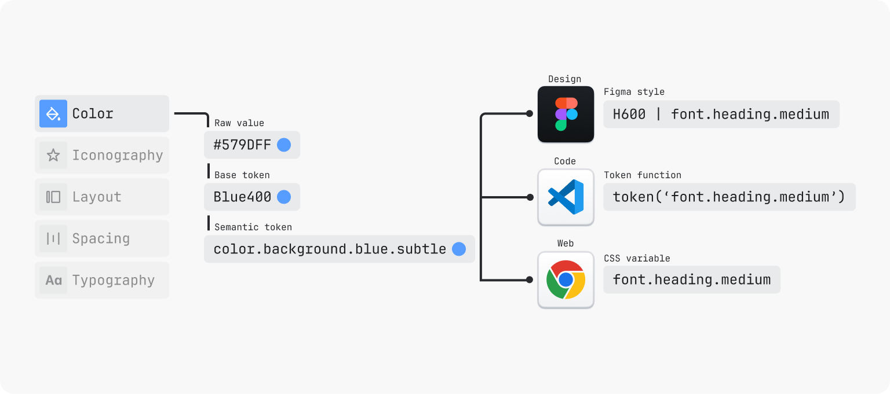
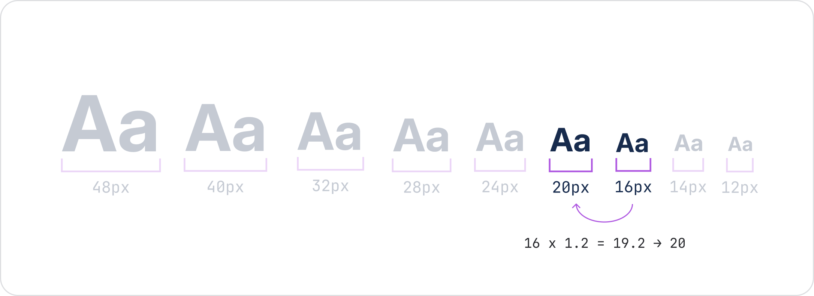
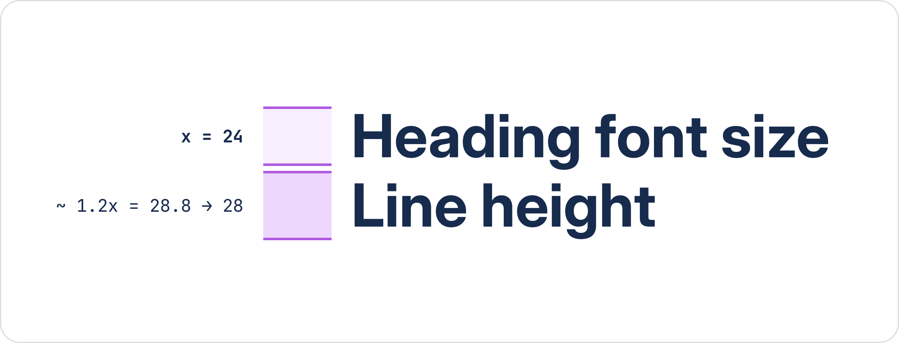
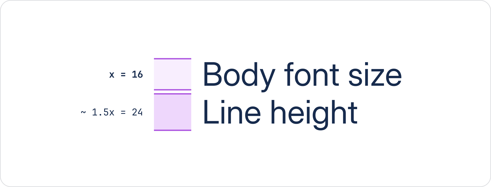

## Web UI 设计系统调研

## 概念

What a Design System Typically Includes

- Design principles — the “why” behind design decisions
- Design tokens — colors, spacing, typography values as code variables
- Component library — coded, reusable UI elements
- Pattern library — recurring UX solutions and page layouts
- Style guide — visual and brand guidelines
- Documentation — usage guidelines, accessibility requirements, code examples
- Governance model — who maintains the system, how changes are proposed and approved

A Style Guide Typically Covers
- Color palette — primary, secondary, semantic (success, error, warning)
- Typography — font families, sizes, weights, line heights
- Spacing & layout — grid system, margins, padding conventions
- Iconography — icon style, sizes, usage rules
- Brand voice & tone — writing style for UI copy
- Logo usage — clear space, minimum sizes, color variants

Examples of UX Patterns 
- Authentication flow — login, registration, password reset
- Search with filters — search bar + faceted filtering + results list
- Data table with actions — sortable table + bulk actions + pagination
- Onboarding sequence — progressive disclosure, tooltip tours, empty states
- Form validation — inline errors, success states, required field indicators

组件库

- 可重用、编码的 UI 元素的集合 - 构成界面的原子构建块。在现代开发中，这些通常构建在 React、Vue、Angular 中或作为 Web 组件。

通过将生产代码组件直接引入设计工具来消除“两个事实来源”问题。设计人员不需要学习单独的系统 -
他们使用开发人员使用的相同组件进行设计，确保一致性并使采用自然。

## IBM carbon

https://carbondesignsystem.com/

评价：文档质量极高，条理清晰。每个组件都有四个方面的描述，非常方便阅读。

## Atlassian Design

https://atlassian.design/foundations

分类：

- 内容
- 间距
- Grid
- Color
- Typography
- Motion
- Icon
- Illustration 插画
- Logos
- Elevation 高度
- Border 边框
- Radius 半径

### design token

为什么要使用设计符号？

- 具有全局主题（暗黑模式）、响应式设计和用户自定义等功能都是通过设计令牌实现的。
- 设计令牌通过简化决策和工艺交接，简化了设计和开发过程。
- 随着视觉语言的演变，可以在整个系统和应用程序中一次性进行更改。不再需要到处查找和替换硬编码的值。
- 借助自动化工具，帮助设计师和开发者更快地开始使用设计符号。
- Token 是实现最新视觉基础的方式。这将向 Atlassian UI 提供视觉一致性及其他改进。

一个设计令牌的名称描述了它应该如何使用，并且每个部分都传达了其使用方式的一个部分。

1. **Foundation**: 视觉设计属性或基础样式的类型，例如颜色、阴影或间距。
2. **Property**: 应用了令牌的 UI 元素，例如边框、背景、阴影或其他属性。
3. **Modifier**: 关于符号用途的附加信息，例如其颜色角色、强调或交互状态。并非每个符号都有修饰符。例如，color.text 是默认正文文本颜色。



例如，Typography tokens 排版符号的一个例子：font.heading.medium


### 插图

选择合适的插图类型（快速参考）

| Type 类型                                                    | Best for 最适合                    |
| :----------------------------------------------------------- | :--------------------------------- |
| **[Spot](https://atlassian.design/foundations/illustrations#spot)** | 空状态、错误状态、庆祝重大胜利     |
| **[Low-fidelity UI](https://atlassian.design/foundations/illustrations#low-fidelity-ui)** | 入职引导、重点功能巡游、工作流说明 |
| **[Ambient pattern](https://atlassian.design/foundations/illustrations#ambient-pattern)** | 消息和促销区域的背景元素           |


### 高度

| Z-index | Example usage                                                | Elevation level |
| :------ | :----------------------------------------------------------- | :-------------- |
| 100     | None                                                         | None            |
| 200     | [Atlassian navigation](https://atlassian.design/components/atlassian-navigation/) | Default         |
| 300     | [Inline dialog](https://atlassian.design/components/inline-dialog/) | Overlay         |
| 400     | [Popup](https://atlassian.design/components/popup/)          | Overlay         |
| 500     | [Blanket](https://atlassian.design/components/blanket/)      | None            |
| 510     | [Modal](https://atlassian.design/components/modal-dialog/)   | Overlay         |
| 600     | [Flag](https://atlassian.design/components/flag/)            | Overlay         |
| 700     | [Spotlight](https://atlassian.design/components/onboarding/) | Overlay         |
| 800     | [Tooltip](https://atlassian.design/components/tooltip/)      | None            |

启发是不同类型的div元素需要占据不同的高度区间。


### border

举例： `border.width.focused` 标记与 `color.border.focused` 标记配对，以定义焦点环的厚度。


### radius

- 使用 `radius.xsmall` 令牌，可为徽章、复选框、头像标签和键盘快捷键等小细节元素提供额外的细节。
- 使用 `radius.small` 令牌为小元素（如标签、时间戳、标签、日期、工具提示容器、表格中的图像以及紧凑按钮）提供支持。
- 使用 `radius.medium` 令牌，用于交互式元素，例如按钮、输入框、文本区域、选择、导航项和智能链接。
- 使用 `radius.large` 令牌，用于卡片、页面内容器、浮动 UI 和下拉菜单等元素。
- 使用 `radius.xlarge` 令牌用于全页容器、大容器、模态对话框、Kanban 列表和表格。
- 使用 `radius.xxlarge` 标记视频播放器。
- 使用 `radius.full` 标记来表示头像、名称、与用户相关的 UI 以及表情符号反应。这个标记也可以用于分隔线和其他药丸形状的元素，因为它会生成完全圆形的半径。
- 仅将 `radius.tile` 标记用于瓦片组件，例如图标瓦片或对象瓦片。此标记不应在瓦片之外使用。

此外，需要处理外层焦点环

| Element radius token | Focus radius token to pair with | Focus ring radius value* |
| :------------------- | :------------------------------ | :----------------------- |
| `radius.xsmall`      | `radius.focus.xsmall`           | 4px (xsmall +2 offset)   |
| `radius.small`       | `radius.focus.small`            | 6px (small +2 offset)    |
| `radius.medium`      | `radius.focus.medium`           | 8px (medium +2 offset)   |
| `radius.large`       | `radius.focus.large`            | 10px (large +2 offset)   |
| `radius.xlarge`      | `radius.focus.xlarge`           | 14px (xlarge +2 offset)  |
| `radius.xxlarge`     | `radius.focus.xxlarge`          | 18px (xxlarge +2 offset) |


### 内容


### 颜色


### 网格


### 间距

### 运动效果

交互时间：

- 交互（50-150 毫秒）。用于悬停和按压状态。较短的持续时间确保界面感觉立即响应且精致。
- 过渡效果（150–400 毫秒）。用于元素进入、退出或屏幕上移动（例如模态框、面板）。较长的持续时间有助于用户跟踪空间变化。较大的元素通常需要较长的持续时间以保持比例感。

Easing curves 缓动曲线：

- Ease-out bold。元素迅速出现并减速停止。最适合 Panel 或 Flag 等元素进入屏幕。
- Ease-in-out bold。温和开始和柔和结束。最适合缩放 Modals 或重新定位元素。
- Ease-in practical。开始缓慢，然后迅速加速。最适合元素移开时的退出过渡。
- Ease-out practical。精致的日常进入曲线。最适合 Popup 或悬停背景渐变等元素。

如果用户每天会触发该动效数十次，应将其控制在 150 毫秒以内。如果用户每会话只触发一次，则有更多空间进行表现。

尊重减少运动设置。当减少运动处于激活状态时，运动将被关闭且即时。切勿使用闪烁、快速振荡或扫过屏幕大面积的运动效果。验证在所有运动禁用的情况下界面是否仍然完全可用。

保持动态效果温暖、自信且目标明确。

### 排版

排版标记使用 rem 单位而不是像素值来定义字体大小和行高。字体大小通过将 rem 单位乘以浏览器默认的 16px 大小动态计算得出（即 1rem 等于 16px）。

与绝对（或固定）的像素不同，rem 是相对单位，会根据根元素（html）的大小进行调整。使用 rem 单位允许用户根据需求或浏览器大小调整文本大小，从而提高设计的响应性和可访问性。

标题尺寸：

| Token                  | Font weight | Font size         | Line height      |
| :--------------------- | :---------- | :---------------- | :--------------- |
| `font.heading.xxlarge` | Bold        | 2 rem / 32 px     | 2.25 rem / 36 px |
| `font.heading.xlarge`  | Bold        | 1.75 rem / 28 px  | 2 rem / 32 px    |
| `font.heading.large`   | Bold        | 1.5 rem / 24 px   | 1.75 rem / 28 px |
| `font.heading.medium`  | Bold        | 1.25 rem / 20 px  | 1.5 rem / 24 px  |
| `font.heading.small`   | Bold        | 1 rem / 16 px     | 1.25 rem / 20 px |
| `font.heading.xsmall`  | Bold        | 0.875 rem / 14 px | 1.25 rem / 20 px |
| `font.heading.xxsmall` | Bold        | 0.75 rem / 12 px  | 1 rem / 16 px    |

---

正文文本有三种尺寸，用于不同场景：

- 
  正文 L 是长格式内容的默认尺寸。使用这种尺寸为博客等提供舒适的阅读体验。
- 
  正文 M（默认）是组件或空间有限时的默认尺寸，用于详细或描述性内容，如旗帜中的主要描述。
- 正文 S 应谨慎使用，用于次要级内容，如细字或语义信息。

| Token             | Font weight | Font size         | Line height      | Paragraph spacing* |
| :---------------- | :---------- | :---------------- | :--------------- | :----------------- |
| `font.body.large` | Regular     | 1 rem / 16 px     | 1.5 rem / 24 px  | 1 rem / 16 px      |
| `font.body`       | Regular     | 0.875 rem / 14 px | 1.25 rem / 20 px | 0.75 rem / 12 px   |
| `font.body.small` | Regular     | 0.75 rem / 12 px  | 1 rem / 16 px    | 0.5 rem / 8 px     |

>段落间距仅在 Figma 文本样式库中设置。要在代码中表示段落，请为每个段落使用单独的文本组件，并使用堆叠组件管理段落间距。

---

正文字体粗细通过 Figma 中的文本样式选择或代码中的字体粗细标记应用。正文文本有三种粗细可供选择：

- **Regular** 常规粗细用于普通段落，与标题形成对比，以及组件中的中等粗细文本。
- **Medium** 中等粗细用于与图标对齐。在大多数组件中使用此粗细，或在文本旁边可能出现线条图标时使用。
- **Bold** 粗体字用于特殊情况下，当需要区分文本或强调时。应谨慎使用这种粗体。

---

Metric

| Token                | Font weight | Font size        | Line height      |
| :------------------- | :---------- | :--------------- | :--------------- |
| `font.metric.large`  | Bold        | 1.75 rem / 28 px | 2 rem / 32 px    |
| `font.metric.medium` | Bold        | 1.5 rem / 24 px  | 1.75 rem / 28 px |
| `font.metric.small`  | Bold        | 1 rem / 16 px    | 1.25 rem / 20 px |

Code 代码
代码文本样式用于在我们的代码块组件中表示代码。

| Token       | Font weight | Font size | Line height |
| :---------- | :---------- | :-------- | :---------- |
| `font.code` | Regular     | 12 px     | 20 px       |

---

Typescale 类型比例。

在考虑字体缩放时，这个排版系统使用一个小三度类型比例。尺寸按 1.2 的因子放大或缩小，四舍五入到最接近的 4 的倍数，并围绕一个基于 rem 单位的 16px 基础单位形成。



要确定标题的行高，将字体大小乘以约 1.2 倍，而正文则乘以约 1.5 倍。这些数值也会四舍五入到最接近的 4 的倍数，以与其他基础元素（如间距和图标）保持一致。





## reshape

https://reshaped.so/

评价：感觉完全比不过shadcn/ui。

## GitHub Primer

 https://primer.style/design/guides/introduction/

组件分类哲学：

- 构建块组件，是指功能基础且可与其它组件结合构建几乎所有 UI 的组件。构建块组件的一些例子有 `Details` 和 `Link`。
- 模式组件，帮助我们重复常用 UI 模式和交互，以保持品牌并提供出色的用户体验。模式组件的一些例子有 `Button`、`Avatar` 或 `Label`。
- 辅助组件，是指帮助用户实现常见 UI 或 CSS 模式，同时仍能对结果保持一定控制的组件。辅助组件的一个例子是``Stack``。

> 假设人们会打破规则，提供让他们安全打破规则的方式。

### Primer Primitives

对于尺寸、间距和排版符号，使用独立文件组织：

```scss
@import '@primer/primitives/dist/css/base/size/size.css';
@import '@primer/primitives/dist/css/base/typography/typography.css';
@import '@primer/primitives/dist/css/functional/size/border.css';
@import '@primer/primitives/dist/css/functional/size/breakpoints.css';
@import '@primer/primitives/dist/css/functional/size/size-coarse.css';
@import '@primer/primitives/dist/css/functional/size/size-fine.css';
@import '@primer/primitives/dist/css/functional/size/size.css';
@import '@primer/primitives/dist/css/functional/size/viewport.css';
@import '@primer/primitives/dist/css/functional/typography/typography.css';
```

颜色符号按单个主题文件分组：

```scss
@import '@primer/primitives/dist/css/functional/themes/light.css';
@import '@primer/primitives/dist/css/functional/themes/light-tritanopia.css';
@import '@primer/primitives/dist/css/functional/themes/light-high-contrast.css';
@import '@primer/primitives/dist/css/functional/themes/light-colorblind.css';
@import '@primer/primitives/dist/css/functional/themes/dark.css';
@import '@primer/primitives/dist/css/functional/themes/dark-colorblind.css';
@import '@primer/primitives/dist/css/functional/themes/dark-dimmed.css';
@import '@primer/primitives/dist/css/functional/themes/dark-high-contrast.css';
@import '@primer/primitives/dist/css/functional/themes/dark-tritanopia.css';
```

关于Theme：Primer 颜色设计令牌通过 `body` 标签或其他高级 DOM 元素上的 data-attribute 选择器提供。有三个不同的 data-attribute 用于处理主题： `data-color-mode` 、 `data-light-theme` 和 `data-dark-theme`。

`data-color-mode` 属性用于设置主题的颜色模式。该属性的值应为 `auto` 、 `light` 或 `dark` 。当设置为 `auto` 时，主题将根据用户的系统偏好自动在亮色和暗色之间切换。

使用示例：

```html
<body data-color-mode="light" data-light-theme="light" data-dark-theme="dark"></body>
```

### Color

示例：

- 将前景颜色 `--fgColor-accent` 值定义为`#0969da`。
- 将背景颜色`--bgColor-accent-emphasis`定义为`#0969da`。
- 将 Border 边界颜色`--borderColor-accent-emphasis` 定义为 `#0969da`。
- 将 Shadow `--shadow-floating-large` 定义为 `0 0 0 1px #d1d9e000, 0 40px 80px 0 #25292e3d`。
- Button 按钮的颜色具有多种语义；也具有多个状态，例如hove、active、disabled等等。例如将 `--button-danger-bgColor-active`定义为 某种红色 `#a40e26`。
- Data visualization 数据可视化。例如 `--data-auburn-color-emphasis` 和 `--data-auburn-color-muted` 分别表示强调和减弱。
- Focus 关注。`--focus-outlineColor` 表示某个元素聚焦时的边框颜色。
- overlay层。`--overlay-backdrop-bgColor` 表示外围的暗层颜色，`--overlay-bgColor`表示内部的背景颜色，-`-overlay-borderColor`表示内部的边框颜色。

### Breakpoints 断点 

| CSS variable CSS 变量  | Output value 输出值 | Source value 源值 |
| ---------------------- | ------------------- | ----------------- |
| `--breakpoint-xsmall`  | 20rem               | 320px             |
| `--breakpoint-small`   | 34rem               | 544px             |
| `--breakpoint-medium`  | 48rem               | 768px             |
| `--breakpoint-large`   | 63.25rem            | 1012px            |
| `--breakpoint-xlarge`  | 80rem               | 1280px            |
| `--breakpoint-xxlarge` | 87.5rem             | 1400px            |


### Typography

关于排版，主要定义下面分类：

Font family 字体家族

| Sample           | CSS variable                   | Output value                                                 |
| ---------------- | ------------------------------ | ------------------------------------------------------------ |
| monospace        | `--fontStack-monospace`        | ui-monospace, SFMono-Regular, SF Mono, Menlo, Consolas, Liberation Mono, monospace |
| sansSerif        | `--fontStack-sansSerif`        | 'Mona Sans VF', -apple-system, BlinkMacSystemFont, 'Segoe UI', 'Noto Sans', Helvetica, Arial, sans-serif, 'Apple Color Emoji', 'Segoe UI Emoji' |
| sansSerifDisplay | `--fontStack-sansSerifDisplay` | 'Mona Sans VF', -apple-system, BlinkMacSystemFont, 'Segoe UI', 'Noto Sans', Helvetica, Arial, sans-serif, 'Apple Color Emoji', 'Segoe UI Emoji' |
| system           | `--fontStack-system`           | 'Mona Sans VF', -apple-system, BlinkMacSystemFont, 'Segoe UI', 'Noto Sans', Helvetica, Arial, sans-serif, 'Apple Color Emoji', 'Segoe UI Emoji' |

Font shorthand

例如 `font: var(--text-display-shorthand);` 背后的源值其实包含了四个CSS属性的设置。

| Sample | CSS variable                  | Source value                                                 |
| ------ | ----------------------------- | ------------------------------------------------------------ |
| body   | `--text-body-shorthand-large` | font-weight: `{text.body.weight}`font-size: `{text.body.size.large}`font-family: `{fontStack.sansSerif}`line-height: `{text.body.lineHeight.large}` |

其他的就是关于不同文本类型的size设置：

- Display
- Title变体： Title large/medium/small
- 子标题 Subtitle
- Body变体： Body large/medium/small
- Caption
- Code Block
- Inline Code Block
- Weight
- Font Size
- Line Height 


### Token 命名约定

Primer 设计 Token 的命名采用一致的规范，例如`bgColor-accent-muted`。

这种命名规范分为三个类别：基础、组件/模式、功能。每个类别都是整体规范的一个子集。

基础：


```
base-size-4
base-color-green-5
brand-base-color-lime-5
base-fontWeight-semibold
```

---

功能符号表示全局 UI 模式。


```
bgColor-inset
borderColor-default
brand-borderWidth-thin
boxShadow-inset-thick
```

---

组件/模式令牌只能用于组件 CSS 中。


```
control-danger-borderColor-rest
button-primary-bgColor-hover
brand-overlay-bgColor
text-codeInline-fontSize
```

---

在编写属性时，无论是变体还是组件，都应按照其在代码中看到或编写的方式。例如，ActionList 组件中图标或头像的属性写作 `leadingVisual` 或者 `trailing[Accessory]`。


### Size modifiers 尺寸修饰符

- General-purpose t-shirt sizes `xsmall | small | medium | large | xlarge | xxlarge`
- denisty `condensed | normal | spacious`
- Thickness names `thin | thick | thicker`
- viewport range names `narrow | regular | wide`

### 关于CSS 变量

不再使用sx props（React）以及Scss 变量，全部迁入 CSS Variables。


### Loading indicators 加载指示器

按时间分类：

- 少于 1 秒：不使用加载器
- 1-3 秒：不确定型加载器
- 3-10秒：确定型加载器
- 超过 10 秒：使用确定的加载状态，并尽可能将进程视为后台任务，以避免阻塞其他交互。
- Content skeleton 内容骨架

其他原则：

- 减少页面上显示的加载指示器的数量。
- 加载期间禁用控件。您可以在用户提交表单后禁用表单控件，以避免对提交过程中所做的更改是否将被保存产生混淆。
- 大而闪亮的动画会对对运动敏感的用户造成伤害。


### 导航

- 如果你从父页面导航到子页面，子页面应有明确的方式导航回父页面。这通常通过面包屑或“返回”按钮实现。
- 同一页面，不同状态。例如，局部页面的换页操作。在使用这种导航时，尽量在可行的情况下避免全页重新加载。
- 同一页面上出现新位置。例如一个社交交流页面定位到高亮的某个评论。如果滚动到的部分是页面锚点，URL 应该改变，附加#hash。
- 打开对话框将用户带入新的上下文。焦点移动到对话框中，用户在未关闭对话框的情况下无法与页面其余部分进行交互。
- 虽然 SegmentedControls 主要用于从短列表中进行选择，但它们也可以作为导航组件，用于筛选、排序或以不同格式查看内容。

### 优雅降级

- UI 中无法准确渲染但又不便完全排除的较小部分，通常可以用简短的错误消息来替代。例如 could not local data 并结合警告图标。不要尝试渲染缺少关键信息的 UI。
- 如果受影响区域足够大，用空白状态组件替换受影响的 UI，该组件解释为什么预期的 UI 没有出现。

### 通知/反馈

Primer 为消息组件提供六种状态：信息、警告、成功、不可用、关键和增值销售。12px 大小的图标使用填充变体，而 16px 和 24px 大小的图标则使用轮廓变体，并搭配 14px 或更大的文本。

更改的反馈：

- 如果更改是在没有重定向或页面刷新的情况下发生的，您可以使用 InlineMessage 组件。
- 如果更改已发生并且页面刷新或重定向，您可以使用一个 Banner 组件。


### React Hooks

这里列举了一些常用的工具函数，方便复用。

`colorMode` 是用户意图，`colorScheme` 是最终渲染时使用的具体主题方案。


### CSS Utilities CSS 工具

- 动画
- 边框
- box shadow
- colors
- details 详情
- flexbox
- Grid
- layout 布局
- margin
- padding
- typography 排版